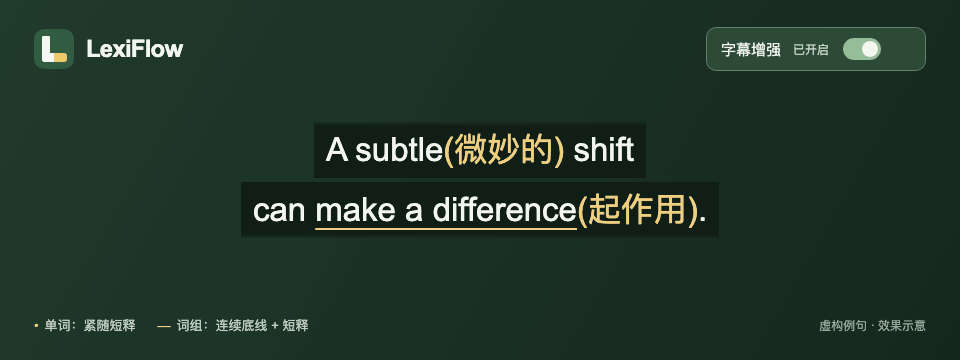

# LexiFlow

看 YouTube 英文视频时，生词旁直接显示中文短释，不用切走查词。

> 效果示意：虚构字幕中的生词提示。



<a id="docker-安装与使用"></a>

## Podman Compose 安装与使用

准备 Java 25、Node.js 22+ 和已运行的 Podman/Compose 后，在仓库根目录执行：

```sh
node ops/podman/local.mjs install
```

脚本自动构建镜像、下载精简词库、初始化 PostgreSQL 并启动应用。成功后按输出目录加载 Chrome 扩展。日常使用 `up`、`status`、`stop`、`logs` 子命令，详见[部署与使用指南](docs/user/podman-macos.md)。

CSV、词库 ZIP、密码与安装文件只在本机保存，不进入 Git。这是本地验证入口，正式验收与跨机体验进展见[执行状态](docs/roadmap/master-plan/phase2/status.md)。

既有 Docker 发行入口的操作仍见[生命周期指南](docs/development/operations/docker-release.md)，不得与 Podman 验证项目混用同一数据空间。

## 本地启动

macOS 源码开发者进入[本机编译、配置与启动](docs/development/operations/local-experience.md#12-初始化本地配置再启动确定性-api)。开发工具链和词库重建只用于开发库，不用于 Docker 发行安装数据。
