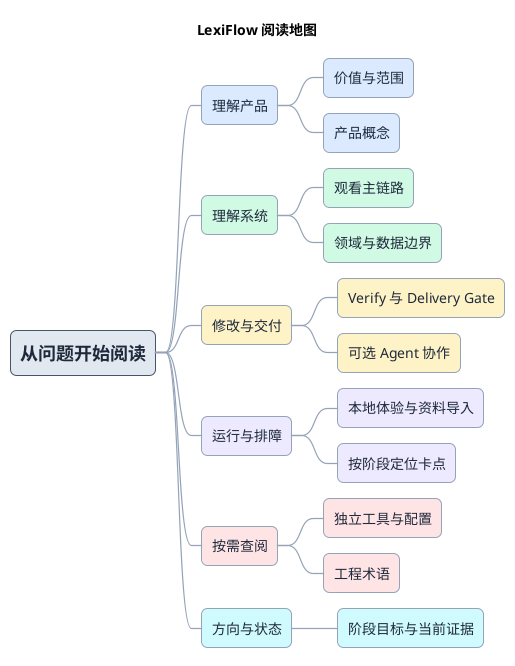

# 1. 从问题开始阅读 LexiFlow

LexiFlow 在观看英文内容时提供低打扰词义提示。先建立产品与系统模型，再根据当前任务进入工程流程；只查字段或命令时可以直接进入 Reference。

## 1.1. 阅读地图

## 1.2. 选择你的入口

| 你要理解或完成什么 | 从这里开始 | 接下来 |
| --- | --- | --- |
| 为什么做、什么不做？ | [产品说明](product/product-brief.md) | [产品术语](product/glossary.md) |
| 一条字幕怎样得到提示？ | [架构总览](architecture/overview.md) | [产品流程](architecture/flows.md) → 对应领域与数据 contract |
| 怎样修改并交付？ | [工程地图](development/overview.md) | [交付主干](development/change-delivery.md) → Verify / Delivery Gate |
| 怎样本机使用、导入资料？ | [运行与环境](development/operations.md) | 本地体验 / 词库导入 / 隔离测试 |
| 某一步失败了怎么办？ | [按阶段排障](development/troubleshooting.md) | 定位运行环境、检查、身份或证据层 |
| 只查某个工具或英文术语？ | [工程 Reference](development/reference.md) | 工具、配置、Scripts、术语 |
| 已做到哪里、下一阶段做什么？ | [路线图](roadmap/master-plan.md) | [状态与下一步](roadmap/master-plan/status.md) |

## 1.3. 如何逐层定位

总览图给出阶段和边界；阶段页说明前置、输出与失败去向；模块页再映射到入口和内部文件。Reference 是侧链，不必顺序读完。每个详情页保留上级和回程，避免为了理解局部而重读全仓规则。

长期能力 contract 见 [OpenSpec](../openspec/project.md)，机器约束真源见 [Harness](../harness/README.md)。图源只在 Markdown 的 PlantUML 围栏；图包和运行证据不成为正文依赖。
