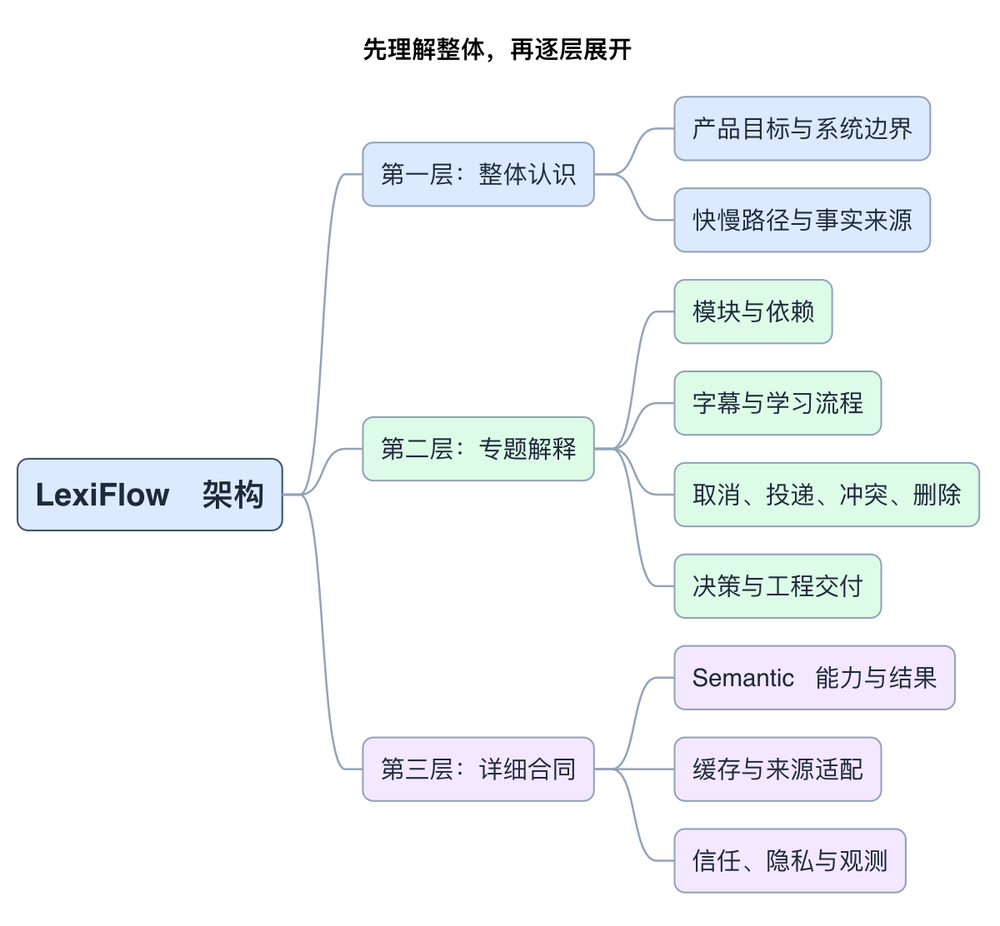

# LexiFlow 架构阅读入口

LexiFlow 帮助用户在看英文内容时理解少量关键表达。**英文先显示，规则决定是否提示，模型提供语境含义，服务端维护个人学习状态**。下面的文档按这个故事逐层展开。

当前只优化第一阶段。业务架构和十项 ADR 仍是 **Proposed**；Java 25 构建及质量工具已有工程验证，真实提示、跨设备同步和数据删除尚未交付。

## 先花十分钟建立整体认识

从 [架构总览](phase-1.md) 开始。它回答系统要解决什么问题、有哪些边界、两条主链路如何配合、为什么采用当前结构。读完再选择专题，不需要先记住全部合同。

[PlantUML 源码](diagrams/reading-map.puml) · [矢量图](diagrams/reading-map.svg)

这张图表示阅读层次。上层给结论和直觉；中层解释机制与取舍；下层保留实现必须遵守的精确条款。

## 带着一个问题进入专题

| 想弄清的问题 | 阅读页面 | 看完应能解释什么 |
|---|---|---|
| 每个模块拥有什么，代码能依赖谁？ | [模块与依赖](modules-and-dependencies.md) | 七个领域、应用边界、组合根与端口的关系 |
| 一句字幕和一次用户行为如何流过系统？ | [字幕与学习流程](caption-and-learning-flows.md) | 快慢提示链路和事实→证据→Profile 链路 |
| 重试、取消、晚到和删除会不会破坏状态？ | [生命周期与一致性](phase-1-lifecycle-guarantees.md) | work、attempt、投递观察、意图 revision 和删除屏障 |
| 哪些跨模块语义必须共同遵守？ | [横切合同导读](phase-1-cross-cutting-contracts.md) | Semantic、缓存、信任、观测和来源适配各自的责任 |
| 为什么做这些选择，什么时候重新考虑？ | [架构决策](decisions.md) | 十项 ADR 的推荐、替代方案、代价和复审条件 |
| 设计如何落实到 Java 和验收？ | [工程与交付](engineering-and-delivery.md) | 唯一工具 owner、三层验收和当前证明边界 |

## 实现时再查详细参考

[合同目录](contracts/README.md) 是条款索引。它保留完整输入/结果语义、失败分类、缓存有效性、安全约束、conformance 和验收条件。合同中 `Must`、`Should`、`Later` 的原有含义保持不变。

[图源目录](diagrams/README.md) 提供所有 PlantUML 源码、brief、PNG 和 SVG。图是正文的解释视角，细节简化不放宽正式合同。

## 设计、执行证据与阶段决定分别查看

本目录讲架构；[确定性工具审查](../reviews/phase-1-deterministic-tools-audit.md) 记录工程执行；[G1 决策包](../reviews/g1-decision-package.md) 记录阶段决定条件；[本次重构审查](../reviews/architecture-documentation-restructure.md) 记录链接、图包和历史收据的影响。文档改写不自动更新旧 receipt，也不激活第二阶段。
