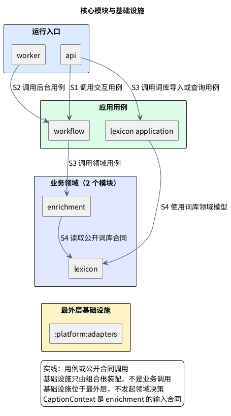

# 1. 模块边界

**位置：** [架构总览](overview.md) → 模块边界。**下一步：** 看[观看时序](flows/viewing.md)追踪运行调用，或按下面的 owner 进入具体 contract。**失败边界：** 不可靠资料由 Enrichment 返回空结果；跨域不能绕过公开 contract 直接读写表。

LexiFlow 后端是共享两个业务领域的 Modular Monolith，不是因为 `api` 与 `worker` 可分别部署就拆成两个服务。判断模块归属先看**独立事实与规则由谁负责**，再看用例和技术怎样调用它们。仅被多处引用、在后台运行或调用模型，都不是新建领域模块的理由。

## 1.1. 两个领域回答不同问题

**Lexicon：这个词或短语有哪些可复用知识？** `:modules:lexicon` 拥有词项、词形、固定短语、基础义项、频率／难度、领域元数据、来源和版本，以及规范化与查询合同。它不拥有当前字幕采用哪个义项、是否提示或供应商输出。[词库合同](lexicon-contract.md)展开 lemma、sense、alias 与发布版本。

**Enrichment：这一段字幕是否需要什么提示？** `:modules:enrichment` 声明 `CaptionContext` 输入合同，拥有候选选择、重叠／密度／价值规则、已发布语义资料的适用性判断、提示结果与版本。它不拥有词库事实、HTTP、DOM、模型 SDK 或工作租约。`settlement` 的基础义项与频率可跨视频复用，属于 Lexicon；在当前一句是否显示“结算”属于 Enrichment。词库命中不等于展示，单次语义结果也不自动变成词库义项。[字幕合同](caption-contract.md)与[语义合同](semantic-contract.md)说明输入和资料门槛。

### 1.1.1. 看似领域、实际上不是模块的概念

字幕、位置、修订和有限上下文只是 Enrichment 的 `CaptionContext` 输入值，首版没有内容编辑或内容库。来源适配器生成该输入，但 YouTube DOM 和来源私有类型不能进入领域。语义能力只服务提示：观看仅做确定性匹配，第三阶段的独立事后分析才可由基础设施适配模型；它不拥有独立业务事实，也不预建语义服务。通用标识、时间和版本用 Java 标准 `UUID`、`Instant`、`Duration`；`CaptionRevision`、`LexiconVersion`、`PromptResultVersion` 等由各自 owner 定义，不建空壳 shared kernel。出现独立内容库、语义产品或稳定跨领域共享合同的证据前，不向核心领域写入这些新规则。

## 1.2. 依赖从组合根走向公开 contract

下图是**模块级用例／公开 contract 的调用方向**，不画 worker 在观看请求中执行，也不把装配基础设施误作业务调用。具体的客户端、服务端和存储系统关系见[系统边界图](overview.md#11-系统边界英文在本机事实在服务端)。

`api` / `worker` 是唯一同时装配 application 与 `:platform:adapters` 的组合根，二者不互相依赖。`:application:workflow` 协调交互或后台用例，但不判断词义；`:application:lexicon-application` 负责离线导入与版本查询。Enrichment 只从 Lexicon 的**公开合同**读已发布知识，Lexicon 不反向依赖 Enrichment。`:platform:adapters` 是最外层技术实现，不发起提示决策，也不因实现 DAO 而拥有所有表。

### 1.2.1. 九个 Gradle 叶项目到哪里找

业务 Domain 在 `:modules:lexicon` 和 `:modules:enrichment`；Application 在 `:application:workflow` 和 `:application:lexicon-application`；技术适配在 `:platform:adapters`；进程入口在 `:apps:api` 与 `:apps:worker`；验证在 `:tests:architecture` 和 `:tests:quality-gates`，合计九个叶项目。验证项目只在检查时依赖受测模块，不参与运行。

- [`backend/modules/lexicon`](../../backend/modules/lexicon) 持有词条、义项与版本；[`backend/modules/enrichment`](../../backend/modules/enrichment) 持有 `CaptionContext`、候选和提示规则。Domain 不依赖 HTTP、Chrome、YouTube、Redis、PostgreSQL 或供应商 SDK。
- [`backend/application/workflow`](../../backend/application/workflow) 协调用例，不能把规则藏在流程里；[`backend/application/lexicon`](../../backend/application/lexicon) 定义 `LexiconRepository`、导入服务和可重建的版本感知 L1 查询，不含 SQL、DAO、DO、Spring 或具体数据库类型。
- [`backend/platform/adapters`](../../backend/platform/adapters) 提供持久化、缓存、观测、安全和未来离线模型的技术接入，但不改工作状态机、提示规则或重试预算。[`backend/apps/api`](../../backend/apps/api) 是 HTTP 映射和装配入口，不能直接跨表读取；[`backend/apps/worker`](../../backend/apps/worker) 以无 Web Server 进程触发后台／恢复用例，不成为队列或调度领域。
- [`backend/tests/architecture`](../../backend/tests/architecture) 验证依赖方向；[`backend/tests/quality-gates`](../../backend/tests/quality-gates) 验证 Java 源码工程规则，不替代产品行为测试或 Python Gate 收据。[Gradle 项目护栏](../../backend/gradle/build-logic/src/main/kotlin/io/lexiflow/buildlogic/VerifyProjectDependenciesTask.kt)检查角色方向与环。

### 1.2.2. 容易混淆的责任

Worker 决定**进程何时运行**，workflow 决定**工作如何可靠完成**；例如 worker 以 `WebApplicationType.NONE` 启动，workflow 判断取消后是否可提交和怎样恢复。Workflow 定义**所需保证**，`:platform:adapters` 用事务或条件更新实现保证。`CaptionContext` 是 Enrichment 接收的原文事实，不是新领域；字幕修订使旧提示失效，Enrichment 重算但不篡改原文。Lexicon 的长期义项不等于当前句的语义选择，后者必须带当前 `CaptionContext` 证据。

## 1.3. 当前字幕怎样经过边界

来源适配器在本机产生不含平台私有类型的有界输入，`api` 交给 workflow；workflow 调用 Enrichment，后者经 Lexicon 公开合同查询候选和发布版本，再按价值、密度和适用性决定返回可靠提示或空结果。没有当前字幕模型调用、后台补全或 `pending` 承诺；扩展只显示匹配当前字幕的结果。Worker 只服务独立后台用例；第三阶段规划的分析产物必须经公开发布合同后，才可供后续观看读取。[观看时序](flows/viewing.md)标出每次调用和迟到丢弃。

Chrome 扩展仅可拥有用户明确触发的本机 `SuppressedTermPreference`：以词段和词库版本写入，不上传、不推断熟悉度、不生成账号身份或跨设备合并。本机偏好不是服务端事实。[产品说明](../product/product-brief.md)解释这种低打扰取舍。

## 1.4. 静态边界与变更入口

模块不得直接读写其他 Domain 拥有的数据；来源专有类型不得进入 `CaptionContext`；infra 不得向领域发起决策；组合根之外不得直接依赖具体技术适配。准备修改时先确定 owner 和公开 contract，再看[持久化边界](data-model.md)或[来源适配](source-contract.md)；需要改变长期约束时从[产品架构规范](../../openspec/specs/product-architecture/spec.md)与 OpenSpec 变更进入，不以文档叙述代替验证。
