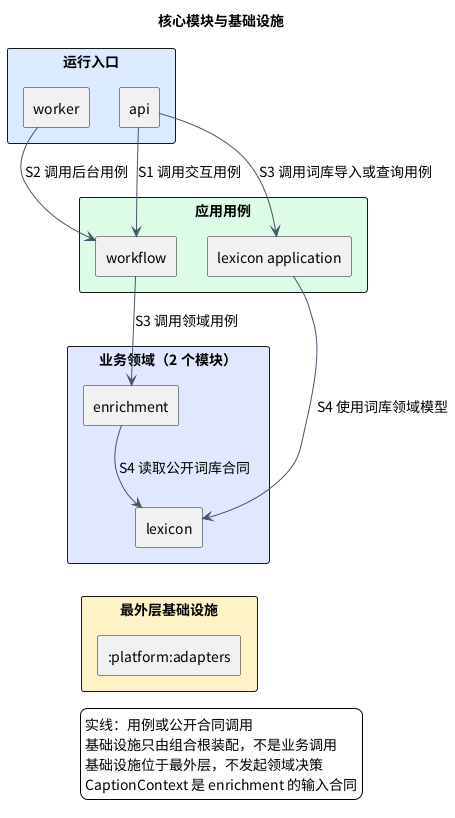

# 1. 模块边界

LexiFlow 保留两个业务领域和九个 Gradle 叶项目：共享词汇知识与通用字幕提示是业务边界；用例协调、技术适配、运行入口和验证各自承担非业务责任。扩展只保存用户显式触发的本机词段抑制偏好；产品不维护账号、服务端个人档案或跨设备同步。

模块只在拥有独立事实、规则或多个稳定消费者时存在。仅仅“被多处引用”“在后台运行”或“调用模型”不是模块理由。

## 1.1. 业务领域

| 领域模块 | 只回答的业务问题 | 它拥有的事实和规则 | 不能拥有 |
|---|---|---|---|
| `:modules:lexicon` / 共享词汇知识 | **这个词或短语有哪些可复用知识？** | 词项、词形、短语、基础义项、词频/难度、领域元数据及其来源与版本；规范化与查询合同。 | 当前字幕采用哪个义项、是否提示、提示结果、供应商输出。 |
| `:modules:enrichment` / 通用字幕提示 | **这一段字幕是否需要什么提示？** | `CaptionContext` 输入合同、候选选择、重叠/密度/价值规则、已发布语义资料的适用性判断、提示结果与结果版本。 | 词库事实、供应商 SDK、工作租约和队列机制、HTTP 或 DOM。 |

Lexicon 是**稳定、跨内容复用的知识**；Enrichment 是**针对一段字幕的决策和派生结果**。例如 `settlement` 的基础义项和频率归 Lexicon；在一句字幕中是否提示，以及“结算”是否适用于该词段，归 Enrichment。词库命中不等于展示，单次语义结果也不成为词库义项。

### 1.1.1. 不建立独立模块的概念

| 概念 | 为什么不是独立领域模块 | 所在位置 |
|---|---|---|
| 字幕与上下文 | 首版的字幕、位置、修订和有限上下文是提示请求输入，没有内容编辑、内容库或独立后端消费者。 | `CaptionContext`，由 Enrichment 声明为输入值合同；来源适配器产生它，但不把 DOM 或来源私有类型带进领域。 |
| 语境释义 | 语义能力只服务提示，不拥有独立业务事实。 | Enrichment 对已发布资料进行确定性匹配；模型仅可在第三阶段独立事后分析中由基础设施适配。观看不产生模型任务。 |
| 共享基础库 | 标识、时间和版本没有脱离业务语义的共享模型。 | 使用 Java 标准 `UUID`、`Instant`、`Duration`；`CaptionRevision`、`LexiconVersion`、`PromptResultVersion` 等值对象由各自 owner 定义。 |

这三类概念目前不拥有独立业务事实，也不建立独立 Gradle 项目；在出现内容库、独立语义产品或稳定的无领域共享合同前，不得向核心领域写入这些规则。

## 1.2. 项目与依赖关系

| 项目类别 | Gradle 项目 | 数量 |
|---|---|---:|
| 领域 | `:modules:lexicon`、`:modules:enrichment` | 2 |
| 应用 | `:application:workflow`、`:application:lexicon-application` | 2 |
| 基础设施适配 | `:platform:adapters` | 1 |
| 运行入口 | `:apps:api`、`:apps:worker` | 2 |
| 验证 | `:tests:architecture`、`:tests:quality-gates` | 2 |
| **叶项目总数** |  | **9** |

图展示模块级调用方向，不表示 worker 参与观看请求或授权后台模型补全；验证模块与基础设施内部的具体技术实现不在图中展开。基础设施只由组合根装配，不是请求链路的一环，也不发起 Enrichment 决策。

- **实线**是用例或公开合同使用：入口调用 workflow；workflow 调用 Enrichment；Enrichment 查询 Lexicon。
- 基础设施只由组合根装配；为避免把装配误读为业务调用，图中不把它画成请求链路的边。
- 位于最外层的 `:platform:adapters` 承接模型、数据库、缓存、观测和安全等技术实现，但不拥有领域事实或发起领域决策。
- 测试模块只在验证时依赖受测模块，不参与请求链路。

### 1.2.1. 九个模块的职责

| 模块 | 只做什么 | 产生或拥有的东西 | 绝不做什么 |
|---|---|---|---|
| `:modules:lexicon` | 查询和维护共享词汇知识。 | 词项、短语、基础义项及版本。 | 不读来源 DOM，不决定提示，不调用模型。 |
| `:modules:enrichment` | 将 `CaptionContext` 与词库材料变成提示决策；只使用已发布的可靠语义资料。 | 候选、规则判断、提示结果和资料版本关联。 | 不管理词库事实，不写供应商 SDK，不拥有工作调度机制。 |
| `:application:workflow` | 将一次交互或后台任务按可靠顺序完成。 | 用例协调和提示调用顺序。 | 不判断词义或提示价值，不直接依赖 Postgres、Redis 或模型 SDK。 |
| `:application:lexicon-application` | 协调离线词库导入和版本感知查询。 | `LexiconRepository` 合同、导入服务与可重建 L1 查询服务。 | 不含 SQL、DAO、DO、Spring 或具体数据库类型。 |
| `:platform:adapters` | 为上层提供具体技术集成。 | 离线模型技术适配、Postgres、Redis、观测和安全接入。 | 不调用 Enrichment 决策，不改工作状态机、提示规则或重试预算，不因数据库访问而成为所有表的 owner。 |
| `:apps:api` | 启动 HTTP 进程，接收请求并装配依赖。 | HTTP 传输映射和启动配置。 | 不写领域规则，不开后台业务循环，不直接跨表读取。 |
| `:apps:worker` | 启动无 Web Server 的后台进程，触发 workflow 的后台/恢复用例并装配依赖。 | 进程生命周期与触发配置。 | 不是队列、调度领域或异步代码目录；不拥有提示规则、租约或结果。 |
| `:tests:architecture` | 验证代码依赖方向和边界访问。 | 架构测试。 | 不参与产品运行或定义业务规则。 |
| `:tests:quality-gates` | 执行并自测 Java 源码工程规则。 | 中文注释、Record 文档、PMD 抑制等检查器及报告。 | 不替代产品行为测试或 Python Gate 收据。 |

Chrome 扩展可拥有本机 `SuppressedTermPreference` 存储与一个固定写入接口：仅在用户选择“不再提示”时，以词段和词库版本写入；它不得上传、推断熟悉度、生成账号身份或跨设备合并。该偏好是客户端私有体验状态，不是服务端事实。

### 1.2.2. 容易混淆的边界

| 两方 | 一句话分界 | 例子 |
|---|---|---|
| `worker` / `workflow` | Worker 决定**进程何时运行**；workflow 决定**工作如何可靠完成**。 | worker 以 `WebApplicationType.NONE` 启动、绑定触发器；workflow 判断取消后能否提交、如何恢复未完成工作。 |
| `workflow` / `:platform:adapters` | Workflow 定义**需要什么保证**；基础设施用技术实现**怎样做到**。 | 词库发布用例要求版本一致；基础设施用事务或条件更新实现。 |
| `enrichment` / `CaptionContext` | Enrichment 是**对输入作决定**；CaptionContext 是**被决定的原文事实**。 | 字幕修订使旧提示失效；Enrichment 重算提示，不篡改原文。来源私有 DOM 留在来源适配器或扩展。 |
| `lexicon` / 语义能力 | Lexicon 是**长期复用知识**；语义资料的适用性判断是**本次字幕决策**。 | `settlement` 的义项和频率可跨视频复用；当前句选择“结算”只绑定本次 `CaptionContext`。 |

### 1.2.3. 一条字幕请求如何经过这些边界

1. 来源适配器/扩展产生不含私有类型的 `CaptionContext`；api 将它交给 workflow。
2. Workflow 调用 Enrichment；Enrichment 查询 Lexicon，按候选、密度和价值规则决定是否需要提示。
3. Enrichment 使用适用的已发布资料形成可靠提示；证据不足就不提示，不访问模型。
4. Workflow 返回确定性结果，不建立当前字幕的后台补全或 pending 承诺。
5. 扩展仅显示匹配当前字幕的结果。Worker 只可用于独立后台用例，不参与观看等待；第三阶段分析产物经公开发布合同供后续观看使用。

## 1.3. 静态依赖规则

1. Enrichment 只依赖 Lexicon 的公开合同；Lexicon 不反向依赖 Enrichment。
2. Workflow 依赖领域公开用例，不依赖 infrastructure 的技术实现。
3. Infrastructure 位于最外层并承接技术实现，不从技术层向领域发起调用。
4. `api` / `worker` 是唯一同时依赖 workflow 和 infrastructure 的位置，用于装配；它们不彼此依赖。
5. 领域不得依赖 HTTP、Chrome、YouTube、Redis、PostgreSQL 或供应商 SDK；来源专有类型不得进入 `CaptionContext`。

[Gradle 项目护栏](../../backend/gradle/build-logic/src/main/kotlin/io/lexiflow/buildlogic/VerifyProjectDependenciesTask.kt)检查角色方向与环。模块边界和验证同时演进，不通过跨表访问或具体技术类型绕开合同。
