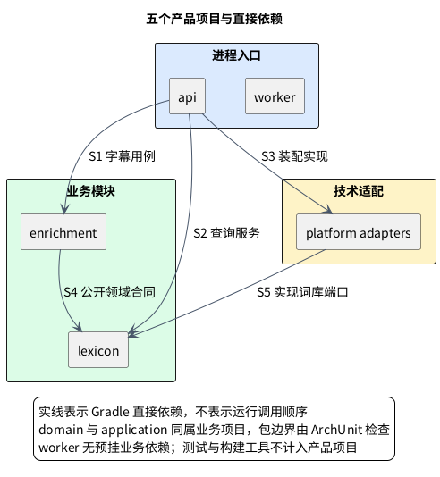

# 1. 模块边界

**位置：** [架构总览](overview.md) → 模块边界。**下一步：** 看[观看时序](flows/viewing.md)追踪运行调用，或按下面的 owner 进入具体 contract。**失败边界：** 不可靠资料由 Enrichment 返回空结果；跨域不能绕过公开 contract 直接读写表。

LexiFlow 后端是共享两个业务领域的 Modular Monolith，不是因为 `api` 与 `worker` 可分别部署就拆成两个服务。判断模块归属先看**独立事实与规则由谁负责**，再看用例和技术怎样调用它们。仅被多处引用、在后台运行或调用模型，都不是新建领域模块的理由。

## 1.1. 两个领域回答不同问题

**Lexicon：这个词或短语有哪些可复用知识？** `:modules:lexicon` 拥有词项、词形、固定短语、基础义项、频率／难度、领域元数据、来源和版本，以及规范化与查询合同。它不拥有当前字幕采用哪个义项、是否提示或供应商输出。[词库合同](lexicon-contract.md)展开 lemma、sense、alias 与发布版本。

**Enrichment：这一段字幕是否需要什么提示？** `:modules:enrichment` 声明 `CaptionContext` 输入合同，拥有候选选择、重叠／密度／价值规则、已发布语义资料的适用性判断、提示结果与版本。它不拥有词库事实、HTTP、DOM、模型 SDK 或工作租约。`settlement` 的基础义项与频率可跨视频复用，属于 Lexicon；在当前一句是否显示“结算”属于 Enrichment。词库命中不等于展示，单次语义结果也不自动变成词库义项。[字幕合同](caption-contract.md)与[语义合同](semantic-contract.md)说明输入和资料门槛。

### 1.1.1. 看似领域、实际上不是模块的概念

字幕、位置、修订和有限上下文只是 Enrichment 的 `CaptionContext` 输入值，首版没有内容编辑或内容库。来源适配器生成该输入，但 YouTube DOM 和来源私有类型不能进入领域。语义能力只服务提示：观看仅做确定性匹配，第三阶段的独立事后分析才可由基础设施适配模型；它不拥有独立业务事实，也不预建语义服务。通用标识、时间和版本用 Java 标准 `UUID`、`Instant`、`Duration`；`CaptionRevision`、`LexiconVersion`、`PromptResultVersion` 等由各自 owner 定义，不建空壳 shared kernel。出现独立内容库、语义产品或稳定跨领域共享合同的证据前，不向核心领域写入这些新规则。

## 1.2. 依赖从组合根走向公开 contract

下图是**五个产品 Gradle 项目的直接依赖方向**，不是运行时调用顺序。每个业务项目包含领域与应用层；worker 尚无后台业务，不预挂领域或适配器依赖。具体的客户端、服务端和存储系统关系见[系统边界图](overview.md#11-系统边界英文在本机事实在服务端)。

`api` 装配 Enrichment 字幕用例、Lexicon 查询服务和持久化实现。`worker` 是独立无 Web Server 入口，尚无后台用例，因此不声明产品项目依赖。两者不互相依赖，也不会因分进程而改变业务所有权。Enrichment 只从 Lexicon 的 `domain.port` 与 `domain.model` **公开合同**读取已发布知识；Lexicon 不反向依赖 Enrichment。`:platform:adapters` 仅依赖实际使用的 Lexicon，不发起提示决策。

### 1.2.1. 五个产品项目与三个测试项目

| Gradle 项目 | 职责与内部结构 |
| --- | --- |
| `:modules:lexicon` | 词库知识、导入与查询；`domain.model/port/catalog`、`application.importing/query/port` |
| `:modules:enrichment` | 字幕提示领域规则与用例；`domain.model/policy`、`application.caption` |
| `:platform:adapters` | 来源文件、持久化等具体技术实现；仅依赖 Lexicon |
| `:apps:api` | HTTP 映射和装配；请求／响应在 `hints.model` |
| `:apps:worker` | 无 Web Server 的运行入口，按已实现的后台用例接入依赖 |
| `:tests:architecture` | 编译类架构边界及隔离反例 |
| `:tests:quality-gates` | Java 源码工程规则及其直接测试 |
| `:tests:integration` | PostgreSQL、Redis、API 与 worker 的运行 smoke 测试 |

[`backend/gradle/build-logic`](../../backend/gradle/build-logic) 是 Gradle convention 与依赖护栏的独立构建，不是产品模块。测试项目仅在检查时依赖受测模块，不参与运行。扫描覆盖所有业务模块内部的领域与应用源码，不依赖已经不存在的独立 application 项目。

### 1.2.2. 功能在前，职责在后

以 Lexicon 为例，领域实体和值对象在 `domain.model`，查询合同在 `domain.port`。导入服务与计划在 `application.importing`，请求、来源行和批次值对象在其 `model` 子包；查询服务在 `application.query`，存储端口在 `application.port`。Enrichment 的字幕用例和结果分别在 `application.caption` 与 `application.caption.model`。

类名表达角色：行为使用 `Service`、`UseCase`、`Policy` 等，边界输入输出使用 `Request`、`Result`、`Response`；领域实体与值对象保留业务名词。record 是实现语法，不形成统一的 `record/` 目录，也不机械改名为 DTO。嵌套的辅助结果仍可与所属行为类型就近保存。

`domain` 不依赖 `application`，`model` 不依赖服务、用例或领域策略。导入值对象的构造校验委托 `importing.validation` 纯 Java 辅助函数，该包不得依赖其他应用类型；不把必需校验移到可被绕过的服务调用点。持久化的 DO、DAO、Mapper 在同包协作并保留包私有可见性，不为文件夹对称而公开内部类型。上述边界由 [ArchUnit 测试](../../backend/tests/architecture/src/test/java/io/lexiflow/architecture/LayerArchitectureTest.java)与 [Gradle 项目护栏](../../backend/gradle/build-logic/src/main/kotlin/io/lexiflow/buildlogic/VerifyProjectDependenciesTask.kt)验证。

## 1.3. 当前字幕怎样经过边界

来源适配器在本机产生不含平台私有类型的有界输入，`api` 交给 Enrichment 的字幕应用用例；用例经 Lexicon 公开合同查询候选和发布版本，再调用本领域规则，再按价值、密度和适用性决定返回可靠提示或空结果。没有当前字幕模型调用、后台补全或 `pending` 承诺；扩展只显示匹配当前字幕的结果。Worker 只服务独立后台用例；第三阶段规划的分析产物必须经公开发布合同后，才可供后续观看读取。[观看时序](flows/viewing.md)标出每次调用和迟到丢弃。

Chrome 扩展仅可拥有用户明确触发的本机 `SuppressedTermPreference`：以词段和词库版本写入，不上传、不推断熟悉度、不生成账号身份或跨设备合并。本机偏好不是服务端事实。[产品说明](../product/product-brief.md)解释这种低打扰取舍。

## 1.4. 静态边界与变更入口

模块不得直接读写其他 Domain 拥有的数据；来源专有类型不得进入 `CaptionContext`；infra 不得向领域发起决策；组合根之外不得直接依赖具体技术适配。准备修改时先确定 owner 和公开 contract，再看[持久化边界](data-model.md)或[来源适配](source-contract.md)；需要改变长期约束时从[产品架构规范](../../openspec/specs/product-architecture/spec.md)与 OpenSpec 变更进入，不以文档叙述代替验证。
