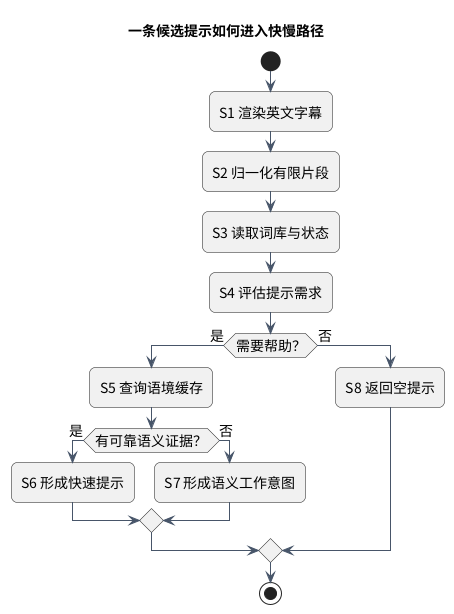
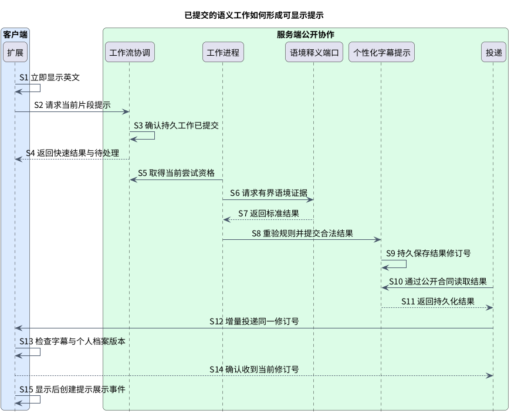
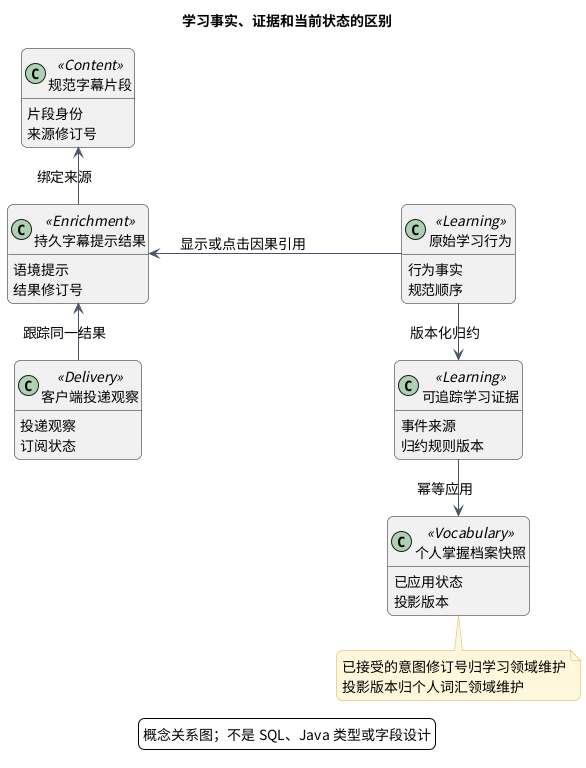
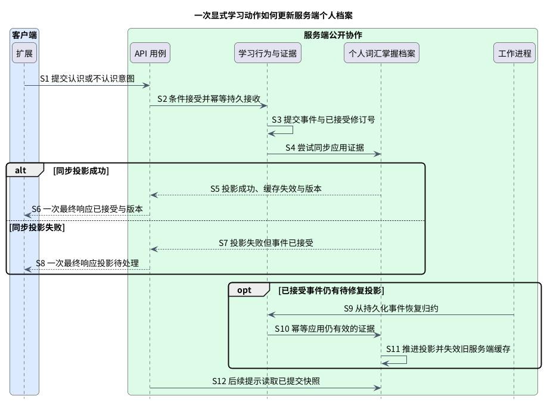

# 字幕与学习流程：即时帮助连接长期个人状态

LexiFlow 有两条互相反馈的业务链路：字幕链路读取个人档案，决定当前帮助；学习链路保存真实行为，更新之后会读取的个人档案。**前者以不中断观看为目标，后者以事实不丢失、顺序可解释、重放不重复为目标**。

本页把图解与逐步责任放在同一链路中，[生命周期](phase-1-lifecycle-guarantees.md) 展开取消、冲突和恢复；以下流程仍是待实现设计。

文中保留的内容、词库、提示编排等技术标识，对应 [具体业务责任与 Java 模块](modules-and-dependencies.md)；其中词库是中英词汇语料库，不是个人学习档案。

## 字幕链路：先显示英文，再补充语境提示

### 先选该提示什么，再决定是否需要模型

图：活动图：一个候选的规则选择、语境缓存和语义工作意图。

S1 在浏览器执行且不等待网络，S2–S8 是服务端选择提示时的逻辑视角；图不是同一调用栈。它画的是一个候选的选择，实际一句字幕可能有多个候选，整体密度仍受提示编排规则控制。

### 慢路必须先提交工作，再独立投递结果

图：时序图：正常已提交的语义工作，经提示编排持久化后由投递投递。

这张图刻意画“提交已确认”的正常路径：S3 在承诺待处理前完成持久提交；工作进程在合法尝试下获取语义证据，提示编排重验个人档案/规则后持久化结果；投递通过公开合同读取和投递，不依赖原 API 请求仍存活。

| 工作接收结论 | API 能承诺什么 | 客户端如何继续 |
|---|---|---|
| 持久提交已确认 | 快速结果 + 待处理 | 显示英文/已有提示，等待可关联的增量结果 |
| 明确提交失败 | 快速结果 + 无待处理任务 | 英文/已有提示继续，不等待不存在的结果 |
| 提交确认不明 | 保留原稳定身份的可恢复结论 | 有界查询或幂等重试，不另开工作或伪称无待处理任务 |
| 不需要语义工作 | 快速结果 + 完整 | 不承担模型等待 |

### 显示资格每次都要重验

视频/字幕切换、个人档案更新、取消或权限变化，都可能让刚到的结果失效。扩展只有在当前身份/修订号/过期兼容后才合并，晚到结果静默丢弃。缓存命中同样不能跳过这些检查。

### 字幕链路精确条款

#### 7.1 步骤与责任

1. 扩展从 YouTube 适配器获得字幕和可用播放上下文，并先渲染纯英文。此步骤不访问网络。
2. 扩展以稳定字幕身份查询 L1 缓存。命中时可以先显示仍在有效期且档案版本兼容的提示注释。
3. 扩展发送当前字幕、可用的前后文引用、播放位置、客户端已知个人档案/缓存版本和请求关联。具体协议留给阶段 3。
4. API 完成认证、归属、输入大小、语言和重复请求检查，把请求交给应用层。
5. 内容将 YouTube 输入归一成来源无关的内容上下文。上下文缺失、乱序或下一句未知是合法状态。
6. 提示编排同时查询全局词库与用户个人词汇档案快照，完成规范化、令牌/短语检测、候选生成和提示需求预测。
7. 已有高置信词汇/上下文缓存的候选形成快速提示注释；已掌握或不值得打断的候选被过滤。提示编排同时返回需要语义慢速通道的工作意图，这还不等于工作已经入队。
8. 存在慢速工作时，工作流协调应用层先提交持久交接。只有收到持久提交确认后，API 才把快速结果与 `pending` 一起暴露给客户端；不得用内存入队或“准备提交”状态提前承诺待处理。
9. 持久化入队失败时，API 等失败结论明确后返回已有快速结果与 `no-pending` 降级语义。客户端继续显示英文/快速提示注释，不能等待一个不存在的结果。没有慢速工作时，快速结果直接以完整语义返回。
10. 已提交的工作由工作进程按当前句优先、下一句预取次之调度，调用供应商无关语义端口。输入使用有界的上一句/当前句/下一句上下文，并记录供应商/模型/规则版本的可观察元数据。
11. 语义返回语境义、简短目标语言表达与置信信息。工作进程通过提示编排再次执行展示策略，防止模型绕过用户已掌握状态或提示注释数量限制。
12. 提示编排持久化最终提示注释结果并填充缓存；持久化结果的负责人仍是提示编排，工作进程只是执行者，不能把结果写成工作进程或传输私有状态。
13. `Client Delivery / Sync` 通过提示编排公开合同发现并关联投递持久化结果。它不要求原始 API 请求仍存活，也不允许工作进程直接回调原 API 请求对象。阶段 3 在轮询、SSE 或 WebSocket 中选一种传输，不改变负责人和持久化结果语义。
14. 扩展只在视频、字幕身份和修订号仍匹配时合并；晚到结果静默丢弃，不覆盖当前字幕。

#### 7.2 快慢路径的正确性

- 快速路径没有语义结果时可以返回空提示注释；“没有提示”是合法降级，不是错误字幕。
- `pending` 是持久交接已提交的承诺。入队失败必须返回 `no-pending`；不得让客户端对未持久化工作轮询或等待。
- 慢速结果必须基于与请求关联的内容上下文和档案版本。若个人档案已变化，服务端可重算展示决策或标记客户端不得复用。
- 语义缓存键必须区分词项/短语、语境指纹、目标语言和策略/模型版本。具体键结构留给阶段 2/4。
- 语义结果只提供“是什么意思”的证据；最终“是否展示”仍由提示编排规则决定。

#### 7.3 提示注释生命周期语义

`generated`、`delivered`、`displayed` 与 `clicked` 是四个不同事实，不得互相推断：

1. **已生成**：提示编排已产生可识别的提示注释结果；需要后续增量投递的结果以提示编排领域拥有的持久化记录为准。
2. **已投递**：`Client Delivery / Sync` 已按选定传输合同把特定结果修订号交给客户端。传输成功不证明它仍适合当前字幕，更不证明用户看见了它。
3. **已显示**：扩展完成身份/修订号检查并把提示注释实际提交到当前可见叠加层后，才创建 `HintDisplayed` 行为事件。收到载荷、写入 L1 或准备渲染都不能上报已显示。
4. **已点击**：用户对已显示提示注释发生交互后创建 `HintClicked`，并引用对应已显示/结果身份。无法建立因果引用的点击不能被学习归约当成有效掌握度证据。

`generated` 和 `delivered` 主要用于提示编排/投递的生命周期与效果分母；`displayed` 和 `clicked` 是客户端观察到的学习归约行为。这样可以避免把生成但未送达、送达但已陈旧、或进入缓存但未展示的提示误计为用户暴露。

#### 7.4 取消、提交资格与投递 ACK

[生命周期保证](phase-1-lifecycle-guarantees.md) 补充待处理/运行中/终态、尝试隔离屏障、取消与完成竞争，以及 receipt-unknown/已收到/已丢弃/已显示的结果合同。取消不能保证供应商停止计算，但必须阻止失效尝试提交新的业务效果；字幕切换立即在客户端失效旧修订号。ACK 丢失重投同一结果，不重新生成模型结果，也不等于用户已看见。

## 学习链路：从行为事实到个人状态

### 三种对象分别回答“发生了什么、说明什么、现在如何”

图：概念类图：内容、提示注释、投递观察、学习归约事件/证据与个人档案快照。

学习归约事件是不可随评分算法改写的原始事实；学习归约证据是带来源与归约器版本的解释；个人档案快照是已应用证据后的当前状态。图是概念关系，**不是 SQL 表、Java 类型或传输字段设计**。

### 显式动作同步尝试投影，失败仍如实区分

图：时序图：已接受显式意图，成功返回版本，失败返回待处理，工作进程从事件恢复。

图从“条件接受成功”开始；陈旧基准、身份错误或冲突的拒绝分支在 [生命周期合同](phase-1-lifecycle-guarantees.md#learning-顺序与显式冲突) 展开。先持久提交，再尝试同步投影；成功和失败各只返回**一次最终响应**，不是先发 ACK 再发版本 ACK。

### 让后续字幕读取更新后的状态

个人词汇推进自己的投影版本，并使旧服务端个人档案缓存失效。投递/同步向客户端传播当前版本，扩展淘汰不兼容 L1；个人词汇不操作浏览器缓存。新提示读取服务端已提交快照，多个设备通过版本逐步收敛。

学习归约的已接受显式意图修订号描述“哪些意图已接受以及顺序”；个人词汇的投影版本描述“哪些证据已应用”。投影待处理时二者尤其不能混用。

### 学习链路精确条款

#### 8.1 步骤与一致性

1. 扩展把 `WordSeen`、`HintDisplayed`、`HintClicked`、`SentencePaused`、`SentenceReplayed`、`WordMarkedKnown`、`WordMarkedUnknown`、`TranslationExpanded` 等记录为行为事实。`HintDisplayed` 只能在提示注释实际提交到可见叠加层后产生，`HintClicked` 必须引用已显示的结果；已生成/已投递不得替代这两个客户端事实。事件带稳定客户端身份，因此离线补传和重试不会重复计数。
2. API 验证用户/设备归属、事件类型、内容引用和基本因果关系。客户端不能提交最终熟悉度数值。
3. 学习归约先将事件持久提交。PostgreSQL 不可用时不能声称事件已保存；客户端可以稍后重试。
4. 显式 `MarkedKnown/MarkedUnknown` 表达强用户意图。事件持久提交后，同一用例同步产生证据并尝试更新个人档案。只有投影成功，单次最终响应才携带已接受与新档案版本；投影失败则同一响应明确表示事件已保存、档案投影待处理，由工作进程从持久化事件修复。禁止先返回持久化 ACK，再返回第二个版本 ACK。
5. 暂停、重播、展示、点击等隐式信号批量异步归约。学习归约使用带版本的、可解释评分规则生成正/负/中性证据。
6. 个人词汇档案幂等应用证据，更新当前投影并保留事件来源/规则版本的可追踪关系。重复作业不会重复增加接触次数或熟悉度。
7. 个人档案更新后，服务端先使 Redis 中的旧档案版本失效；`Client Delivery / Sync` 只向客户端传播当前版本，扩展据此淘汰不兼容的 L1 条目。个人词汇不直接操作浏览器缓存。跨设备不要求推送完整个人档案；后续请求凭服务端版本自然收敛。
8. 未来更换评分算法时，从检查点或事件起点重放到新投影，比较后再切换版本。原始事实保持不变。

学习归约是跨设备规范接收顺序与已接受显式意图修订号的负责人，个人词汇投影版本表示已应用状态，二者不能混用。推荐显式动作按服务端意图修订号条件接受；陈旧基准得到可解释冲突，而非由客户端时钟决定覆盖。重复/乱序、投影待处理、重放和删除屏障的保证及三个冲突方案见 [生命周期保证](phase-1-lifecycle-guarantees.md#learning-顺序与显式冲突)。具体事件结构定义、事务、归约器和删除完成策略仍由后续阶段设计。

#### 8.2 为什么不是直接 CRUD

直接把 `known/unknown` 或熟悉度写回数据库简单，但会丢失行为背景、算法版本和重算能力。完整事件溯源又会让身份、内容、词库等无需回放的上下文承担额外复杂度。推荐只对学习归约事实采用先追加，并把个人词汇档案作为可重建投影；其他上下文使用普通事务状态。

## 同步与异步边界：按承诺划分

判断方法是：**用户现在需要确认什么，就同步等到那个事实的真实边界；长尾计算留在后台**。

| 用户需要的确认 | 同步边界 | 留在后台的工作 |
|---|---|---|
| 英文已经可见 | 客户端本地渲染 | 无后端前置条件 |
| 快路结果可返回 | 有界内容/词库/个人档案/规则读取 | 外部模型缓存未命中 |
| 有慢速工作可等待 | 持久交接提交或明确失败结论 | 供应商尝试与结果投递 |
| 学习行为已保存 | 学习归约事件持久提交 | 隐式证据归约 |
| 显式选择已生效 | 档案版本或投影待处理结论 | 失败恢复；不能假承诺读己之写 |

所有 API 等待都有截止时间；网络、Redis、工作进程、模型故障采取明确降级。完整操作矩阵与失败隔离见 [详细边界与预算](contracts/architecture-invariants.md#9-同步与异步边界)。

## 后续实现需要证明什么

首先证明英文首屏不计入后端/供应商延迟，再分别测量快速路径、队列等待、供应商和投递的长尾。用重复事件、乱序、投影失败、切换字幕与迟到结果注入证明上述因果关系。具体 SLO、事件结构定义、评分、传输和事务仍由后续阶段选择，本页不把设计图当产品测试结果。
