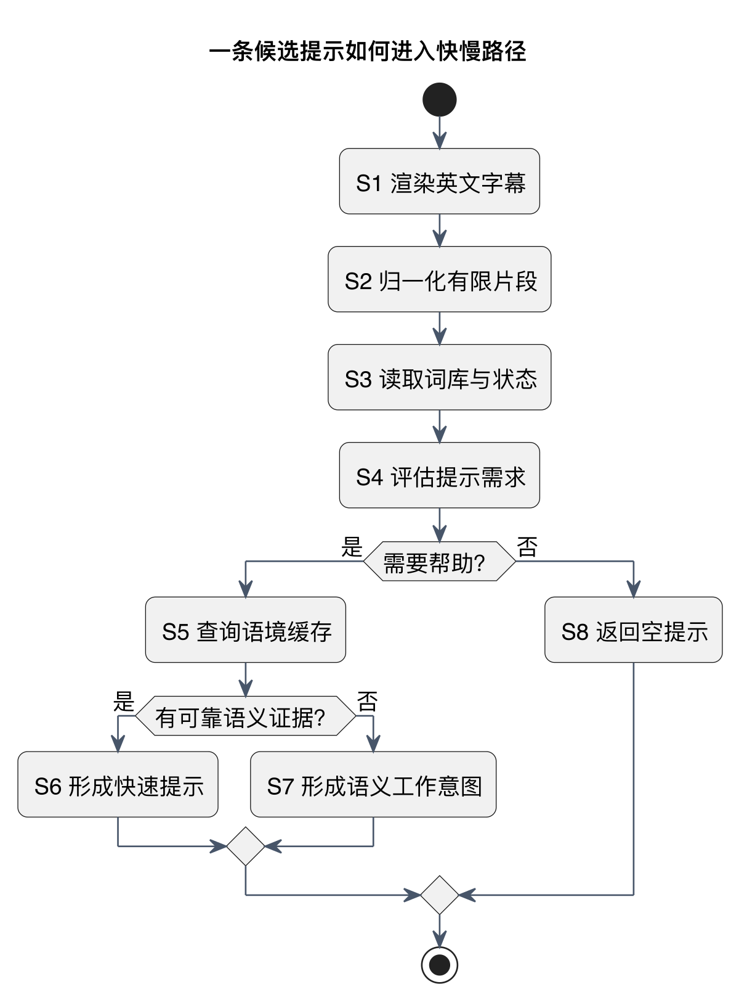
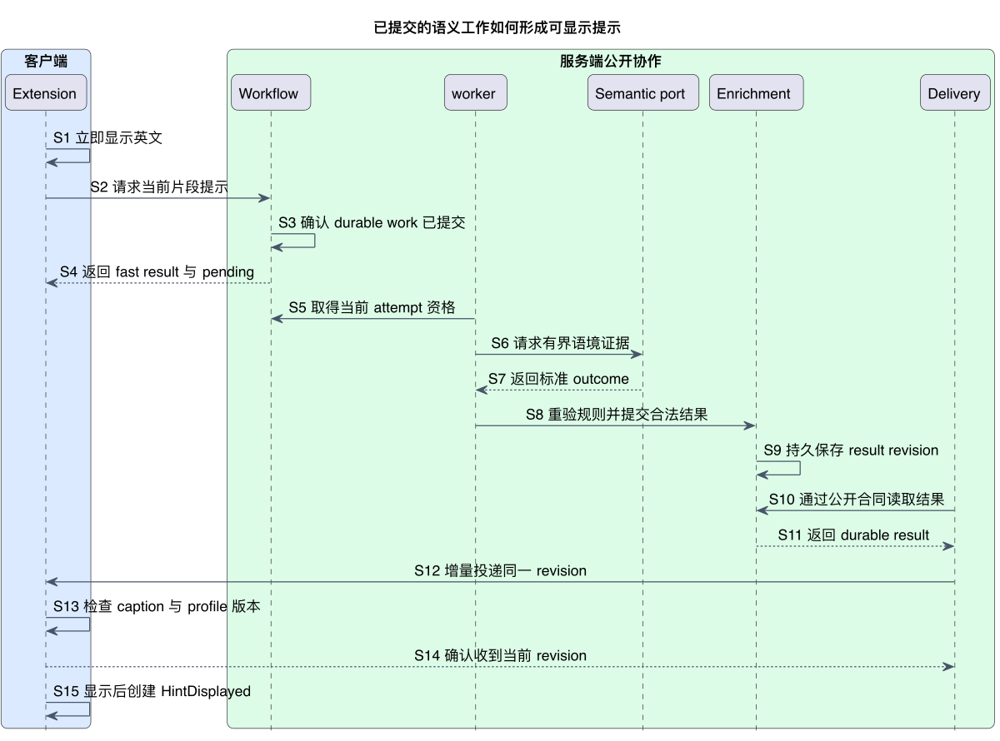
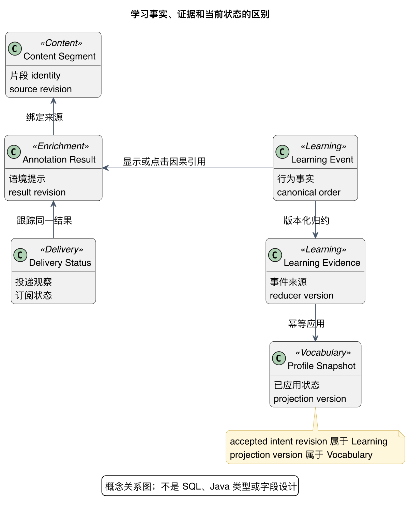
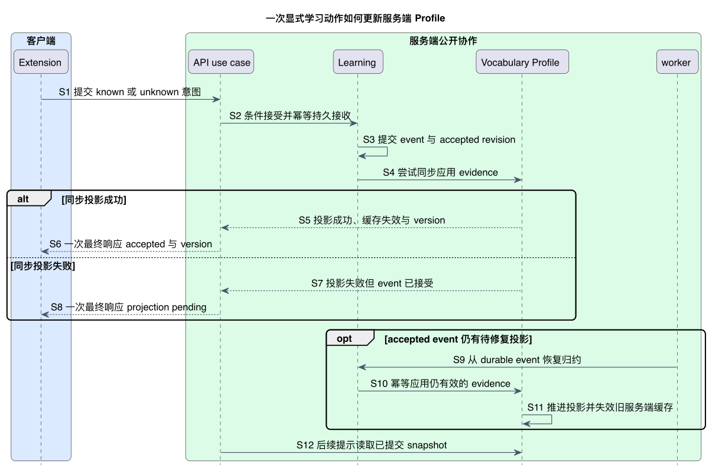

# 字幕与学习流程：即时帮助连接长期个人状态

LexiFlow 有两条互相反馈的业务链路：字幕链路读取 Profile，决定当前帮助；学习链路保存真实行为，更新之后会读取的 Profile。**前者以不中断观看为目标，后者以事实不丢失、顺序可解释、重放不重复为目标**。

本页先解释机制和关键分支。[详细流程合同](contracts/core-workflows.md) 保留逐步责任，[生命周期](phase-1-lifecycle-guarantees.md) 展开取消、冲突和恢复；以下流程仍是待实现设计。

## 字幕链路：先显示英文，再补充语境提示

### 先选该提示什么，再决定是否需要模型

[PlantUML 源码](diagrams/annotation-selection.puml) · [矢量图](diagrams/annotation-selection.svg)

S1 在浏览器执行且不等待网络，S2–S8 是服务端选择提示时的逻辑视角；图不是同一调用栈。它画的是一个候选的选择，实际一句字幕可能有多个候选，整体密度仍受 Enrichment 规则控制。

规则先结合词库和 Profile 判断是否需要帮助。已有可靠语境缓存走快路；没有可靠证据时形成 slow-work **意图**。意图还不是已存在的工作，也不能直接对客户端承诺 pending。已经掌握或不值得打断时返回空提示，英文观看继续。

### 慢路必须先提交工作，再独立投递结果

[PlantUML 源码](diagrams/annotation-async.puml) · [矢量图](diagrams/annotation-async.svg)

这张图刻意画“提交已确认”的正常路径：S3 在承诺 pending 前完成 durable commit；worker 在合法 attempt 下获取 Semantic evidence，Enrichment 重验 Profile/规则后持久化 result；Delivery 通过公开合同读取和投递，不依赖原 API 请求仍存活。

| 工作接收结论 | API 能承诺什么 | 客户端如何继续 |
|---|---|---|
| durable commit 已确认 | fast result + pending | 显示英文/已有提示，等待可关联的增量结果 |
| 明确提交失败 | fast result + no-pending | 英文/已有提示继续，不等待不存在的结果 |
| 提交确认不明 | 保留原 stable identity 的可恢复结论 | 有界查询或幂等重试，不另开工作或伪称 no-pending |
| 不需要语义工作 | fast result + complete | 不承担模型等待 |

具体轮询、SSE 或 WebSocket 后续再选，选择不改变 Enrichment 的 result ownership，也不允许 worker 回调原请求对象。

### 显示资格每次都要重验

视频/字幕切换、Profile 更新、取消或权限变化，都可能让刚到的结果失效。Extension 只有在当前 identity/revision/expiry 兼容后才合并，晚到结果静默丢弃。缓存命中同样不能跳过这些检查。

收到 revision 的 ACK 只证明收到；可见 overlay 提交后才创建 `HintDisplayed`；用户实际点击才创建带有效因果引用的 `HintClicked`。S14 与 S15 特意分开，避免把 transport 成功计作用户暴露。

## 学习链路：从行为事实到个人状态

### 三种对象分别回答“发生了什么、说明什么、现在如何”

[PlantUML 源码](diagrams/learning-concepts.puml) · [矢量图](diagrams/learning-concepts.svg)

Learning Event 是不可随评分算法改写的原始事实；Learning Evidence 是带来源与 reducer version 的解释；Profile Snapshot 是已应用 evidence 后的当前状态。图是概念关系，**不是 SQL 表、Java 类型或 wire 字段设计**。

这样更换评分规则时可以从保留事实重放（replay）、比较新 projection，再切换版本；无需把历史“已经学会”判断冒充原始观察。其他领域不因此统一采用 Event Sourcing。

### 显式动作同步尝试投影，失败仍如实区分

[PlantUML 源码](diagrams/learning-feedback.puml) · [矢量图](diagrams/learning-feedback.svg)

图从“条件接受成功”开始；陈旧 base、身份错误或冲突的拒绝分支在 [生命周期合同](phase-1-lifecycle-guarantees.md#learning-顺序与显式冲突) 展开。先 durable commit，再尝试同步投影；成功和失败各只返回**一次最终响应**，不是先发 ACK 再发 version ACK。

投影成功时 accepted + 新 version 满足 read-your-writes；投影失败时 accepted + projection pending 只证明事实已保存，不承诺已读到新状态。后台沿用相同事实幂等修复，旧意图不能覆盖新意图。

暂停、重播、真实显示和点击等隐式事实使用异步批处理和最终一致。相同 event/evidence/job 重传不重复计数；客户端不能直接提交权威 familiarity score。

### 让后续字幕读取更新后的状态

Vocabulary 推进自己的 projection version，并使旧服务端 profile cache 失效。Delivery/Sync 向客户端传播当前版本，Extension 淘汰不兼容 L1；Vocabulary 不操作浏览器缓存。新提示读取服务端已提交 snapshot，多个设备通过版本逐步收敛。

Learning 的 accepted explicit-intent revision 描述“哪些意图已接受以及顺序”；Vocabulary 的 projection version 描述“哪些证据已应用”。投影 pending 时二者尤其不能混用。

## 同步与异步边界：按承诺划分

判断方法是：**用户现在需要确认什么，就同步等到那个事实的真实边界；长尾计算留在后台**。

| 用户需要的确认 | 同步边界 | 留在后台的工作 |
|---|---|---|
| 英文已经可见 | 客户端本地渲染 | 无后端前置条件 |
| 快路结果可返回 | 有界 Content/Lexicon/Profile/规则读取 | 外部模型 cache miss |
| 有 slow work 可等待 | durable handoff commit 或明确失败结论 | Provider attempt 与结果投递 |
| 学习行为已保存 | Learning event durable commit | 隐式 evidence 归约 |
| 显式选择已生效 | profile version 或 projection pending 结论 | 失败恢复；不能假承诺 read-your-writes |

所有 API 等待都有 deadline；网络、Redis、worker、模型故障采取明确降级。完整操作矩阵与失败隔离见 [详细边界与预算](contracts/architecture-invariants.md#9-同步与异步边界)。

## 后续实现需要证明什么

首先证明英文首屏不计入后端/Provider 延迟，再分别测量 fast path、queue wait、Provider 和 Delivery 的长尾。用重复事件、乱序、投影失败、切换字幕与 late result 注入证明上述因果关系。具体 SLO、event schema、评分、传输和事务仍由后续阶段选择，本页不把设计图当产品测试结果。
