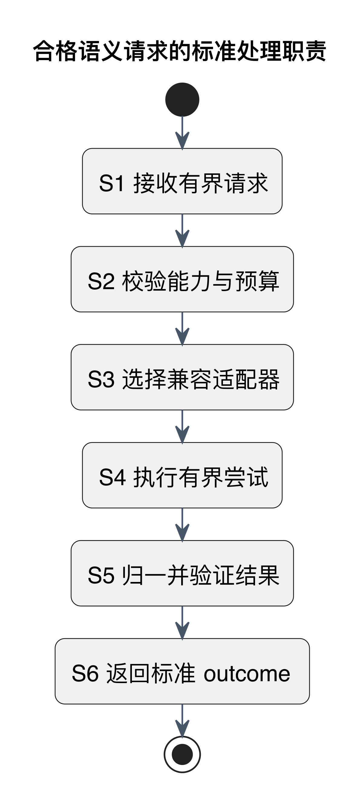

# Semantic 能力合同

> Proposed。先读 [横切合同导读](../phase-1-cross-cutting-contracts.md)。

只表达业务任务，不把 Provider 的 SDK、模型或 Prompt 暴露给核心。

[PlantUML 源码](../diagrams/semantic-outcome.puml) · [矢量图](../diagrams/semantic-outcome.svg)

图展示合格请求的正常职责路径；abstain、timeout、refusal、invalid 与取消等提前终止必须保持标准 outcome，详见 [结果合同](semantic-result.md)。

## 精确语义与后续证据

下面保留原合同的任务映射、Must/Should/Later、conformance、验收和未决假设。它们约束后续实现，不能从文档存在推断产品通过。

<!-- retained-contract:start -->
**对应任务：`LF-TSK-SEM-0001`**

本合同细化 ADR-007 的任务级抽象。业务模块只表达需要完成的语义能力、受约束的输入语义和预算；Semantic 负责能力路由、Provider 隔离与标准结果发布。端口不是通用文本生成接口，也不允许调用方选择具体 Provider、模型或 Prompt。

### 2.1 任务级能力

| Capability | 调用意图与有界输入 | Semantic 的责任 | 不属于 Semantic 的责任 |
|---|---|---|---|
| `disambiguate` | 为一个已定位的 term/phrase，在当前 caption 与允许的相邻 context 中判定候选语义。 | 返回与输入绑定、可校验且带置信与 provenance 的语境义证据，或明确 abstain/failure。 | 修改 Global Lexicon、推断用户熟悉度、决定是否展示。 |
| `translateInContext` | 为已选定的 term/phrase 与语境义生成目标语言的短表达；目标语言和表达约束由调用方声明。 | 保持 term、语境义、引用范围一致；只产生短语级语义证据。 | 生成整句双语字幕、决定 UI 文案长度或样式、覆盖原英文。 |
| `extractPhrase` | 在一个有界 caption/context 中找出具有整体语义的候选 span。 | 返回可绑定回原输入的候选 span、整体语义证据与置信；可返回无可靠候选。 | 判断用户是否需要提示、调整字幕 DOM、把每个候选都变成 annotation。 |
| `explainSentence` | 对用户显式请求或受控学习流程中的一个句子及有界 context 给出结构化解释证据。 | 区分词义、结构或语用等受支持的解释类别，并保持输入引用。 | 在正常观看 fast path 自动生成整句中文、替代 Learning 或 Enrichment 决策。 |

四类 capability 共享调用包络和 `LF-TSK-SEM-0002` 的标准 outcome，但各自拥有独立的输入约束、结果 invariant、质量评估与预算。一个 capability 的成功 payload 不能作为另一 capability 的成功结果使用。

### 2.2 调用包络与责任边界

以下元素描述架构语义，不承诺后续代码方法、wire 字段或序列化格式。

**Must**

- 请求必须携带 capability 与 contract version、规范输入 identity、最小必要的有界 context、目标语言或解释意图（若该 capability 需要）、调用方 deadline/cancellation 和数据分类。缺少必需上下文时应 abstain 或失败，不能补造字幕事实。
- 调用方负责 Content identity、source/context revision、用户授权和输入最小化；Semantic 不回读其他 Domain 的私有表来补全请求。
- Semantic 负责把任务路由到兼容 adapter、约束总 attempt/deadline/cost budget、归一并校验结果，再以 `LF-TSK-SEM-0002` 的 provider-neutral outcome 返回。
- Provider adapter 只实现外部系统适配与不可信输出归一，不拥有业务展示规则、Vocabulary Profile 或 annotation 生命周期。
- Enrichment 负责结合 Lexicon、Profile、规则和 Semantic evidence 决定 annotation；Client Delivery/Extension 只消费已发布的业务合同，不直接调用 Provider。
- deadline 和 cancellation 从调用方传入并沿路缩短。Semantic 只对 request/input identity、context revision 和 contract version 做晚到兼容校验；Enrichment 在形成或发布 annotation 前重验 profile/rule/annotation 前置版本；Client Delivery/Extension 在投递或显示前重验 caption/annotation/profile version。任何一层都不能用晚到结果延长已结束的观看路径。
- 默认只发送完成 capability 所需的最小 context。原始整段 transcript、Vocabulary Profile、账户标识和行为历史不得作为隐式上下文；确需用户相关信号时必须由 owner 提供已授权、最小化且可审计的派生信息。
- 输出必须是标准结构化 outcome。Provider 自有 SDK 对象、model name、token/accounting 字段、HTTP 状态、原始错误或自由文本响应不得穿过 Semantic port 进入 Domain。

**Should**

- 每类 capability 拥有独立 conformance fixtures，证明 fake、local 和外部 adapter 对同一请求语义产生可比较的标准 outcome。
- capability version 与 result contract version 独立演进；破坏性变化通过显式兼容审查，不用 Provider 路由配置暗中改变业务语义。
- 调用方给出用途标签和隐私等级，使 routing policy 能选择满足数据驻留、保留和成本限制的 adapter，但用途标签不能包含原始学习内容。

**Later**

- Phase 4 决定代码级 port 形态、各 capability 的具体 payload schema、routing/fallback 策略、Provider 清单和 deadline 数值。
- Phase 4/7 用离线标注集、故障注入与生产 SLO 确定 adapter 资格、预算和熔断参数。
- Prompt、Provider 参数与凭据装配均属于 adapter/operations 实现，不在 Phase 1 合同中固定。

### 2.3 Provider-neutral conformance review

审查以业务调用方可见的 port 为边界，并对四类 capability 逐项回答：

| 检查 | `PASS` 条件 | 失败示例 |
|---|---|---|
| 能力语义 | 名称和输入表达业务任务，结果可绑定回规范输入。 | `generate(prompt)`、无法定位来源的自由文本。 |
| Provider 隔离 | Domain 只看 capability、预算和标准 outcome。 | SDK request/response、model ID、HTTP status 出现在 Domain contract。 |
| Owner 边界 | Semantic 只提供证据；Enrichment/Profile/Learning 保持各自决策权。 | Semantic 直接标记“用户不认识”或“必须显示”。 |
| 预算与取消 | deadline、cancellation、attempt/cost budget 可被 adapter 遵守和观测。 | Provider 自行无限重试，晚到结果无版本检查地发布。 |
| 隐私最小化 | 每项输入都能说明 capability 必要性、授权来源和保留边界。 | 默认发送完整 transcript、账户 ID 或完整 Profile。 |
| 替换能力 | fake/local/外部 adapter 可在不改变调用方合同的情况下替换。 | 调用方分支判断特定 Provider 错误或输出格式。 |

### 2.4 Acceptance evidence

`LF-TSK-SEM-0001` 只有在以下证据可复核时才可判为 `PASS`：

1. 一份覆盖四类 capability 的 Provider-neutral type review，逐项确认业务名称、输入责任、标准 outcome 与 owner 边界，没有 SDK、Prompt、model 或 transport 泄漏。
2. 一张 capability responsibility matrix，证明 Content/Enrichment/Semantic/adapter/Client 的输入提供、路由、验证、展示和持久化责任唯一。
3. 至少两种不同 adapter（其中一种可为 deterministic fake）的概念 conformance walk-through，证明调用方合同不随 Provider 改变。
4. 一个 English-first 降级 journey，证明 timeout、abstain、failure 或 cancellation 均不会延迟英文字幕，也不会触发整句双语兜底。
5. 一份 privacy review，说明每类 capability 的最小上下文、禁止输入、授权 owner 与 retention owner。

### 2.5 未决假设

| ID | Assumption | 验证时机/owner |
|---|---|---|
| SEM-PORT-A1 | 四类能力足以支撑 MVP，新增能力无需退化为通用文本接口。 | Phase 4，Semantic 与 Enrichment owner 用代表性语料验证。 |
| SEM-PORT-A2 | `explainSentence` 主要服务显式学习动作，不进入正常 caption fast path。 | Phase 5/6 可用性测试与成本测量。 |
| SEM-PORT-A3 | 最小相邻 caption window 足以覆盖多数消歧与短语抽取。 | Phase 4 离线标注集比较；不足时通过有版本的 context policy 调整。 |
<!-- retained-contract:end -->
