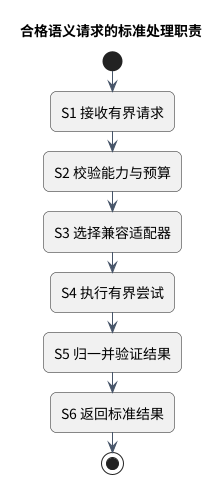

# 语义能力合同

> Proposed。先读 [横切合同导读](README.md)。

只表达业务任务，不把供应商的 SDK、模型或提示词暴露给核心。

图：语义请求的标准处理职责。

图展示合格请求的正常职责路径；不作答、超时、拒绝、无效与取消等提前终止必须保持标准结果，详见 [结果合同](semantic-result.md)。

## 精确语义与后续证据

下面保留原合同的任务映射、必须/应当/后续条件、符合性、验收和未决假设。它们约束后续实现，不能从文档存在推断产品通过。

<!-- retained-contract:start -->
**对应任务：`LF-TSK-SEM-0001`**

本合同细化 ADR-007 的任务级抽象。业务模块只表达需要完成的语义能力、受约束的输入语义和预算；语义负责能力路由、供应商隔离与标准结果发布。端口不是通用文本生成接口，也不允许调用方选择具体供应商、模型或提示词。

### 2.1 任务级能力

| 能力 | 调用意图与有界输入 | 语义的责任 | 不属于语义的责任 |
|---|---|---|---|
| `disambiguate` | 为一个已定位的词项/短语，在当前字幕与允许的相邻上下文中判定候选语义。 | 返回与输入绑定、可校验且带置信与来源证明的语境义证据，或明确放弃回答/失败。 | 修改全局词库、推断用户熟悉度、决定是否展示。 |
| `translateInContext` | 为已选定的词项/短语与语境义生成目标语言的短表达；目标语言和表达约束由调用方声明。 | 保持词项、语境义、引用范围一致；只产生短语级语义证据。 | 生成整句双语字幕、决定界面文案长度或样式、覆盖原英文。 |
| `extractPhrase` | 在一个有界字幕/上下文中找出具有整体语义的候选词段。 | 返回可绑定回原输入的候选词段、整体语义证据与置信；可返回无可靠候选。 | 判断用户是否需要提示、调整字幕 DOM、把每个候选都变成提示注释。 |
| `explainSentence` | 对用户显式请求或受控学习流程中的一个句子及有界上下文给出结构化解释证据。 | 区分词义、结构或语用等受支持的解释类别，并保持输入引用。 | 在正常观看快速路径自动生成整句中文、替代学习归约或提示编排决策。 |

四类能力共享调用包络和 `LF-TSK-SEM-0002` 的标准结果，但各自拥有独立的输入约束、结果不变量、质量评估与预算。一个能力的成功载荷不能作为另一能力的成功结果使用。

### 2.2 调用包络与责任边界

以下元素描述架构语义，不承诺后续代码方法、传输字段或序列化格式。

**必须**

- 请求必须携带能力与合同版本、规范输入身份、最小必要的有界上下文、目标语言或解释意图（若该能力需要）、调用方截止时间/取消和数据分类。缺少必需上下文时应不作答或失败，不能补造字幕事实。
- 调用方负责内容身份、来源/上下文修订号、用户授权和输入最小化；语义不回读其他领域的私有表来补全请求。
- 语义负责把任务路由到兼容适配器、约束总尝试/截止时间/成本预算、归一并校验结果，再以 `LF-TSK-SEM-0002` 的供应商无关结果返回。
- 供应商适配器只实现外部系统适配与不可信输出归一，不拥有业务展示规则、个人词汇档案或提示注释生命周期。
- 提示编排负责结合词库、个人档案、规则和语义证据决定提示注释；客户端投递/扩展只消费已发布的业务合同，不直接调用供应商。
- 截止时间和取消从调用方传入并沿路缩短。语义只对请求/输入身份、上下文修订号和合同版本做晚到兼容校验；提示编排在形成或发布提示注释前重验个人档案/规则/提示注释前置版本；客户端投递/扩展在投递或显示前重验字幕/提示注释/个人档案版本。任何一层都不能用晚到结果延长已结束的观看路径。
- 默认只发送完成能力所需的最小上下文。原始整段转写、个人词汇档案、账户标识和行为历史不得作为隐式上下文；确需用户相关信号时必须由负责人提供已授权、最小化且可审计的派生信息。
- 输出必须是标准结构化结果。供应商自有 SDK 对象、模型名称、令牌/用量记账字段、HTTP 状态、原始错误或自由文本响应不得穿过语义端口进入领域。

**应当**

- 每类能力拥有独立符合性测试样例，证明模拟实现、本地和外部适配器对同一请求语义产生可比较的标准结果。
- 能力版本与结果合同版本独立演进；破坏性变化通过显式兼容审查，不用供应商路由配置暗中改变业务语义。
- 调用方给出用途标签和隐私等级，使路由策略能选择满足数据驻留、保留和成本限制的适配器，但用途标签不能包含原始学习内容。

**后续条件**

- 阶段 4 决定代码级端口形态、各能力的具体载荷结构定义、路由/回退策略、供应商清单和截止时间数值。
- 阶段 4/7 用离线标注集、故障注入与生产 SLO 确定适配器资格、预算和熔断参数。
- 提示词、供应商参数与凭据装配均属于适配器/运维实现，不在阶段 1 合同中固定。

### 2.3 供应商无关符合性审查

审查以业务调用方可见的端口为边界，并对四类能力逐项回答：

| 检查 | `PASS` 条件 | 失败示例 |
|---|---|---|
| 能力语义 | 名称和输入表达业务任务，结果可绑定回规范输入。 | `generate(prompt)`、无法定位来源的自由文本。 |
| 供应商隔离 | 领域只看能力、预算和标准结果。 | SDK 请求/响应、模型 ID、HTTP 状态出现在领域合同。 |
| 负责人边界 | 语义只提供证据；提示编排/个人档案/学习归约保持各自决策权。 | 语义直接标记“用户不认识”或“必须显示”。 |
| 预算与取消 | 截止时间、取消、尝试/成本预算可被适配器遵守和观测。 | 供应商自行无限重试，晚到结果无版本检查地发布。 |
| 隐私最小化 | 每项输入都能说明能力必要性、授权来源和保留边界。 | 默认发送完整转写、账户 ID 或完整个人档案。 |
| 替换能力 | 模拟实现/本地/外部适配器可在不改变调用方合同的情况下替换。 | 调用方分支判断特定供应商错误或输出格式。 |

### 2.4 验收证据

`LF-TSK-SEM-0001` 只有在以下证据可复核时才可判为 `PASS`：

1. 一份覆盖四类能力的供应商无关类型审查，逐项确认业务名称、输入责任、标准结果与负责人边界，没有 SDK、提示词、模型或传输泄漏。
2. 一张能力职责矩阵，证明内容/提示编排/语义/适配器/客户端的输入提供、路由、验证、展示和持久化责任唯一。
3. 至少两种不同适配器（其中一种可为确定性模拟实现）的概念符合性逐步核对，证明调用方合同不随供应商改变。
4. 一个英文优先降级旅程，证明超时、不作答、失败或取消均不会延迟英文字幕，也不会触发整句双语兜底。
5. 一份隐私审查，说明每类能力的最小上下文、禁止输入、授权负责人与保留负责人。

### 2.5 未决假设

| ID | 假设 | 验证时机/负责人 |
|---|---|---|
| SEM-PORT-A1 | 四类能力足以支撑 MVP，新增能力无需退化为通用文本接口。 | 阶段 4，语义与提示编排负责人用代表性语料验证。 |
| SEM-PORT-A2 | `explainSentence` 主要服务显式学习动作，不进入正常字幕快速路径。 | 阶段 5/6 可用性测试与成本测量。 |
| SEM-PORT-A3 | 最小相邻字幕窗口足以覆盖多数消歧与短语抽取。 | 阶段 4 离线标注集比较；不足时通过有版本的上下文策略调整。 |
<!-- retained-contract:end -->
