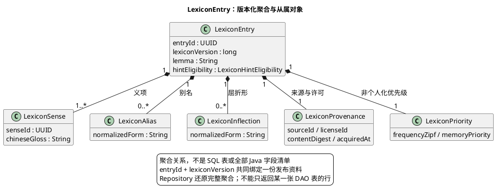

# 1. 词库持久化模型与初始化合同

**位置：** [架构总览](overview.md) → [共享词库合同](lexicon-contract.md) → 持久化模型。**前一步：** 离线词库导入准备规范资料；**下一步：** 发布版本供查询；**失败：** 批次保持不可见或事务回滚，绝不让半成品成为观看事实。操作步骤见[词库导入](../development/operations/lexicon-import.md)。

LexiFlow 现有持久化闭环是共享词库。PostgreSQL 保存词条版本、导入批次和来源证据；进程内 L1、Redis 与浏览器状态是可重建副本。领域和 application 只使用完整 Model 与 `LexiconRepository`，不能因为底层有表就把 DAO 行当成领域对象。

## 1.1. LexiconEntry 聚合

`LexiconEntry` 用不可猜测的 `lexicon_entry_id` 与不可变 `lexicon_version` 标识可跨内容复用的词汇知识。一个版本包含 lemma、一个或多个 Sense、Alias、Inflection、Provenance 与优先级。Sense 的稳定身份与准确版本会被 Annotation 引用；旧版本不能被新资料原地覆盖。查询时 Repository 还原完整聚合，不能丢失某个 sense、alias 或 inflection。[词库合同](lexicon-contract.md)定义字段、歧义和发布不变量。

图中展示 Domain 聚合关系，不把每个对象都当作独立服务或 SQL 表。精确字段见 [LexiconEntry](../../backend/modules/lexicon/src/main/java/io/lexiflow/lexicon/domain/model/LexiconEntry.java)，批次发布边界见下一节。

## 1.2. 导入批次与可见性

`lexicon_import_batch` 记录来源摘要、许可、版本、处理行数与发布状态。规范输入在一个 PostgreSQL 事务内写入并发布；流式输入先写入不可见的 `STAGED` 批次，只在完整扫描、处理行数与来源行数相等后切换到 `PUBLISHED`。同一时刻最多一个版本为 `PUBLISHED`。失败不能把部分批次暴露给观看；更正或撤回通过新版本表达，不改写已发布词条。

## 1.3. 持久化边界

`:modules:lexicon` 的 `domain.model` 拥有业务事实，`application.port` 定义 `LexiconRepository`，`application.importing` 协调导入；`:platform:adapters` 的 persistence 包实现 DO、DAO、Mapper、SQL 与 PostgreSQL 事务。技术层不因能访问数据库而取得所有领域表的所有权。未形成闭环的内容、标注、语义结果和异步工作不预留表或持久化接口。存储边界应从[模块边界](boundaries.md)理解，不从项目目录推断业务调用方向。

## 1.4. Repository 与 DAO

应用服务只依赖 [`LexiconRepository.java`](../../backend/modules/lexicon/src/main/java/io/lexiflow/lexicon/application/port/LexiconRepository.java)。[`DefaultLexiconRepository.java`](../../backend/platform/adapters/src/main/java/io/lexiflow/lexicon/platform/persistence/DefaultLexiconRepository.java)组合词条、导入批次和来源证据 DAO；DAO 只处理 PostgreSQL 表访问，DO 仅在 persistence 包内出现。[`LexiconEntryMapper.java`](../../backend/platform/adapters/src/main/java/io/lexiflow/lexicon/platform/persistence/LexiconEntryMapper.java)把 DO 还原成完整领域 Model；Repository 不向上暴露 `JdbcClient` 或表行。

## 1.5. 事务与版本

规范导入在同一 PostgreSQL 事务内锁定发布、分配版本、写入批次／词条／证据、替换旧发布版本并发布新版本。流式导入按连续分块更新 `source_rows_processed`；只有处理行数等于完整来源行数，才可以发布。发布身份必须与来源摘要、许可和词条内容绑定，重建后不可让旧缓存或本机偏好错误指向不同资料。

## 1.6. 结构初始化

数据库唯一最新结构在 [`infra/postgres/schema.sql`](../../infra/postgres/schema.sql)。结构变化须显式重建**本项目开发库**并完整重新导入；API 启动不得隐式清库，也不得触及其他项目数据。初始化测试覆盖空库初始化、非空拒绝、失败原子回滚后用修正 SQL 重试。具体隔离环境由[操作入口](../development/operations.md)指引，不用开发数据库充当测试资源。
