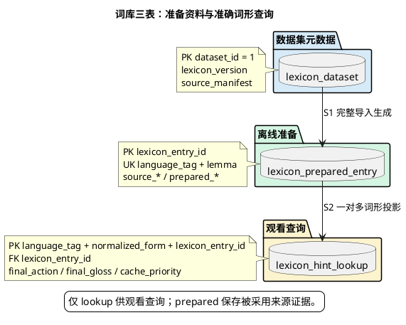

# 1. 词库持久化模型与初始化合同

**位置：** [架构总览](overview.md) → [共享词库合同](lexicon-contract.md) → 持久化模型。**输入：** 完整扫描并校验的离线来源；**输出：** 一套可供观看直接查询的已发布资料；**失败：** 发布事务回滚，观看继续读取先前完整资料。

PostgreSQL 只保存当前完整词库。来源文件本身按摘要保留在受控本机位置，不把每个来源的每条原始释义分别入库。观看只读 `lexicon_hint_lookup`，不联查准备记录；L1、Redis 与浏览器缓存均可重建。

## 1.1. 三张表的职责与关系

| 表 | 职责 | 关键字段与约束 | 写入与读取 |
| --- | --- | --- | --- |
| `lexicon_dataset` | 固定 `dataset_id=1` 的完整来源和发布身份 | PK `dataset_id`；`lexicon_version`、`source_manifest`、行数与准备规则 | 完整发布事务最后写入；API 只取版本 |
| `lexicon_prepared_entry` | 按语言与主词形归并的离线准备事实 | PK `lexicon_entry_id`；UK `(language_tag, lemma)`；`source_*`、`prepared_gloss`、`exclusion_reason`、`prepared_priority` | 来源扫描后批量写入；观看不查询 |
| `lexicon_hint_lookup` | 原形、别名和屈折形的准确反查表 | PK `(language_tag, normalized_form, lexicon_entry_id)`；FK 指向准备词条；`final_*`、`cache_priority` | 导入时派生；字幕批量查询唯一读表 |

一个准备词条可以产生多条准确词形；一个词形也可以自然地对应多个词条，尤其是屈折形。后者须向 Enrichment 保留全部候选，不选择第一条。逐字段类型、样例、赋值时点及关联见[三表字段 Reference](data-model/fields.md)；数据库约束与中文注释以 [schema.sql](../../infra/postgres/schema.sql) 为准。

## 1.2. 来源证据与最终决定

`source_gloss` 只记录被采用来源的清洗前释义；`source_gloss_ref` 定位来源文件记录。`source_bnc_rank`、`source_frq_rank`、`source_complex_tags`、`source_oxford_basic` 是来源原始证据。导入时计算 `prepared_gloss`、排除原因和优先级，再在查询表冻结 `final_action=HINT|BLOCK`、安全短释、义项身份和独立的缓存优先级。基础词和不能安全形成单一短释的词形保留为 BLOCK，因而可以进入负向缓存，但不显示提示。

词条身份由 `(language_tag, lemma)` 确定，不由来源或数据集 ID 决定。`lexicon_version` 只在单例数据集保存并随完整重导递增；查询结果随已发布资料版本绑定，版本变化时缓存失效。本机显式抑制偏好仍同时核对词条身份和版本。

## 1.3. 前置校验与原子发布

发布前先完整扫描来源、冻结基础词选择、验证格式和跨行 canonical 词形冲突。通过后重读同一来源，在**单个 PostgreSQL 事务**内以固定分块批写准备表及查询表；来源摘要和计数在提交前再次核对，最后写入数据集元数据。任一步失败均回滚，新数据不部分可见；没有 `STAGED`、`PUBLISHED` 等持久化生命周期状态。更正与撤回通过重新准备完整数据集并原子替换，不在观看时修改资料。

## 1.4. 边界与初始化

`LexiconRepository` 是 application 的唯一持久化端口；PostgreSQL 适配器负责事务和 SQL，不向 Enrichment 暴露表行。`LexiconEntry` 仍用于离线准备和领域校验，观看只接收从查询投影生成的 `LexiconHintCandidate`。查询一至三个连续词的准确形式，缺失形式合并为一次批量 SQL，不对长短语做任意 n-gram 枚举。

数据库唯一最新结构在 [schema.sql](../../infra/postgres/schema.sql)。结构变化须显式重建**本项目开发库**并完整重导；API 启动不隐式清库，也不触及其他项目。隔离集成测试在临时 schema 执行，结束后清理。
