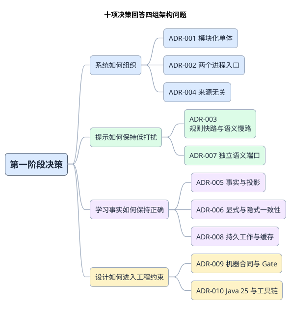

# 架构决策：推荐什么，为什么，何时重审

十项 ADR 不是十个互不相关的清单，它们共同回答四个问题：系统如何组织、提示如何保持低打扰、学习事实如何保持正确、设计如何进入工程约束。

**推荐方向是模块化单体、两运行入口、规则快路与语义慢路、行为事实加个人投影，以及 Java 25 的确定性工程工具。** 业务决策仍是 Proposed；本地骨架已实现不等于用户已接受全部 ADR 或 G1 已完成。

图：十项 ADR 按系统组织、观看体验、事实正确性和工程约束分组。

## 决策索引

| 问题 | 相关 ADR | 一组连续取舍 |
|---|---|---|
| 系统如何组织 | ADR-001、002、004 | 用模块和来源边界控制复杂度；用两个进程隔离时延 |
| 提示如何保持低打扰 | ADR-003、007 | 规则决定是否提示；语义能力可替换且不进入必需快路 |
| 事实如何保持正确 | ADR-005、006、008 | 行为可重放，显式/隐式分层一致，工作持久化且缓存可丢弃 |
| 工程如何固定边界 | ADR-009、010 | 唯一机器合同、分层证据、Java 25 工具链与显式版本锁 |

每个 ADR 先给推荐结论，再说明背景、替代方案与代价、结果和复审条件。编号与原标题保留，其他文档的链接继续有效。

## 系统组织：用业务边界控制复杂度

先把业务负责人与来源边界固定，再用进程分工隔离交互和后台延迟。三个决策同时降低早期部署成本，并保留未来按真实瓶颈演进的入口。

### ADR-001：采用模块化单体

**状态：Proposed**

#### 推荐结论

采用一个代码库、一个版本体系内的模块化单体。每个限界上下文拥有公开 API、内部领域/应用与出站端口。跨上下文只能使用公开 API；数据库、缓存和供应商通过适配器接入。物理构建模块可渐进拆分，但逻辑依赖规则和测试从第一天生效。

#### 背景与问题

产品从一个 Chrome 扩展和一个后端开始，但领域已包含身份、内容、词库、个人词汇档案、学习归约、语义与提示编排。未来来源和客户端会扩展；当前没有足够吞吐、独立团队或隔离数据证明需要微服务。

#### 替代方案与取舍

| 方案 | 优点 | 代价/风险 |
|---|---|---|
| 简单分层单体 | 初始化最快、文件少。 | 领域负责人容易退化为控制器/服务/仓库横向调用，数百任务并行后冲突和隐式耦合难以控制。 |
| **模块化单体** | 单进程事务和调试简单；领域清晰；未来可按真实热点拆分。 | 需要维护公开面、依赖清单和架构测试；部署仍有共同版本节奏。 |
| 微服务 | 独立发布和故障隔离强。 | 过早引入网络契约、分布式事务、服务发现和运维成本，当前工作负载无法证明收益。 |

#### 结果与代价

- 必须：模块依赖无环；领域禁止基础设施导入；只有引导装配实现。
- 应当：每个上下文的公开能力可通过合同测试样例独立验证。
- 后续条件：当吞吐、数据隔离、发布频率或团队负责人连续显示边界压力时，优先抽出已有公开 API 最稳定的上下文。

#### 何时重新考虑

单个上下文需要独立扩容且长期占主要资源、发布耦合持续阻塞多个负责人，或故障隔离 SLO 无法由 `api`/`worker` 进程切分满足。

### ADR-002：同代码库提供 `api` 与 `worker` 两个运行入口

**状态：Proposed**

#### 推荐结论

构建 `bootstrap-api` 与 `bootstrap-worker` 两个组合根。两者共享相同领域/应用版本，独立运行、扩容和重启；通过持久交接异步工作。工作进程经提示编排公开能力写入提示编排领域拥有的持久化提示注释结果，`Client Delivery / Sync` 应用模块再关联投递；工作进程不回调原始 API 请求对象。两个入口是可部署的运行时，不是独立业务服务。

#### 背景与问题

字幕快速路径需要稳定低延迟；模型调用、预取、学习归约投影与重放具有高延迟、批处理和可重试特征。把它们都放在 API 请求线程会把供应商长尾传给用户。

#### 替代方案与取舍

| 方案 | 优点 | 代价/风险 |
|---|---|---|
| 单进程内线程池 | 本地启动最简单，调用开销低。 | 工作进程堵塞、内存和崩溃会影响 API；扩容比例绑定。 |
| **两个入口、同一单体** | 延迟/故障边界清晰；不增加内部网络 API；共享代码和事务语义。 | 需要持久化作业协调、版本兼容和两个运行时的运维。 |
| 独立微服务 | 可独立技术栈和发布。 | 增加网络失败、重复契约和分布式诊断，初期收益不足。 |

#### 结果与代价

API 不等待工作进程完成记录；工作进程不拥有独立领域模型；组合根中禁止业务条件分支。结果生成归提示编排，结果投递归 `Client Delivery / Sync`，两个负责人不得通过直接读写对方表耦合。

#### 何时重新考虑

工作进程与 API 必须使用不同发布周期或技术栈，且公共应用层模块已无法承载兼容边界。

### ADR-004：内容核心来源无关，YouTube 是适配器

**状态：Proposed**

#### 推荐结论

内容上下文只表达来源无关的内容、片段、字幕、时间范围、播放位置和有界上下文。YouTube DOM/API 解析保留在扩展来源适配器；后端来源适配器只负责映射为内容的公开语义。

#### 背景与问题

YouTube 是第一个入口，未来还要支持网页、PDF、播客与其他视频平台。如果核心模型持有 DOM 选择器、播放器 API 或平台字幕格式，后续来源会复制全部学习归约/提示编排流程。

#### 替代方案与取舍

| 方案 | 优点 | 代价/风险 |
|---|---|---|
| 以 YouTube 为中心的核心模型 | 首个演示更快。 | 平台概念渗透缓存、事件和个人档案；第二来源会造成大规模重构。 |
| **规范内容 + 适配器** | 一条提示编排/学习归约处理流程服务全部来源；测试可用通用测试样例。 | 首期需定义规范化边界，并处理来源信息缺失。 |
| 每个来源独立处理流程 | 可完全定制。 | 重复规则、个人档案和语义逻辑，跨来源学习状态难共享。 |

#### 结果与代价

内容上下文接受缺失和乱序；YouTube 私有类型不得越过适配器。来源特殊能力通过可选能力表达，不能进入共享核心的必填假设。

#### 何时重新考虑

至少两个来源证明无法用同一内容/片段/上下文语义表达，并且差异会改变核心学习含义，而不只是适配器获取方式。

## 观看体验：让语境帮助不拖慢英文

先守住字幕首屏，再为真正需要的表达付出模型成本。快慢路径和语义端口一起保证低打扰、故障隔离与供应商可替换。

### ADR-003：采用规则快速通道与语义慢速通道

**状态：Proposed**

#### 推荐结论

提示编排分两段：

1. 快速通道同步执行规范化、短语/候选检测、词库/个人档案/缓存查询和提示需求规则；形成确定性或已缓存提示注释与慢速工作意图。
2. 存在慢速工作时，工作流协调应用层先提交持久交接。API 只有在提交确认后才暴露快速结果 + 待处理；入队失败时返回快速结果 + 无待处理任务安全降级，不承诺虚构工作。
3. 已提交的语义工作由工作进程执行，调用语义供应商后经提示编排再次执行展示策略并持久化提示注释结果；`Client Delivery / Sync` 通过公开合同关联投递增量结果。

英文优先绘制始终位于客户端，并早于两段后端结果。

#### 背景与问题

用户要求英文立即显示、提示少而准、翻译结合语境。纯 LLM 字幕翻译会阻塞并产生过量提示；纯词典又无法可靠处理多义词、短语和术语。

#### 替代方案与取舍

| 方案 | 优点 | 代价/风险 |
|---|---|---|
| 每句阻塞调用 LLM | 实现直观，语境能力集中。 | P95/P99 受供应商控制；成本高；无模型即无字幕辅助；容易变成整句翻译。 |
| 纯本地规则/词典 | 快、稳定、便宜。 | 多义词、习语、技术语境和自然中文质量受限。 |
| **混合方案快速/慢速通道** | 英文和快速提示稳定；模型只处理难例；可预取和缓存。 | 要处理增量结果、迟到结果、版本和双阶段测试。 |

#### 结果与代价

- 模型只贡献语义证据，不能单独决定展示。
- 待处理是持久交接承诺，不是候选生成或内存入队状态。
- 提示编排拥有已生成/已持久化的提示注释结果，`Client Delivery / Sync` 拥有已投递/状态；客户端实际可见渲染后才产生 `HintDisplayed`，用户交互后才产生 `HintClicked`。
- 客户端必须支持关联、修订号、去重和陈旧结果拒绝。
- 必须按阶段统计延迟和降级原因，不能只报一次总耗时。

#### 何时重新考虑

受控压测证明某类小模型在目标部署下有稳定、可负担的严格截止时间，且同步接入不会影响快速路径 P99；届时可只为该任务增加有界同步路由。

### ADR-007：业务只依赖语义端口

**状态：Proposed**

#### 推荐结论

由 `semantic-api` 定义任务级能力、标准错误、截止时间、置信与可观察元数据。`semantic-routing` 根据任务和策略选择实现；供应商 SDK 只存在于 `semantic-providers` 适配器。领域不接收供应商原始响应。

#### 背景与问题

OpenAI、Gemini、Qwen、本地模型和未来供应商在能力、价格、延迟和接口上都不同。短语检测、简单消歧与困难解释也未必使用同一模型。

#### 替代方案与取舍

| 方案 | 优点 | 代价/风险 |
|---|---|---|
| 业务代码直接调用一家 SDK | 首个调用最快。 | 错误、缓存、测试和数据模型被供应商锁定；替换成本散落全仓。 |
| 通用“文本进、文本出”接口 | 表面统一。 | 丢失任务语义、结构校验、截止时间和可比较指标，容易形成新的泄漏抽象。 |
| **任务级语义端口** | 可按任务路由和测试；标准化失败与结果；隔离 SDK。 | 需要维护能力交集和供应商专有的适配器。 |

#### 结果与代价

端口表达 `disambiguate`、`translateInContext`、`extractPhrase`、`explainSentence` 等业务能力，但本阶段不定义具体方法签名或提示词。模拟实现供应商是合同/用户旅程测试的一等实现。

#### 何时重新考虑

多个供应商长期无法映射到稳定任务语义；此时按能力拆端口，而不是把供应商类型暴露给提示编排。

## 事实正确性：接受、应用与恢复各有边界

事实接收、状态投影和异步工作分别有持久证据。三个决策共同解决重复、乱序、确认丢失和恢复，不用缓存或客户端时钟承担正确性。

### ADR-005：学习归约保存不可变事实，个人词汇档案是投影

**状态：Proposed**

#### 推荐结论

学习归约先追加保存不可变行为事实，使用版本化规则生成证据；个人词汇档案幂等应用证据，形成当前可查询投影。身份、内容、词库等其他上下文继续使用普通事务状态。

#### 背景与问题

用户掌握度会随实际展示、点击、暂停、重播和显式标记变化。生成但未交付、交付但陈旧、缓存但未显示的提示不算用户暴露。算法会迭代；只保存最终熟悉度无法解释、回放或重新计算。对整个系统使用事件溯源又超出必要范围。

#### 替代方案与取舍

| 方案 | 优点 | 代价/风险 |
|---|---|---|
| 直接 CRUD 熟悉度 | 简单、读取快。 | 丢失因果与算法版本，无法可信重算；客户端容易成为权威。 |
| **学习归约事实 + 档案投影** | 保留解释和重放能力；查询仍高效；复杂度局限在学习链路。 | 需要幂等、检查点、投影版本和最终一致性。 |
| 全系统事件溯源 | 所有状态可重放。 | 身份/内容等无必要上下文也承担事件版本、投影和迁移成本。 |

#### 结果与代价

学习归约是原始行为负责人，个人词汇是当前掌握状态负责人；个人档案不能反向成为原始历史。`HintDisplayed` 只在客户端把提示注释实际提交到可见叠加层后上报，`HintClicked` 必须引用对应已显示/结果身份。已生成/已投递生命周期状态不能替代学习归约的已显示/已点击事实。事件结构定义和重放策略在阶段 2 设计。

#### 何时重新考虑

事件量、保留成本或隐私要求使完整历史不可持续；届时设计可验证的压缩/保留策略，而不是静默丢弃解释性。

### ADR-006：显式意图同步投影，隐式信号异步投影

**状态：Proposed**

#### 推荐结论

所有事件先持久提交。显式 `MarkedKnown/MarkedUnknown` 在同一用例中同步产生证据并推进档案版本；只有事件提交和投影成功后，单次最终响应才确认已接受与新版本。若投影失败，事件保持待处理由工作进程修复，同一最终响应明确说明事件已接受 + 投影待处理，不能先发送持久化 ACK 再发送版本 ACK。隐式事件由工作进程批量归约并最终一致更新个人档案。

#### 背景与问题

用户点击“认识”后希望立即不再提示；`HintDisplayed`、暂停、重播等高频弱信号可以稍后批量处理。全部同步会放大写延迟，全部异步会违背强用户意图。

#### 替代方案与取舍

| 方案 | 优点 | 代价/风险 |
|---|---|---|
| 全同步投影 | 一致性简单。 | 高频行为增加 API P99 和锁竞争，失败耦合更大。 |
| **按意图强度分层** | 强意图读己之写；弱信号可批处理。 | 两条路径需要共享同一归约器/幂等性语义并验证结果等价。 |
| 全异步投影 | API 最轻。 | 用户刚标记认识仍可能马上看到提示，体验不可信。 |

#### 结果与代价

同步与异步路径不能复制评分逻辑；工作进程重放显式事件时必须识别已应用证据。API 对“事件已保存但投影待处理”需要明确状态语义，并只给出一次最终响应；待处理不是读己之写成功。

[生命周期保证](phase-1-lifecycle-guarantees.md#learning-顺序与显式冲突) 比较客户端时钟、纯服务端接收顺序和意图修订号条件接受三种冲突方案，推荐第三种。学习领域拥有的已接受意图修订号独立于投影版本；陈旧动作不能静默反转新意图。该补充仍为 Proposed，精确结构定义、事务和评分属于后续阶段。

#### 何时重新考虑

真实交互证明短暂最终一致性可接受，或同步投影无法达到 API SLO；也可考虑以严格版本叠加层实现相同读己之写。

### ADR-008：初期使用 PostgreSQL 持久交接，Redis 只做可丢弃状态

**状态：Proposed**

#### 推荐结论

使用与权威业务写入一致的 PostgreSQL 事务发件箱/作业边界承载异步交接，工作进程幂等消费。字幕快速结果的待处理仅在交接持久提交后返回；入队失败明确无待处理任务。工作进程完成后由提示编排持久化结果，再经 `Client Delivery / Sync` 投递；Redis 只承担缓存、短期去抖和可恢复协调，不是唯一工作队列。具体结构定义、声明与重试算法在阶段 2/7 决定。

[生命周期保证](phase-1-lifecycle-guarantees.md#durable-work取消与租约) 固定总截止时间/有限预算、持久化提交资格、隔离屏障、取消与完成竞争、提交确认未知及投递 ACK 的架构保证。供应商晚到不承诺停止计算，也不能恢复已终止工作。具体租约/退避数值仍由阶段 2/7 选择，ADR 状态仍为 Proposed。

#### 背景与问题

系统需要在 API 提交后可靠交给工作进程，且必须支持至少一次投递、重试和诊断。初期没有 Kafka 级吞吐证据；Redis 被明确定位为缓存/热点状态，不能因刷新丢失学习归约或语义工作。

#### 替代方案与取舍

| 方案 | 优点 | 代价/风险 |
|---|---|---|
| 内存队列 | 零外部依赖。 | 进程退出即丢任务，无法支持可靠学习归约。 |
| Redis 队列/流作为唯一来源 | 延迟低、实现成熟。 | 与 PostgreSQL 业务提交存在双写边界；缓存运维动作可能影响持久工作。 |
| **PostgreSQL 持久交接** | 事务一致、组件少、可审计，适合初期规模。 | 高频声明会给数据库增加负载，需要索引、批处理和清理。 |
| Kafka 等专用平台 | 高吞吐、分区和重放强。 | 运维、协议和本地开发成本高，当前无工作负载依据。 |

#### 结果与代价

API 只在持久提交后承诺语义待处理或确认学习归约事件接收；显式行为还须等待同步投影成功或待处理结论，形成单次最终响应。工作进程以至少一次假设实现。Redis 全量丢失必须进入韧性 Gate。

#### 何时重新考虑

可测量的数据库争用、队列滞后或保留需求达到 PostgreSQL 方案上限，且优化索引/批量/分区后仍无法满足 SLO。

## 工程约束：让实现和证据各有负责人

工程规则由确定性工具执法，目录验收消费冻结证据。工具链和机器合同限制漂移，但独立复核、可信身份和用户决定仍不能省略。

### ADR-009：用机器可读清单和 Gate 固定边界

**状态：Proposed**

#### 推荐结论

工程初始化时建立：

- 唯一机器可读模块清单，声明工作包负责人、允许项目依赖与禁止导入；
- 架构、合同、旅程和失败注入验收目录；
- 单一 Gate CLI/脚本入口，显式选择增量/完整；
- 不可覆盖的每次运行证据；
- 子代理交接结构定义与 `PASS/FAIL/BLOCKED` 结果语义。

客户端特定代理配置只引用共享规则，不复制规则正文。主代理不把子代理退出成功直接视作质量 `PASS`。

#### 背景与问题

项目预计拆成数百个子功能和大量子代理调用。只写人类文档无法防止跨模块导入、跳过验证、写范围冲突和适配器泄漏。参考仓库已经证明依赖允许列表、禁止导入、统一 Gate 和任务交接能把边界变成可验收事实。

#### 替代方案与取舍

| 方案 | 优点 | 代价/风险 |
|---|---|---|
| 仅文档约定 | 初期成本最低。 | 规则随代理/开发者理解漂移，无法自动定位违例。 |
| **清单 + 可执行文件检查** | 依赖和验收可重复；适合并行委派；失败有证据。 | 需要维护清单、触发条件和测试速度。 |
| 每个平台复制完整规则 | 平台内读取方便。 | 多真源漂移，修改需跨目录同步，难判断权威版本。 |

#### 结果与代价

- 必需 Gate 未运行、跳过或不可用均不能报告为 `PASS`。
- Java 格式、静态分析、注释、模块和类依赖、测试及覆盖率规则只由 Gradle/Java 工具链执行；Python Gate 只做选择、编排、证据和收据治理，不实现同义 Java 源码扫描。
- `TASK_VALIDATION` 是交付命令的唯一执行层；`INDEPENDENT_REVIEW` 只复核冻结产物和验证收据，`CATALOG_DECISION` 只验证收据/依赖/哈希 DAG。后两层不得再次启动交付检查器。
- 原子任务保留独立 DAG/结果证据；Codex 委派以稳定 `work_package_id` 和精确 `task_ids[]` 聚合同负责人、同合同/写入边界且总预计至少 120 分钟的工作，避免为小步骤重复启动代理。
- 并行实现任务必须使用不重叠写范围；接口/清单/组合根集成由唯一负责人串行完成。
- 主会话优先接收精简完成回调，不做高频状态轮询；首次兜底检查不得早于五分钟，后续不得频于十分钟。

#### 何时重新考虑

只有当清单或 Gate 的维护成本持续高于它捕获的真实缺陷，并有替代的同等可执行控制时才简化；不能退回纯口头约定。

### ADR-010：采用 JVM 后端、TypeScript 扩展与独立 Python 工具链

**状态：Proposed**

#### 推荐结论

若用户接受 G1，阶段 2 的数据模型工程骨架按以下技术基线展开；具体补丁版本在创建 wrapper/锁文件当天通过官方稳定版本重新核验并固定：

- 后端：Java 25 LTS；Spring Boot 4.x 作为 HTTP、配置与运行时适配器；核心领域保持纯 Java，不依赖 Spring 提示注释。只有测量证明需要响应式背压的适配器才引入 Reactor，普通 API 默认使用同步 servlet/virtual-thread 友好的调用模型。
- 构建：Gradle 9.7.x Wrapper、Kotlin DSL、Java 工具链 25、版本目录与依赖锁定。多项目物理模块对应稳定逻辑负责人；构建逻辑集中管理质量规则，不由每个模块复制。
- 扩展：清单 V3 + TypeScript；Node 24 LTS 仅用于构建、静态检查、测试和打包，不作为后端运行时。首次创建扩展锁文件时使用当日稳定的 TypeScript 6.x 补丁并精确锁定；内容脚本、服务工作进程、叠加层界面和共享合同分包，并按 MV3 的可终止服务工作进程设计可恢复状态。
- 工程工具：Python 3.12，继续只承载 Harness、Gate、生成器和审计脚本；不承载产品领域。3.12 已进入 security-only，本选择只用于在 G1 期间保持现有 Harness 的已验证解释器基线，并不承诺把它沿用到 EOL；升级阈值见下文版本治理。
- 目录：`backend/`、`clients/chrome-extension/`、`contracts/`、`tests/`、`scripts/`、`harness/`、`openspec/`、`planning/`、`docs/`。后续阶段再创建具体模块，不在本 ADR 提前生成代码或 API。

#### 背景与问题

LexiFlow 后端要维护清晰的模块公开面、事务内持久交接、可重放学习归约流与长期数据迁移；Chrome 扩展必须直接面对 DOM、清单 V3 与浏览器生命周期。参考仓库的 Java 多模块、Gradle Wrapper、依赖锁和架构测试路径已经可复用，但不能因此把浏览器代码或工程工具也强行放进 JVM。仓库已按用户指定的 Java 方向建立产品构建基础；`LF-TSK-OPS-0001` 仍须通过当前输入目录验收，才能正式冻结运行时、构建、锁和物理目录方向。

#### 替代方案与取舍

| 方案 | 优点 | 代价/风险 |
|---|---|---|
| **Java 25 + Spring Boot + Gradle；扩展 TypeScript** | 强类型模块边界、成熟事务/数据库生态；可直接继承参考仓库的 Gradle/架构测试经验；浏览器端保持原生生态。 | 两套产品语言与构建工具；Spring 需要通过工作包/模块测试防止进入领域；系统默认 Java 26 与产品 Temurin 25 必须由统一启动器隔离。 |
| 后端与扩展全 TypeScript | 共享语言、DTO 工具和上手速度好；Node 异步 I/O 适合 API。 | 后端领域边界更依赖静态检查/约定；事务、投影与大量代理并行修改时，需要额外工程规则才能获得同等级隔离。 |
| Kotlin + Spring Boot；扩展 TypeScript | JVM 生态与简洁建模兼得，空值安全强。 | 引入 Java/Kotlin/TypeScript 三种语境；编译和构建逻辑更复杂；与参考仓库直接复用的源级模式较少。 |

#### 版本选择的当时证据

- Oracle 当前支持路线把 Java 25 列为 LTS；Gradle 兼容矩阵证明 Java 25 的工具链与运行支持起点都是 9.1.0，这只回答“最低兼容版本”，不等于实施版本。本次评审时 Gradle 官方发布版本将 9.7.1 列为最新稳定版，因此 ADR 选择 9.7.x 发布系列；批准实施时再次选择当日稳定补丁，并用 Gradle 官方校验和固定发行包 ZIP 和 Wrapper JAR，而不是跟随开发机的非 LTS Java 26。[Oracle Java SE 支持路线图](https://www.oracle.com/ae/java/technologies/java-se-support-roadmap.html)；[Gradle 兼容性矩阵](https://docs.gradle.org/current/userguide/compatibility.html)；[Gradle 发布版本](https://gradle.org/releases/)；[Gradle 发布校验和](https://gradle.org/release-checksums/)
- Gradle 的多项目依赖会同时约束类路径与构建顺序，依赖锁定会校验解析结果，适合把逻辑依赖清单落实到物理构建。[Gradle 多项目构建](https://docs.gradle.org/current/userguide/multi_project_builds.html)；[Gradle 依赖锁定](https://docs.gradle.org/current/userguide/dependency_locking.html)
- Spring Boot 4.1 当前支持 Java 17–26 和 Gradle 8.14+/9.x；Spring Modulith 提供模块结构验证，但先保留为后续条件，避免框架提示注释成为领域边界真源。[Spring Boot系统要求](https://docs.spring.io/spring-boot/system-requirements.html)；[Spring Modulith 基础](https://docs.spring.io/spring-modulith/reference/fundamentals.html)
- Node 官方建议生产应用选择活动/Maintenance LTS；截至本次评审 Node 24 为 LTS。Chrome 清单 V3 使用按需服务工作进程，并禁止远程托管代码，因此扩展必须持久化可恢复状态并把可执行代码纳入包内。[Node.js 发布版本](https://nodejs.org/en/about/previous-releases)；[Chrome 清单 V3](https://developer.chrome.com/docs/extensions/develop/migrate/what-is-mv3)
- TypeScript 6.0 是本次评审时的稳定发布线，并明确包含面向 7.0 的 breaking-change/deprecation 迁移说明；因此首次锁精确固定 6.x 补丁，7.x 不得作为自动依赖更新进入。[TypeScript 6.0 发布说明](https://www.typescriptlang.org/docs/handbook/release-notes/typescript-6-0.html)
- Python 官方生命周期表显示 3.12 仅接收安全修复并于 2028-10 EOL；3.12 的后续安全发布为不定期仅源码，官方已停止提供二进制安装器。LexiFlow 暂留 3.12 是为了保持现有阶段 1 Harness 的解释器基线、缩小 G1 同时变更面，且 Python 不承载产品领域；这也意味着干净机器安装能力必须成为批准后复现检查，而不能假定本机 pyenv 缓存存在。[Python 版本状态](https://devguide.python.org/versions/)；[Python 3.12 security-only 发布说明](https://www.python.org/downloads/release/python-31214/)

#### 版本审查与漂移策略

- `LF-WS-OPS` 是运行时、Wrapper 和锁文件的唯一负责人；`LF-WS-QLT` 独立执行 Gate 并保存收据。每次阶段 Gate、每次发布候选，以及距上次复核 30 天时，重新检查上述官方生命周期和兼容矩阵。
- 创建工程骨架当天只从仍受支持的发布系列选择稳定补丁，并把精确版本写入 Gradle Wrapper、版本目录/依赖锁、Node 运行时固定版本、`package.json`/锁文件、Python 运行时固定版本与 Python 依赖锁。范围符号或开发机全局版本不得替代这些真源。
- 安全公告要求升级时立即建立独立 OPS 任务；同发布系列的补丁仍须通过清理后构建、产品测试和架构测试。Java、Gradle、Spring Boot、Node、TypeScript 或 Python 的主版本/次版本变化必须先建立 OpenSpec 变更，重新核对兼容矩阵、破坏性变更、部署环境和回滚证据。
- Python 3.12 在以下任一条件先到时升级到当时仍处于缺陷修复支持的稳定版本：无法在受支持平台从声明的来源建立干净环境；关键依赖停止支持 3.12；安全修复无法及时获得；进入 EOL 前 12 个月；或 Python 工具开始成为对外发布产物。升级不得晚于 2027-10 的复核窗口。
- 升级失败时回退到上一组已通过 Gate 的 Wrapper、运行时固定版本和完整锁文件，并从上一可重现构建产物恢复；不得只回退单个直接依赖而保留未知的传递性图。

#### 结果与代价

- 必须：产品依赖使用 wrapper 与锁文件；不得依赖开发机全局 Gradle/Node 包。Java 工具链固定为 25；确定性启动器必须拒绝 Java 26，系统默认 Java 不能成为产品构建证据。
- 必须：Spring、PostgreSQL、Redis、HTTP、供应商 SDK 只进入适配器/组合根；领域/应用的边界由 Gradle 项目依赖与架构测试双重约束。
- 必须：扩展打包不包含远程托管代码；内容脚本输入按不可信网页数据处理；服务工作进程不保存无法恢复的唯一状态。
- 应当：后端和扩展各自有快速定向测试，跨端合同测试样例由 `contracts/` 负责人串行维护；仓库 Gate 统一聚合，但不把两个构建系统耦合成隐式魔法。
- 后续条件：是否采用 Spring Modulith、jOOQ/Flyway、具体测试库、前端打包器和单仓库工作包管理器，在相应阶段用工作负载与维护成本决定；本 ADR 不提前冻结。

批准后的具体创建顺序、拟执行命令和证据产物见 [批准后的工具链验证](../development/post-approval-toolchain-verification.md)。该清单目前是计划，未执行，也不构成 Wrapper、锁文件、清理后构建或架构测试已通过的证据。

#### 何时重新考虑

Java 25/Gradle/Spring Boot组合无法在目标部署和团队环境稳定复现；后端交付速度长期被跨语言合同成本主导；或真实性能分析表明所选运行时无法满足延迟、内存或冷启动目标。发生时先保留领域合同与数据所有权，再替换运行时/适配器。

## 评审记录模板

人工评审后，在本页只更新对应 ADR 的状态和以下记录，不在历史段落中静默改写已接受的理由：

| 项目 | 内容 |
|---|---|
| 决定 ID | `ADR-...` |
| 审查日期 | 待填写 |
| 审阅者 | 待填写 |
| 结果 | 已接受 / Rejected / Superseded |
| 条件 | 若有，写进入下一阶段前的约束 |
| 替代的旧记录 / 被新记录替代 | 若有，链接新 ADR |

完整领域、数据流、同步/异步边界和验收合同见 [phase-1.md](phase-1.md)。

## 当前实现如何理解这些提案

当前精确运行时和工具版本以 [Java 清单](../../harness/java-product.manifest.yaml) 与[版本目录](../../backend/gradle/libs.versions.toml)为准；本页解释选择与取舍，不维护执行流水账。双环境复现和正式收据须按[校验手册](../development/validation/README.md)另行证明。
