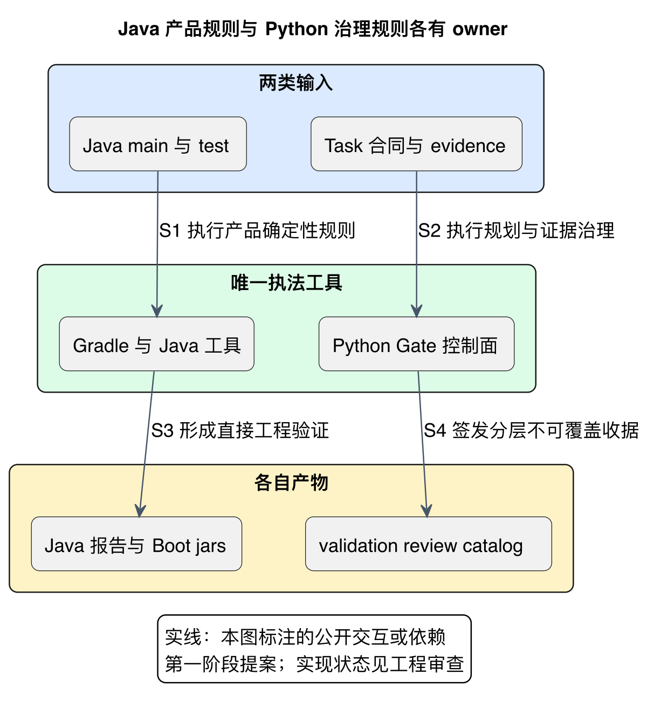
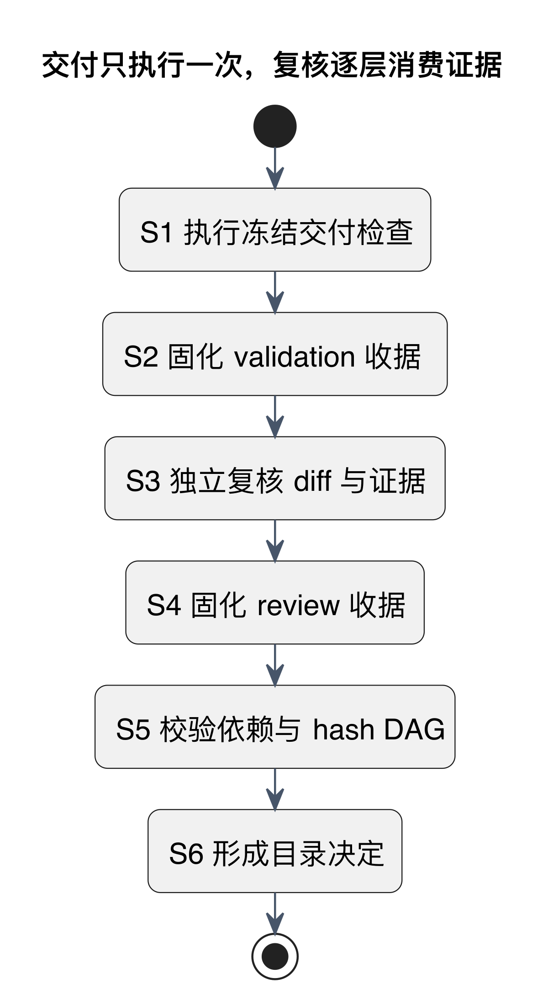

# 工程与交付：业务架构、工具执法和验收证据分层

架构说明系统应该怎样协作，工程工具检查实现有没有越界，验收证据说明哪个版本经过谁的检查。**三件事必须连接，但不能互相代替**。

当前业务后端固定为 Java 25，Python 只承载 scripts、Harness、Gate、生成器和审计；TypeScript Extension 是后续产品实现。所有调度规则的唯一真源是 [AGENTS.md](../../AGENTS.md) 与 [harness](../../harness/README.md)。

## 先区分两类确定性工具

[PlantUML 源码](diagrams/quality-ownership.puml) · [矢量图](diagrams/quality-ownership.svg)

左路检查 Java 产品源码、字节码和测试；右路检查 Task/规划/证据/identity/收据。箭头没有把两路直接接起来，因为当前统一 Gate **没有 Java Gradle adapter**：Java 聚合构建属于直接工程验证，尚不能自动成为正式 Java Task receipt。

| 被检查的内容 | 唯一 owner / 工具 | 不能重复做的事 |
|---|---|---|
| Java 格式与 imports | Spotless | Python 再做同义格式扫描 |
| Javadoc/风格、静态缺陷 | Checkstyle、PMD、DocLint | 多层反复运行相同规则或默认启用全量低信号检查 |
| 中文注释、record 参数、禁止 PMD suppression | Java source gates，共享 compiler parse | Python 重写 Java 词法或 AST 判断 |
| 项目依赖与真实类型方向 | Gradle dependency guard、ArchUnit | 把空 domain 范围或 fixture 合规当未来业务合规 |
| 直接行为测试、零失败/错误/跳过、覆盖报告 | JUnit、Gradle XML owner、JaCoCo | 把 NO-SOURCE 当业务测试或把报告当覆盖率门槛 |
| 任务图、handoff、冻结证据、收据和 hash DAG | Python Gate / Harness | 侵入产品 Domain/Application/API/worker 业务逻辑 |

精确工具版本、探针和真实限制见 [确定性工具审查](../reviews/phase-1-deterministic-tools-audit.md)，不在本页复制第二份配置。

## 功能交付与验收只执行一层

[PlantUML 源码](diagrams/gate-layers.puml) · [矢量图](diagrams/gate-layers.svg)

S1/S2 属于 `TASK_VALIDATION`：在冻结合同下执行直接检查，生成不可覆盖 validation receipt。S3/S4 属于 `INDEPENDENT_REVIEW`：独立身份读冻结 diff 和 evidence，不能重跑全部交付命令。S5/S6 属于 `CATALOG_DECISION`：读 validation、review、dependency receipts 与 hash DAG，形成目录决定。

图画成功路径，不能据此跳过身份与输入验证。缺检查、skipped、未触发、进程 exit 0、queued、ack 或 receipt 过时都不能称 PASS。详细 owner/receipt/authority 合同见 [质量分层](../development/quality-gate-layering.md) 与 [Gate 控制面](../development/gate-control-plane-design.md)。

## 工作包和回调如何节约执行成本

一个工作包完成同 owner、同 contract/write 边界的连续功能及直接测试，再向精确父会话发紧凑 signal；Main 用产物 locator、identity 和 hash 核对，不读完整聊天和日志，也不按固定短周期循环询问进展。

Qoder 同时一个 run；Codex 子任务默认 Luna，升级依具体失败/风险证据决定。工作包最低规模、prompt 限制、首次 300 秒与后续 600 秒兜底、完成落盘再回调、不得递归委派等均只链接到 [agent policy](../../harness/agent-policy.manifest.yaml)。本页提供理解，不扩展 frozen handoff schema 或另设调度 daemon。

## 当前有哪些证据，还缺什么

| 层次 | 已有材料 | 证明边界 |
|---|---|---|
| 设计提案 | 七领域、十项 ADR、核心流程和横切合同 | 业务架构仍 Proposed，图不等于实现 |
| 直接 Java 工程验证 | 最近一次 clean delivery：199 执行任务、36 Java tests、两份 Boot jars、owner 正反例 | 本机锁定构建；并非双环境无缓存复现或产品旅程完成 |
| 正式 Task/G1 | 分层 Gate 和历史收据机制 | 文档改写使绑定原文的旧 receipts 不能证明当前 bytes；Java adapter/可信 context 仍有缺口 |
| 用户阶段决定 | G1 决策条件 | 第二阶段未激活，文档改写不等于批准所有 ADR |

Java 快速/完整交付选择以 [java-product.manifest.yaml](../../harness/java-product.manifest.yaml) 为准；确定性 launcher 固定 Temurin 25 和 Wrapper，聚合禁止跳过或 dry-run。公开 Gate 入口需要可信 evidence context，缺失如实 FAIL。

## 文档和合同改动也要保持证据诚实

阅读结构可以调整，旧收据不能随之覆盖或改签。变更后先列真正受影响的输入与 Task，再生成新版本的当前证据。无需为展示信息变化重跑所有产品工具，但也不能借旧 PASS 为新架构正文背书。

本次重构的图包、链接、条款保留及输入影响记录在 [文档重构审查](../reviews/architecture-documentation-restructure.md)。后续正式验收要按真实 actor、冻结版本和 issuer authority 重新处理相关任务，不自动跨入 Phase 2。
