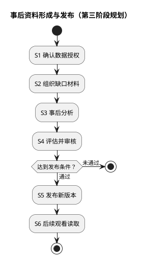

# 1. 字幕提示与事后改进流程

**位置：** [架构总览](overview.md) → 流程总览。**下一步：** 正在看视频时进入[观看时序](flows/viewing.md)；要判断资料怎样可见时读本页第 1.2 节。**失败去向：** 两条链失败均不阻塞英文或把未审核结果送进当前字幕。

本页回答“观看与资料更新为何不是同一工作流”。观看以当前字幕为输入，产出当前字幕可用的提示或空结果；事后改进以另行授权的材料为输入，产出**经过审核发布的资料版本**。只有版本化发布把它们接起来。这里的事后链是[第三阶段](../roadmap/master-plan/improvement.md)规划，不表示分析任务或模型接口已实现。

## 1.1. 观看：仅从已发布资料作决定

英文字幕在本机先显示；扩展将来源文本压缩为有界输入，向 `api` 请求提示。Enrichment 通过 Lexicon 的公开合同读取已发布词库及适用语义资料，依次筛选候选、价值和提示密度，返回绑定原文、词段范围和资料版本的提示或空结果。客户端最后复核当前视频、字幕、观察序号和时效，才展示仍有效的提示。

缓存未命中可以异步查询已有资料，但不能启动模型、预取模型或为当前字幕创建 `pending` 工作。词库命中不是语境消歧；证据不足时不提示。网络超时、服务故障、字幕切换或迟到响应都退回英文或已有**仍有效**的本机提示。[观看时序](flows/viewing.md)标出参与者与失败点；[运行安全](runtime-safety.md)定义复用边界。

## 1.2. 资料准备：审核发布后才可被后续观看读取

下图是第三阶段的**规划边界**，不是已上线任务状态机。图中“事后分析”可以包含模型，但并非必须；它不能被当前字幕请求触发。

S1 先确认材料取得、保留与可能外发的授权；普通观看请求不是这种授权。S2—S3 独立组织缺口并产生待校验材料。S4 检查来源、适用条件与质量；**未通过即停止发布，保留现有已发布版本**。S5 由资料负责人经公开 contract 发布新版本，S6 仅让**后续**观看读取。发布或分析失败不回补当前字幕；撤回或回退必须使缓存按版本失效。[语义资料合同](semantic-contract.md)给出可靠资料门槛，[词库持久化模型](data-model.md)说明现有 Lexicon 发布的事务边界。

## 1.3. 第二阶段的效率工作不改变两条链

[第二阶段](../roadmap/master-plan/performance.md)可优化既有资料的查询、批量准备和复用，但不能以性能名义让观看依赖第三阶段模型在线运行。Redis、本机 L1 和投影都可重建；资料版本、来源修订或规则变化时旧结果不可复用。两条链的领域 owner 与禁止跨越的依赖见[模块边界](boundaries.md)。

## 1.4. 按问题进入准确合同

输入来源或身份不可靠，查[来源适配](source-contract.md)和[字幕内容](caption-contract.md)；不知道候选何时可提示，查[共享词库](lexicon-contract.md)和[语义资料](semantic-contract.md)；怀疑旧结果或缓存，查[运行安全](runtime-safety.md)。这些是本流程节点的 Reference，不是需要顺序执行的附加步骤。进度与证据只见[状态页](../roadmap/master-plan/status.md)。
