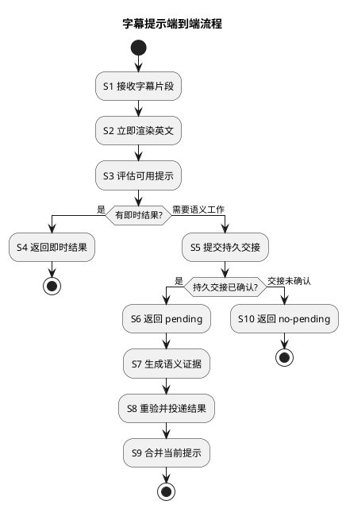

# 1. 字幕提示流程

本页按图中的 `S1` 至 `S10` 说明一段字幕从到达、即时响应，到可选后台补全和最终显示的执行顺序。它只描述流程上的输入、交接、结果和终止条件；模块职责见[模块边界](boundaries.md)，语义输入输出见[语义合同](semantic-contract.md)，缓存与失效合同见[运行安全](runtime-safety.md)。

## 1.1. 流程总览

每段字幕都有一条不依赖提示的前台路径：`S1 → S2`。扩展取得字幕片段和播放上下文后立即显示英文；提示缓存、网络请求、持久工作和语义能力都只能补充该显示，不能把它变成等待点。

在 `S3`，流程按可用结果分流。扩展先读取与内容修订兼容的本机 L1；未命中时，服务端用规范 `CaptionContext`、词库和提示规则形成即时结论。已有可靠提示、规则直接产生的结果和“不提示”的空结果都在 `S4` 结束前台请求。只有缺少可靠语义证据且规则仍认为值得提示时，才进入 `S5` 之后的后台分支。

| 分支 | 图中步骤 | 前台响应 | 后续工作 |
|---|---|---|---|
| 可立即确定 | `S3 → S4` | 返回可直接合并的提示，或明确的空结果。 | 无。 |
| 可持久交接 | `S5 → S6` | 返回快速结果并标记 `pending`。 | 后台执行 `S7 → S9`。 |
| 无法交接 | `S5 → S10` | 返回快速结果并标记 `no-pending`。 | 无；英文继续显示。 |

`pending` 是已确认的持久交接结论，不是“已放入内存队列”“正在准备提交”或“供应商可能会计算”的同义词。`no-pending` 说明本次请求没有可等待的后台结果；两者都不阻塞英文字幕。

## 1.2. 前台请求流程

前台流程覆盖 `S1` 至 `S6` 与 `S10`：它的目标是在当前字幕仍有效时给出确定、可降级的响应，而不是等待模型产出。

### 1.2.1. S1–S2：接收字幕并独立显示英文

来源适配器或扩展将当前英文字幕、位置、有限相邻上下文和内容修订归一为 `CaptionContext`。扩展先以该片段渲染英文，再处理任何提示结果；即使输入校验、缓存、服务端、工作进程或供应商超时，观看路径仍以“仅英文”结束。

请求只携带完成本次提示所需的最小上下文。账号、设备标识、观看历史、个人熟悉度和行为状态不属于此流程的输入，也不参与提示决定。

### 1.2.2. S3–S4：判定并返回即时结果

`S3` 按以下顺序寻找无需等待后台工作的结果：

1. 扩展读取内容身份、字幕身份、内容修订和硬性过期均匹配的本机 L1；命中后只合并与当前片段对应的提示。
2. L1 未命中时，服务端将来源输入归一为 Enrichment 的 `CaptionContext`，从 Lexicon 的公开材料定位词、短语和术语候选。
3. Enrichment 以共享词频、短语边界、上下文价值、提示密度和规则版本判断候选是否值得提示，并使用已有的可靠语义证据形成快速提示。

规则直接排除的候选以空结果结束；已有可靠证据的候选以快速提示结束。语义能力只能为候选提供“此处是什么意思”的证据，不能把模型成功变成必须展示的指令，也不能绕过提示规则。

### 1.2.3. S5–S6/S10：确认后台工作的响应语义

当规则仍需要语义证据，Workflow 尝试为该工作建立持久交接。只有交接已经确认，响应才沿 `S6` 返回 `pending`；提交失败、取消或未能确认时，响应沿 `S10` 返回 `no-pending`。两条分支都可带已有的快速提示，但不承诺稍后一定出现完整提示。

| 交接结论 | 响应中的状态 | 客户端处理 |
|---|---|---|
| 已确认 | `pending` | 保持英文或快速提示，并只接受可关联的后续结果。 |
| 未确认 | `no-pending` | 保持英文或快速提示，不为本次请求等待或轮询。 |

## 1.3. 后台补全与投递流程

后台流程只从已确认的 `pending` 开始，依次执行 `S7 → S8 → S9`。它与前台响应解耦：前台已经完成，后台结果只能作为当前字幕的增量补充。

### 1.3.1. S7：生成语义证据

Worker 取得合法尝试后调用 Enrichment 所定义的语义能力。基础设施中的供应商集成负责请求映射和不可信响应解析；Enrichment 只接收标准结果，区分 `success`、`abstained` 和 `failure`。没有可靠语义证据时放弃提示，不以空文本或供应商自评伪装成功。

### 1.3.2. S8：重验、持久化并投递有效结果

在结果可发布前，Enrichment 重验内容修订、上下文引用、语义合同版本、提示规则版本、取消状态和硬性过期。通过重验的结果才持久化为可投递结果；投递只读取该公开结果，不依赖原 API 请求或浏览器连接仍然存在。

语义调用成功不等于结果已经发布，更不等于用户已经看到提示。任何重验失败都使该次结果终止，不应以晚到结果延长已结束的观看路径。

### 1.3.3. S9：匹配当前字幕后合并

扩展接收结果时再次核对视频、字幕身份、内容修订和硬性过期。全部匹配才增量合并提示；字幕切换、内容修订、结果撤回、过期或晚到时静默丢弃。重复投递同一结果修订只允许幂等合并，不重新调用语义能力，也不产生个人行为状态。

## 1.4. 结果生命周期与终止条件

流程中的结果按“可用、待补全、不可等待、失效”处理，而不是按屏幕显示或用户操作处理。`generated`、`delivered` 与实际显示是不同技术状态；显示、点击或停留不会转化为学习行为。只有用户明确选择“不再提示”时，扩展才在本机写入词段抑制偏好，并在后续匹配结果时过滤它。

| 事件 | 流程处理 | 可见结果 |
|---|---|---|
| 字幕或内容修订变化 | 旧 L1 未命中或清除；后台结果在 `S8` 或 `S9` 被拒绝。 | 继续英文，等待与新修订匹配的新结果。 |
| 缓存或语义能力不可用 | `S3` 无法取得可靠结果，或 `S7` 失败。 | 不阻塞英文；没有可靠提示即不提示。 |
| 持久交接未确认 | 在 `S10` 结束本次后台分支。 | 返回 `no-pending`，不等待不存在的结果。 |
| 结果晚到、撤回或过期 | `S9` 不合并。 | 当前屏幕不展示旧提示。 |
| 同一结果重放 | 以结果修订幂等处理。 | 不重复生成或扩展产品状态。 |

## 1.5. 流程与相邻合同的边界

本页回答“何时发生、经过哪些分支、何时结束”。下列页面分别定义流程节点所依赖的合同，避免把流程页扩展成原则或决策的重复说明：

| 主题 | 定义位置 | 在本流程中的作用 |
|---|---|---|
| 来源输入 | [来源适配合同](source-contract.md) | 定义 `S1` 所用 `CaptionContext` 的规范输入和来源边界。 |
| 模块与调用方向 | [模块边界](boundaries.md) | 定义扩展、Workflow、Enrichment、Lexicon、Worker 与基础设施如何承担各节点。 |
| 语义任务 | [语义合同](semantic-contract.md) | 定义 `S3` 和 `S7–S8` 的证据、结果与供应商隔离。 |
| 缓存、失效与隐私 | [运行安全](runtime-safety.md) | 定义 `S3`、`S8`、`S9` 的副本、信任和失效约束。 |
| 架构取舍 | [架构决策](decisions.md) | 记录这些流程边界的决策原因，不在本页重复展开。 |
