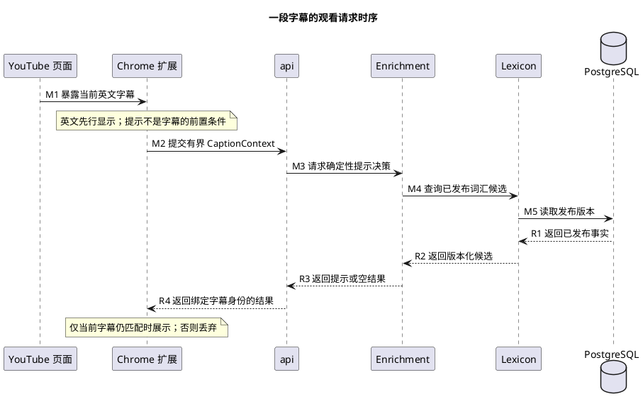
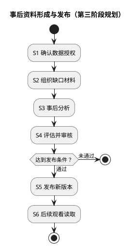

# 1. 字幕提示与事后改进流程

[架构总览](overview.md) → 流程总览。本文说明观看与事后资料改进如何通过发布衔接。

本页回答“观看与资料更新为何不是同一工作流”。观看以当前字幕为输入，产出当前字幕可用的提示或空结果；事后改进以另行授权的材料为输入，产出**经过审核发布的资料版本**。只有版本化发布把它们接起来。这里的事后链是[第三阶段](../roadmap/master-plan/improvement.md)规划，不表示分析任务或模型接口已实现。

## 1.1. 观看：仅从已发布资料作决定

英文字幕在本机先显示；扩展将来源文本压缩为有界输入，向 `api` 请求提示。Enrichment 通过 Lexicon 的公开合同读取已发布词库及适用语义资料，依次筛选候选、价值和提示密度，返回绑定原文、词段范围和资料版本的提示或空结果。客户端最后复核当前视频、字幕、观察序号和时效，才展示仍有效的提示。

缓存未命中可以异步查询已有资料，但不能启动模型、预取模型或为当前字幕创建 `pending` 工作。词库命中不是语境消歧；多义词读取已发布默认首义，缺少合法默认义项或来源依据时不提示。网络超时、服务故障、字幕切换或迟到响应都退回英文或已有**仍有效**的本机提示。[运行安全](runtime-safety.md)定义缓存与结果复用边界。

### 1.1.1. 参与者与调用顺序

这张时序图只画**一次当前字幕请求**。英文在 M1 后已经可见，M2—R4 都是可降级的附加工作，不构成字幕显示的前置条件。

```plantuml
@startuml
title 一段字幕的观看请求时序
skinparam shadowing false
skinparam sequenceStyle rectangle
skinparam nodesep 30
skinparam ranksep 50
participant "YouTube 页面" as youtube
participant "Chrome 扩展" as extension
participant "api" as api
participant "Enrichment" as enrichment
participant "Lexicon" as lexicon
database "PostgreSQL" as postgres
youtube -> extension : M1 暴露当前英文字幕
note over extension
英文先行显示；提示不是字幕的前置条件
end note
extension -> api : M2 提交有界 CaptionContext
api -> enrichment : M3 请求确定性提示决策
enrichment -> lexicon : M4 查询已发布词汇候选
lexicon -> postgres : M5 读取发布版本
postgres --> lexicon : R1 返回已发布事实
lexicon --> enrichment : R2 返回版本化候选
enrichment --> api : R3 返回提示或空结果
api --> extension : R4 返回绑定字幕身份的结果
note over extension
仅当前字幕仍匹配时展示；否则丢弃
end note
@enduml
```

M1 的来源是 YouTube 已渲染字幕；扩展把当前文本与本机观察身份绑定，形成有界请求。M2 到 M3 的 HTTP 和应用协调不承担词义判断。M4 到 R2 只查 Lexicon 的已发布版本；已发布语义资料的适用性由 Enrichment 规则判断，不是供应商即时输出。R3 可以是空结果，R4 即使成功也必须在客户端复核当前字幕身份才能显示。图省略可重建缓存：命中只能替代同版本资料读取，不能替代发布与失效校验。

### 1.1.2. 哪一步失败，怎样降级

- **M1 前没有可靠英文：** 来源不伪造转写、轨道或修订；保留页面可用英文，不发提示请求。[来源适配合同](source-contract.md)说明 DOM 观察身份与规范 `ContentRevision` 的差异。
- **M2 输入越界或身份不完整：** 不把 DOM、URL 或观看历史送进领域；无法关联当前字幕时仅英文。[字幕合同](caption-contract.md)定义规范化、范围与稳定身份。
- **M4—R3 默认选择与降级：** 同一词条多义时，Enrichment 使用已发布默认第一候选，不截取原始词典列表；缺资料、不同词条身份冲突或服务不可用时返回空结果，不返回待模型完成的承诺，也不发后台补全。[词库合同](lexicon-contract.md)与[语义合同](semantic-contract.md)解释为什么。
- **R4 晚到：** 字幕切换、seek、导航、观察序号或资料版本变化时丢弃结果；相同文本不等于同一次观察。[运行安全](runtime-safety.md)界定可复用条件。

### 1.1.3. 合同与代码位置

源端采集与展示分别在 [`extension/src/caption-source.ts`](../../extension/src/caption-source.ts)、[`extension/src/overlay.ts`](../../extension/src/overlay.ts)；HTTP 映射在 [`CaptionHintController.java`](../../backend/product/api/src/main/java/io/lexiflow/api/hints/CaptionHintController.java)，用例在 [`EnrichCaptionUseCase.java`](../../backend/product/enrichment/src/main/java/io/lexiflow/enrichment/application/caption/EnrichCaptionUseCase.java)，领域判断在 [`DeterministicHintPolicy.java`](../../backend/product/enrichment/src/main/java/io/lexiflow/enrichment/domain/policy/DeterministicHintPolicy.java)。这些位置帮助追踪当前实现，不替代[长期产品架构规范](../../openspec/specs/product-architecture/spec.md)或[状态页](../roadmap/master-plan/phase2/status.md)的交付事实。

## 1.2. 资料准备：审核发布后才可被后续观看读取

下图是第三阶段的**规划边界**，不是已上线任务状态机。图中“事后分析”可以包含模型，但并非必须；它不能被当前字幕请求触发。

```plantuml
@startuml
title 事后资料形成与发布（第三阶段规划）
skinparam nodesep 30
skinparam ranksep 50
start
:S1 确认数据授权;
:S2 组织缺口材料;
:S3 事后分析;
:S4 评估并审核;
if (达到发布条件？) then (通过)
  :S5 发布新版本;
  :S6 后续观看读取;
  stop
else (未通过)
  stop
endif
@enduml
```

S1 先确认材料取得、保留与可能外发的授权；普通观看请求不是这种授权。S2—S3 独立组织缺口并产生待校验材料。S4 检查来源、适用条件与质量；**未通过即停止发布，保留现有已发布版本**。S5 由资料负责人经公开 contract 发布新版本，S6 仅让**后续**观看读取。发布或分析失败不回补当前字幕；撤回或回退必须使缓存按版本失效。[语义资料合同](semantic-contract.md)给出可靠资料门槛，[词库持久化模型](data-model.md)说明现有 Lexicon 发布的事务边界。

## 1.3. 第二阶段的效率工作不改变两条链

[第二阶段](../roadmap/master-plan/performance.md)可优化既有资料的查询、批量准备和复用，但不能以性能名义让观看依赖第三阶段模型在线运行。Redis、本机 L1 和投影都可重建；资料版本、来源修订或规则变化时旧结果不可复用。两条链的领域 owner 与禁止跨越的依赖见[模块边界](boundaries.md)。

## 1.4. 按问题进入准确合同

输入来源或身份不可靠，查[来源适配](source-contract.md)和[字幕内容](caption-contract.md)；不知道候选何时可提示，查[共享词库](lexicon-contract.md)和[语义资料](semantic-contract.md)；怀疑旧结果或缓存，查[运行安全](runtime-safety.md)。这些是本流程节点的 Reference，不是需要顺序执行的附加步骤。进度与证据只见[状态页](../roadmap/master-plan/phase2/status.md)。
