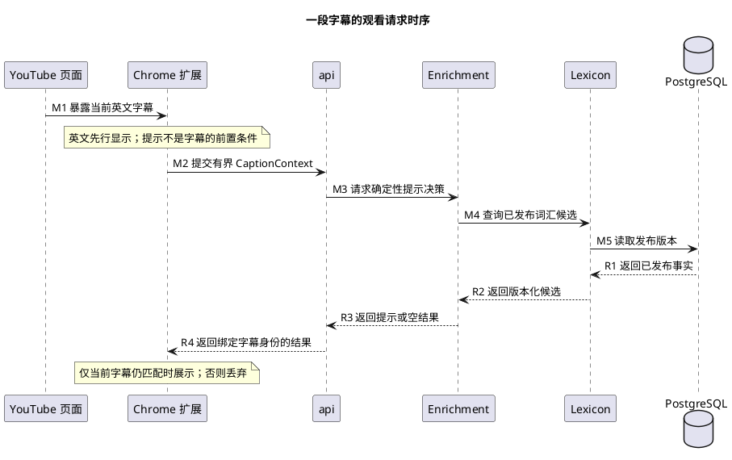

# 1. 观看请求：从字幕到词段提示

**位置：** [架构总览](../overview.md) → [两条流程](../flows.md) → 观看请求。**前置：** 来源提供当前已渲染的英文字幕；**输出：** 当前字幕可用的提示或空结果；**下一步：** 展示后等待下一字幕；**失败：** 保留英文并丢弃不可靠或迟到的提示。

这张时序图只画**一次当前字幕请求**。英文在 M1 后已经可见，M2—R4 都是可降级的附加工作，不构成字幕显示的前置条件。

## 1.1. 参与者与调用顺序

M1 的来源是 YouTube 已渲染字幕；扩展把当前文本与本机观察身份绑定，形成有界请求。M2 到 M3 的 HTTP 和应用协调不承担词义判断。M4 到 R2 只查 Lexicon 的已发布版本；已发布语义资料的适用性由 Enrichment 规则判断，不是供应商即时输出。R3 可以是空结果，R4 即使成功也必须在客户端复核当前字幕身份才能显示。图省略可重建缓存：命中只能替代同版本资料读取，不能替代发布与失效校验。

## 1.2. 哪一步失败，怎样降级

- **M1 前没有可靠英文：** 来源不伪造转写、轨道或修订；保留页面可用英文，不发提示请求。[来源适配合同](../source-contract.md)说明 DOM 观察身份与规范 `ContentRevision` 的差异。
- **M2 输入越界或身份不完整：** 不把 DOM、URL 或观看历史送进领域；无法关联当前字幕时仅英文。[字幕合同](../caption-contract.md)定义规范化、范围与稳定身份。
- **M4—R3 缺资料、歧义或服务不可用：** Enrichment 不选择词典首义、不返回待模型完成的承诺，也不发后台补全；空结果是正常终点。[词库合同](../lexicon-contract.md)与[语义合同](../semantic-contract.md)解释为什么。
- **R4 晚到：** 字幕切换、seek、导航、观察序号或资料版本变化时丢弃结果；相同文本不等于同一次观察。[运行安全](../runtime-safety.md)界定可复用条件。

## 1.3. 合同与代码位置

源端采集与展示分别在 [`extension/src/caption-source.ts`](../../../extension/src/caption-source.ts)、[`extension/src/overlay.ts`](../../../extension/src/overlay.ts)；HTTP 映射在 [`CaptionHintController.java`](../../../backend/apps/api/src/main/java/io/lexiflow/api/hints/CaptionHintController.java)，用例在 [`EnrichCaptionUseCase.java`](../../../backend/application/workflow/src/main/java/io/lexiflow/workflow/application/EnrichCaptionUseCase.java)，领域判断在 [`DeterministicHintPolicy.java`](../../../backend/modules/enrichment/src/main/java/io/lexiflow/enrichment/domain/DeterministicHintPolicy.java)。这些位置帮助追踪当前实现，不替代[长期产品架构规范](../../../openspec/specs/product-architecture/spec.md)或[状态页](../../roadmap/master-plan/status.md)的交付事实。
