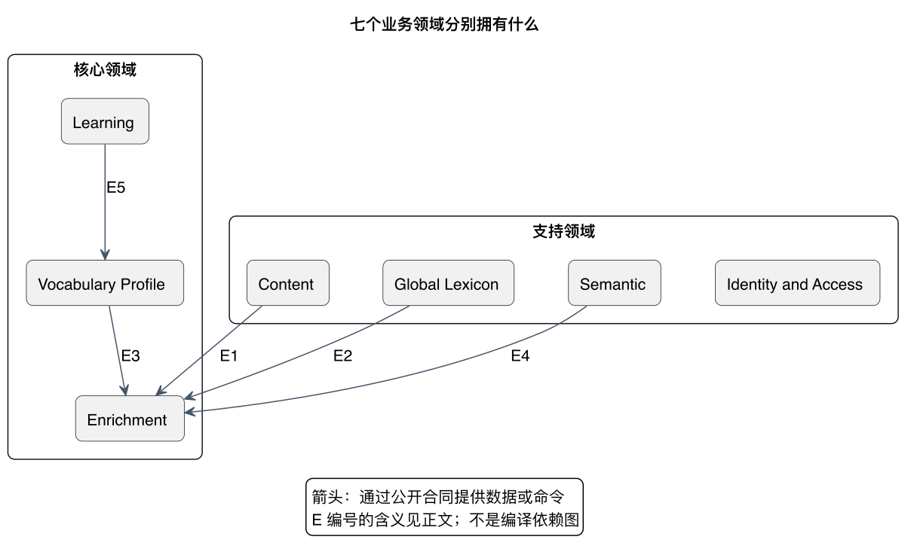
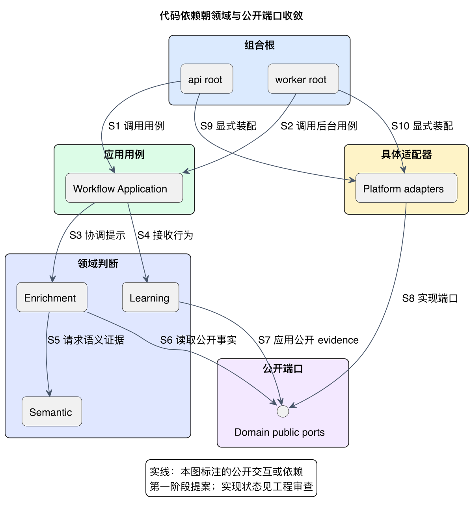

# 模块与依赖：先定所有权，再定调用方向

模块边界首先回答“谁对哪种事实负责”。**同一进程内也不能绕过公开合同读写其他领域的数据**。部署为 `api` 和 `worker` 只是执行方式，不改变领域 owner。

本页分两步理解：先看业务责任，再看编译依赖。详细 allowlist 与目标模块职责见 [模块边界参考](contracts/module-boundaries.md)，机器真源是 [module-boundaries.yaml](../../harness/module-boundaries.yaml)。

## 业务责任：七个领域形成三个配合关系

[PlantUML 源码](diagrams/domain-responsibility.puml) · [矢量图](diagrams/domain-responsibility.svg)

这是一张组件责任图，箭头表示通过公开合同提供数据或命令，**不是编译依赖方向**。Content、Lexicon、Profile、Semantic 分别向 Enrichment 提供片段、词汇事实、个人状态和语境证据；Learning 向 Profile 提供可追踪 evidence。Identity 在工作流接收和投递处负责身份授权，不能成为读取所有私有数据的中介。

| 领域 | 一句话责任 | 拥有的权威内容 | 边界上必须避免什么 |
|---|---|---|---|
| Content | 把来源差异变成规范片段 | 内容 identity、caption/context revision、source location | 把 YouTube DOM 类型带进核心 |
| Global Lexicon | 提供全局词汇知识 | term、phrase、sense、频率和级别元数据 | 保存用户是否掌握某词 |
| Enrichment | 决定该用户此时得到哪些提示 | candidate、need-hint policy、annotation decision/result | 让模型自行决定展示或让 worker 私存结果 |
| Semantic | 提供 Provider 无关的语境证据 | capability、路由策略、标准 contextual outcome | 更新 Profile 或决定 UI 展示 |
| Learning | 保存与解释用户行为 | 幂等事件、canonical order、accepted intent revision、evidence | 把客户端 score 当事实或把 conflict 当成功 |
| Vocabulary Profile | 表达用户当前学习状态 | familiarity、learning state、projection version | 操作浏览器 DOM 或冒充原始事件 owner |
| Identity & Access | 确认谁能访问和撤销什么 | 账户、设备、会话、偏好、撤销/删除 generation | 用 correlation 或设备时间代替授权 |

图中 E1–E4 是四种提示输入，E5 是 Learning evidence。投递与同步由应用边界承载，下一节说明它们的位置。

## 应用层：把领域协作变成用例

Workflow Application 协调 `enrich-caption`、`ingest-learning-event` 等用例：验证输入后调用公开领域合同，提交 durable work，形成一次最终响应。它不替领域决定熟悉度或绕过 adapter 装配规则。

Client Delivery / Sync 负责增量结果关联、投递观察、行为上传入口和 profile/cache version 的客户端传播。Enrichment 拥有结果；Delivery 拥有投递状态；Extension 拥有实际显示观察，三者不能互相推断。

Foundation 是最小共享内核，只放 stable identities、time/version contracts。新增业务规则应回到所属领域，不放入通用 utility 以逃避边界。

## 静态依赖：领域与端口在内，技术实现在外

[PlantUML 源码](diagrams/dependency-direction.puml) · [矢量图](diagrams/dependency-direction.svg)

此处箭头表示**代码依赖**。S1–S4 从组合根进入用例和领域；S5–S7 使用领域及公开 port；S8 表示 adapter 实现 port，S9/S10 表示组合根显式装配具体 adapter。图选择了两条代表性用例，完整领域 allowlist 仍以机器合同为准。

例如，Enrichment 需要读取熟悉度时，依赖 Vocabulary 的公开查询合同；PostgreSQL adapter 实现该合同；`api`/`worker` root 装配实现。Enrichment 不需要知道数据库，也不能自行查 Vocabulary 的表。

Allowed 关系由组合根→application→domain/ports，以及 adapter→其实现端口组成。Forbidden 关系包括 domain→HTTP/JDBC/Redis/Provider SDK、模块→其他 Domain 私有持久化、以及 YouTube 私有类型→核心 contract。依赖图必须无环。

## 目标职责与当前 Java 目录如何对应

| 逻辑边界 | 当前骨架目录 | 当前完成程度 |
|---|---|---|
| 两个 composition roots | `backend/apps/api`、`backend/apps/worker` | Boot 启动与 context 测试已有工程验证 |
| Workflow 与 Delivery 应用层 | `backend/application/workflow`、`client-delivery` | package-info 骨架，未实现业务用例 |
| 七个领域与 Foundation | `backend/modules/*` | 领域包与依赖边界，尚无业务 domain 类型 |
| 技术适配器 | `backend/platform/*` | 目录和构建规则，未实现业务存储/模型适配器 |
| 架构和源码工具 | `backend/tests/architecture`、`quality-gates` | 可执行规则及隔离正反例测试 |

当前 ArchUnit 产品范围只有两个 Boot 应用类型、零个 domain 类型。隔离 fixture 能证明规则会拒绝违规依赖，不能证明尚未编写的业务代码已经符合架构。详见 [工具审查](../reviews/phase-1-deterministic-tools-audit.md)。

## 写一个子功能时如何检查边界

先找到其数据 owner，再确定 public contract，再选择用例或 adapter 的位置；最后核对 allowed / forbidden 依赖和对应直接测试。跨模块只通过合同协作，集成验证串行。工作包规模、模型选择、identity 及 callback 规则只从 [共享 agent policy](../../harness/agent-policy.manifest.yaml) 读取，不在架构页复制第二套调度配置。
