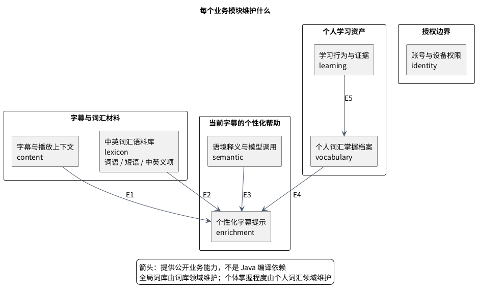
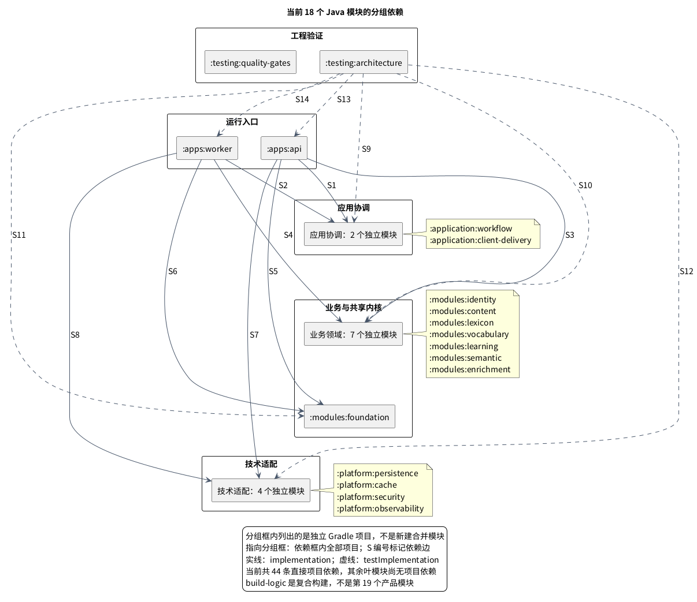
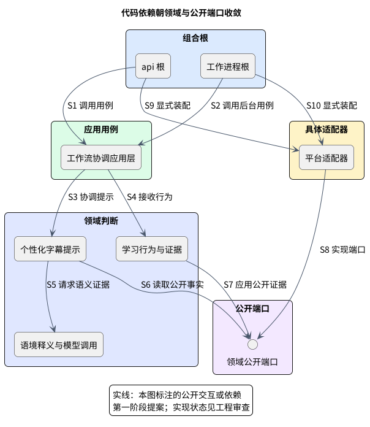

# 模块与依赖：从业务责任找到 Java 模块

LexiFlow 使用 Java 25 的 Gradle 多项目来隔离业务责任。**七个业务领域各对应一个 Java 模块；应用协调、技术适配、运行入口和验证工具分别放在其他模块。** 同一进程不允许绕过公开合同读取其他领域的数据。

先回答最具体的问题：**中英词汇、短语和基础译义语料由 `:modules:lexicon` 的“中英词汇语料库”维护**。模型回答某段字幕中的含义由 `:modules:semantic` 提供；用户是否掌握该词由 `:modules:vocabulary` 保存。这三种数据不混成一个词库。

## 1. 领域、功能与 Java 模块分别是什么

领域是某类业务事实及规则的负责人，例如“中英词汇语料库”负责全局共享的词语、短语和义项。一个领域包含多项功能，如词形归一、短语匹配和义项查询。用户看到的“字幕提示”则跨领域协作，不能把它的全部代码塞入一个通用功能包。

本项目用一个 Gradle 叶模块项目作为一个 Java 模块的编译/依赖边界；Java 库插件给它生产源码/测试来源集合、类路径和 jar。本页的模块指 Gradle 项目，**不是 JPMS `module-info.java`**。七个业务模块与七个领域一一对应，基础等其他模块不另算业务领域。

职责名称是 [机器边界](../../harness/module-boundaries.yaml) 的 display_name；稳定合同键、Gradle 路径和包标识保留，方便核对既有代码与任务。完整责任与禁止范围在 [下文精确条款](#模块边界精确条款)。

## 2. 业务责任：明确谁维护什么

E1 提供规范字幕，E2 提供中英基础译义/短语匹配，E3 提供当前语境证据，E4 提供个人掌握程度；E5 将学习行为归约为可追踪证据。账号与设备权限在用例接收及投递处授权，不充当所有领域的私有数据入口。这张图解释业务协作，Java 编译依赖见后文。

| 具体领域名 | 稳定标识 / Gradle 模块 | 维护的权威事实与功能 | 不负责 | 对外能力 |
|---|---|---|---|---|
| 账号与设备权限 | `identity-access` / `:modules:identity` | 账户、设备、会话、偏好、访问与撤销/删除代次 | 词义、熟悉度或模型路由 | 认证后的 `UserContext`、设备/客户端归属检查。 |
| 字幕与播放上下文 | `content` / `:modules:content` | 来源归一化、字幕片段、播放位置、上下文窗口与修订号 | 中英词库或个人掌握度 | 解析或读取当前内容上下文，维护稳定内容引用。 |
| 中英词汇语料库 | `global-lexicon` / `:modules:lexicon` | 全局词语/短语、词形、基础中英义项、词频、难度与专业领域元数据 | 模型的每次原始回答、用户是否掌握 | 规范化词项、短语匹配、全局词汇事实查询。 |
| 个人词汇掌握档案 | `vocabulary-profile` / `:modules:vocabulary` | 每用户熟悉度、学习状态、暴露汇总和档案版本；幂等应用证据 | 原始行为日志、全局译义维护 | 按用户读取个人档案快照；应用带来源的学习归约证据；发布个人档案版本变化。 |
| 学习行为与证据 | `learning` / `:modules:learning` | 行为事件接收、幂等、顺序/意图修订号、规则化证据与重放 | 客户端自报分数直接覆盖档案 | 持久化事件接收、证据生成、投影/重放协调。 |
| 语境释义与模型调用 | `semantic` / `:modules:semantic` | 供应商无关端口、路由政策、当前上下文的标准释义结果 | 永久修改词库或决定最终界面展示 | `SemanticProvider` 类端口、路由、预算、超时和标准结果。 |
| 个性化字幕提示 | `enrichment` / `:modules:enrichment` | 候选提取、提示需求规则、提示追踪区段/级别、持久提示注释结果 | 私读其他领域的表、投递状态或个人档案更新 | 快速提示编排、慢速提示编排完成记录、持久化提示注释结果、提示注释版本/置信度。 |

### 中英语料、语境释义与个性化展示如何配合

以 `settlement` 为设计示例：语料库可提供“结算”“和解”等基础义项及领域信息；语境释义模块根据当前字幕提供适用含义的证据；提示模块结合个人掌握档案决定要不要显示、显示哪个词段。模型结果不会自动变成永久词库条目，显示或点击也不会直接变成“已掌握”。

语料导入、校订、来源与版本管理属于词库负责人；PostgreSQL 的具体持久化实现放在 `:platform:persistence`，通过词库自己的端口进入，数据库适配器不取得词库业务所有权。当前只有骨架，语料导入功能、业务表和管理界面尚未实现；这里明确归属，不承诺整句双语语料或批量机器翻译功能。

## 3. Java 模块的完整划分

八个 `:modules:*` 包含上表七个领域与 `:modules:foundation`。基础只放稳定身份、时间和版本合同，不容纳翻译、熟悉度或提示规则。

另外十个叶模块的职责如下，合计 **18 个 Gradle Java 模块**，全部在 [settings.gradle.kts](../../backend/settings.gradle.kts) 的映射中注册：

| Java 模块 | 目录（相对后端） | 具体职责 | 当前状态 |
|---|---|---|---|
| `:application:workflow` | `application/workflow` | 提示、行为接收等公开用例的协调与持久交接 | package-info 骨架 |
| `:application:client-delivery` | `application/client-delivery` | 结果投递、订阅与版本同步、事件上传入口 | package-info 骨架 |
| `:platform:persistence` | `platform/persistence` | 各领域自己的 PostgreSQL 端口实现 | package-info 骨架 |
| `:platform:cache` | `platform/cache` | Redis 与可重建缓存端口实现 | package-info 骨架 |
| `:platform:security` | `platform/security` | 鉴权/撤销相关技术实现 | package-info 骨架 |
| `:platform:observability` | `platform/observability` | 日志、指标、追踪技术实现 | package-info 骨架 |
| `:apps:api` | `apps/api` | HTTP 入口与组合根，装配公开用例和适配器 | 启动启动与上下文测试 |
| `:apps:worker` | `apps/worker` | 后台执行入口与组合根 | 启动启动与上下文测试 |
| `:tests:architecture` | `tests/architecture` | ArchUnit、编译输入边界与隔离正反例 | 可执行工程规则 |
| `:tests:quality-gates` | `tests/quality-gates` | Java 注释/记录/抑制规则与其测试 | 可执行工程工具 |

`gradle/build-logic` 是提供约定插件插件 / 自定义任务的独立包含的构建，不是一个业务领域。扩展也不是 Java 模块。

## 4. 当前构建实际声明了哪些依赖

这张图以 [根构建](../../backend/build.gradle.kts) 的项目依赖声明为准。`api` 和 `worker` 各直接实现依赖 14 个产品项目；架构测试 testImplementation 依赖这 14 个项目及两个应用，共 16 个。**当前总计 44 条直接项目依赖；业务模块、应用层与平台的互相依赖尚未装配。** 不应把目标调用箭头当作已实现的 Gradle 依赖。

业务骨架与可执行规则不能代替产品实现；实际源码范围和工具执行方法见[Java 校验手册](../development/validation/03-java-engineering.md)。

## 5. 目标中的公开合同与代码依赖

这是目标中的代码分层图，以公开合同 / 端口收敛依赖；S1–S4 由组合根进入用例与业务模块，S5–S8 使用或实现公开端口，S9/S10 装配具体技术实现。它与上一张“已声明 Gradle 依赖”有不同的证明范围。

目标 Java 模块依赖上限由机器合同声明；箭头不是必须立即添加的依赖：

| 模块 | 目标可依赖的业务模块（均仅公开合同） |
|---|---|
| `:modules:foundation` | 无 |
| 身份 / 内容 / 词库 / 个人词汇 | 基础 |
| 学习归约 | 基础、内容、个人词汇 |
| 语义 | 基础、内容、词库 |
| 提示编排 | 基础、内容、词库、个人词汇、语义 |

模块内部纯领域模型 / 策略仍只依赖最小基础；领域间协作通过公开能力边界完成。应用层协调用例，平台适配器实现其端口；任何模块不直接访问别的领域的持久化实现或表。

[Gradle 项目护栏](../../backend/gradle/build-logic/src/main/kotlin/io/lexiflow/buildlogic/VerifyProjectDependenciesTask.kt) 当前检查角色方向与环：模块→模块，应用层→模块，平台→应用/模块，应用→应用/平台/模块，测试→产品项目。它**不按每个领域细分 YAML 允许列表**，也不许可应用层→应用层；机器目标允许工作流协调使用投递能力，当前可由组合根协调两个应用模块，不声明两者直接编译依赖。后续若要改构建依赖，应先明确接口与护栏变更，不能由业务协作箭头推断编译依赖已存在。

## 6. 写子功能前如何定位

先问事实由谁拥有，再找到上表 Java 模块，确定其公开合同、用例协调与适配器位置，最后核对目标允许范围和现有 Gradle 护栏。检查命令及执行脚本见 [Java 校验手册](../development/validation/03-java-engineering.md)；工作包身份、规模、模型和回调只读 [共享政策](../../harness/agent-policy.manifest.yaml)。

## 模块边界精确条款

### 关键归属与禁止范围

- 原始 `Learning Event` 的历史归学习归约；个人词汇档案只保留可解释投影和来源引用，避免同一事实有两个负责人。
- `Contextual Meaning` 是内容上下文与词库/语义结果的组合，由提示编排在一次决策中使用；它不是全局词库的永久唯一含义。
- 提示注释的生成及持久化结果归提示编排；传输状态、增量投递和客户端同步归 `Client Delivery / Sync` 应用模块。客户端只按字幕身份、提示注释修订号和档案版本合并，不能把提示注释当作永久词义。
- YouTube 解析代码属于客户端来源适配器；后端内容上下文不出现 YouTube DOM、CSS 选择器或播放器私有对象。

### 6. 模块化单体

#### 6.1 推荐模块布局

下表表达目标逻辑职责，其中 `*-api` / `*-domain` 等是职责标签，**不是当前已经注册的 Gradle 项目路径**。当前每个领域的公开 API 与实现都位于同一个 `:modules:*` Java 模块内，后续通过包可见性与架构规则隔离；例如 `lexicon-api` / `lexicon-domain` 都对应 `:modules:lexicon`。工作流协调 / 投递分别对应 `:application:workflow` / `:application:client-delivery`，入口与组合根对应两个 `:apps:*`，技术端口实现位于四个 `:platform:*`；完整对应关系以 [实际模块清单](modules-and-dependencies.md#3-java-module-的完整划分) 为准。

Java 25 的 Gradle 骨架已存在，具体公开 API 与领域类型仍未实现；运行时/build/toolchain 决策由 [ADR-010](decisions.md#adr-010采用-jvm-后端typescript-extension-与独立-python-工具链) 提交 G1 评审，物理拆分 API/实现模块仍须由后续任务明确，不从这张逻辑表推断已有额外项目。

| 逻辑责任组 | 职责标签 | 责任与可见性 |
|---|---|---|
| 内核 | `foundation` | 极少量稳定标识、时间和版本语义；禁止成为通用工具杂物间。 |
| 领域 API | `identity-api`, `content-api`, `lexicon-api`, `vocabulary-api`, `learning-api`, `semantic-api`, `enrichment-api` | 每个上下文自己拥有的公开命令/查询/事件/端口契约。外部模块只能依赖这些公开面。 |
| 领域实现 | `identity-domain`, `content-domain`, `lexicon-domain`, `vocabulary-domain`, `learning-domain`, `semantic-routing`, `enrichment-domain` | 聚合、策略、领域服务与上下文内应用层服务；实现细节默认不可见。 |
| 跨上下文应用层 | `workflow-application` | 鉴权后的提示编排与学习归约用例编排、事务边界、持久交接、跨上下文协调；不承载领域规则。 |
| 客户端应用层 | `client-delivery-sync` | 增量结果投递、投递状态、缓存版本合同、行为上传和个人档案同步；只通过上下文公开合同读取结果或提交行为。 |
| 入站适配器 | `transport-http`, `worker-consumers` | 把外部请求或持久化作业转换成应用层命令/查询；只做协议、校验映射和错误映射。 |
| 出站适配器 | `persistence-postgres`, `cache-redis`, `semantic-providers`, `content-source-adapters` | 实现各上下文声明的出站端口。按业务负责人分包，禁止绕过端口横向读取。 |
| 引导 | `bootstrap-api`, `bootstrap-worker` | 唯一组合根；装配配置、适配器和运行时生命周期。不得包含业务判断。 |
| 客户端 | `extension` | YouTube 来源适配器、英文渲染、L1 缓存、增量合并、行为采集。不是服务器单体的内部模块。 |

早期可以在同一构建模块内用强制工作包边界承载一个上下文的 API 与实现；一旦边界测试不足、团队并行冲突上升或需要独立发布契约，再物理拆成 `*-api` 与 `*-domain`。逻辑依赖规则从第一天生效，不能等待物理拆分后才建立。

#### 6.2 静态依赖方向

箭头含义是“源模块可依赖目标模块”。额外规则如下：

1. 所有领域实现只能依赖 `foundation`、自己的 API，以及上图列明的其他上下文 API。
2. `Learning` 通过 `content-api` 校验行为的内容引用，通过 `vocabulary-api` 提交证据；`Content` 和 `Vocabulary Profile` 都不能反向依赖学习归约实现，因此不存在环。
3. `Enrichment` 只读内容、词库和个人词汇的公开查询，并使用语义端口；它不能调用具体数据库或供应商。
4. 出站适配器实现端口，但业务模块不依赖适配器。只有引导可以同时看见抽象和实现。
5. `workflow-application` 依赖 `content-api` 完成来源无关的输入编排；`client-delivery-sync` 依赖提示编排公开合同读取持久化结果，不能直接读取提示编排表。
6. `api` 与 `worker` 不是业务负责人。任何被两个运行时复用的业务逻辑必须位于应用/领域。

#### 6.3 运行入口

| 入口 | 延迟目标 | 主要工作 | 故障影响 |
|---|---|---|---|
| `api` | 低延迟、有限等待 | 鉴权、请求校验、快速提示编排、事件持久化接收、读取当前结果、提交异步工作。 | 不得因模型或工作进程卡住请求线程；仍能提供英文和缓存结果。 |
| `worker` | 吞吐优先、可重试 | 语义缓存未命中、下一句预取、学习归约投影、重放、回填和维护任务。 | 延迟提示注释或个人档案收敛，不应阻止英文字幕与已缓存快速路径。 |

两个入口可以独立扩容和重启，但属于同一版本化应用。拆成网络微服务前，不引入分布式内部 API。
