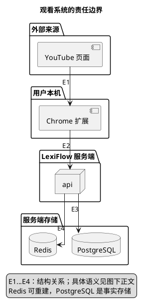

# 1. LexiFlow 架构总览

**位置：** [文档首页](../README.md) → [产品说明](../product/product-brief.md) → 架构总览。**下一步：** [两条流程](flows.md)解释事情如何发生；[模块边界](boundaries.md)解释谁负责。**失败去向：** 当前字幕、资料或服务不可靠时回到英文，不进入模型补全。

LexiFlow 是 Java 25 Modular Monolith，首个客户端为 Chrome 扩展，首个内容来源为 YouTube。系统有两条独立的时间线：**观看**只消费已经发布的资料并立即保留英文；**事后改进**属于第三阶段规划，只有审核发布后才影响后续观看。两条链通过资料版本衔接，不通过当前字幕的模型请求、后台补全或回调衔接。

## 1.1. 系统边界：英文在本机，事实在服务端

下图只回答“哪些系统拥有输入、展示和存储”，不是 Java import 依赖图；E1—E4 的方向表示资料或请求经过的边界。

- **E1**：扩展从 YouTube 页面读取已渲染英文，不修改来源英文节点；来源 DOM 和平台类型不进入领域模型。
- **E2**：扩展提交有界 `CaptionContext` 相关请求，英文展示不等待响应；服务端返回提示或空结果。
- **E3**：PostgreSQL 保存词库及发布版本事实；业务模块只通过公开 contract 访问各自拥有的数据。
- **E4**：Redis 与浏览器缓存只是可重建副本，不能成为事实源或绕过发布状态。

观看不保存观看历史，不上传本机抑制偏好。原始字幕、观看 URL、凭据或模型载荷不得借缓存、日志或指标跨越信任边界。[运行安全](runtime-safety.md)进一步说明失效和授权。[ADR-001](decisions.md#11-adr-001以模块化单体交付)解释部署选择。

## 1.2. 两条链如何在发布点相遇

观看从当前字幕开始，经过 Enrichment 对已发布 Lexicon 资料的确定性判断，终点是当前字幕上的提示或空结果。缺少可靠身份、资料、服务或语境证据时只保留英文。第三阶段事后分析从**另行授权的材料**开始，可使用模型，但其产物在评估审核前不可进入观看查询或缓存。发布新版本后，后续请求读取新资料；失败时保留旧发布版本。

[流程总览](flows.md)把两条链及其交接展开；[观看时序](flows/viewing.md)指出每一次调用和迟到结果的丢弃位置。[语义资料合同](semantic-contract.md)说明发布边界，不能从规划推断分析任务已实现。[ADR-003](decisions.md#13-adr-003观看使用已发布资料模型只用于事后分析)记录模型隔离决定。

## 1.3. 领域与依赖，不等于进程数量

Lexicon 拥有可复用词汇事实和版本；Enrichment 拥有 `CaptionContext` 输入合同、候选与提示决策。`:application:workflow` 协调用例，`:application:lexicon-application` 协调导入和版本查询，`:platform:adapters` 实现技术端口。`api` 与 `worker` 只是可分别部署的组合根；worker 不参加观看等待，也不因为独立进程成为微服务。Domain 不依赖 HTTP、数据库、缓存或供应商 SDK，模块不得直接读写其他 Domain 所有的数据。

看[模块边界](boundaries.md)的组件关系、职责和代码位置，再读[持久化模型](data-model.md)区分完整领域聚合与 DAO 行。Python 只负责仓库 Harness、Gate、生成器和审计，不承载产品业务。当前实现和未完成处由[状态页](../roadmap/master-plan/status.md)记录。

## 1.4. 从流程下钻到 contract 与代码

如果问题是“字幕何时失效”，从[观看时序](flows/viewing.md)进入[来源适配](source-contract.md)和[字幕身份](caption-contract.md)；如果问题是“为什么词库命中却没提示”，进入[共享词库](lexicon-contract.md)和[语义资料](semantic-contract.md)；如果问题是“结果能否缓存”，进入[运行安全](runtime-safety.md)。[架构决策](decisions.md)只回答已确定取舍，不替代 workflow 和 contract。长期约束以[产品架构规范](../../openspec/specs/product-architecture/spec.md)为准。
