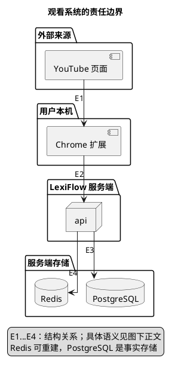

# 1. LexiFlow 架构总览

[文档首页](../README.md) → [产品说明](../product/product-brief.md) → 架构总览。本文概述系统边界、两条流程和领域职责。

LexiFlow 是 Java 25 Modular Monolith，首个客户端为 Chrome 扩展，首个内容来源为 YouTube。观看只消费已发布资料并优先显示英文；第三阶段规划的事后改进，须经审核发布后才影响后续观看。两者通过资料版本衔接，不由当前字幕触发模型工作。

## 1.1. 系统边界：英文在本机，事实在服务端

下图展示输入、展示与存储的系统边界；E1—E4 表示请求或资料流向，不表示 Java 依赖。

```plantuml
@startuml
title 观看系统的责任边界
top to bottom direction
skinparam shadowing false
skinparam nodesep 30
skinparam ranksep 60
skinparam linetype ortho
package "外部来源" as external {
  component "YouTube 页面" as youtube
}
package "用户本机" as client {
  component "Chrome 扩展" as extension
}
package "LexiFlow 服务端" as server {
  node "api" as api
}
package "服务端存储" as storage {
  database "PostgreSQL" as postgres
  database "Redis" as redis
}
youtube --> extension : E1
extension --> api : E2
api --> postgres : E3
api --> redis : E4
legend right
  E1...E4：结构关系；具体语义见图下正文
  Redis 可重建，PostgreSQL 是事实存储
endlegend
@enduml
```

- **E1**：扩展从 YouTube 页面读取已渲染英文，不修改来源英文节点；来源 DOM 和平台类型不进入领域模型。
- **E2**：扩展提交有界 `CaptionContext` 相关请求，英文展示不等待响应；服务端返回提示或空结果。
- **E3**：PostgreSQL 保存词库及发布版本事实；业务模块只通过公开 contract 访问各自拥有的数据。
- **E4**：Redis 与浏览器缓存只是可重建副本，不能成为事实源或绕过发布状态。

观看不保存观看历史，不上传本机抑制偏好。原始字幕、观看 URL、凭据或模型载荷不得借缓存、日志或指标跨越信任边界。[运行安全](runtime-safety.md)进一步说明失效和授权。[ADR-001](decisions.md#11-adr-001以模块化单体交付)解释部署选择。

## 1.2. 两条链如何在发布点相遇

事后改进仅限第三阶段规划，须另行授权材料并通过评估、审核和版本发布；之后的观看请求才可读取新资料，失败时继续使用旧版本。具体调用见[流程总览](flows.md)，审核与资料门槛见[语义资料合同](semantic-contract.md)。

## 1.3. 领域与依赖，不等于进程数量

Lexicon 拥有可复用词汇事实和版本；Enrichment 拥有 `CaptionContext` 输入合同、候选与提示决策。两个领域 Gradle 项目内部各自保留 `domain` 与 `application` 包：Enrichment 协调字幕用例，Lexicon 协调导入和版本查询，`:adapters` 实现技术端口。`:api` 是唯一 Spring Boot 组合根；未来后台任务由同一应用调度，但不得进入观看等待链路。Domain 不依赖 HTTP、数据库、缓存或供应商 SDK，模块不得直接读写其他 Domain 所有的数据。

看[模块边界](boundaries.md)的组件关系、职责和代码位置，再读[持久化模型](data-model.md)区分完整领域聚合与 DAO 行。Python 只负责仓库 Harness、Gate、生成器和审计，不承载产品业务。当前实现和未完成处由[状态页](../roadmap/master-plan/phase2/status.md)记录。

## 1.4. 从流程下钻到 contract 与代码

字幕身份与失效见[观看时序](flows/viewing.md)、[来源适配](source-contract.md)和[字幕身份](caption-contract.md)；提示资格见[共享词库](lexicon-contract.md)与[语义资料](semantic-contract.md)；缓存见[运行安全](runtime-safety.md)。[架构决策](decisions.md)记录取舍，长期约束以[产品架构规范](../../openspec/specs/product-architecture/spec.md)为准。
