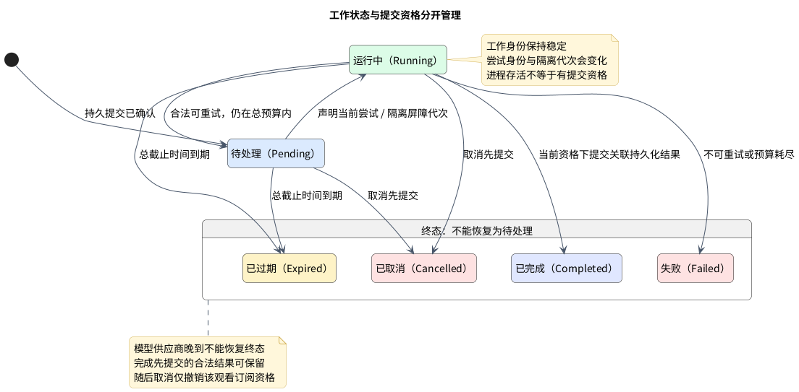
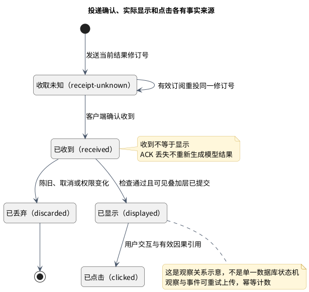
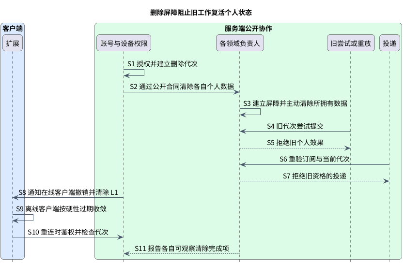

# 生命周期与一致性：谁在什么条件下还能提交效果

正常时序解释系统如何工作；生命周期解释异常时仍必须成立什么。**工作可重试但提交资格不能复用，结果可重投但不能冒充实际显示，事实可重放但不能复活已删除主体**。

按四个问题阅读：工作是否仍有效；投递是否真实可见；用户意图是否已被更新；个人数据是否已被撤销。它们分别由工作流协调/提示编排、投递/扩展、学习归约/个人词汇和身份/各领域负责。

> Proposed。补充 ADR-003/005/006/008，随 G1 等待用户决定。原保证保留；不指定 SQL、HTTP、租约秒数、重试次数、供应商或法律保留策略。

## 持久工作、取消与租约

工作是稳定需求，尝试是一次执行；能否提交由负责人的资格与隔离屏障代次决定。先看状态，再看竞争与恢复规则。

图：持久工作、取消与租约的 PlantUML 图解。

<!-- retained-lifecycle:start -->

工作流协调应用层通过公开合同提交持久工作；工作状态由 PostgreSQL 中的工作流协调持有。语义只执行有界尝试，提示编排拥有提示注释结果，投递只拥有投递状态。部署为 api/工作进程不改变这些业务负责人。

| 状态 / 条件 | 允许的转换 | 必须保持的保证 |
|---|---|---|
| 尚未提交 | 提交成功后进入待处理；失败返回快速结果 + 无待处理任务。 | 未提交的意图不能被客户端或工作进程当成已存在工作。 |
| `Pending`（待处理） | 当前尝试获得执行资格后进入运行中；取消或总截止时间到期可直接终止。 | 稳定工作身份与当前尝试身份分离。 |
| `Running`（运行中） | 在有效资格与版本下完成；可重试失败回到待处理；取消、到期或预算耗尽进入终态。 | 每次认领产生新的、可比较的隔离屏障代次；失去资格的旧尝试无权提交业务效果。 |
| `Completed`（已完成） | 通过提示编排合同发现已提交结果，再独立进入投递流程。 | 结果与已完成工作的关联须有可恢复的持久化提交边界；崩溃恢复不能制造第二个业务结果。 |
| `Cancelled` / `Expired` / `Failed`（取消、过期、失败） | 不再重试这个工作。新的观看需求必须形成新的合法工作。 | 终态不能因供应商晚到、租约续期或重复消息恢复成待处理。 |

取消是提交权限与投递资格的撤销，不是“供应商保证停止计算”的承诺。供应商可以在取消后返回，但旧尝试的结果不能产生新提示注释、更新用户投影或发送新投递。取消与完成竞争时，以负责人的持久化转换顺序为准：完成先提交可以保留当时合法产生的结果；随后取消使该观看订阅不再接收或显示它。取消先提交则完成提交必须被拒绝。拒绝记录只保留受控原因与非敏感关联，不保存原始模型响应。

字幕切换立即使客户端旧观看修订号失效，不等待服务端确认。单个订阅取消不等于删除共享内容或语义证据，也不撤销另一个仍然合法的订阅。登出撤销当前客户端的投递资格并清除其个人 L1；账号删除采用后述更强的数据屏障。

租约到期后可由新的尝试恢复同一未终止工作，沿用工作身份、改变尝试与隔离屏障代次。旧工作进程恢复网络后也必须重新核资格、总截止时间、输入版本及取消/删除状态。仅检查“进程还活着”或 Redis 锁不足以获得提交权限。

重试必须有有限总截止时间、尝试/成本预算，并区分可重试的失败与不可重试的拒绝、输入不合法、取消及过期。阶段 2/7 决定具体认领、退避和预算配置；配置缺失不得变成无限重试。网络提交确认丢失只能用原稳定身份查询或幂等重试，不能断言无待处理任务再另开工作；API 同步等待仍有界，英文与已有快速结果始终继续。

<!-- retained-lifecycle:end -->

## 投递确认与显示事实

发送、收到、真正显示和点击是不同观察。重投同一修订号修复 ACK，不重新调用模型；学习计数来自实际显示观察。

图：投递确认与显示事实的 PlantUML 图解。

图展示观察间的因果关系，不是合并所有负责人的单一持久状态机。生成结果属于提示编排，投递观察属于投递，显示/点击来自客户端事实。

<!-- retained-lifecycle:start -->

| 观察结果 | 投递 / 扩展的处理 | 不允许推断的事实 |
|---|---|---|
| 传输已发送，接收确认未知 | 标记 receipt-unknown；在订阅、版本和期限仍有效时，以同一结果身份/修订号重投。 | 不证明客户端收到，也不证明已显示。 |
| 客户端确认收到当前结果修订号 | 投递可记录已投递；扩展再进行当前字幕/个人档案/权限检查。 | 已收到 ACK 不是渲染成功。 |
| 收到后因陈旧、取消或权限变化丢弃 | 记录受控丢弃原因；停止对此订阅重投这个修订号。 | 不产生 HintDisplayed，不改变掌握度。 |
| 当前可见叠加层已提交 | 扩展以稳定观察身份创建 HintDisplayed，并单独上传。 | HintDisplayed 上传 ACK 丢失不允许重复计一次暴露。 |
| 用户点击可见提示 | HintClicked 引用对应已显示/结果身份。 | 缺少有效因果引用的点击不能当成学习证据。 |

一次 ACK 丢失不应导致重新调用模型或生成新结果。重复传输载荷可以确认收到，不能重复产生同一个显示观察。离开后返回同一句造成新的真实显示是另一个观察；精确身份结构定义在阶段 2/5 定义。

投递与观看订阅脱钩的持久化结果仍由提示编排管理，但其“曾生成”不意味着可永远重投。重投时也需重新鉴权和校验当前个人档案/提示注释/内容版本。失效通知只是加速机制，读取及显示时校验仍是最后防线。

<!-- retained-lifecycle:end -->

## 学习归约顺序与显式冲突

学习归约的已接受意图修订号决定意图顺序；个人档案的投影版本描述应用进度。陈旧设备不能静默反转更新意图。

<!-- retained-lifecycle:start -->

学习归约负责原始事实、幂等接收结果和服务端规范接收顺序；个人词汇档案负责应用证据与生成自己的投影版本。客户端时间、视频位置和关联只是事实背景，不能作为跨设备更新顺序或授权来源。隐式事实可乱序接收，其归约必须可按服务端稳定顺序重放，并保留归约器版本与因果引用。

| 显式 known/unknown 冲突方案 | 优点 | 代价 / 风险 |
|---|---|---|
| 按客户端 wall 时钟最后写入 | 离线操作容易保留“发生时间”。 | 时钟漂移和伪造会覆盖新意图；不推荐作为权威顺序。 |
| 仅按服务端接收顺序最后接受 | 合同简单，易于重放。 | 很晚补传的旧操作也可能反转用户最近的选择。 |
| **服务端意图修订号 + 条件接受** | 陈旧设备不会静默覆盖更新的显式意图；冲突可解释、可重复。 | 客户端需刷新并重新确认冲突动作；增加一个独立于投影的因果修订号。 |

推荐第三种。学习归约在用户与词汇身份的边界内维护已接受显式意图修订号，通过自己的公开接收合同判断动作的基准修订号。该修订号表示已接受意图的顺序，不等于个人词汇投影已完成；投影暂时失败时仍能区分新旧意图。

相同事件身份与相同输入重试返回同一接收结果，不重复追加或推进修订号；相同身份携带不同输入被拒绝。基准已陈旧的显式动作得到明确冲突，不自动改变个人档案。若保留拒绝事实，必须标记其不能生成评分证据；不能把冲突报成成功投影。客户端刷新后真正再次确认的动作有新的身份与当前基准。具体字段、事务及索引留给阶段 2。

已接受的显式意图仍按现有链路先持久提交，再尝试同步投影，只返回一次最终响应。投影失败表示已接受 + 投影待处理，不承诺读己之写；后台修复不得让较旧的显式修订号覆盖较新者。隐式行为参与接触次数与熟悉度的可解释归约，但不得因重试或乱序悄悄反转更新的显式意图；如何随时间减弱显式意图、评分和衰减规则由阶段 6 比较并版本化。

重放保留规范顺序、已接受/冲突区分、最新显式意图和归约器版本。新投影在验证后切换，不能用一次重放重新接受旧冲突，也不能让已删除主体重新出现。

<!-- retained-lifecycle:end -->

## 删除屏障与不可复活

清除已有个人数据之外，还要拒绝旧代次的后来写入；否则重放、缓存刷新和离线补传可能重新创建刚删除的状态。

图：删除屏障与不可复活的 PlantUML 图解。

图中的在线撤销与离线过期/重连是两种收敛路径；不能把无法触达的离线设备算作已即时清除。各负责人的在线存储、备份和遥测完成项分别报告。

<!-- retained-lifecycle:start -->

“学习归约事实不可变”约束正常归约与重放，不是禁止用户删除或无限保留的承诺。账号/数据删除由身份 & 访问授权并建立服务端可信的撤销/删除代次；各领域仅通过自己的公开合同清除其拥有的数据。协调者不得横向直接删其他模块的表。

删除屏障生效后，旧代次的事件补传、待处理投影、重放、提示注释工作、缓存刷新及投递都无权提交新个人效果；进行中的尝试即便晚到也不能复活个人档案或用户提示注释。恢复相同登录标识的主体不能自动复用旧代次。共享词库或确实不含个人影响的语义证据依其负责人/隐私分类处理，不因账号删除无差别清空。

在线 L1 立即收到撤销信号并清除，离线 L1 受既有有限硬性过期、重连鉴权与代次校验共同约束。无法触达的离线设备不能被报告为“已即时清除”。PostgreSQL 负责人删除、Redis 清除、离线客户端收敛及备份/遥测保留是不同完成项。

阶段 2 的 SEC-0002 必须比较物理删除、去标识化与删除墓碑，定义哪些个人事实/派生数据必须清除、最小屏障元数据及其保留期限，并确定可观察的删除完成结果；阶段 7 验证各存储、备份、日志及离线设备的清除时限。阶段 1 仅固定不可复活、负责人隔离、主动清除与不虚报完成保证，不提前选择具体法律保留策略或声称已完成物理清除。

<!-- retained-lifecycle:end -->

## 后续必须验证的场景

用并发、崩溃、晚到和确认丢失证明前面的保证；下表仍是预期验证，不是已执行产品测试。

<!-- retained-lifecycle:start -->

这些是设计层的预期，不是已经执行的产品测试：

| 场景 | 必须观察到的结果 | 后续负责人 / 阶段 |
|---|---|---|
| 供应商在取消后完成 | 失效尝试无业务提交与新投递；英文继续。 | 提示编排 / 语义，P4 |
| 工作进程租约失效后旧、新尝试同时返回 | 只有当前合法隔离屏障代次产生一次业务效果。 | 工作流协调 / OPS，P2、P7 |
| 持久提交成功但 API 确认丢失 | 原身份查询/重试发现同一工作；没有第二份工作或假无待处理任务。 | 工作流协调 / API，P2、P3 |
| 完成记录后崩溃，投递未接收 | 从提示编排领域拥有的结果恢复投递，不重跑模型。 | 提示编排 / 投递，P3、P4 |
| 收到 ACK 丢失；重投后字幕已切换 | 同一修订号被拒绝为陈旧，零 HintDisplayed。 | 投递 / 扩展，P3、P5 |
| 叠加层已显示但行为上传 ACK 丢失 | 稳定事件身份重传，只计一次实际观察。 | 扩展 / 学习归约，P5、P6 |
| 两设备使用同一基准提交相反意图 | 一个条件接受，一个冲突；结果不由设备时钟决定。 | 学习归约 / 个人档案，P2、P6 |
| 新意图投影待处理，旧工作进程稍后恢复 | 已接受顺序保持稳定，旧修订号不反转新意图。 | 学习归约 / 个人档案，P2、P6 |
| 删除与重放、缓存刷新、离线补传并发 | 删除屏障拒绝旧代次的写入与投递；清除完成项如实区分。 | 身份 / SEC / 各领域，P2、P7 |

本提案被用户修改或拒绝时，应同时修订相关 ADR、事实/端口合同和这些场景，再生成新的当前来源与分层验收；不能修改历史 PASS 或给跳过的检查补签通过。

<!-- retained-lifecycle:end -->
