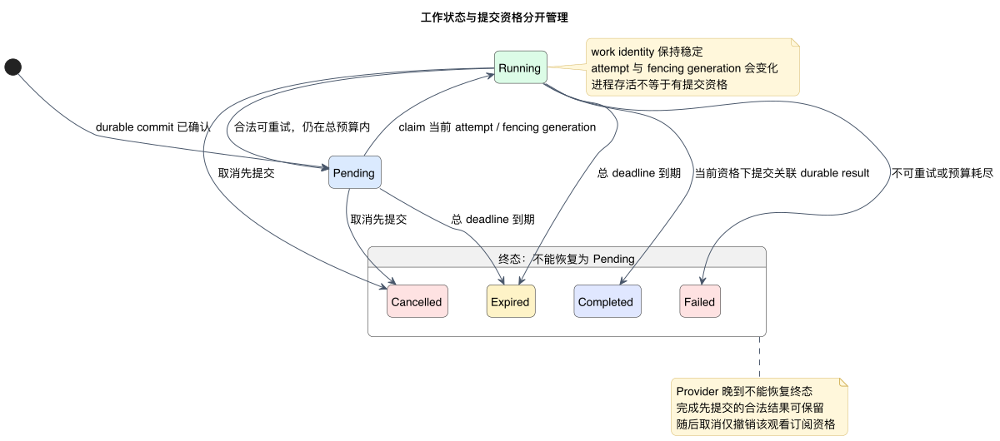
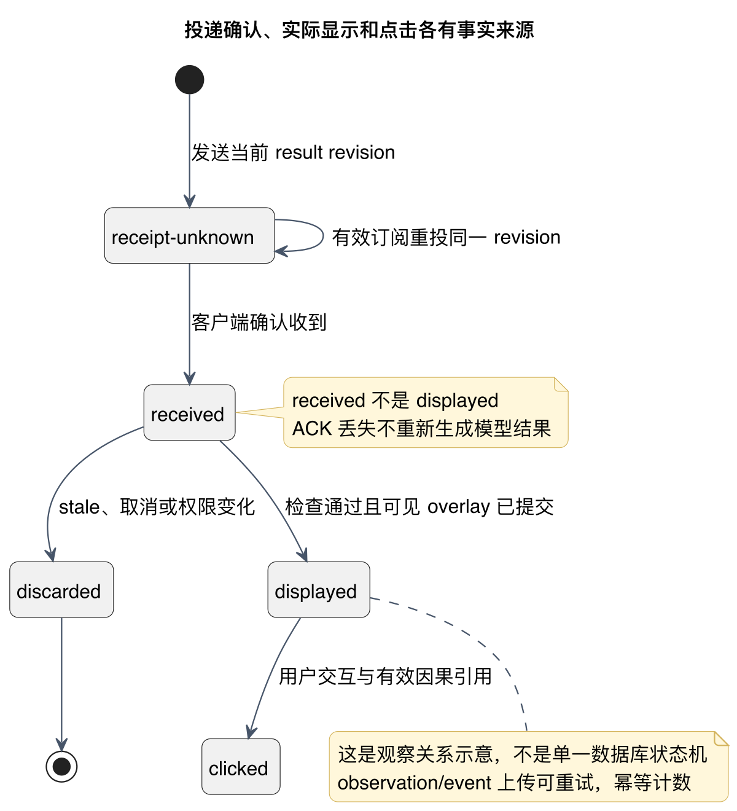
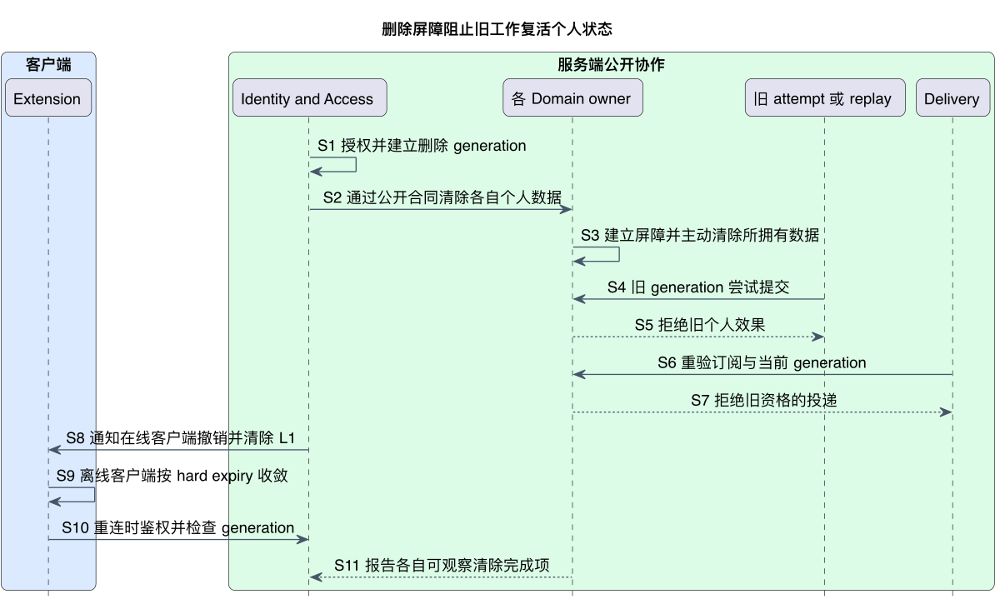

# 生命周期与一致性：谁在什么条件下还能提交效果

正常时序解释系统如何工作；生命周期解释异常时仍必须成立什么。**工作可重试但提交资格不能复用，结果可重投但不能冒充实际显示，事实可重放但不能复活已删除主体**。

按四个问题阅读：工作是否仍有效；投递是否真实可见；用户意图是否已被更新；个人数据是否已被撤销。它们分别由 Workflow/Enrichment、Delivery/Extension、Learning/Vocabulary 和 Identity/各 Domain 负责。

> Proposed。补充 ADR-003/005/006/008，随 G1 等待用户决定。原保证保留；不指定 SQL、HTTP、lease 秒数、重试次数、Provider 或法律保留策略。

## Durable work、取消与租约

工作是稳定需求，attempt 是一次执行；能否提交由 owner 的资格与 fencing generation 决定。先看状态，再看竞争与恢复规则。

[PlantUML 源码](diagrams/work-lifecycle.puml) · [矢量图](diagrams/work-lifecycle.svg)

<!-- retained-lifecycle:start -->

Workflow Application 通过公开 contract 提交 durable work；工作状态由 PostgreSQL 中的 workflow coordination 持有。Semantic 只执行有界 attempt，Enrichment 拥有 annotation result，Delivery 只拥有投递状态。部署为 api/worker 不改变这些业务 owner。

| 状态 / 条件 | 允许的转换 | 必须保持的保证 |
|---|---|---|
| 尚未提交 | 提交成功后进入 pending；失败返回 fast result + no-pending。 | 未提交的意图不能被客户端或 worker 当成已存在工作。 |
| Pending | 当前 attempt 获得执行资格后进入 running；取消或总 deadline 到期可直接终止。 | 稳定 work identity 与当前 attempt identity 分离。 |
| Running | 在有效资格与版本下完成；可重试失败回到 pending；取消、到期或预算耗尽进入终态。 | 每次 claim 产生新的、可比较的 fencing generation；失去资格的旧 attempt 无权提交业务效果。 |
| Completed | 通过 Enrichment contract 发现已提交 result，再独立进入投递流程。 | result 与 completed work 的关联须有可恢复的 durable 提交边界；崩溃恢复不能制造第二个业务结果。 |
| Cancelled / Expired / Failed | 不再重试这个 work。新的观看需求必须形成新的合法工作。 | 终态不能因 provider 晚到、lease 续期或重复消息恢复成 pending。 |

取消是提交权限与投递资格的撤销，不是“Provider 保证停止计算”的承诺。Provider 可以在取消后返回，但旧 attempt 的结果不能产生新 annotation、更新用户 projection 或发送新投递。取消与完成竞争时，以 owner 的 durable 转换顺序为准：完成先提交可以保留当时合法产生的结果；随后取消使该观看订阅不再接收或显示它。取消先提交则完成提交必须被拒绝。拒绝记录只保留受控原因与非敏感关联，不保存原始模型响应。

caption 切换立即使客户端旧观看 revision 失效，不等待服务端确认。单个订阅取消不等于删除共享 Content 或 Semantic evidence，也不撤销另一个仍然合法的订阅。登出撤销当前客户端的投递资格并清除其个人 L1；账号删除采用后述更强的数据屏障。

lease 到期后可由新的 attempt 恢复同一未终止 work，沿用 work identity、改变 attempt 与 fencing generation。旧 worker 恢复网络后也必须重新核资格、总 deadline、输入版本及取消/删除状态。仅检查“进程还活着”或 Redis 锁不足以获得提交权限。

重试必须有有限总 deadline、attempt/cost budget，并区分 retryable failure 与不可重试的拒绝、输入不合法、取消及过期。Phase 2/7 决定具体 claim、退避和预算配置；配置缺失不得变成无限重试。网络提交确认丢失只能用原稳定 identity 查询或幂等重试，不能断言 no-pending 再另开工作；API 同步等待仍有界，英文与已有 fast result 始终继续。

<!-- retained-lifecycle:end -->

## 投递确认与显示事实

发送、收到、真正显示和点击是不同观察。重投同一 revision 修复 ACK，不重新调用模型；学习计数来自实际显示 observation。

[PlantUML 源码](diagrams/delivery-lifecycle.puml) · [矢量图](diagrams/delivery-lifecycle.svg)

图展示观察间的因果关系，不是合并所有 owner 的单一持久状态机。生成 result 属于 Enrichment，投递观察属于 Delivery，显示/点击来自客户端事实。

<!-- retained-lifecycle:start -->

| 观察结果 | Delivery / Extension 的处理 | 不允许推断的事实 |
|---|---|---|
| Transport 已发送，接收确认未知 | 标记 receipt-unknown；在订阅、版本和期限仍有效时，以同一 result identity/revision 重投。 | 不证明客户端收到，也不证明 displayed。 |
| 客户端确认收到当前 result revision | Delivery 可记录 delivered；Extension 再进行当前 caption/profile/权限检查。 | received ACK 不是渲染成功。 |
| 收到后因 stale、取消或权限变化丢弃 | 记录受控 discard 原因；停止对此订阅重投这个 revision。 | 不产生 HintDisplayed，不改变掌握度。 |
| 当前可见 overlay 已提交 | Extension 以稳定 observation identity 创建 HintDisplayed，并单独上传。 | HintDisplayed 上传 ACK 丢失不允许重复计一次暴露。 |
| 用户点击可见提示 | HintClicked 引用对应 displayed/result identity。 | 缺少有效因果引用的点击不能当成学习证据。 |

一次 ACK 丢失不应导致重新调用模型或生成新 result。重复 transport payload 可以确认收到，不能重复产生同一个显示 observation。离开后返回同一句造成新的真实显示是另一个 observation；精确 identity schema 在 Phase 2/5 定义。

Delivery 与观看订阅脱钩的 durable result 仍由 Enrichment 管理，但其“曾生成”不意味着可永远重投。重投时也需重新鉴权和校验当前 profile/annotation/content version。失效通知只是加速机制，读取及显示时校验仍是最后防线。

<!-- retained-lifecycle:end -->

## Learning 顺序与显式冲突

Learning 的 accepted intent revision 决定意图顺序；Profile 的 projection version 描述应用进度。陈旧设备不能静默反转更新意图。

<!-- retained-lifecycle:start -->

Learning 负责原始事实、幂等接收结果和服务端 canonical intake order；Vocabulary Profile 负责应用 evidence 与生成自己的 projection version。客户端时间、视频位置和 correlation 只是事实背景，不能作为跨设备更新顺序或授权来源。隐式事实可乱序接收，其归约必须可按服务端稳定顺序重放，并保留 reducer version 与因果引用。

| 显式 known/unknown 冲突方案 | 优点 | 代价 / 风险 |
|---|---|---|
| 按客户端 wall clock 最后写入 | 离线操作容易保留“发生时间”。 | 时钟漂移和伪造会覆盖新意图；不推荐作为权威顺序。 |
| 仅按服务端接收顺序最后接受 | 合同简单，易于重放。 | 很晚补传的旧操作也可能反转用户最近的选择。 |
| **服务端意图 revision + 条件接受** | 陈旧设备不会静默覆盖更新的显式意图；冲突可解释、可重复。 | 客户端需刷新并重新确认冲突动作；增加一个独立于 projection 的因果 revision。 |

推荐第三种。Learning 在用户与 lexical identity 的边界内维护 accepted explicit-intent revision，通过自己的公开接收 contract 判断动作的 base revision。该 revision 表示已接受意图的顺序，不等于 Vocabulary projection 已完成；投影暂时失败时仍能区分新旧意图。

相同 event identity 与相同输入重试返回同一接收结果，不重复追加或推进 revision；相同 identity 携带不同输入被拒绝。base 已陈旧的显式动作得到明确 conflict，不自动改变 Profile。若保留拒绝事实，必须标记其不能生成 scoring evidence；不能把 conflict 报成成功投影。客户端刷新后真正再次确认的动作有新的 identity 与当前 base。具体字段、事务及索引留给 Phase 2。

已接受的显式意图仍按现有链路先 durable commit，再尝试同步投影，只返回一次最终响应。投影失败表示 accepted + projection pending，不承诺 read-your-writes；后台修复不得让较旧的显式 revision 覆盖较新者。隐式行为参与 exposure 与 familiarity 的可解释归约，但不得因重试或乱序悄悄反转更新的显式意图；如何随时间减弱显式意图、评分和衰减规则由 Phase 6 比较并版本化。

重放保留 canonical order、accepted/conflict 区分、最新显式意图和 reducer version。新 projection 在验证后切换，不能用一次 replay 重新接受旧 conflict，也不能让已删除主体重新出现。

<!-- retained-lifecycle:end -->

## 删除屏障与不可复活

清除已有个人数据之外，还要拒绝旧 generation 的后来写入；否则 replay、缓存刷新和离线补传可能重新创建刚删除的状态。

[PlantUML 源码](diagrams/delete-barrier.puml) · [矢量图](diagrams/delete-barrier.svg)

图中的在线撤销与离线 expiry/重连是两种收敛路径；不能把无法触达的离线设备算作已即时清除。各 owner 的在线存储、备份和 telemetry 完成项分别报告。

<!-- retained-lifecycle:start -->

“Learning 事实不可变”约束正常归约与重放，不是禁止用户删除或无限保留的承诺。账号/数据删除由 Identity & Access 授权并建立服务端可信的撤销/删除 generation；各 Domain 仅通过自己的公开 contract 清除其拥有的数据。协调者不得横向直接删其他模块的表。

删除屏障生效后，旧 generation 的事件补传、pending projection、replay、annotation work、缓存刷新及投递都无权提交新个人效果；进行中的 attempt 即便晚到也不能复活 Profile 或用户 annotation。恢复相同登录标识的主体不能自动复用旧 generation。共享 Lexicon 或确实不含个人影响的 Semantic evidence 依其 owner/隐私分类处理，不因账号删除无差别清空。

在线 L1 立即收到撤销信号并清除，离线 L1 受既有有限 hard expiry、重连鉴权与 generation 校验共同约束。无法触达的离线设备不能被报告为“已即时清除”。PostgreSQL owner deletion、Redis purge、离线客户端收敛及备份/telemetry 保留是不同完成项。

Phase 2 的 SEC-0002 必须比较物理删除、去标识化与 tombstone，定义哪些个人事实/派生数据必须清除、最小屏障元数据及其保留期限，并确定可观察的删除完成结果；Phase 7 验证各存储、备份、日志及离线设备的清除时限。Phase 1 仅固定不可复活、owner 隔离、主动 purge 与不虚报完成保证，不提前选择具体法律保留策略或声称已完成物理清除。

<!-- retained-lifecycle:end -->

## 后续必须验证的场景

用并发、崩溃、晚到和确认丢失证明前面的保证；下表仍是预期验证，不是已执行产品测试。

<!-- retained-lifecycle:start -->

这些是设计层的预期，不是已经执行的产品测试：

| 场景 | 必须观察到的结果 | 后续 owner / 阶段 |
|---|---|---|
| Provider 在取消后完成 | 失效 attempt 无业务提交与新投递；英文继续。 | Enrichment / Semantic，P4 |
| worker lease 失效后旧、新 attempt 同时返回 | 只有当前合法 fencing generation 产生一次业务效果。 | Workflow / OPS，P2、P7 |
| durable commit 成功但 API 确认丢失 | 原 identity 查询/重试发现同一工作；没有第二份工作或假 no-pending。 | Workflow / API，P2、P3 |
| completion 后崩溃，Delivery 未接收 | 从 Enrichment-owned result 恢复投递，不重跑模型。 | Enrichment / Delivery，P3、P4 |
| 收到 ACK 丢失；重投后 caption 已切换 | 同一 revision 被拒绝为 stale，零 HintDisplayed。 | Delivery / Extension，P3、P5 |
| overlay 已显示但行为上传 ACK 丢失 | 稳定 event identity 重传，只计一次实际 observation。 | Extension / Learning，P5、P6 |
| 两设备使用同一 base 提交相反意图 | 一个条件接受，一个 conflict；结果不由设备时钟决定。 | Learning / Profile，P2、P6 |
| 新意图投影 pending，旧 worker 稍后恢复 | accepted order 保持稳定，旧 revision 不反转新意图。 | Learning / Profile，P2、P6 |
| 删除与 replay、缓存刷新、离线补传并发 | 删除屏障拒绝旧 generation 的写入与投递；清除完成项如实区分。 | Identity / SEC / 各 Domain，P2、P7 |

本提案被用户修改或拒绝时，应同时修订相关 ADR、事实/port 合同和这些场景，再生成新的 current source 与分层验收；不能修改历史 PASS 或给跳过的检查补签通过。

<!-- retained-lifecycle:end -->
