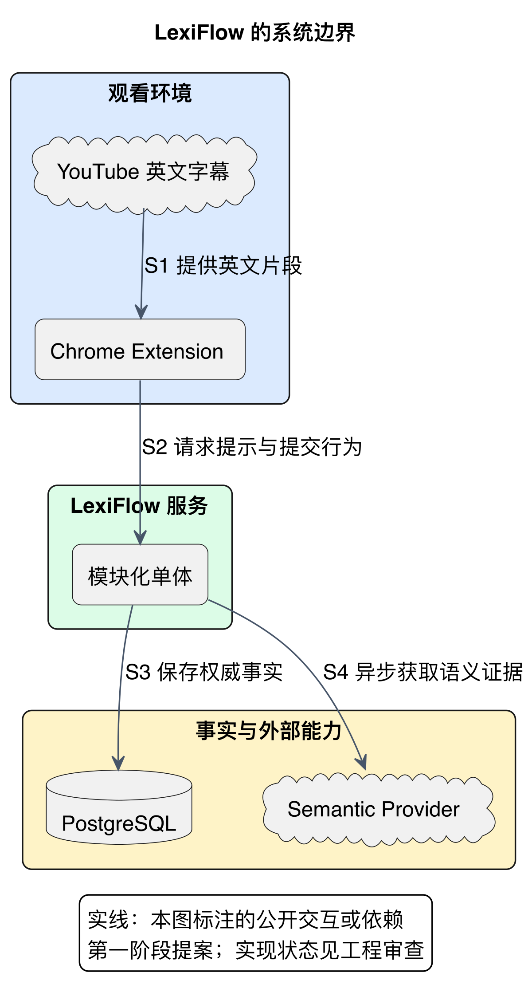
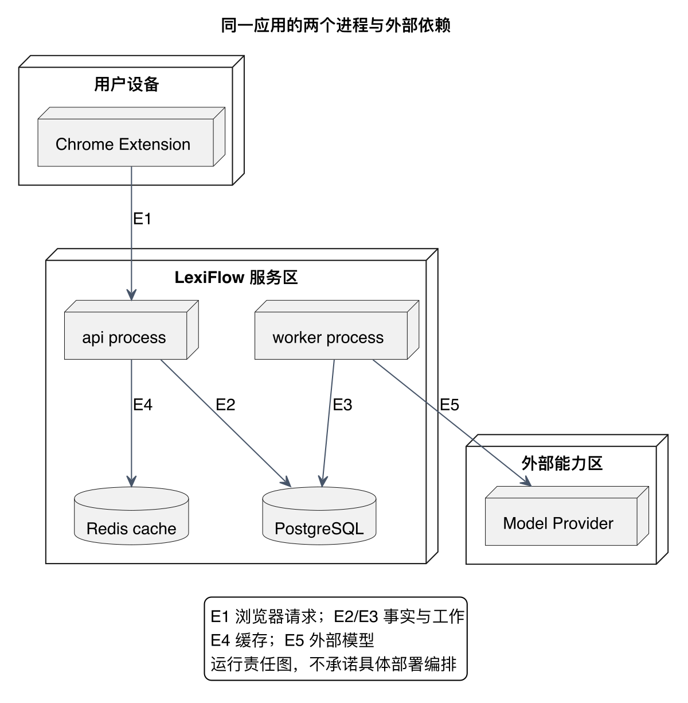

# LexiFlow 架构总览

LexiFlow 的架构围绕两件事组织：**观看时及时提供少量帮助，观看后积累可解释的个人学习状态**。第一件事要求英文字幕独立于网络和模型；第二件事要求用户行为先成为服务端事实，再生成可重建的 Vocabulary Profile。

因此，我们推荐一个 **Java 25 模块化单体**：薄 Chrome Extension 承载观看交互；服务端通过规则快路和语义慢路生成提示；PostgreSQL 保存权威事实；`api` 与 `worker` 分别承载短交互和后台工作。两种进程共享同一套领域边界。

> Task id：`LF-ARCH-P1-001`。架构状态：Proposed；第一阶段继续优化。Java 基础骨架已存在，下面的业务链路是待实现设计。SQL、具体业务 endpoint、Prompt 和部署编排仍在后续阶段。

## 1. 从用户体验理解系统

用户看到的仍是英文，只有可能不熟悉且值得提示的词语得到简短中文解释。例如：

```text
This could materially impair（实质性损害） settlement finality（结算最终性）.
```

这里有三个连续判断：先定位单词、短语和术语；再结合个人状态判断是否需要帮助；最后为选中的表达确定语境含义。**Rules 决定是否提示，Models 决定语境含义**。模型结果回来后，规则还要再检查一次展示资格。

### 第一版目标与非目标

首个入口是有英文字幕的普通 YouTube 点播视频；同一账户的多个 Chrome 实例共享服务端 Profile。英文字幕始终是主内容，任何 annotation 不能阻塞观看。

非目标（non-goals）是整句双语字幕、全平台接入、完整复习系统，以及在没有实际规模证据时引入微服务、Kafka 或 Kubernetes。YouTube 字幕可获取性、提示质量和时延仍是待验证假设（assumptions），见 [详细假设与预算](contracts/architecture-invariants.md#3-assumptions)。

## 2. 先看整体边界



[PlantUML 源码](diagrams/system-context.puml) · [矢量图](diagrams/system-context.svg)

按 S1–S4 阅读这张上下文图：YouTube 提供英文片段；Extension 向服务端请求提示和提交行为；服务端保存权威事实，并在后台按需获取语义证据。**S1 的英文显示不等待 S2–S4**。

Extension 拥有当前视频、当前字幕、可见 overlay 和本机缓存；服务端拥有个人状态与业务决策；外部 Provider 只返回不可信的语义证据。浏览器缓存和 Redis 都可以清空重建，不能取代 PostgreSQL。

## 3. 用两条主链路建立认识

### 观看链路：英文先出现，帮助逐步补充

Extension 先显示英文，再尝试复用有效 L1 提示。服务端快路读取词库与 Profile，执行候选和 need-hint 规则，返回已有可靠帮助。语义缺口由后台补齐，不进入 fast path 的必需等待。

只有工作 **durable commit 已确认**，服务端才可返回 `pending`。明确提交失败返回已有 fast result + `no-pending`；确认不明要沿用原 identity 查询或幂等重试，不能凭空另开工作。后台最终结果由 Enrichment 持久化，再经 Delivery 独立投递。

晚到结果必须仍匹配当前 caption、revision、profile 和权限，才有资格显示。收到 payload、实际显示和点击是不同事实。

<a id="7-youtube-caption-到-annotation-的完整链路"></a>
完整图解见 [字幕提示链路](caption-and-learning-flows.md#字幕链路先显示英文再补充语境提示)，逐步合同见 [原 §7 详细参考](contracts/core-workflows.md#7-youtube-caption-到-annotation-的完整链路)。

### 学习链路：行为先保存，状态再投影

用户显式标记 known/unknown，以及真实显示、点击、暂停、重播等行为，先由 Learning 幂等保存。Learning 把事实归约为带来源和规则版本的 evidence；Vocabulary Profile 幂等应用 evidence，形成跨设备当前状态。

显式动作尝试同步投影，成功的单次响应携带新 profile version；投影失败只承诺 event 已接受、projection pending。隐式信号异步批处理并最终一致。事实保留重放（replay）能力，不把重复上传当作多次学习。

<a id="8-behavior-到-learning-再到-vocabulary-profile-的完整链路"></a>
完整图解见 [学习反馈链路](caption-and-learning-flows.md#学习链路从行为事实到个人状态)，冲突和重放见 [生命周期](phase-1-lifecycle-guarantees.md#learning-顺序与显式冲突)。

### 两条链路如何连接

上一条链路读取 Profile 决定提示；下一条链路改变 Profile，影响之后的提示。连接点是可比较的 profile version 和公开合同，任何模块都不能直接读取其他领域的私有表。

<a id="9-同步与异步边界"></a>
同步与异步边界按交互承诺划分：英文显示在本地；事实接受等到 durable commit；显式投影等到 version 或 pending 结论；外部模型、隐式归约和 replay 由后台完成。所有等待都有 deadline，失败采取明确降级。见 [同步与异步的判断方法](caption-and-learning-flows.md#同步与异步边界按承诺划分)。

## 4. 再理解业务如何分工

<a id="5-bounded-context-与责任"></a>
七个 Bounded Context 可以按三组记忆：**Content + Lexicon 提供内容和词汇事实；Enrichment + Semantic 形成个性化语境帮助；Learning + Vocabulary 积累学习资产**。Identity & Access 为三组提供授权边界。

Delivery / Sync 属于应用层，负责投递与同步，不额外成为业务 Domain。Foundation 只放稳定 identity、时间与版本合同，不变成共享业务杂物箱。

<a id="61-推荐模块布局"></a>
<a id="62-静态依赖方向"></a>
具体职责、推荐模块布局、静态依赖方向与 forbidden 依赖见 [模块与依赖](modules-and-dependencies.md)。依赖由组合根指向 application，再指向 domain/ports；适配器实现端口，领域不反向依赖适配器。

## 5. 为什么是同一应用、两个运行入口



[PlantUML 源码](diagrams/runtime-deployment.puml) · [矢量图](diagrams/runtime-deployment.svg)

这张部署图回答“在哪里执行”，前面的上下文图回答“谁和系统交互”。`api` 处理有界交互，`worker` 处理语义尝试、隐式归约和恢复任务；二者通过事实存储和公开用例协作。

E1 是浏览器请求，E2/E3 是事实与持久工作，E4 是可重建缓存，E5 是外部模型调用。图只画关键依赖，未展开 worker 的所有缓存访问或 Delivery 的具体传输；实例数量和编排方案尚未确定。

两进程隔离长尾延迟，领域仍在同一代码库内保持事务与所有权边界。模块化单体及两入口的取舍见 [ADR-001/002](decisions.md#系统组织用业务边界控制复杂度)。

## 6. 用四条保证检查所有细节

| 保证 | 对用户和实现意味着什么 | 下一层阅读 |
|---|---|---|
| 英文独立显示 | 网络、模型、worker 失败不阻塞观看；English first 是硬边界 | [核心流程](caption-and-learning-flows.md) |
| 事实与副本分离 | PostgreSQL 负责权威状态；Redis/L1 丢失只能影响速度 | [缓存合同导读](phase-1-cross-cutting-contracts.md#4-cache-正确性有效期与隐私合同) |
| 每种事实有唯一 owner | 生成、投递、显示、点击、接受意图、完成投影分别证明 | [生命周期](phase-1-lifecycle-guarantees.md) |
| 外部输入不能直接决定业务 | 网页、客户端声明、Provider 输出均要验证与最小化 | [信任边界](phase-1-cross-cutting-contracts.md#5-信任边界与威胁合同) |

完整 17 条架构约束、Must/Should/Later 和稳定验收 ID 在 [架构不变量参考](contracts/architecture-invariants.md)。它是实现检查清单，总览不重复平铺每条规则。

## 7. 从设计走向工程与阶段决定

Java 25 骨架、Spotless、Checkstyle、PMD、源码 gate、ArchUnit、JUnit 和 JaCoCo 已有本机直接工程验证。Python 负责规划、runner 和证据治理，不重复实现 Java 源码规则。实际工具责任和验收分层见 [工程与交付](engineering-and-delivery.md)。

设计状态、工程构建通过、正式 Task receipt 和用户阶段决定分别记录。目前仍有正式证据上下文和 Java Gradle adapter 的边界，不能由文档或构建成功推断 G1 通过。

下一步评审需要确认系统组织、快慢路径、显式/隐式一致性、持久工作及来源隔离；理由见 [十项决策](decisions.md)，出口条件见 [G1 决策包](../reviews/g1-decision-package.md)。本次重构不进入第二阶段。
