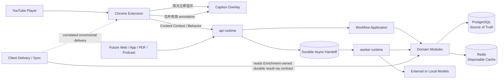
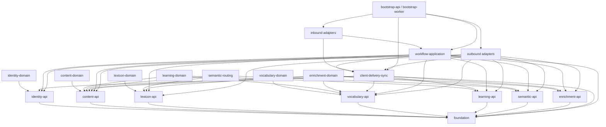
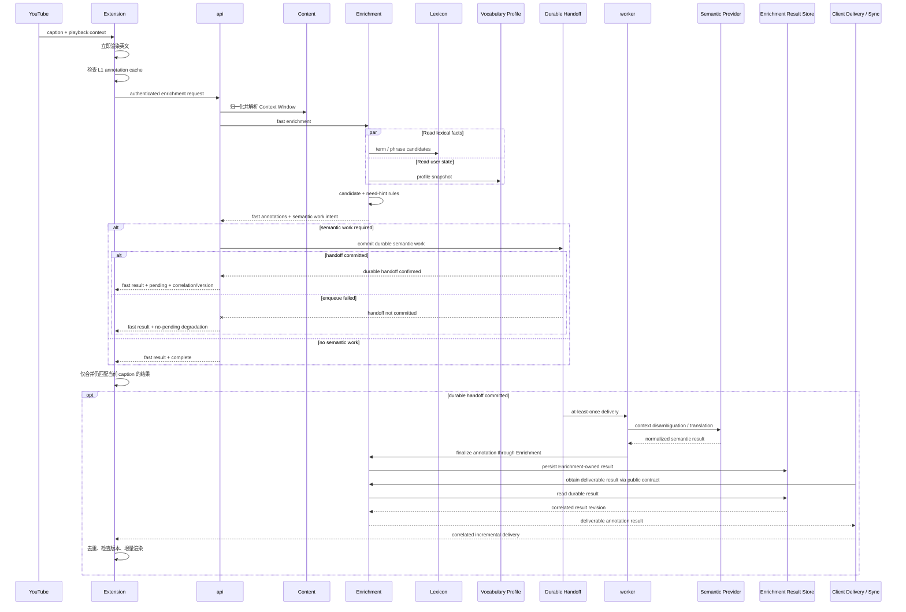
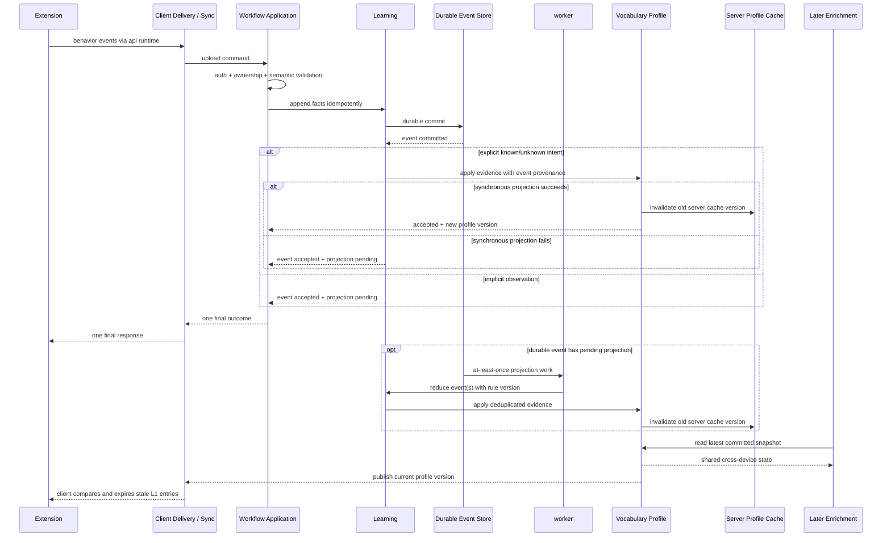

# LexiFlow Phase 1 架构

> Task id: `LF-ARCH-P1-001`
>
> 状态：`Proposed`，等待产品方向评审
>
> 本文只确定 Domain、模块、依赖、核心数据流和同步/异步边界。数据表字段、具体 REST 路径、部署编排、Prompt 与代码实现留给后续 Phase。

## 1. 目标与范围

LexiFlow 的第一入口是 YouTube 英语字幕辅助。英文字幕必须先于任何后端或模型结果显示；系统只给用户可能不熟悉的单词、短语、术语提供简短、结合语境的中文提示。长期核心资产是跨设备共享、可解释、可重算的个人 `Vocabulary Profile`。

Phase 1 固定以下架构性质：

- 后端采用 Modular Monolith，在一个代码库内以 Bounded Context 和可检查依赖隔离业务。
- `api` 与 `worker` 是同一应用的两个运行入口，共享 Domain 与 Application 模块，但具有不同延迟和故障边界。
- Chrome Extension 是薄客户端。它负责字幕接入、播放上下文、英文优先渲染、增量 annotation 合并、行为采集与 L1 cache；后端持有权威用户状态。
- Enrichment 使用确定性 fast lane 和模型 semantic slow lane。模型不可阻塞英文字幕，也不可成为所有字幕的必经路径。
- Learning 先保存事实事件，再产生可解释的 Vocabulary Profile 投影；不把整个系统建设为 Event Sourcing。
- PostgreSQL 保存权威事实和可恢复状态；Redis 与浏览器缓存均可丢弃、可重建，不能决定正确性。

本阶段不决定客户端与后端的增量传输方式，也不决定具体框架、表结构、消息格式或模型供应商。

## 2. 架构原则

### 2.1 产品原则

1. **English first**：字幕首屏只依赖播放器和扩展本地状态。
2. **Selective help**：规则决定是否需要帮助，模型决定当前语境下帮助的内容。
3. **Graceful absence**：无缓存、模型超时、worker 不可用时，用户仍可正常看英文字幕。
4. **Server-owned profile**：多个设备共享后端的 Vocabulary Profile；客户端缓存只是带版本的副本。
5. **Facts before scores**：行为事实不可被 familiarity 分数替代；分数必须能追溯到规则版本和输入事件。
6. **Source-neutral core**：YouTube 只是一种 Content Source，不能渗入词汇、学习和语义核心模型。

### 2.2 工程原则

以下约束沿用参考仓库 `feipi-session-browser-java` 已验证的做法：

- Domain 不依赖 Web 框架、数据库驱动、缓存客户端、序列化实现或模型 SDK。
- Application 只面向公开 API 与 outbound port 编排，不直接引用具体 adapter。
- concrete adapter 只能由 composition root 装配，业务模块不能反向依赖启动入口。
- 依赖白名单和 forbidden import 必须成为机器可读的架构清单，并由 architecture test 执行。
- Harness 只保存静态、机器可读的 owner；运行结果进入不可覆盖的 run evidence，不把临时状态写回规则文件。
- Gate 显式运行；未运行、跳过或不可用均不能报告为 `PASS`。
- 大任务先按可验收功能拆分，再将同 owner、同 contract/写入边界的连续 Task 聚合为工作包。Qoder 与 Codex 均使用稳定 `work_package_id`、精确 `task_ids[]` 和逐 Task outcome；调用者与 runner 的字段、任务规模和回调约束以 [agent-policy.manifest.yaml](../../harness/agent-policy.manifest.yaml) 为准。并行写范围不得重叠，主 Agent 独立验收。

## 3. Assumptions

| ID | Assumption | 架构影响 | 需要验证的时机 |
|---|---|---|---|
| A-01 | 首个版本允许先服务单个用户，但所有业务数据从第一天带租户/用户边界。 | 后续开放多用户时无需重写 Domain。 | Identity/API 设计前 |
| A-02 | Chrome Extension 能获得至少当前 caption 文本、时间范围和视频身份；上一句/下一句可能不完整。 | Content Context 必须允许缺项和乱序，不能假设完整 transcript。 | Extension spike |
| A-03 | 网络、字幕和模型都可能间歇不可用。 | 英文渲染本地完成；增强结果可缺失、超时或晚到。 | 首个端到端原型 |
| A-04 | 中文是首个 hint 目标语言，未来可能扩展其他目标语言。 | Annotation 语义中保留目标语言概念，核心规则不写死中文。 | Data/API 设计前 |
| A-05 | 客户端重试和离线补传会造成至少一次投递。 | Learning intake、异步 job 和结果合并都必须幂等。 | Data/API 设计前 |
| A-06 | 大多数隐式行为不要求即时改变下一帧字幕。 | 普通 Learning 投影可异步；显式“认识/不认识”需要 read-your-writes。 | Learning 交互评审 |
| A-07 | 初期吞吐不支持引入专用消息平台的成本。 | 使用 PostgreSQL 持久化的 outbox/job 边界驱动 worker；Redis 不承担唯一队列。 | 压测显示瓶颈时复审 |
| A-08 | 语义提供者的延迟、成本和可用性差异很大。 | Semantic Provider 必须可路由、可超时、可观测且可替换。 | Enrichment 详细设计前 |

## 4. 系统上下文

图中的箭头表达运行时交互，不代表 Domain 可以直接依赖基础设施。PostgreSQL、Redis 和 Model 均通过 outbound port 接入。

## 5. Bounded Context 与责任

| Context | 拥有的业务责任 | 对外能力 | 明确不负责 |
|---|---|---|---|
| **Identity & Access** | 用户、设备身份、会话认证、数据归属和授权边界。 | 认证后的 `UserContext`、设备/客户端归属检查。 | 词汇评分、字幕处理、模型路由。 |
| **Content** | 来源无关的内容、片段、caption、播放位置和上下文窗口；把 YouTube 输入归一为通用语义。 | 解析或读取当前 Content Context，维护稳定内容引用。 | 判断用户是否认识词；生成中文提示。 |
| **Lexicon** | 全局共享的 term/phrase、lemma、变形、难度、频率、领域与基础义项知识。 | 规范化 term、短语匹配、全局 lexical facts 查询。 | 存储个人掌握度；决定最终 annotation。 |
| **Vocabulary Profile** | 每个用户的当前词汇掌握投影、领域熟悉度、暴露汇总和学习状态。 | 按用户读取 profile snapshot；应用带来源的 Learning evidence；发布 profile 版本变化。 | 保存原始行为事实；直接调用模型。 |
| **Learning** | 接收并保存行为事实；校验行为语义；按版本化、可解释规则把事件归约成 Vocabulary evidence；支持重放。 | durable event intake、evidence 生成、projection/replay 协调。 | 拥有 Lexicon；把前端任意数值直接写入 profile。 |
| **Semantic** | 提供供应商无关的语境消歧、语境翻译、短语语义和解释能力；按任务路由 provider。 | `SemanticProvider` 类端口、路由、预算、超时和标准结果。 | 决定用户是否需要提示；持有用户 profile。 |
| **Enrichment** | 针对 User + Content + Context + Vocabulary Profile 决定提示 span、级别和内容；形成并持久化 annotation result。 | fast enrichment、slow enrichment completion、durable annotation result、annotation 版本/置信度。 | 获取 YouTube DOM；投递客户端结果；更新 profile；绑定具体模型 SDK。 |

### 5.1 关键归属规则

- 原始 `Learning Event` 的历史归 Learning；Vocabulary Profile 只保留可解释投影和来源引用，避免同一事实有两个 owner。
- `Contextual Meaning` 是 Content Context 与 Lexicon/Semantic 结果的组合，由 Enrichment 在一次决策中使用；它不是 Global Lexicon 的永久唯一含义。
- Annotation 的生成及 durable result 归 Enrichment；传输状态、增量投递和客户端同步归 `Client Delivery / Sync` 应用模块。客户端只按 caption identity、annotation revision 和 profile version 合并，不能把 annotation 当作永久词义。
- YouTube 解析代码属于客户端 source adapter；后端 Content Context 不出现 YouTube DOM、CSS selector 或播放器私有对象。

## 6. 模块化单体

### 6.1 推荐模块布局

模块名表达职责；runtime/build/toolchain 候选由 [ADR-010](decisions.md#adr-010采用-jvm-后端typescript-extension-与独立-python-工具链) 提交 G1 评审，具体物理项目、依赖与 build file 仍留给批准后的阶段任务。

| 模块组 | 模块 | 责任与可见性 |
|---|---|---|
| Kernel | `foundation` | 极少量稳定标识、时间和版本语义；禁止成为通用工具杂物间。 |
| Domain API | `identity-api`, `content-api`, `lexicon-api`, `vocabulary-api`, `learning-api`, `semantic-api`, `enrichment-api` | 每个 Context 自己拥有的公开 command/query/event/port 契约。外部模块只能依赖这些公开面。 |
| Domain implementation | `identity-domain`, `content-domain`, `lexicon-domain`, `vocabulary-domain`, `learning-domain`, `semantic-routing`, `enrichment-domain` | 聚合、策略、领域服务与 Context 内 application service；实现细节默认不可见。 |
| Cross-context application | `workflow-application` | 鉴权后的 enrichment 与 learning 用例编排、事务边界、durable handoff、跨 Context 协调；不承载领域规则。 |
| Client application | `client-delivery-sync` | 增量结果投递、delivery status、cache version contract、行为上传和 profile sync；只通过 Context 公开 contract 读取结果或提交行为。 |
| Inbound adapters | `transport-http`, `worker-consumers` | 把外部请求或 durable job 转换成 application command/query；只做协议、校验映射和错误映射。 |
| Outbound adapters | `persistence-postgres`, `cache-redis`, `semantic-providers`, `content-source-adapters` | 实现各 Context 声明的 outbound port。按业务 owner 分包，禁止绕过 port 横向读取。 |
| Bootstrap | `bootstrap-api`, `bootstrap-worker` | 唯一 composition roots；装配配置、adapter 和 runtime 生命周期。不得包含业务判断。 |
| Clients | `extension` | YouTube source adapter、英文渲染、L1 cache、增量合并、行为采集。不是服务器单体的内部模块。 |

早期可以在同一构建模块内用强制 package 边界承载一个 Context 的 API 与实现；一旦边界测试不足、团队并行冲突上升或需要独立发布契约，再物理拆成 `*-api` 与 `*-domain`。逻辑依赖规则从第一天生效，不能等待物理拆分后才建立。

### 6.2 静态依赖方向

箭头含义是“源模块可依赖目标模块”。额外规则如下：

1. 所有 Domain implementation 只能依赖 `foundation`、自己的 API，以及上图列明的其他 Context API。
2. `Learning` 通过 `content-api` 校验行为的内容引用，通过 `vocabulary-api` 提交 evidence；`Content` 和 `Vocabulary Profile` 都不能反向依赖 Learning 实现，因此不存在环。
3. `Enrichment` 只读 Content、Lexicon 和 Vocabulary 的公开查询，并使用 Semantic port；它不能调用具体数据库或 provider。
4. outbound adapter 实现 port，但业务模块不依赖 adapter。只有 bootstrap 可以同时看见抽象和实现。
5. `workflow-application` 依赖 `content-api` 完成来源无关的输入编排；`client-delivery-sync` 依赖 Enrichment 公开 contract 读取 durable result，不能直接读取 Enrichment 表。
6. `api` 与 `worker` 不是业务 owner。任何被两个 runtime 复用的业务逻辑必须位于 Application/Domain。

### 6.3 运行入口

| 入口 | 延迟目标 | 主要工作 | 故障影响 |
|---|---|---|---|
| `api` | 低延迟、有限等待 | 鉴权、请求校验、fast enrichment、事件 durable intake、读取当前结果、提交异步工作。 | 不得因模型或 worker 卡住请求线程；仍能提供英文和缓存结果。 |
| `worker` | 吞吐优先、可重试 | semantic cache miss、下一句预取、Learning projection、重放、回填和维护任务。 | 延迟 annotation 或 profile 收敛，不应阻止英文字幕与已缓存 fast path。 |

两个入口可以独立扩容和重启，但属于同一版本化应用。拆成网络微服务前，不引入分布式内部 API。

## 7. YouTube caption 到 annotation 的完整链路

### 7.1 步骤与责任

1. Extension 从 YouTube adapter 获得 caption 和可用播放上下文，并先渲染纯英文。此步骤不访问网络。
2. Extension 以稳定 caption identity 查询 L1 cache。命中时可以先显示仍在有效期且 profile version 兼容的 annotation。
3. Extension 发送当前 caption、可用的前后文引用、播放位置、客户端已知 profile/cache version 和请求 correlation。具体协议留给 Phase 3。
4. API 完成认证、归属、输入大小、语言和重复请求检查，把请求交给 Application。
5. Content 将 YouTube 输入归一成来源无关的 Content Context。上下文缺失、乱序或下一句未知是合法状态。
6. Enrichment 同时查询 Global Lexicon 与用户 Vocabulary Profile snapshot，完成 normalization、token/phrase detection、candidate generation 和 need-hint prediction。
7. 已有高置信 lexical/context cache 的候选形成 fast annotation；已掌握或不值得打断的候选被过滤。Enrichment 同时返回需要 semantic slow lane 的工作意图，这还不等于工作已经入队。
8. 存在 slow work 时，Workflow Application 先提交 durable handoff。只有收到 durable commit 确认后，API 才把 fast result 与 `pending` 一起暴露给客户端；不得用内存 enqueue 或“准备提交”状态提前承诺 pending。
9. durable enqueue 失败时，API 等失败结论明确后返回已有 fast result 与 `no-pending` 降级语义。客户端继续显示英文/fast annotation，不能等待一个不存在的结果。没有 slow work 时，fast result 直接以 complete 语义返回。
10. 已提交的工作由 Worker 按当前句优先、下一句预取次之调度，调用 provider-independent Semantic port。输入使用有界的上一句/当前句/下一句上下文，并记录 provider/model/rule version 的可观察元数据。
11. Semantic 返回语境义、简短目标语言表达与置信信息。Worker 通过 Enrichment 再次执行展示策略，防止模型绕过用户已掌握状态或 annotation 数量限制。
12. Enrichment 持久化最终 annotation result 并填充 cache；durable result 的 owner 仍是 Enrichment，Worker 只是执行者，不能把结果写成 Worker 或 transport 私有状态。
13. `Client Delivery / Sync` 通过 Enrichment 公开 contract 发现并关联投递 durable result。它不要求原始 API 请求仍存活，也不允许 Worker 直接回调原 API 请求对象。Phase 3 在 polling、SSE 或 WebSocket 中选一种传输，不改变 owner 和 durable result 语义。
14. Extension 只在 video、caption identity 和 revision 仍匹配时合并；晚到结果静默丢弃，不覆盖当前字幕。

### 7.2 快慢路径的正确性

- fast path 没有 semantic 结果时可以返回空 annotation；“没有提示”是合法降级，不是错误字幕。
- `pending` 是 durable handoff 已提交的承诺。enqueue 失败必须返回 `no-pending`；不得让客户端对未持久化工作轮询或等待。
- slow result 必须基于与请求关联的 Content Context 和 profile version。若 profile 已变化，服务端可重算展示决策或标记客户端不得复用。
- semantic cache key 必须区分 term/phrase、语境指纹、目标语言和策略/模型版本。具体 key 结构留给 Phase 2/4。
- 语义结果只提供“是什么意思”的证据；最终“是否展示”仍由 Enrichment 规则决定。

### 7.3 Annotation 生命周期语义

`generated`、`delivered`、`displayed` 与 `clicked` 是四个不同事实，不得互相推断：

1. **generated**：Enrichment 已产生可识别的 annotation result；需要后续增量投递的结果以 Enrichment-owned durable record 为准。
2. **delivered**：`Client Delivery / Sync` 已按选定传输合同把特定 result revision 交给客户端。transport 成功不证明它仍适合当前 caption，更不证明用户看见了它。
3. **displayed**：Extension 完成 identity/revision 检查并把 annotation 实际提交到当前可见 overlay 后，才创建 `HintDisplayed` 行为事件。收到 payload、写入 L1 或准备渲染都不能上报 displayed。
4. **clicked**：用户对已显示 annotation 发生交互后创建 `HintClicked`，并引用对应 displayed/result identity。无法建立因果引用的 click 不能被 Learning 当成有效掌握度证据。

`generated` 和 `delivered` 主要用于 Enrichment/Delivery 的生命周期与效果分母；`displayed` 和 `clicked` 是客户端观察到的 Learning 行为。这样可以避免把生成但未送达、送达但已 stale、或进入缓存但未展示的提示误计为用户暴露。

### 7.4 取消、提交资格与投递 ACK

[Lifecycle guarantees](phase-1-lifecycle-guarantees.md) 补充 pending/running/terminal、attempt fencing、取消与完成竞争，以及 receipt-unknown/received/discarded/displayed 的结果合同。取消不能保证 Provider 停止计算，但必须阻止失效 attempt 提交新的业务效果；caption 切换立即在客户端失效旧 revision。ACK 丢失重投同一 result，不重新生成模型结果，也不等于用户已看见。

## 8. Behavior 到 Learning 再到 Vocabulary Profile 的完整链路

### 8.1 步骤与一致性

1. Extension 把 `WordSeen`、`HintDisplayed`、`HintClicked`、`SentencePaused`、`SentenceReplayed`、`WordMarkedKnown`、`WordMarkedUnknown`、`TranslationExpanded` 等记录为行为事实。`HintDisplayed` 只能在 annotation 实际提交到可见 overlay 后产生，`HintClicked` 必须引用已显示的 result；generated/delivered 不得替代这两个客户端事实。事件带稳定客户端 identity，因此离线补传和重试不会重复计数。
2. API 验证用户/设备归属、事件类型、内容引用和基本因果关系。客户端不能提交最终 familiarity 数值。
3. Learning 先将事件 durable commit。PostgreSQL 不可用时不能声称事件已保存；客户端可以稍后重试。
4. 显式 `MarkedKnown/MarkedUnknown` 表达强用户意图。事件 durable commit 后，同一 use case 同步产生 evidence 并尝试更新 profile。只有投影成功，单次最终响应才携带 accepted 与新 profile version；投影失败则同一响应明确表示事件已保存、profile projection pending，由 worker 从 durable event 修复。禁止先返回 durable ACK，再返回第二个 version ACK。
5. 暂停、重播、展示、点击等隐式信号批量异步归约。Learning 使用带版本的、可解释 scoring rule 生成正/负/中性 evidence。
6. Vocabulary Profile 幂等应用 evidence，更新当前投影并保留事件来源/规则版本的可追踪关系。重复 job 不会重复增加 exposure 或 familiarity。
7. profile 更新后，服务端先使 Redis 中的旧 profile version 失效；`Client Delivery / Sync` 只向客户端传播当前 version，Extension 据此淘汰不兼容的 L1 条目。Vocabulary 不直接操作浏览器缓存。跨设备不要求推送完整 profile；后续请求凭服务端版本自然收敛。
8. 未来更换 scoring 算法时，从 checkpoint 或事件起点重放到新 projection，比较后再切换版本。原始事实保持不变。

Learning 是跨设备 canonical 接收顺序与 accepted explicit-intent revision 的 owner，Vocabulary projection version 表示已应用状态，二者不能混用。推荐显式动作按服务端意图 revision 条件接受；陈旧 base 得到可解释 conflict，而非由客户端时钟决定覆盖。重复/乱序、projection pending、重放和删除屏障的保证及三个冲突方案见 [Lifecycle guarantees](phase-1-lifecycle-guarantees.md#learning-顺序与显式冲突)。具体 event schema、事务、reducer 和删除完成策略仍由后续阶段设计。

### 8.2 为什么不是直接 CRUD

直接把 `known/unknown` 或 familiarity 写回数据库简单，但会丢失行为背景、算法版本和重算能力。完整 Event Sourcing 又会让 Identity、Content、Lexicon 等无需回放的 Context 承担额外复杂度。推荐只对 Learning 事实采用 append-first，并把 Vocabulary Profile 作为可重建投影；其他 Context 使用普通事务状态。

## 9. 同步与异步边界

| 操作 | 边界 | 原因 | 超时/失败语义 |
|---|---|---|---|
| 英文 caption 渲染 | 客户端同步 | 核心体验不能依赖网络。 | 永远不被 annotation 失败阻塞。 |
| L1 cache 读取与有效性检查 | 客户端同步 | 低延迟；只读副本。 | miss 即继续显示英文。 |
| 认证、授权、输入验证 | API 同步 | 在接受数据或返回个人状态前必须完成。 | 明确拒绝，不提交异步工作。 |
| Content Context 归一化 | API 同步且有界 | fast enrichment 必需；不拉取完整视频。 | 使用缺项上下文或返回可恢复错误。 |
| Lexicon/Profile/cache 查询 | API 同步且并行 | need-hint 的必要输入。 | cache miss 可回源；超预算则空 annotation 降级。 |
| Candidate 与 need-hint rules | API 同步 | 确定性、低延迟、可测试。 | 失败不调用模型兜底；返回英文安全降级。 |
| 已缓存 semantic result 合并 | API 同步 | 无外部等待即可提高质量。 | 版本不兼容则忽略。 |
| semantic work durable handoff | API 同步到 commit/失败结论 | 客户端只能等待真实存在的异步工作。 | commit 后才返回 pending；enqueue 失败返回 fast result + no-pending。 |
| semantic provider cache miss | Worker 异步 | 隔离长尾延迟、成本与 provider 故障。 | deadline、有限重试、可审计终态；不阻塞字幕。 |
| durable annotation result 写入 | Worker 经 Enrichment 同步到 commit | 增量投递必须有 Enrichment-owned 权威结果。 | 未 commit 不声明 generated/completed，不触发投递。 |
| incremental client delivery | `Client Delivery / Sync` 异步 | 与原 API 请求生命周期解耦，支持重连和 stale 检查。 | delivery 失败可重试；不等于 displayed。 |
| 当前/下一 caption 预取 | Worker 异步 | 用播放前瞻隐藏模型延迟。 | 晚到可丢弃；不改变权威状态。 |
| Learning event durable intake | API 同步到 commit | 客户端需要知道事实是否安全落地。 | 未 commit 不确认；允许幂等重试。 |
| 显式 known/unknown projection | 与 intake 同一 API use case，同步到 profile version 或 pending 结论 | 满足强意图 read-your-writes，同时保持单次响应。 | 成功响应含 version；失败响应只声明 event accepted + projection pending，worker 修复。 |
| 隐式行为 projection | Worker 异步 | 可批处理，避免交互延迟放大。 | at-least-once + 幂等；最终一致。 |
| replay、backfill、analytics | Worker 异步 | 非交互型、资源较重。 | 独立 run evidence，不覆盖旧 projection。 |

所有 API 等待都有明确 deadline。外部 provider、Worker 和 Redis 均不得无限占用 API 请求；Worker 不回调原始请求对象。是否采用 polling、SSE 或 WebSocket 只影响 `Client Delivery / Sync` 的传输 adapter，不改变 durable handoff、Enrichment result ownership 与增量结果语义。

## 10. 数据、缓存与一致性边界

### 10.1 Source of Truth

- PostgreSQL：用户身份、Content 的权威归一化记录、Lexicon 权威数据、Learning 事件、Vocabulary Profile 投影、Enrichment-owned annotation durable result、异步 handoff 和 delivery status。
- Redis：profile/lexicon/semantic hot cache、去抖和短期协调。删除全部 Redis 数据后，系统行为可以变慢但不能产生不同的权威结论。
- Extension local storage：最近 caption/annotation/profile version 的 L1 cache 与尚未确认的行为事件。它不能覆盖后端 profile。

这只是 owner 与一致性定义；表、索引和 migration 在 Phase 2 设计。

### 10.2 一致性模型

- 用户显式纠正：同一会话 read-your-writes。
- 隐式 Learning：最终一致，profile version 单调前进。
- async delivery：至少一次；Enrichment result 与 Client Delivery status 分属不同 owner，consumer、投递和客户端合并均幂等。
- semantic result：允许重复计算；以语境/策略版本判定可复用性。
- cache：versioned 或显式失效；任何 cache hit 都不能绕过用户归属。
- late result：只能补充仍匹配的 caption，不能回滚更新的 profile 或 annotation revision。

## 11. 失败隔离与可观察性

### 11.1 失败隔离

| 故障 | 必须保留的能力 | 降级结果 |
|---|---|---|
| API/网络不可达 | YouTube 原英文字幕、L1 命中、行为本地排队。 | 无新 annotation；恢复后补传事件。 |
| Redis 不可用 | PostgreSQL 权威读写、英文字幕。 | 延迟上升，禁止返回错误权威状态。 |
| Worker 不可用 | fast enrichment、Learning event intake。 | semantic 和隐式 profile 更新 pending。 |
| semantic handoff enqueue 失败 | 英文字幕、已有 fast annotation。 | fast response 明确 no-pending；不得承诺稍后会有 slow result。 |
| Semantic Provider 超时/限流 | fast annotation、英文字幕。 | 当前 semantic hint 缺失；可由预取或缓存改善。 |
| PostgreSQL 不可用 | 客户端英文字幕与已有 L1。 | 不确认事件、不伪造 profile/annotation 写入成功。 |
| 字幕上下文缺失 | 当前英文 caption。 | 降低或放弃语境 hint，不猜测。 |

### 11.2 观察边界

一次 caption workflow 和一次 behavior workflow 都必须拥有端到端 correlation，并记录：fast/slow lane、cache tier、rule/profile/model version、各阶段延迟、降级原因和最终状态。日志默认不记录完整字幕、模型输入、认证材料和个人词汇历史；诊断需要内容时使用显式脱敏采样。

延迟指标至少按 `client render`、`api fast path`、`semantic queue wait`、`provider call`、`incremental delivery` 分段统计 P50/P95/P99。不能用平均延迟掩盖字幕场景的长尾。具体 SLO 数值在端到端 spike 后确认；在此之前的硬约束是 provider 延迟不计入 fast path，英文首屏不计入后端依赖。

## 12. 架构约束

以下规则使用“必须”时，应在实现阶段转成 architecture test、contract test 或 Gate：

1. Domain 代码不得 import Web、数据库、Redis、序列化、浏览器或模型供应商实现。
2. Application 和 inbound adapter 不得访问具体 persistence/provider adapter。
3. 只有 bootstrap 模块可装配 concrete adapter；bootstrap 不得实现领域判断。
4. 模块只能使用其他 Context 的公开 API；不得跨 Context 读取对方表或 internal package。
5. 模块依赖图必须无环，并与机器可读 allowlist 一致。
6. YouTube 专有类型不得越过 source adapter 进入 `content-api` 或其他核心模块。
7. Vocabulary Profile 的写入只能来自受信 application command 或 Learning evidence；客户端不得提交权威 score。
8. Learning 事件确认必须晚于 durable commit；显式行为的单次最终响应还必须晚于同步 projection 的成功或 pending 结论。重复 event/job/evidence 不改变最终结果。
9. semantic provider 调用不得进入 API fast path 的必需依赖。
10. Enrichment 必须在模型结果前后都执行展示策略；模型不能自行绕过 known-term、数量和信心门槛。
11. PostgreSQL 是 correctness owner；清空 Redis 或 L1 后系统必须能够恢复同一权威状态。
12. 外部枚举和值必须有稳定 wire value，不依赖语言枚举的名称或顺序。
13. `pending` 必须有已提交的 durable handoff；enqueue 失败必须 no-pending 降级。Worker 经 Enrichment 写入 durable result，`Client Delivery / Sync` 才负责关联投递。
14. Worker 不直接回调原 API 请求对象；异步结果投递必须与原请求生命周期解耦。
15. 结果携带足够版本/identity，使客户端能拒绝 stale 或跨 caption 合并；generated/delivered 不等于 displayed/clicked。
16. 所有异步消费以 at-least-once 设计并幂等；不得以“通常只投递一次”为正确性前提。
17. 共享 harness/architecture manifest 是规则 owner；不同 Agent 客户端配置只做入口，不复制规则正文。

## 13. Must / Should / Can Evolve Later

### Must Have

- 上述七个 Bounded Context、公开边界和无环依赖。
- 英文优先渲染；fast path 不等待 external model。
- PostgreSQL 权威状态、Redis/L1 可丢弃缓存语义。
- source-neutral Content Context 和 YouTube adapter 隔离。
- immutable Learning facts、幂等 intake、可解释 profile projection。
- 显式 known/unknown 的 read-your-writes；隐式行为最终一致。
- provider-independent Semantic port、deadline、错误和置信语义。
- `api`/`worker` 两个 composition root 与 durable async handoff。
- `client-delivery-sync` 应用模块；Enrichment result 与 delivery status 的不同 owner。
- pending-before-commit 禁止、enqueue 失败 no-pending 降级、显式行为单次最终 ACK。
- 仅实际显示的 annotation 产生 `HintDisplayed`；generated/delivered/displayed/clicked 四级语义。
- correlation/version/idempotency，以及可执行 architecture/contract/journey Gates。
- 隐私边界：认证数据、完整字幕和个人历史不进入默认日志。

### Should Have

- 上一句/当前句/下一句的有界 Context Window 与下一句预取。
- semantic、lexicon、profile 的分层 cache 与可观测 hit/miss。
- profile/scoring/model/rule version 和重放对比能力。
- annotation 数量、置信度和解释级别的策略预算。
- worker priority、backpressure、dead-letter/人工诊断状态。
- 可替换 fake provider/fake clock/fake store 的确定性测试接口。
- architecture manifest、统一 Gate 入口和不可覆盖的 run evidence。

### Can Evolve Later

- 概率化 `P(user knows term | context)` 和更复杂 Learning Model。
- Web、App、PDF、Podcast 与其他视频网站 source adapter。
- 更强的本地 NLP、embedding 或 Vector DB；只有检索 workload 证明必要时引入。
- 多 provider 动态成本路由、A/B 实验和个性化解释深度。
- 专用消息平台、独立微服务、Kubernetes；只有吞吐、故障隔离或团队 ownership 有数据支撑时拆分。
- 跨设备实时 profile push；初期由服务端版本自然收敛。

## 14. 可执行验收合同

Phase 1 没有产品实现，因此此处定义后续 Gate 必须执行的行为合同，而不是声称当前已通过。每个验收 ID 都能成为独立任务和固定 fixture；结果只允许 `PASS`、`FAIL`、`BLOCKED`，required check 未运行或 skipped 不得记为 `PASS`。

| ID | Fixture / Action | 可观察结果 | Gate 类型 |
|---|---|---|---|
| ARCH-001 | 扫描所有 production module 的项目依赖。 | 每条依赖都在 allowlist，图无环，internal package 无跨 Context import。 | Architecture |
| ARCH-002 | 扫描 Domain/Application bytecode 或源码 import。 | 不含 Web、JDBC/数据库、Redis、provider SDK、concrete adapter 等 forbidden import。 | Architecture |
| ARCH-003 | 启动两个 composition root 并检查模块归属。 | `api`/`worker` 只装配；共享业务行为来自同一 Application/Domain 实现。 | Architecture |
| FLOW-001 | Semantic fake 延迟远超 API deadline，提交一条新 caption。 | Extension 先显示英文；API fast result 在自身预算内完成；provider 不阻塞 fast path。 | Journey + latency |
| FLOW-002 | Profile 表示用户已掌握 `materially`。 | Candidate 可被检测，但最终 fast/slow annotation 都不展示该 term。 | Domain contract |
| FLOW-003 | 用 legal、blockchain 两组上下文处理 `settlement`。 | Enrichment 使用不同 contextual meaning，Global Lexicon 不被覆盖成单一永久义。 | Domain contract |
| FLOW-004 | slow annotation 在客户端切换 caption 后到达。 | 客户端根据 identity/revision 拒绝 stale result，不污染当前字幕。 | Client contract |
| FLOW-005 | 清空 Redis 与 L1 后重放同一权威数据。 | 结果可能更慢，但用户归属、profile 和已持久化结果保持一致。 | Resilience |
| FLOW-006 | durable handoff commit 成功与 enqueue 失败各提交一次 semantic miss。 | 成功场景 fast result 才含 pending；失败场景只有 fast result + no-pending，客户端不等待虚构工作。 | Transaction + journey |
| FLOW-007 | Worker 完成 semantic work，原 API 请求已结束。 | Enrichment 持久化 durable result；Client Delivery / Sync 关联投递，Worker 不直接回原请求。 | Ownership + journey |
| LEARN-001 | 同一 behavior event 重复提交、同一 job 重复投递。 | 事件只形成一次有效 evidence，profile 不重复累计。 | Contract |
| LEARN-002 | 提交 `WordMarkedKnown` 后立刻请求下一 caption，并注入一次 projection 失败。 | 成功仅有一次最终响应且含新 profile version；失败仅有一次 event accepted + projection pending 响应，不虚构 read-your-writes。 | Journey |
| LEARN-003 | 提交 hint display/click/replay 等隐式事件。 | API 在 durable commit 后确认；worker 最终更新 profile，API 不等待投影。 | Journey |
| LEARN-004 | 对固定事件集用同一 scoring version 重放两次。 | 得到等价 profile；换新版本时旧 projection 与原始事件仍可审计。 | Replay contract |
| LEARN-005 | annotation 分别生成未送达、送达但 stale、写入 L1 未显示、实际显示并点击。 | 只有实际可见渲染产生 `HintDisplayed`，只有引用已显示 result 的交互产生有效 `HintClicked`；前几种不增加 display exposure。 | Client + learning contract |
| SOURCE-001 | Content 输入缺少下一句或乱序。 | 当前英文和可用 fast path 正常；系统降低信心或不提示，不猜造上下文。 | Domain contract |
| TENANT-001 | 设备 A 更新 profile，设备 B 发起 enrichment；另一个用户请求相同 term。 | A/B 共享最新服务端用户状态；不同用户结果和 cache 隔离。 | Security journey |
| FAIL-001 | 分别注入 provider、worker、Redis、PostgreSQL 故障。 | 降级与第 11 节一致；所有“已接受/已完成”状态都由真实 durable evidence 支撑。 | Failure injection |
| OBS-001 | 跑完整 fast + slow + learning journey。 | correlation 可串联各阶段，能计算分段 P95/P99，默认日志无完整字幕和敏感数据。 | Observability |

实现后的统一 incremental Gate 至少选择受变更影响的 Architecture、Contract 和 Journey 验收；跨模块或 release candidate 再运行 full Gate。具体命令由仓库 Harness 在工程初始化时声明为唯一入口。

## 15. 面向大规模 Sub-Agent 的工作分解边界

后续数百个子功能应沿稳定 owner 拆分，而不是让 Agent 自行创造跨模块捷径：

1. 一级按 Phase 与 Bounded Context 建 workstream，例如 `content-normalization`、`learning-intake`、`semantic-routing`。
2. 二级按一个公开能力或一个验收 ID 拆原子 Task；实现与直接关联测试一起交付。原子 Task 用于 DAG 与 receipt，不直接等于一次 Agent 会话。
3. 接口变更先由独立 contract task 固定 public API 和 acceptance fixture，再并行 adapter/implementation；集成串行。
4. 实际委派使用工作包，原子 Task 保留独立验收身份；Codex 与 Qoder 均绑定稳定 `work_package_id` 与精确有序 `task_ids[]`。模型、规模、scope 与并发限制统一见 `harness/agent-policy.manifest.yaml`，不得把原子 Task 直接等同于一次 Agent 会话。
5. 并行任务的写范围不得重叠；共享 manifest、依赖清单、migration 顺序和 composition root 由单 owner 串行修改。
6. 每个原子 Task 分别保留 outcome evidence；Agent 工作包的 `PASS` 只是输入证据，主 Agent 必须检查必要 diff、scope、声明命令、Gate 原始结果和跨模块 effect。
7. 工作包优先靠精简完成回调；主 Session 不做高频轮询。首次兜底检查不得早于五分钟，后续不得频于十分钟，并应使用非 LLM watchdog 或单次有界检查。

这一分解合同让边界完整的实现/复核工作包可以安全交给 Qoder 或 Codex Sub-Agent；不足两小时的小修改与检查由主 Agent 直接完成，跨 Context 决策、冲突处理和最终验收仍保留给主 Agent。

## 16. Phase 1 评审出口

进入 Phase 2 前应明确接受或修改以下方向：

- 七个 Bounded Context 的 owner 是否完整；
- Modular Monolith + `api`/`worker` 两入口是否接受；
- semantic cache miss 全部离开 fast path 是否接受；
- 显式行为同步投影、隐式行为异步投影的一致性分层是否接受；
- PostgreSQL durable handoff 作为初期异步边界是否接受；
- YouTube-specific 逻辑仅位于客户端/source adapter 是否接受。

决策理由、替代方案与复审触发器见 [decisions.md](decisions.md)。

Semantic capability/result、缓存正确性与隐私、信任边界、telemetry redaction 和 source adapter conformance 的细化约束见 [Phase 1 横切架构合同](phase-1-cross-cutting-contracts.md)。这些合同保持 `Proposed`，须经独立复核和正式 Gate receipt 后才能满足对应 catalog task；文档存在本身不等于任务 `PASS`。
