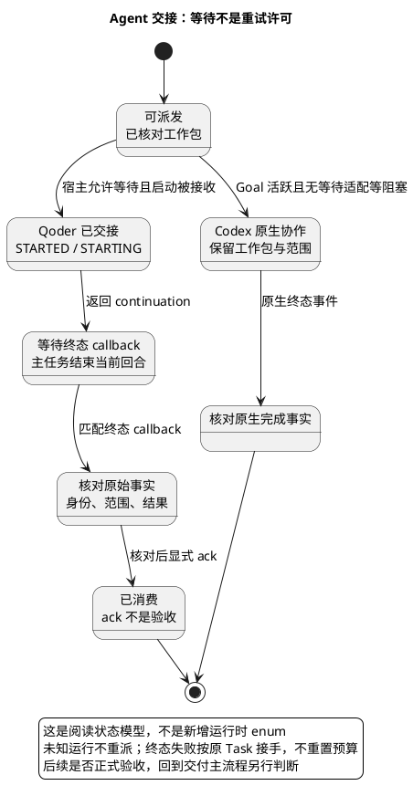

# 1. Agent workflow：可选委派与真实交接

> 位置：[工程地图](overview.md) → [开发交付 S1](change-delivery.md) → Agent 协作。前置是有界工作包和真实宿主身份，输出是可核对的执行事实；它不是独立验收的替代品。

## 1.1. 先分清执行与验收

Main 决定范围、owner 和验收方式；Agent 执行工作包；完成信号只通知 Main 去核对事实。核对后需要正式验收时，再进入独立 submit/validate/review/check，不让实现者自签。

图为阅读状态模型，不是新增 enum。Qoder 使用终态 callback；Codex 原生子代理使用协作事件，不要求 Qoder ack。两个路由共享工作包身份与范围，不共享未经证明的完成结论。

## 1.2. 派发前：先证明允许启动

读取 [policy](../../harness/agent-policy.manifest.yaml) 的 subagent_protocol、模型路由、qoder_delegation 与 agent_dispatch。Task identity、版本、owner、允许/禁止路径、所需上下文、产物、验收和检查命令必须明确。Catalog 存在时核对，不把无关 Catalog 漂移变成通用派发锁；planning-only 也不能冒充已经分解的 Task。

Qoder 使用 [delegation/qoder_cli.py](../../scripts/agents/delegation/qoder_cli.py) 的 preflight 读取资格快照；start/resume 仍在锁内复核。preflight 不分配 run、不证明在线账号健康，也不替代实际启动。Goal 活跃或无法证明宿主能等待外部 callback 时不启动 Qoder，按当前 policy 转入原生 Codex 路由；不改宿主数据库或暂停 Goal 绕过。

## 1.3. 启动与等待：未知不是失败

Qoder start/resume 返回 run_id、一次有界 startup_handshake 和 continuation。STARTED 表示已观察到绑定 started.json；STARTING 只是尚未观察到，不允许因此启动第二个执行器。只有实际持久化失败才按失败路由处理。

收到 `end-current-turn-await-callback`，父任务结束当前回合；不 sleep、主动轮询 status/result 或读取日志维持等待。外部 callback 必须绑定原父 Session；queued 不等于已交付到父任务。

占用拒绝区分当前可信 Session、同仓其他 Session、跨仓或未知占用。只有充分证据证明本 Session 已在途，才能等待该 callback；其他情况按结构化 next_action 处理，不能绕过写域冲突或 host-wide lease。精确锁与预算见[身份和运行事实](agent-workflow/identity.md)。

## 1.4. 完成与接手：先核对再消费

匹配终态 callback 到达后核对 Task/version、允许范围、身份、规范产物及执行证据。Qoder 的 `validate-result` 只核对结构，不能签发 Gate；核对后才显式 ack。重复已 ack/superseded 的 callback 不再派发或重验。

运行失败和调度失败分开：同轮两条调度路由都不可用才累计 policy 的连续失败；成功接单清连续计数但保留历史，未知启动不重派。预算耗尽时保持 Task identity，核对历史后选择合规接手，不改版本或删运行记录重置预算。

下一步：回到[交付 S2](change-delivery/verification.md)。定位失败见[排障](troubleshooting.md)；只查文件职责见 [Scripts Reference](reference/scripts.md)。
