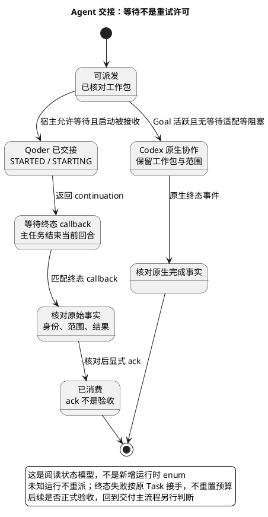

# 1. Agent workflow：可选委派与真实交接

> 位置：[工程地图](overview.md) → [开发交付 S1](change-delivery.md) → Agent 协作。前置是有界工作包和真实宿主身份，输出是可核对的执行事实；它不是独立验收的替代品。

## 1.1. 先分清执行与验收

Main 决定范围、owner 和验收方式；Agent 执行工作包；完成信号只通知 Main 去核对事实。核对后需要正式验收时，再进入独立 submit/validate/review/check，不让实现者自签。

```plantuml
@startuml
skinparam backgroundColor white
skinparam defaultFontName SansSerif
skinparam defaultFontSize 14
skinparam shadowing false
skinparam nodesep 40
skinparam ranksep 45
top to bottom direction
title Agent 交接：等待不是重试许可
state "可派发\n已核对工作包" as Ready
state "Qoder 已交接\nSTARTED / STARTING" as Handoff
state "等待终态 callback\n主任务结束当前回合" as Waiting
state "核对原始事实\n身份、范围、结果" as Checking
state "已消费\nack 不是验收" as Acked
state "Codex 原生协作\n保留工作包与范围" as Codex
state "核对原生完成事实" as Done
[*] --> Ready
Ready --> Handoff : 宿主允许等待且启动被接收
Ready --> Codex : Goal 活跃且无等待适配等阻塞
Handoff --> Waiting : 返回 continuation
Waiting --> Checking : 匹配终态 callback
Checking --> Acked : 核对后显式 ack
Codex --> Done : 原生终态事件
Done --> [*]
Acked --> [*]
legend bottom
这是阅读状态模型，不是新增运行时 enum
未知运行不重派；终态失败按原 Task 接手，不重置预算
后续是否正式验收，回到交付主流程另行判断
endlegend
@enduml
```

图为阅读状态模型，不是新增 enum。Qoder 使用终态 callback；Codex 原生子代理使用协作事件，不要求 Qoder ack。两个路由共享工作包身份与范围，不共享未经证明的完成结论。

## 1.2. 派发前：先证明允许启动

主线程在当前聊天直接展示交接，不只把状态写在工具输出或本机日志里。提示合同见 [policy 的 execution_progress.user_visible_dispatch](../../harness/agent-policy.manifest.yaml)：调用前说明执行器、工作包、目标和范围；调用后依据返回证据说明是否真正启动以及运行标识。比如“准备派发 Qoder，工作包 `<work_package_id>`，负责 Gradle 配置与直接测试”与“Qoder 已确认启动，run `<run_id>`；后台实施中，主线程等待终态通知，尚未验收”是不同阶段，不能提前宣称成功。启动拒绝或失败同样在聊天说明原因与接手路径；收到完成通知后再分别报告实施、自检、独立验收和 Git 交付。

读取 [policy](../../harness/agent-policy.manifest.yaml) 的 subagent_protocol、模型路由、qoder_delegation 与 agent_dispatch。Task identity、版本、owner、允许/禁止路径、所需上下文、产物、验收和检查命令必须明确。Catalog 存在时核对，不把无关 Catalog 漂移变成通用派发锁；planning-only 也不能冒充已经分解的 Task。

Qoder 使用 [delegation/qoder_cli.py](../../scripts/agents/delegation/qoder_cli.py) 的 preflight 读取资格快照；start/resume 仍在锁内复核。preflight 不分配 run、不证明在线账号健康，也不替代实际启动。Goal 活跃或无法证明宿主能等待外部 callback 时不启动 Qoder，按当前 policy 转入原生 Codex 路由；不改宿主数据库或暂停 Goal 绕过。

## 1.3. 启动与等待：未知不是失败

Qoder start/resume 返回 run_id、一次有界 startup_handshake 和 continuation。STARTED 表示已观察到绑定 started.json；STARTING 只是尚未观察到，不允许因此启动第二个执行器。只有实际持久化失败才按失败路由处理。

收到 `end-current-turn-await-callback`，父任务结束当前回合；不 sleep、主动轮询 status/result 或读取日志维持等待。外部 callback 必须绑定原父 Session；queued 不等于已交付到父任务。

占用拒绝区分当前可信 Session、同仓其他 Session、跨仓或未知占用。只有充分证据证明本 Session 已在途，才能等待该 callback；其他情况按结构化 next_action 处理，不能绕过写域冲突或 host-wide lease。精确锁与预算见[身份和运行事实](agent-workflow/identity.md)。

## 1.4. 完成与接手：先核对再消费

匹配终态 callback 到达后核对 Task/version、允许范围、身份、规范产物及执行证据。Qoder 的 `validate-result` 只核对结构，不能签发 Gate；核对后才显式 ack。重复已 ack/superseded 的 callback 不再派发或重验。

运行失败和调度失败分开：同轮两条调度路由都不可用才累计 policy 的连续失败；成功接单清连续计数但保留历史，未知启动不重派。预算耗尽时保持 Task identity，核对历史后选择合规接手，不改版本或删运行记录重置预算。

**工作包执行顺序**：实现者先确定最终 checkout 和输入，仅运行直接小回归（如 `tests.verification.test_development_efficiency`），不运行完整 adapter 全套或 development/Hook。完整 Hook 由独立 validator 在冻结输入后执行一次；若必要检查失败或阻塞，且源代码修复或相关输入/环境发生变化，则按冻结输入规则进行必要重验。只允许现有事务合同证明全部输入、配置、环境、窗口、runner 与 context 相同的事务内成功复用，禁止跨交付复用。实现者可进行直接静态、编译和目标测试自检，不得替代独立完整 Hook。长事件使用原生等待，日志仅在有信息的事件或终态读取。完整验证状态按实际记录报告。共享规则见 [policy validation_efficiency](../../harness/agent-policy.manifest.yaml)。详见[交付 Hook §1.5](change-delivery/hooks.md)。

下一步：回到[交付 S2](change-delivery/verification.md)。定位失败见[排障](troubleshooting.md)；只查文件职责见 [Scripts Reference](reference/scripts.md)。

## 1.5. 原生验收与新任务例外

验证与审查由当前父任务下不同的原生子代理承担；共享 Session 可接受，但 actor 必须来自真实原生元数据。实现者可做静态/编译/测试自检，不得自签正式验证或审查。Codex 内部委派用 `spawn_agent`；Qoder 优先用于实现，不是原生验收前置。

新任务仅作例外兜底：至少两轮不同子代理针对当前输入验证 PASS、对应 Hook 仍阻塞，并有定向修复及当前任务能力边界证据。父任务说明报告 locator、阻塞层和边界后，须获用户明确授权；身份报错、缺环境、业务测试失败或未知运行本身均不构成理由。新任务仍遵守相同 Hook 和冻结输入，不得跳检。

Codex 委派默认 Luna：常规工作包 low，其他 medium；只有具体复杂性、失败或未覆盖风险才升级 Sol/high。调用时显式传 `model` 与 `reasoning_effort`；例外 `create_thread` 显式传 `model`/`thinking` 并核对实际模型，不以提示词、角色或默认 Astra 代替。99.9% 是设计目标，不是实测路由指标。
