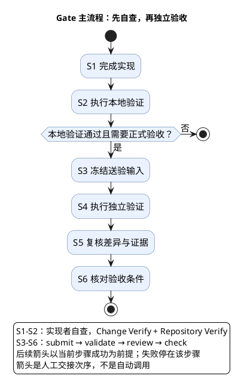

# 1. 开发交付：从实现到可信验收

> 位置：[文档首页](../README.md) → [工程地图](overview.md) → 开发交付。先读本页建立阶段关系，再进入 Verify 或 Acceptance；精确参数到 Reference 查阅。

日常 **Verify** 回答“这些输入是否通过检查”；正式 **Acceptance** 回答“同一冻结输入是否经过独立验证、审查及依赖/批准核对”。它们复用检查能力，不共享身份结论。一次 Agent 执行完成不等于验收通过。

## 1.1. 先看交付主干

图中的箭头是交接顺序，不表示前一个 CLI 自动调用下一个。日常工作不需要正式验收时，止于本地自查；本地检查失败则停在对应问题，不能把“结束”理解成 PASS。正式链的后续操作以当前步骤满足要求为前提。

| 阶段 | 要解决的问题 | 入口与交接 | 深入阅读 |
| --- | --- | --- | --- |
| S1 实现 | 谁负责本次范围？ | 人工或 Agent 产出代码与真实执行事实 | [可选 Agent workflow](agent-workflow.md) |
| S2 本地 Verify | 改动与完整基线分别证明什么？ | Change/Repository report | [选择、执行与报告](change-delivery/verification.md) |
| S3 submit | 哪些输入与哪个 producer 被送验？ | submission | [正式 Acceptance](change-delivery/acceptance.md#12-submit冻结送验输入) |
| S4 validate | 独立身份是否执行了相同输入的检查？ | validation record | [独立验证](change-delivery/acceptance.md#13-validate执行独立验证) |
| S5 review | 差异与证据是否支持结论？ | review record | [独立审查](change-delivery/acceptance.md#14-review复核差异与证据) |
| S6 check | receipt、依赖和用户批准是否满足？ | check record | [条件核对](change-delivery/acceptance.md#15-check核对条件而非重跑) |

## 1.2. 哪些不是主干阶段

文档链接、格式和 policy projection 是模块检查里的 **standalone checker**，无需把每项都画成新的阶段。缺环境、身份冲突、输入漂移和缺批准会阻止交接，因此必须从主干进入[排障页](troubleshooting.md)。

`status` 是已有 submission 的观察入口，不是 S7。Hook 安装和 skill 链接是有副作用的本机维护，不是编辑或提交的许可步骤。日常 Verify 不读取 Task identity，不签发正式 receipt，也不阻断 commit。

## 1.3. 从本次工作开始

先确认最终 diff、他人修改与本次负责范围，不在编辑前预锁文件。完成时执行 Change Verify 并阅读 scope_review，再执行 Repository Verify；前者不覆盖后者，二者也不代替正式独立验证。

完整原生检查被聚合入口包含时，不再机械补跑每个子任务。正式 validate 由独立身份执行，不能为了节省成本改用实现者旧报告。review/check 不运行交付命令。

下一步：进入 [Verify](change-delivery/verification.md)。需要准备环境时进入[隔离验证环境](operations/verification-environment.md)；只查某个工具时进入 [Reference](reference.md)。
