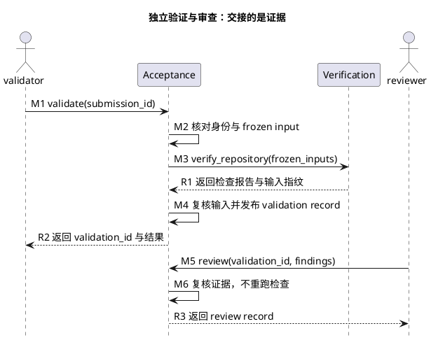

# 1. Acceptance：独立身份与证据交接

> 位置：[工程地图](../overview.md) → [开发交付 S3–S6](../change-delivery.md) → Acceptance。前置是可送验 Task、PASS Change report 和真实 producer；各阶段只发布自己的 record。

## 1.1. 先理解谁执行、谁审查



图只展开正常的 validate/review 交接。producer 未画入图；validator 须独立于 producer/submitter，reviewer 须独立于 producer/validator。身份由真实 runtime 来源证明，不能填写 actor 字符串代替。

## 1.2. submit：冻结送验输入

实现者确认范围后送验。该操作读取报告、Task 要求和 producer 事实，不自动完成后续验证：

```bash
python3 -m scripts.acceptance submit --task-id <id> --change-report-id <uuid> --confirm-scope-report-id <uuid>
```

[submit.py](../../../scripts/acceptance/submit.py) 绑定 Task/version/dependencies、固定检查要求、冻结闭包、diff、文件快照与来源。委派实现可给 `--producer-run-id`，但只用于核对真实原始事实；不能提供自报 actor/session/descriptor。Task 缺 required_check_ids 时失败关闭，不当成空列表。

输出 submission_id 后交给独立 validator。缺失或漂移的报告不能用历史 PASS 补齐。

## 1.3. validate：执行独立验证

在真实独立 Session 中执行以下操作，不与 producer 的命令拼成“一键验收”：

```bash
python3 -m scripts.acceptance validate --submission-id <uuid>
```

[validate.py](../../../scripts/acceptance/validate.py) 按顺序读取 submission、核对身份独立性、producer 和 frozen input，再调用 Verification 的公共 API。执行后再次核对输入，发布 validation report/record；缺项与未执行不得 PASS，也不签发 review。

它使用 [authority.py](../../../scripts/acceptance/authority.py) 核对来源、[requirements.py](../../../scripts/acceptance/requirements.py) 核对 Task、[records.py](../../../scripts/acceptance/records.py) 安全读写记录。私有 helper 的共享现状见 [Scripts Reference](../reference/scripts.md)，不是让调用者绕过公开场景的许可。

## 1.4. review：复核差异与证据

独立 reviewer 阅读 frozen diff 和 validation evidence，形成真实 findings 后提交：

```bash
python3 -m scripts.acceptance review --submission-id <uuid> --validation-id <uuid> --findings-json <path> --decision <PASS|BLOCKED|FAIL>
```

[review.py](../../../scripts/acceptance/review.py) 消费明确审查意见，不替 reviewer 自动生成结论。它会重核冻结输入，但不运行交付命令。没有实际审查不能默认使用 PASS。

## 1.5. check：核对条件而非重跑

获得可信 validation/review 后，核对依赖和必要的用户批准：

```bash
python3 -m scripts.acceptance check --submission-id <uuid>
```

[check.py](../../../scripts/acceptance/check.py) 校验 receipt/hash DAG、当前 Task/dependency 和精确绑定的 approval。缺依赖或批准返回 BLOCKED，不发布永久失败的终态；条件补齐后可重核同一 submission。已有成功记录在当前性重验后幂等返回。系统不自动生成用户批准。

## 1.6. 记录、观察与失败去向

每层 record 在 ignored `tmp/quality/acceptance/` 原子、一次性发布。重复 JSON key、路径异常、非普通文件、竞争记录、hash 或绑定输入变化均不能当作可信证据。历史 record 不因任意短 TTL 自动失效，但使用时必须重核绑定来源和内容。

`python3 -m scripts.acceptance status --submission-id <uuid>` 是只读观察入口，不推动链路。身份冲突、frozen input 漂移、readiness 缺失和 approval 缺失分别按[排障](../troubleshooting.md)处理，不统一归为“再跑一次”。工程 fixture 只能证明实现链路，不代替真实独立 Session。

上一阶段：[Verify](verification.md)。回到[交付主干](../change-delivery.md)，或按需查[记录模板](../reference/record-template.md)。
