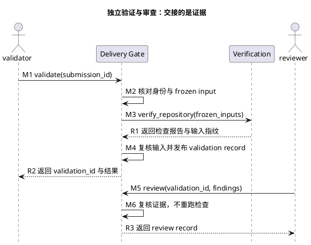

# 1. Delivery Gate：独立身份与证据交接

> 位置：[工程地图](../overview.md) → [开发交付 S3–S6](../change-delivery.md) → Delivery Gate。前置是可送验 Task、PASS Change report 和真实 producer；各阶段只发布自己的 record。

这里的 Delivery Gate 指“正式交付证据受理与判定”，不是产品功能的人工验收测试，也不是一键测试脚本。`scripts/delivery_gate/` 把送验、独立验证、独立审查、条件核对分成四个场景；`authority.py` 只是从原生任务和子代理元数据读取并复核证据签发者身份的内部 helper，不管理用户账号、权限或角色库。目录名直接表达独立交付门禁；阅读时应先看四个公开动作，再看身份和记录实现。

## 1.1. 先理解谁执行、谁审查



图只展开正常的 validate/review 交接。producer 未画入图；validator 须独立于 producer/submitter，reviewer 须独立于 producer/validator。原生子代理可共享父 Session，分工由不同 thread/actor 识别，不增加独立 Session 认证。身份直接来自原生元数据，不能填写 actor 字符串代替。

## 1.2. submit：冻结送验输入

实现者确认范围后送验。该操作读取报告、Task 要求和 producer 事实，不自动完成后续验证：

```bash
python3 -m scripts.delivery_gate submit --task-id <id> --change-report-id <uuid> --confirm-scope-report-id <uuid>
```

[submit.py](../../../scripts/delivery_gate/submit.py) 绑定 Task/version/dependencies、固定检查要求、冻结闭包、diff、文件快照与来源。委派实现可给 `--producer-run-id`，但只用于核对真实原始事实；不能提供自报 actor/session/descriptor。Task 缺 required_check_ids 时失败关闭，不当成空列表。

输出 submission_id 后交给独立 validator。缺失或漂移的报告不能用历史 PASS 补齐。

## 1.3. validate：执行独立验证

由当前父任务下未参与实现的原生验证子代理执行以下操作，不要求独立宿主 Session，不与 producer 的命令拼成“一键验收”：

```bash
python3 -m scripts.delivery_gate validate --submission-id <uuid>
```

[validate.py](../../../scripts/delivery_gate/validate.py) 按顺序读取 submission、核对执行者角色分工、producer 和 frozen input，再调用 Verification 的公共 API。执行后再次核对输入，发布 validation report/record；缺项与未执行不得 PASS，也不签发 review。

它使用 [authority.py](../../../scripts/delivery_gate/authority.py) 核对来源、[requirements.py](../../../scripts/delivery_gate/requirements.py) 核对 Task、[records.py](../../../scripts/delivery_gate/records.py) 安全读写记录。私有 helper 的共享现状见 [Scripts Reference](../reference/scripts.md)，不是让调用者绕过公开场景的许可。

## 1.4. review：复核差异与证据

独立 reviewer 阅读 frozen diff 和 validation evidence，形成真实 findings 后提交：

```bash
python3 -m scripts.delivery_gate review --submission-id <uuid> --validation-id <uuid> --findings-json <path> --decision <PASS|BLOCKED|FAIL>
```

[review.py](../../../scripts/delivery_gate/review.py) 消费明确审查意见，不替 reviewer 自动生成结论。它会重核冻结输入，但不运行交付命令。没有实际审查不能默认使用 PASS。

## 1.5. check：核对条件而非重跑

获得可信 validation/review 后，核对依赖和必要的用户批准：

```bash
python3 -m scripts.delivery_gate check --submission-id <uuid>
```

[check.py](../../../scripts/delivery_gate/check.py) 校验 receipt/hash DAG、当前 Task/dependency 和精确绑定的 approval。缺依赖或批准返回 BLOCKED，不发布永久失败的终态；条件补齐后可重核同一 submission。已有成功记录在当前性重验后幂等返回。系统不自动生成用户批准。

同一依赖 Task/version 的失败或未完成送验会保留；依赖解析只采用唯一完整 PASS 验收链，不按时间选择最新记录。多个 PASS 链、已存在记录损坏或重复、身份与绑定哈希异常仍阻断；被采用的 check 必须绑定实际 validation/review，并递归核对嵌套依赖 receipt。零条完整 PASS 链不构成依赖满足。

## 1.6. 只读消费既有 PASS

发行证据消费者使用以下只读入口，不调用可能新签发 check 的条件核对动作：

```bash
python3 -m scripts.delivery_gate consume-existing --submission-id <uuid>
```

`consume_existing_pass` 必须找到唯一已存在的完整 submission、validation、review、check 链，并重核当前冻结输入、authority、内容哈希、依赖及必要批准。缺 check 返回 BLOCKED，不创建目录、不补签 receipt、不运行交付命令。成功只返回该链的身份、内容哈希及绑定的 validation report descriptor；它本身不是新的验收阶段，也不证明任意候选已运行。

`consume-candidate --submission-id <uuid> --candidate-directory /absolute/candidate` 在同一只读链上继续核对完整 baseline 报告、唯一实际候选 Check 的 stdout 与实际候选目录字节。候选摘要及完整身份来自报告附件，不由调用者指定；当前干净源码也必须一致。它不补签或重跑交付检查，输出不等于公开发布许可。

候选晋升还必须从该报告绑定的检查输出取得同一候选摘要与运行证据，不得另传无关候选拼接 PASS。普通 Actions 不需要伪造当前 validator/reviewer，但必须能验证既有原生来源；跨宿主原 authority proof 不可核验时仍阻断。

<a id="16-记录观察与失败去向"></a>

## 1.7. 记录、观察与失败去向

每层 record 在 ignored `tmp/quality/delivery-gate/` 原子、一次性发布。重复 JSON key、路径异常、非普通文件、竞争记录、hash 或绑定输入变化均不能当作可信证据。历史 record 不因任意短 TTL 自动失效，但使用时必须重核绑定来源和内容。

`python3 -m scripts.delivery_gate status --submission-id <uuid>` 是只读观察入口，不推动链路。身份冲突、frozen input 漂移、readiness 缺失和 approval 缺失分别按[排障](../troubleshooting.md)处理，不统一归为“再跑一次”。工程 fixture 只能证明实现链路，不代替真实原生子代理的验证和审查。

上一阶段：[Verify](verification.md)。回到[交付主干](../change-delivery.md)，或按需查[记录模板](../reference/record-template.md)。
