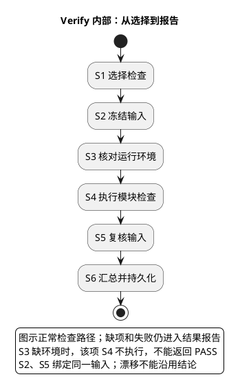
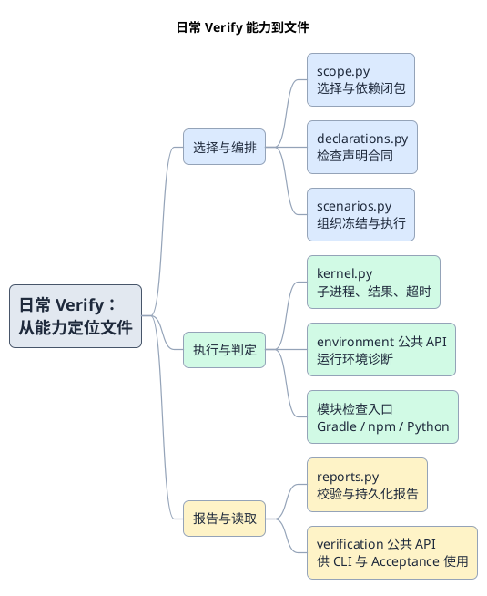

# 1. Verify：选择、执行与报告

> 位置：[工程地图](../overview.md) → [开发交付 S2](../change-delivery.md) → Verify。前置是实际源码和检查声明；输出是 verification report，不是正式 receipt。

## 1.1. 两个入口共享一个执行内核

Change Verify 按 diff 选择 `change-targeted` 检查；Repository Verify 执行 `repository-baseline`。没有 diff 时，当前 Change 入口会选择全部声明，不会把“工作区干净”当成无需验证。

先执行变更自查，阅读选中原因、覆盖缺口和 scope_review：

```bash
python3 scripts/check_changes.py
```

再检查完整仓库基线；不读取 Task、身份或批准记录：

```bash
python3 scripts/check_repository.py
```

Change 的 base 优先使用显式 `--base`，否则取上游 merge-base，再否则取 HEAD。`--expected-path` 仅用于范围自审，不授予编辑权限。Repository 的 `--check-id` 可定向诊断，但部分选择不构成完整仓库 PASS。

## 1.2. 从阶段到子能力



冻结前选定完整检查闭包；执行前后和结束时核对输入。单个检查缺运行环境时不执行其命令，仍汇总 BLOCKED。命令失败、覆盖不足、输入漂移均不能被其他检查的成功抵消。



## 1.3. 从子能力定位文件

- [check_changes.py](../../../scripts/check_changes.py)、[check_repository.py](../../../scripts/check_repository.py)：薄 CLI，解析参数、调用公开场景、持久化报告；不理解测试类。
- [declarations.py](../../../scripts/verification/declarations.py)：加载 module-checks，验证声明与 result contract；不执行模块。
- [scope.py](../../../scripts/verification/scope.py)：diff、triggers、依赖闭包与覆盖。要问“为何这个文件触发另一个模块”，从这里查。
- [scenarios.py](../../../scripts/verification/scenarios.py)：组织选择、冻结、执行和最终复核。它负责顺序，不替模块编写检查规则。
- [Environment API](../../../scripts/environment/__init__.py)：诊断必需运行环境及受控子进程变量，不安装依赖。
- [kernel.py](../../../scripts/verification/kernel.py)：进程、超时、输出 artifact 与 result contract。Java 内容只由 Gradle 检查。
- [reports.py](../../../scripts/verification/reports.py)：报告完整性与不可变持久化。外部从 [public API](../../../scripts/verification/__init__.py) 读取，而不是信任手写 PASS JSON。

完整内部职责表见[Scripts Reference](../reference/scripts.md)。模块的直接测试见 `tests/verification/`；它们证明引擎行为，不代表所有产品检查都已运行。

## 1.4. 去重、结果和交接

同次验证中，命令、配置及输入闭包相同的检查可以只执行一次，结果映射到相应 check ID；不能仅按命令字符串去重，也不能复用旧报告冒充独立验证。

报告在 ignored `tmp/quality/verification-reports/`。`PASS` 只证明该报告冻结的输入；必需环境缺失是 `BLOCKED`，检查断言或输入冲突是 `FAIL`。未执行、skip、零测试和缺失结果不能 PASS。具体 code 以结果字段为准，定位步骤见[排障](../troubleshooting.md)。

下一步：需要正式验收时进入 [submit](acceptance.md#12-submit冻结送验输入)，并交出可核验的 Change report；否则回到[交付主干](../change-delivery.md)完成本地自查说明。

同一能力的 baseline/change 声明应维护相同执行 contract。去重键包含 result_contract，连 completeness_guarantee 说明的漂移也会使同一命令重复执行；只比较命令文本并不充分。
