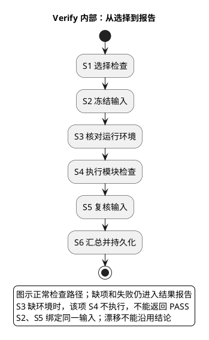
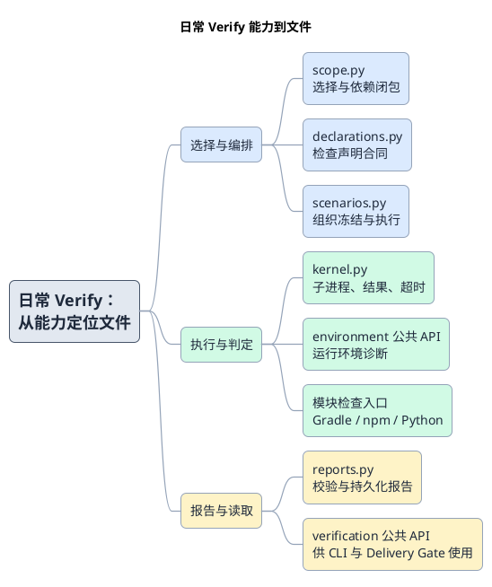

# 1. Verify：选择、执行与报告

> 位置：[工程地图](../overview.md) → [开发交付 S2](../change-delivery.md) → Verify。前置是实际源码和检查声明；输出是 verification report，不是正式 receipt。

## 1.1. 风险驱动的开发入口与完整基线

公开日常开发入口按真实 diff、文件内容和闭包自动评估风险，不接受 root、base、check ID 或风险覆盖参数：

```bash
python3 -m scripts.verification.development
```

机械或局部功能改动执行 `development-change`（按变更触发检查）；高风险工程改动额外执行 `development-baseline`。分类取决于真实 diff/闭包和内容，不信任 Task 名称。高风险不等于正式发行验证。

完整 Change/Repository Verify 原语仍供显式完整基线与发行 CI 使用：Change Verify 按 diff 选择 `change-targeted` 检查；Repository Verify 执行 `repository-baseline`。它们不是每项日常开发的无条件要求。无 diff 时，旧 Change Verify 会选择全部声明，不把“工作区干净”当成无需验证。

需要显式完整 Change 自查时，阅读选中原因、覆盖缺口和 scope_review：

```bash
python3 scripts/check_changes.py
```

再检查完整仓库基线；不读取 Task、身份或批准记录：

```bash
python3 scripts/check_repository.py
```

比较基线与风险/检查闭包由开发入口固定并冻结。定向诊断只用于定位；开发自检、完整 Verify 与正式 Gate 的 PASS 各自绑定不同输入和证明范围，不可互代。

### 1.1.1. 日常功能研发不等待正式发行

执行边界以 [Harness](../../../harness/README.md#执行边界) 为准。功能开发阶段先取得相关模块反馈，不必先完成 ZIP、镜像、双架构发布或真实资料分发验收；源码启动与扩展加载见[本地体验](../operations/local-experience.md)。

开发入口自动推导所需范围；需要定位单个模块问题时，可使用诊断入口：

```bash
# 后端完整模块检查；仍需要 Java 25 和隔离 PostgreSQL/Redis 测试环境。
.local/lexiflow-python/bin/python -m scripts.verification.diagnose repository --check-id eng.backend.delivery

# 扩展质量检查；声明依赖会同时纳入后端检查，不是仅做前端单测。
.local/lexiflow-python/bin/python -m scripts.verification.diagnose repository --check-id eng.extension.quality
```

测试环境按[验证环境](../operations/verification-environment.md)准备，不能接入真实用户数据库。诊断不会自动安装依赖，也不会因为缺少环境而跳过所选模块的必需检查。

诊断仅用于定位，不证明发布可用；报告须说明实际范围，不可作为完整 Verify 报告。正式发行检查由 Task `required_check_ids` 命中 `harness/ci-policy.yaml` formal check 集合触发，并仍执行完整 Repository baseline。

## 1.2. 从阶段到子能力


```plantuml
@startuml
skinparam backgroundColor white
skinparam defaultFontName SansSerif
skinparam defaultFontSize 14
skinparam shadowing false
skinparam nodesep 40
skinparam ranksep 45
title Verify 内部：从选择到报告
start
:S1 选择检查;
:S2 冻结输入;
:S3 核对运行环境;
:S4 执行模块检查;
:S5 复核输入;
:S6 汇总并持久化;
stop
legend bottom
图示正常检查路径；缺项和失败仍进入结果报告
S3 缺环境时，该项 S4 不执行，不能返回 PASS
S2、S5 绑定同一输入；漂移不能沿用结论
endlegend
@enduml
```

冻结前选定完整检查闭包；执行前后和结束时核对输入。单个检查缺运行环境时不执行其命令，仍汇总 BLOCKED。命令失败、覆盖不足、输入漂移均不能被其他检查的成功抵消。

声明源码通过仓库目录描述符逐层读取，不跟随文件或祖先目录的符号链接；特殊文件、私有配置入口及读取期间的身份变化均拒绝。文件快照绑定相对路径、内容摘要、字节数和执行位，缺失或不安全输入不能冻结为 PASS。报告消费时重新核对完整快照，不能仅保留指纹而改写文件描述。这是声明输入的安全读取合同，不证明构建的实际读取闭包、外部候选或跨主机来源已经完整绑定。

同窗多 profile 仅在输入、配置、环境、window、runner 和 context 一致时可复用；未知副作用默认不可复用，跨视图须显式 `transaction_reuse=true`。runtime transport、失败及跨交付结果不复用；自检不复用为 Formal validation，同视图 alias 保持原语义。

跨视图工具身份由共用 Environment helper 解析：绑定实际解释器、声明工具在子进程 PATH 中的解析目标、真实路径及内容摘要，而不只比较 PATH 字符串。有限能力 `python-package-yaml`、`posix-lock-tool`、`sha256-tool` 分别绑定实际 PyYAML 包、当前平台锁工具和脚本所选摘要工具。执行前后与报告消费时重新核对；工具或包字节变化、来源日志损坏、输入漂移均不能投影旧 PASS。只记录身份描述与摘要，不记录秘密环境值；这不等于任意外部服务或所有操作系统状态的认证。

声明工具与冻结源码必须覆盖测试实际读取；合成 fixture 的私有输出若只在同一检查内消费，并不天然要求每个视图重跑。真实服务、浏览器安装或未完整绑定的质量工具依赖保持不可复用，不能仅凭测试名称放行。


```plantuml
@startmindmap
skinparam backgroundColor #FFFFFF
skinparam shadowing false
<style>
mindmapDiagram {
  node {
    FontColor #1E293B
    FontSize 14
    LineColor #94A3B8
    LineThickness 1
    RoundCorner 12
    Padding 10
    Margin 8
    MaximumWidth 180
  }
  rootNode {
    FontSize 18
    FontStyle bold
    LineColor #475569
  }
  arrow {
    LineColor #94A3B8
    LineThickness 1.2
  }
}
</style>
title 日常 Verify 能力到文件

+[#E2E8F0] 日常 Verify：从能力定位文件
++[#DBEAFE] 选择与编排
+++[#DBEAFE] scope.py\n选择与依赖闭包
+++[#DBEAFE] declarations.py\n检查声明合同
+++[#DBEAFE] scenarios.py\n组织冻结与执行
++[#D1FAE5] 执行与判定
+++[#D1FAE5] kernel.py\n子进程、结果、超时
+++[#D1FAE5] environment 公共 API\n运行环境诊断
+++[#D1FAE5] 模块检查入口\nGradle / npm / Python
++[#FEF3C7] 报告与读取
+++[#FEF3C7] reports.py\n校验与持久化报告
+++[#FEF3C7] verification 公共 API\n供 CLI 与 Delivery Gate 使用
@endmindmap
```

## 1.3. 从子能力定位文件

- [check_changes.py](../../../scripts/check_changes.py)、[check_repository.py](../../../scripts/check_repository.py)：薄 CLI，解析参数、调用公开场景、持久化报告；不理解测试类。
- [declarations.py](../../../scripts/verification/declarations.py)：加载 module-checks，验证声明与 result contract；不执行模块。
- [scope.py](../../../scripts/verification/scope.py)：diff、triggers、依赖闭包与覆盖。要问“为何这个文件触发另一个模块”，从这里查。
- [scenarios.py](../../../scripts/verification/scenarios.py)：组织选择、冻结、执行和最终复核。它负责顺序，不替模块编写检查规则。
- [Environment API](../../../scripts/environment/__init__.py)：诊断必需运行环境及受控子进程变量，不安装依赖。
- [kernel.py](../../../scripts/verification/kernel.py)：进程、超时、输出 artifact 与 result contract。Java 内容只由 Gradle 检查。
- [input_snapshot.py](../../../scripts/verification/input_snapshot.py)：以不跟随链接的目录描述符读取声明源码，绑定字节和执行位并拒绝读取竞态；由既有内核调用，不是独立 Gate 或公开命令。
- [reports.py](../../../scripts/verification/reports.py)：报告完整性与不可变持久化。外部从 [public API](../../../scripts/verification/__init__.py) 读取，而不是信任手写 PASS JSON。

完整内部职责表见[Scripts Reference](../reference/scripts.md)。模块的直接测试见 `tests/verification/`；它们证明引擎行为，不代表所有产品检查都已运行。

## 1.4. 去重、结果和交接

同次验证中，命令、配置及输入闭包相同的检查可以只执行一次，结果映射到相应 check ID；不能仅按命令字符串去重，也不能复用旧报告冒充独立验证。

报告在 ignored `tmp/quality/verification-reports/`。`PASS` 只证明该报告冻结的输入；必需环境缺失是 `BLOCKED`，检查断言或输入冲突是 `FAIL`。未执行、skip、零测试和缺失结果不能 PASS。具体 code 以结果字段为准，定位步骤见[排障](../troubleshooting.md)。

下一步：需要正式验收时进入 [submit](delivery-gate.md#12-submit冻结送验输入)，并交出风险绑定的开发验证报告；否则回到[交付主干](../change-delivery.md)记录实际自查范围。

baseline/change 声明须保持相同执行 contract；去重键含 result_contract，故 completeness_guarantee 漂移也会触发重跑，不能只比较命令文本。

## 1.5. 交付触发与语言检查

完成实现后统一运行上述入口，不在每次工具调用后重复扫描。backend 变更选择 Gradle deliveryFull，保留 Spotless、Checkstyle、PMD、Java source/Javadoc、架构与业务测试；scripts 变更选择 Ruff、Pylint 中文 docstring 检查和模块测试。规则真源分别是 [python-quality.toml](../../../harness/python-quality.toml) 与 [python-docstrings.toml](../../../harness/python-docstrings.toml)，工具与环境固定在 requirements-dev。

交付 Hook 自动执行上述 Verify 并返回真实结果，但不替代检查声明、结果语义约束或独立正式验收；启用、阶段边界与恢复方式见[交付 Hook](hooks.md)。
