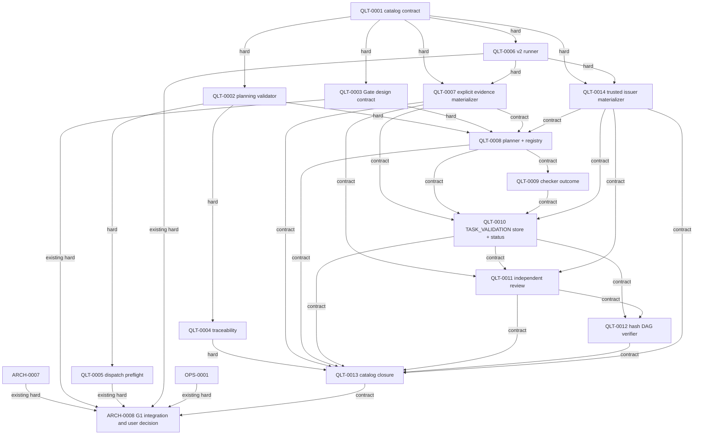

# LexiFlow Gate Control Plane 设计合同

> Catalog task: `LF-TSK-QLT-0003@4` / change `2.1.0`
> Deliverable: Architecture Gate contract
> Evidence: frozen-input plan and immutable receipt example
> Status: current design contract; implementation and catalog receipts remain separately validated

## 1. 任务边界

本文只定义 G1 所需的 Gate 控制面合同：唯一 CLI、纯 plan compiler、显式 registry、`run` 与 `status` 语义、三态聚合、不可覆盖 receipt、issuer provenance，以及 current-input evidence chain。它给后续原子实现任务提供稳定接口，不在 `LF-TSK-QLT-0003@4` 内交付 CLI、store、checker、review workflow 或 bootstrap migration。V3 保持唯一执行层，并通过 current execution evidence contract 采用实例身份隔离：`TASK_VALIDATION` 执行交付检查，`INDEPENDENT_REVIEW` 与 `CATALOG_DECISION` 只消费不可变 evidence/receipt。

当前 catalog 对本任务的要求是 45 分钟的“Define G1 plan, run, status, and receipt semantics”，唯一 hard dependency 为 `LF-TSK-QLT-0001@1/1.0.0`。本任务的完成证据是本文中的合同、最小完整 frozen-input plan 示例和 immutable receipt 示例，不是一个可执行控制面。

本文不改变 Harness handoff schema，不实现 Qoder runner，不做 dispatch 并发判断，也不进入 Phase 2+ 产品设计。现有职责保持：

- `LF-TSK-QLT-0002`：planning catalog 的 schema、ID、owner、typed dependency 与 DAG 验证；
- `LF-TSK-QLT-0004`：acceptance-case traceability contract；
- `LF-TSK-QLT-0005`：派发前 candidate 与 active task 的 owner、file claim、write overlap 与 contract writer 冲突判定；
- `LF-TSK-QLT-0006@3/2.1.0`：runner identity、raw completion lifecycle、completion-before-callback、单 Qoder run 与 300/600 秒 watchdog；它不负责把 Qoder 输出解释为六个结果字段；
- 后续 JIT Gate tasks：本文定义的 compiler、registry、execution、receipt store、review chain 与 G1 integration。

## 2. 唯一 CLI 与控制流

### 2.1 Public surface

唯一公开入口固定为：

```text
python3 scripts/gates/cli.py plan --mode incremental|full [--evidence-packet <repo-relative-path>] [--issuer-packet <repo-relative-path>]
python3 scripts/gates/cli.py run --mode incremental|full [--evidence-packet <repo-relative-path>] [--issuer-packet <repo-relative-path>]
python3 scripts/gates/cli.py status --run-id <uuid>
```

`plan` 与 `run` 必须获得两个显式 packet locator。调用方可以传 flags，也可以由受信 Main Agent/CI launcher 各绑定一个环境变量：`LEXIFLOW_GATE_EVIDENCE_PACKET` 与 `LEXIFLOW_GATE_ISSUER_PACKET`。值只能是单个 repo-relative path；flag 与环境同时出现时必须逐字相等，否则 `FAIL/evidence-context-conflict`；任一 locator 缺失时 `FAIL/missing-evidence-context`。不得从 `latest`、目录扫描、文件时间、多个候选或进程身份推断 packet。这样 `harness/manifest.yaml` 与 `AGENTS.md` 已声明的精确 `run --mode incremental` 命令可由 launcher 注入本次 locator 后执行，同时 CLI flags 为人工复现保留可见路径。Compiler 冻结两个 packet 的 locator/hash，run 再把同一 issuer packet 绑定到 process identity。

`--receipt-kind TASK_VALIDATION|INDEPENDENT_REVIEW|CATALOG_DECISION` 可显式指定；省略时为 `TASK_VALIDATION`。内部 checker 不提供第二套交付入口，只能通过显式 registry 由 `run` 调用。Main Agent/CI 先通过 `QLT-0007` 与 `QLT-0014` materializers 得到本次不可变 packet paths，再绑定环境或传入 flags；不同 receipt kind 使用对应授权的 issuer packet。

实现按 dependency 串行扩展同一个入口：`QLT-0010` 先交付稳定的 receipt-kind handler/store 接口和 `TASK_VALIDATION` route，尚未安装的 kind 明确 `FAIL/unsupported-receipt-kind`；`QLT-0011` 在其 current dependency PASS 后向同一 `cli.py` 安装 `INDEPENDENT_REVIEW` route；`QLT-0013` 最后安装 `CATALOG_DECISION` route。三个 task 对 `cli.py` 的 write claim 因 hard/contract dependency 严格串行，dispatch preflight 必须拒绝并发 claim；不得创建第二个 CLI 或靠 import side effect 注册。

| 命令 | 副作用 | 身份 | 输出 |
|---|---|---|---|
| `plan` | 零副作用；不写 plan、receipt、pointer、event 或 lifecycle 文件，不执行 checker | 不生成 `plan_id` 或 `run_id` | stdout 输出 canonical plan JSON 与 `content_fingerprint` |
| `run` | 复用同一个纯 plan compiler并持久化实际 plan；只有 `TASK_VALIDATION` 执行 selected checks，review/catalog 只验证不可变 evidence/receipt | 每次生成新的 `run_id` | `PASS`、`BLOCKED` 或 `FAIL` |
| `status` | 单次只读；不等待、不 retry、不 resume、不重新判定 | 必须显式提供 `run_id` | 根据 start event 或 final receipt 返回 `RUNNING` 或 `FINALIZED` |

本合同不保留 `run --plan-file`，因此没有 mode/plan-file 歧义，也没有按 ID 复用 plan 的路径。将来若增加 `--plan-file`，它必须与 `--mode` 互斥，并在执行前验证其 `content_fingerprint` 与 current inputs；该扩展需单独 version CLI contract。

### 2.2 `plan` 与 `run` 使用同一 compiler

解析出唯一的 `E`/`P` 后，`plan --mode X` 和 `run --mode X` 必须调用同一个无写入的 `compile_plan(mode, receipt_kind, evidence_packet=E, issuer_packet=P)`。两个显式 packet 完整闭合 context；compiler 返回 canonical payload 与 fingerprint：

```text
same inputs + same registry + same policy -> same canonical plan
same canonical plan                       -> same content_fingerprint
each run                                  -> new run_id
```

`content_fingerprint` 是对 RFC 8785 JSON Canonicalization Scheme 产生的 UTF-8 payload 计算的 SHA-256。计算投影排除 fingerprint 自身、生成时间、输出位置和所有 Gate run identity。`run_id` 只标识一次执行，不进入 fingerprint；不得用 fingerprint 充当 run identity，也不得用 run ID 改变相同内容的 fingerprint。

### 2.3 `run` 的可观察顺序

`run --mode X --evidence-packet E --issuer-packet P` 的合同顺序为：

1. 使用纯 compiler 生成本次实际 canonical plan；
2. 验证 plan 与 current inputs，生成唯一 `run_id`；
3. 在该 run 下持久化实际 plan 的精确 bytes；
4. 在启动任何 checker **之前**，写入并 flush 一个结构化 start event；
5. 将同一 `START` event 的 `run_id` 与 event locator 以单行 JSON 写到 stderr 并 flush，使调用方在 checker 开始前取得 `status --run-id` 的精确地址；
6. 两次 flush 均成功后，`TASK_VALIDATION` 才按 frozen registry 执行 required checks；`INDEPENDENT_REVIEW` 与 `CATALOG_DECISION` 必须保持零 selected checks，并直接进入 evidence-consumption verifier；
7. 聚合交付检查结果或证据复核结果，并创建不可覆盖 final receipt。

Run store 使用确定性目录 `tmp/quality/runs/{run_id}/`；实际 plan、start event 与 final receipt 的唯一 locator 分别为 `plan.json`、`start.json`、`receipt.json`。`status --run-id` 只把经 UUID 验证的 ID 代入这三个固定路径，不扫描目录、不解析 `latest`、不跟随目录外 symlink。

Start event 至少包含 `schema_version`、`run_id`、`receipt_kind`、`content_fingerprint`、persisted plan locator/hash、trusted issuer packet locator/hash、process identity 和 `started_at`。stderr 的 `START` JSON 至少包含 `schema_version`、`event=START`、`run_id`、start-event locator/hash；不得输出 packet 内容或敏感值。无法持久化/flush disk event，或无法 emit/flush 调用方 event 时，均不得启动 checker，命令以 `FAIL/start-event-unavailable` 结束。调用方可以在同步 `run` 尚未返回时，用已收到的 `run_id` 单次查询状态；不需要扫描 run 目录。

`status --run-id` 先查 final receipt；存在且完整时返回 `FINALIZED` 与三态结果。否则读取已 flush 的 start event 并返回 `RUNNING`，不根据 PID、日志或时间推测结果。找不到、损坏或 identity/hash 不一致时 CLI 失败。本文不定义持久化 `PLANNED` 状态。

## 3. Frozen-input plan 合同

### 3.1 V1 必需字段

Schema 名称为 `lexiflow.gate-plan.v1`。Canonical payload 必须完整冻结：

1. `schema_version`、`mode` 与 `receipt_kind`；
2. 精确 `task_id`、`task_version`、`change_version` 与 `task_source` locator/hash；
3. generic explicit evidence packet locator/hash，以及它分别绑定的 raw task、raw completion、stdout、stderr、diff 和 test evidence hashes；
4. packet 中由 Main Agent 显式核对的六个 result fields 与 subject identity；
5. raw caller `allowed_files`/`forbidden_files` strings、normalized arrays、canonical file claims 和 changed/allowed/forbidden/claims 三方 reconciliation；
6. trusted issuer packet locator/hash；
7. consumed source、policy、agent/runtime manifest、task template、acceptance-case registry 与 registry entry locator/hash；
8. `execution.layer`、`checker_execution` 与 `source`；`TASK_VALIDATION` 还冻结 selected checks 的稳定 ID/version、owner、required 属性、selection reasons、declared command、command ID、fixed argv 与 registry entry hash，review/catalog 的 `checks` 必须为空；
9. acceptance criteria/evidence、effect checks 与 risks 的逐项预期映射；
10. 对以上 canonical payload 的 `content_fingerprint`。

路径使用 repo-relative POSIX 形式。输入必须保存存在状态与 SHA-256；目录输入展开为稳定排序的文件清单。Compiler 必须同时保存 caller 原始 scope strings 和解析后的 normalized arrays，canonical claims 也单独保存。Reconciliation 对 changed files、allowed/forbidden arrays 与 claims 做三方检查：每个 changed file 必须 allowed、不得 forbidden、且必须有 claim；每个 claim 必须完全落在 allowed scope 内且不与 forbidden scope 相交。`claims_outside_allowed` 或 `claims_intersecting_forbidden` 非空就是 caller scope 与 claims 冲突，plan 为 FAIL。`run` 针对 plan 中冻结的 bytes 执行，current bytes 与 hash 不一致时为 `FAIL/input-drift`。

### 3.2 Generic explicit evidence packet

Gate 不改变 Qoder Harness 的 14 个 caller fields。Qoder caller schema 保持：

```text
goal, task_id, task_source, task_version, change_version,
allowed_files, forbidden_files, required_context, expected_output,
acceptance_criteria, acceptance_evidence, validation_command,
failure_policy, parent_client
```

Codex Sub-Agent 不伪装成 Qoder Task。一个工作包仍使用 `harness/agent-policy.manifest.yaml` 已声明的 package caller contract；进入 Gate 时，为包内每个目标 Task 保存一个 `lexiflow.codex-work-package-task-projection.v1` raw task。投影顶层精确绑定 `work_package_id`、原顺序且至少两项的 `task_ids[]`、`target_task_id == task_id`、目标 Task/version/source/scope/acceptance/validation、完整嵌套 `caller_contract` 和 runner identity。`task_versions`、`change_versions`、`expected_outputs_by_task`、`acceptance_by_task` 与 `validation_commands` 的 keyset 必须精确等于 `task_ids[]`，目标项必须和顶层投影一致。Caller contract 不含 runner identity；`parent_session_id`、`agent_id`、`run_id`、`session_id` 与 `client=codex` 只在运行时绑定。精确字段集拒绝 `permission_mode`、`_resume_mode`、`title` 或其他 Qoder 字段夹带。

Materializer 接受 `client=qoder|codex` 并拒绝其他 client。两种 client 都必须通过相同 raw task/completion、packet identity 和 task identity 对账；Codex raw task 另外验证稳定 package identity、ordered Task membership、target、caller/target mapping 和 scope containment。Raw runner JSON 可以保留 runner 的 pretty/noncanonical whitespace，但 duplicate key 必须在任何层级失败，实际 bytes 仍由 locator/hash 冻结。Planner 再按 client 使用互斥的 required/optional 字段集合：Qoder initial/resume 合同不变；Codex 只读取上述版本化投影，并将 package task/version/owner/output/acceptance/validation/package scope 与 current catalog 全量对账。Plan 中的 owner、`discovered_from`、file claims 和目标 scope 仍只来自 current catalog，不能由 caller 投影注入。

`LF-TSK-QLT-0006` 只提供 raw task/completion lifecycle 和 runner-bound identity；其 completion contract 不承诺包含六个结果字段。后续首个 JIT task `LF-TSK-QLT-0007` 提供 generic explicit evidence packet materializer。Materializer 不解释 Agent 自然语言，而是要求 Main Agent 显式核对并提交：

- 六个结果字段：`status`、`changed_files`、`validation`、`acceptance_evidence`、`effect_checks`、`risks`；
- raw task packet locator/hash；
- raw completion locator/hash；
- raw stdout 与 stderr 各自的 locator/hash；
- reviewed diff locator/hash；
- executed test evidence locators/hashes；
- Main Agent attestation identity、核对时间和逐字段 source bindings。

Materializer 把这些结构化输入写为一个不可变 explicit evidence packet。它禁止从 Qoder final answer、callback、stdout/stderr、日志或任何 free text 自动猜测、抽取或补齐六字段。Raw artifacts 只被 hash 绑定；字段值来自 Main Agent 的显式核对。缺任一字段、raw locator/hash、diff/test evidence、attestation 或 identity reconciliation 时为 `FAIL/evidence-packet-incomplete`。

同一个 generic packet contract 还必须表达可验证的零写入：只读 review/catalog 路径使用 `changed_files: []`、空 `snapshot.files` 与零字节 diff，三者仍须精确相等，raw task/completion/tests、scope/claims 与 Main-Agent attestation 仍完整绑定。Planner 只允许 `INDEPENDENT_REVIEW` 或 `CATALOG_DECISION` 消费这种零写入 packet；`TASK_VALIDATION` 必须保留非空 subject changed-file snapshot。这样空集合来自 hash-bound packet，而不是 reviewer 在运行时自报，也不会放宽 validation subject 的 current-byte 证明。

因此，已耗尽 Qoder initial/correction 配额的 Task 可以由一个不同 actor 的 Codex 工作包产生零写入 review subject：每个 Task 仍保留自己的 evidence/plan outcome，包身份不会折叠成一个 catalog outcome。Reviewer issuer 仍必须和 producer 独立。`client` 只标识工具类型，两个 Codex 实例可以共享真实 session，但必须具有不同的 verified actor；相同 actor/agent/run/instance 或 replay identity 不能借工作包投影绕过 issuer/review independence。

`QLT-0007` 只 materialize generic explicit result evidence packet，不创建或信任 issuer identity。独立的 `QLT-0014` 为人工、Qoder、Codex reviewer 或 CI actor materialize trusted issuer packet。两项只共享基础 identity 格式；schema、信任来源、负例、locator/hash 和验收结果彼此独立。

`QLT-0014` 只调用 `harness/gate-issuer-authorities.yaml` 中固定注册且由 QLT owner 管理的 verifier；请求 payload 不得选择 verifier 或 authority。Qoder verifier 核对 runner-owned task/completion provenance，Codex verifier 核对 desktop host 绑定的当前 parent/session context，人工 verifier 核对 registry operator record 与 authenticated attestation，CI verifier 核对 workload registry entry 与 attestation。未知 verifier、authority unavailable、自报 actor/role、stale/replayed attestation 或 receipt-kind authorization 不匹配均为 FAIL。Planner `QLT-0008` 只冻结已经 materialized 的 explicit evidence packet 和 issuer packet，不直接解释 QLT-0006 completion。

运行时身份和本地生成身份采用不同版本约束：来自 Codex、Qoder、人工或 CI authority 的 `session_id`、`parent_session_id` 与 Qoder `run_id` 必须是 canonical、non-nil、RFC variant UUID v1–v8，以兼容当前 Desktop/runner 发出的 UUIDv7；LexiFlow 自己生成并负责防重放的 `issuer_instance_id`、`attestation_id`、`nonce` 及 replay claim 仍必须是 canonical UUIDv4。放宽外部来源版本不得放宽 packet namespace 或 nonce 的 UUIDv4 约束。

### 3.3 最小完整 plan JSON 示例

下面是 `lexiflow.gate-plan.v1` 的最小 schema-complete illustrative fixture。除明确说明为对显示内容实算的 canonical hash 外，重复数字形式的 64 位十六进制值只是 schema placeholder；引用的 artifact 不要求在仓库存在，也没有被当前 verifier 解析。它不是当前仓库的 PASS 证据。

```json
{
  "schema_version": "lexiflow.gate-plan.v1",
  "mode": "incremental",
  "receipt_kind": "TASK_VALIDATION",
  "task": {
    "task_id": "LF-TSK-QLT-0002",
    "task_version": 1,
    "change_version": "1.0.0",
    "task_source": {
      "locator": "planning/workstreams.yaml",
      "sha256": "1111111111111111111111111111111111111111111111111111111111111111"
    }
  },
  "subject": {
    "explicit_evidence_packet": {
      "locator": "tmp/quality/evidence/fixture/evidence-packet.json",
      "sha256": "2222222222222222222222222222222222222222222222222222222222222222"
    },
    "raw_artifacts": {
      "task": {
        "locator": "tmp/harness/tasks/fixture/task.json",
        "sha256": "2323232323232323232323232323232323232323232323232323232323232323"
      },
      "completion": {
        "locator": "tmp/harness/tasks/fixture/completion.json",
        "sha256": "2424242424242424242424242424242424242424242424242424242424242424"
      },
      "stdout": {
        "locator": "tmp/harness/tasks/fixture/stdout.log",
        "sha256": "2525252525252525252525252525252525252525252525252525252525252525"
      },
      "stderr": {
        "locator": "tmp/harness/tasks/fixture/stderr.log",
        "sha256": "2828282828282828282828282828282828282828282828282828282828282828"
      },
      "diff": {
        "locator": "tmp/quality/evidence/fixture/reviewed.diff",
        "sha256": "2626262626262626262626262626262626262626262626262626262626262626"
      },
      "tests": [
        {
          "locator": "tmp/quality/evidence/fixture/tests.json",
          "sha256": "2727272727272727272727272727272727272727272727272727272727272727"
        }
      ]
    },
    "main_agent_attestation": {
      "actor_id": "main_agent_fixture",
      "reviewed_at": "2026-09-16T10:00:00Z",
      "result_fields": {
        "status": "PASS",
        "changed_files": [
          "scripts/gates/planning/__init__.py"
        ],
        "validation": {
          "status": "PASS",
          "evidence_locator": "tmp/quality/evidence/fixture/tests.json"
        },
        "acceptance_evidence": [
          "tmp/quality/evidence/fixture/tests.json"
        ],
        "effect_checks": {
          "behavior": "PASS",
          "regression": "PASS"
        },
        "risks": [
          "QLT-PLAN-001"
        ]
      },
      "field_source_bindings": {
        "status": "explicit-main-agent-review",
        "changed_files": "reviewed-diff",
        "validation": "test-evidence",
        "acceptance_evidence": "test-evidence",
        "effect_checks": "explicit-main-agent-review",
        "risks": "explicit-main-agent-review"
      }
    },
    "identity": {
      "parent_session_id": "11111111-1111-4111-8111-111111111111",
      "agent_id": "agent_fixture",
      "run_id": "22222222-2222-4222-8222-222222222222",
      "session_id": "aaaaaaaa-aaaa-4aaa-8aaa-aaaaaaaaaaaa",
      "client": "qoder",
      "parent_client": "codex"
    }
  },
  "issuer_packet": {
    "locator": "tmp/quality/issuers/33333333-3333-4333-8333-333333333333.json",
    "sha256": "e5dd4057e43534f42372910245da488d40b7dada88499f625e9ea1823584df67"
  },
  "scope": {
    "changed_files": [
      "scripts/gates/planning/__init__.py"
    ],
    "raw_caller_strings": {
      "allowed_files": "scripts/gates/**, tests/gates/**",
      "forbidden_files": "planning/**, harness/**"
    },
    "normalized": {
      "allowed_files": [
        "scripts/gates/**",
        "tests/gates/**"
      ],
      "forbidden_files": [
        "harness/**",
        "planning/**"
      ],
      "canonical_file_claims": [
        "scripts/gates/**",
        "tests/gates/**"
      ]
    },
    "three_way_reconciliation": {
      "changed_outside_allowed": [],
      "changed_matching_forbidden": [],
      "changed_without_claim": [],
      "claims_outside_allowed": [],
      "claims_intersecting_forbidden": [],
      "status": "PASS"
    }
  },
  "consumed_inputs": [
    {
      "locator": "planning/workstreams.yaml",
      "state": "present",
      "sha256": "1111111111111111111111111111111111111111111111111111111111111111"
    },
    {
      "locator": "planning/task-template.yaml",
      "state": "present",
      "sha256": "4444444444444444444444444444444444444444444444444444444444444444"
    },
    {
      "locator": "harness/agent-policy.manifest.yaml",
      "state": "present",
      "sha256": "5555555555555555555555555555555555555555555555555555555555555555"
    },
    {
      "locator": "harness/agent-runtime.manifest.yaml",
      "state": "present",
      "sha256": "6666666666666666666666666666666666666666666666666666666666666666"
    },
    {
      "locator": "harness/manifest.yaml",
      "state": "present",
      "sha256": "7777777777777777777777777777777777777777777777777777777777777777"
    },
    {
      "locator": "docs/acceptance-cases/phase-1.md",
      "state": "present",
      "sha256": "abababababababababababababababababababababababababababababababab"
    },
    {
      "locator": "harness/gate-check-registry.yaml",
      "state": "present",
      "sha256": "8888888888888888888888888888888888888888888888888888888888888888"
    }
  ],
  "checks": [
    {
      "check_id": "qlt.planning.validate",
      "check_version": 1,
      "owner": "LF-WS-QLT",
      "required": true,
      "selection_reasons": [
        "scripts/gates/planning/__init__.py -> scripts/gates/planning/** -> qlt.planning.validate"
      ],
      "declared_validation_command": "python3 -m scripts.gates.planning --root .",
      "command_id": "qlt.planning.validate.v1",
      "fixed_argv": [
        "python3",
        "-m",
        "scripts.gates.planning",
        "--root",
        "."
      ],
      "registry_entry_sha256": "9999999999999999999999999999999999999999999999999999999999999999",
      "acceptance_criterion_ids": [
        "LF-TSK-QLT-0002.acceptance_criteria[0]"
      ],
      "effect_check_ids": [
        "behavior",
        "regression"
      ]
    }
  ],
  "expectations": {
    "acceptance": [
      {
        "criterion_id": "LF-TSK-QLT-0002.acceptance_criteria[0]",
        "required_evidence": "typed checker result and test log hash"
      }
    ],
    "effect_checks": [
      {
        "effect_id": "behavior",
        "required": true
      },
      {
        "effect_id": "regression",
        "required": true
      }
    ],
    "risks": [
      {
        "risk_id": "QLT-PLAN-001",
        "required_fields": [
          "impact",
          "mitigation",
          "fallback",
          "remaining_limitation"
        ]
      }
    ]
  },
  "content_fingerprint": "550bbf557de34bd315685799da793678984e0da571ba29755cc249b7b495c3f0"
}
```

## 4. 显式 registry 与命令安全

Registry 是 versioned、显式、有序的声明，不做目录扫描、entry-point 自动发现或 import side effect。每个 check entry 至少定义稳定 `check_id`/version、owner、mode、有限 trigger patterns、required/advisory、`declared_validation_command`、独立 `command_id`、fixed argv、repo-relative cwd、timeout、consumed inputs、typed outcome contract、acceptance/effect mappings 和 canonical entry hash。

Harness 的 caller `validation_command` 保持原有“声明的完整命令字符串”语义。Compiler 只做一次完整 string equality：caller value 必须与 registry entry 的 `declared_validation_command` 精确相等。它不把该字符串当作 command ID，不 tokenize、不插值，也绝不执行它。

执行时 `run` 使用同一 registry entry 中独立的 `command_id` 和 fixed argv。Caller 不能提供或覆盖 command ID/argv。真实 planning validator entry 为：

```json
{
  "check_id": "qlt.planning.validate",
  "check_version": 1,
  "declared_validation_command": "python3 -m scripts.gates.planning --root .",
  "command_id": "qlt.planning.validate.v1",
  "fixed_argv": [
    "python3",
    "-m",
    "scripts.gates.planning",
    "--root",
    "."
  ],
  "cwd": ".",
  "consumed_inputs": [
    "planning/workstreams.yaml",
    "planning/task-template.yaml",
    "harness/agent-policy.manifest.yaml",
    "harness/agent-runtime.manifest.yaml"
  ]
}
```

声明字符串不匹配、未知 command ID、argv override、registry entry hash 漂移或尝试 shell 执行均为 `FAIL/registry-mismatch`。需要不同参数时必须新增并 version registry entry。

## 5. 三态与 receipt contracts

### 5.1 三态

Gate 验证结果只允许：

| Result | 含义 |
|---|---|
| `PASS` | `TASK_VALIDATION` 的 required checks 已实际运行且全部通过，或 review/catalog 的 required immutable evidence/receipt 已完整验证且全部通过 |
| `BLOCKED` | 检查可信完成，但发现被验收内容不满足规则或验收条件 |
| `FAIL` | 无法可信完成验证，例如输入无效、required check 未运行、输出损坏、identity/hash 不一致或证据不完整 |

聚合固定为 `FAIL > BLOCKED > PASS`。`queued`、`acknowledged`、未触发、未运行、跳过、unavailable、callback delivered 或 exit `0` 都不是 PASS。`TASK_VALIDATION` 的 required check 缺失或集合为空时为 FAIL；review/catalog 反而必须拒绝非空 delivery check 集合，并以 kind-specific evidence completeness 决定结果。

### 5.2 所有 receipt 的共同必需字段

Schema 名称为 `lexiflow.gate-receipt.v1`。每份 receipt 都包含：

- `schema_version`、`receipt_kind`、唯一 `run_id`、plan locator/hash 与 `content_fingerprint`；
- trusted issuer packet locator/hash、actor identity 与 Gate process identity；
- `started_at`、`finished_at`、task/change identity 与 current source fingerprint；
- artifact manifest locator/hash；
- kind-specific completeness result；
- canonical rerun argv、最终 `result` 与 reason codes。

不同 receipt kind 的必需 payload 为：

| Receipt kind | 必需内容 | PASS 条件 |
|---|---|---|
| `TASK_VALIDATION` | explicit evidence packet locator/hash及其 raw task/completion/output/diff/tests bindings；Main Agent 六字段 attestation；subject identity；三方 scope reconciliation；每个 required check 的 declared command、command ID、fixed argv registry hash、process fact、typed outcome 与 evidence locator/hash；逐项 acceptance/effect/risk evidence | evidence packet/subject identity/hash 一致；subject changed-file snapshot 非空；所有 required checks 实际执行且 PASS；Main Agent attestation、raw bindings及 acceptance/effect/risk evidence 完整 |
| `INDEPENDENT_REVIEW` | 被审 validation receipt locator/hash；reviewer trusted issuer packet 与 reviewer identity；零 delivery-check execution record；结构化 independence assertions；review scope/source/diff hashes；review plan 中 hash-bound write-set reconciliation；重新读取 validation packet 绑定的 changed-file snapshot 并与仓库当前 subject bytes 对账；逐项 findings、rerun evidence 与 decision | subject validation PASS；reviewer independence 可证明；plan 为 evidence-consumption 且 `checks=[]`；零写入 snapshot/diff/changed-files 来自已验证 packet；subject snapshot 在 review 与 catalog closure 时均重新验证 current；reviewed/current inputs 一致；kind-specific evidence 完整 |
| `CATALOG_DECISION` | validation 与 independent-review receipts locator/hash；零 delivery-check execution record；current task/change/source/registry/policy locator/hash；acceptance-case registry locator/hash及 orphan/duplicate/current-mapping 结果；required dependency receipts locator/hash；每份前序/依赖 receipt 的 trusted issuer packet 与 current authority registry verification；reviewer independence verification；freshness reconciliation；catalog result | plan 为 evidence-consumption 且 `checks=[]`；两份前序 receipts PASS；review 独立；acceptance registry 完整且 current；全部 versions、canonical locators 与 hashes 对 current inputs 一致；每份前序/依赖 receipt 的 issuer authority 重新验证；全部 required dependencies 为 current-input PASS |

缺少该 kind 任一 required field、locator 无法解析、canonical locator 不一致、artifact hash 不匹配、issuer authority 未重新验证，或只靠 free text/调用方自报声明时为 `FAIL/evidence-incomplete`。

## 6. Issuer identity 与 reviewer independence

### 6.1 Trusted issuer packet

Subject identity 和 receipt issuer identity 是两条不同链。每次 `plan`/`run` 都从显式 flag 或受信 launcher 的单值环境绑定消费一个不可变 trusted issuer packet。`QLT-0014` issuer materializer 核对 runner provenance，或由 Main Agent 把人工、当前 Codex 或 CI actor 绑定到上述可信身份来源；QLT-0006 本身不产出该 packet，QLT-0007 也不授权 issuer。下面的 packet 与第 7 节 `CATALOG_DECISION` receipt fixture 是同一个 issuer，字段必须逐项一致：

```json
{
  "schema_version": "lexiflow.trusted-issuer-packet.v1",
  "issuer_instance_id": "33333333-3333-4333-8333-333333333333",
  "actor_type": "codex",
  "actor_id": "catalog_issuer_fixture",
  "parent_session_id": "44444444-4444-4444-8444-444444444444",
  "session_id": "bbbbbbbb-bbbb-4bbb-8bbb-bbbbbbbbbbbb",
  "client": "codex",
  "role": "gate-receipt-issuer",
  "authorized_receipt_kinds": [
    "TASK_VALIDATION",
    "CATALOG_DECISION"
  ],
  "authority": {
    "registry_locator": "harness/gate-issuer-authorities.yaml",
    "registry_sha256": "cdcdcdcdcdcdcdcdcdcdcdcdcdcdcdcdcdcdcdcdcdcdcdcdcdcdcdcdcdcdcdcd",
    "verifier_id": "codex.current-session.v1",
    "evidence_locator": "tmp/quality/issuers/33333333-3333-4333-8333-333333333333/authority-evidence.json",
    "evidence_sha256": "cececececececececececececececececececececececececececececececece"
  },
  "materialized_at": "2026-09-16T10:00:00Z"
}
```

Receipt 保存 packet locator/hash 和经验证的 actor fields。每个 invocation 必须获得经 host/runner verifier 验证的 issuer instance、actor/session identity 与授权 receipt kinds；禁止复制 subject 的 `agent_id`、`run_id` 或 issuer instance 来填 issuer。共享 `client` 或实际 host session 本身不是复制 actor identity。Host verifier 仍必须认证实际执行 actor，actor 不因重新签发 attestation/run 改变。独立 review 仍同时排除 subject producer 与 validation issuer。无法取得 trusted packet 时为 `FAIL/issuer-untrusted`。

Qoder authority provenance 直接绑定 runner 实际持久化的 `task.json` 与 `completion.json` bytes。Runner 使用稳定 pretty JSON，因此 issuer materializer 与 Planner 都按 strict JSON 解析并拒绝 duplicate key、非法数字和 identity drift，同时允许 whitespace/noncanonical serialization；locator/hash 仍冻结原始 bytes。Issuer packet 自身、Codex/human/CI attestation 与正式 receipt 继续要求 canonical JSON。

### 6.2 Gate process identity

`run` 生成独立 process identity，并在 start event 与 final receipt 中一致保存：

```json
{
  "process_instance_id": "55555555-5555-4555-8555-555555555555",
  "gate_run_id": "66666666-6666-4666-8666-666666666666",
  "executable_locator": "scripts/gates/cli.py",
  "executable_sha256": "bbbbbbbbbbbbbbbbbbbbbbbbbbbbbbbbbbbbbbbbbbbbbbbbbbbbbbbbbbbbbbbb",
  "issuer_packet_sha256": "e5dd4057e43534f42372910245da488d40b7dada88499f625e9ea1823584df67"
}
```

`gate_run_id` 必须等于 receipt `run_id`，process identity 必须绑定 issuer packet hash。Gate process identity 不冒充 actor，也不复用 subject run ID。

### 6.3 Reviewer independence

`INDEPENDENT_REVIEW` 至少结构化证明：

1. reviewer actor/issuer instance 与 subject producer 不同；
2. review Gate run ID 与 subject run、validation run 均不同；
3. reviewer 没有写入 subject changed files；
4. review 只引用已完成且不可覆盖的 subject receipt locator/hash，不回写该 receipt；
5. actor、process 与 subject 三条 identity chain 可分别追溯，不能只写 `independent=true`。

任一比较缺失或同一 producer 自审时为 `FAIL/reviewer-not-independent`。`CATALOG_DECISION` 必须重新验证 review receipt 的 packet hash、reviewer identity 与 independence evidence。

## 7. 最小完整 immutable receipt JSON 示例

下面是 `CATALOG_DECISION` 的最小 schema-complete illustrative fixture。重复数字形式的 hashes 与前序 locators 是 schema placeholders；对应 artifact 不要求存在，也没有在当前仓库被 verifier 解析。另一个 `lexiflow.gate-plan.v1` 代码块的 `content_fingerprint` 和显示的 trusted issuer packet 对象 hash 在文档审阅时根据各自显示内容实算；本 receipt block 内的重复数字 hash 仍是 placeholder。它不是当前仓库的 PASS 证据。

```json
{
  "schema_version": "lexiflow.gate-receipt.v1",
  "receipt_kind": "CATALOG_DECISION",
  "run_id": "66666666-6666-4666-8666-666666666666",
  "plan": {
    "locator": "tmp/quality/runs/66666666-6666-4666-8666-666666666666/plan.json",
    "sha256": "dddddddddddddddddddddddddddddddddddddddddddddddddddddddddddddddd",
    "content_fingerprint": "eeeeeeeeeeeeeeeeeeeeeeeeeeeeeeeeeeeeeeeeeeeeeeeeeeeeeeeeeeeeeeee"
  },
  "issuer": {
    "trusted_issuer_packet": {
      "locator": "tmp/quality/issuers/33333333-3333-4333-8333-333333333333.json",
      "sha256": "e5dd4057e43534f42372910245da488d40b7dada88499f625e9ea1823584df67"
    },
    "actor_identity": {
      "issuer_instance_id": "33333333-3333-4333-8333-333333333333",
      "actor_type": "codex",
      "actor_id": "catalog_issuer_fixture",
      "parent_session_id": "44444444-4444-4444-8444-444444444444",
      "session_id": "bbbbbbbb-bbbb-4bbb-8bbb-bbbbbbbbbbbb",
      "client": "codex",
      "role": "gate-receipt-issuer"
    },
    "process_identity": {
      "process_instance_id": "55555555-5555-4555-8555-555555555555",
      "gate_run_id": "66666666-6666-4666-8666-666666666666",
      "executable_locator": "scripts/gates/cli.py",
      "executable_sha256": "bbbbbbbbbbbbbbbbbbbbbbbbbbbbbbbbbbbbbbbbbbbbbbbbbbbbbbbbbbbbbbbb",
      "issuer_packet_sha256": "e5dd4057e43534f42372910245da488d40b7dada88499f625e9ea1823584df67"
    }
  },
  "started_at": "2026-09-16T10:01:00Z",
  "finished_at": "2026-09-16T10:01:02Z",
  "task": {
    "task_id": "LF-TSK-QLT-0002",
    "task_version": 1,
    "change_version": "1.0.0"
  },
  "current_inputs": {
    "source_snapshot_fingerprint": "ffffffffffffffffffffffffffffffffffffffffffffffffffffffffffffffff",
    "registry": {
      "locator": "harness/gate-check-registry.yaml",
      "sha256": "1717171717171717171717171717171717171717171717171717171717171717"
    },
    "policy": {
      "locator": "harness/agent-policy.manifest.yaml",
      "sha256": "1818181818181818181818181818181818181818181818181818181818181818"
    },
    "acceptance_case_registry": {
      "locator": "docs/acceptance-cases/phase-1.md",
      "sha256": "abababababababababababababababababababababababababababababababab",
      "orphan_cases": [],
      "duplicate_cases": [],
      "current_mapping_status": "PASS"
    }
  },
  "subject_receipts": {
    "task_validation": {
      "locator": "tmp/quality/runs/77777777-7777-4777-8777-777777777777/receipt.json",
      "sha256": "1212121212121212121212121212121212121212121212121212121212121212",
      "result": "PASS"
    },
    "independent_review": {
      "locator": "tmp/quality/runs/88888888-8888-4888-8888-888888888888/receipt.json",
      "sha256": "1313131313131313131313131313131313131313131313131313131313131313",
      "result": "PASS"
    }
  },
  "required_dependency_receipts": [
    {
      "task_id": "LF-TSK-QLT-0001",
      "task_version": 1,
      "change_version": "1.0.0",
      "locator": "tmp/quality/runs/99999999-9999-4999-8999-999999999999/receipt.json",
      "sha256": "1414141414141414141414141414141414141414141414141414141414141414",
      "result": "PASS"
    }
  ],
  "reviewer_independence": {
    "reviewer_issuer_packet_sha256": "1515151515151515151515151515151515151515151515151515151515151515",
    "reviewer_identity": {
      "issuer_instance_id": "77777777-7777-4777-8777-777777777778",
      "actor_id": "independent_reviewer_fixture"
    },
    "producer_identity": {
      "agent_id": "agent_fixture",
      "subject_run_id": "22222222-2222-4222-8222-222222222222"
    },
    "producer_and_reviewer_differ": true,
    "review_run_is_distinct": true,
    "reviewer_wrote_subject_files": false,
    "status": "PASS"
  },
  "freshness_reconciliation": {
    "task_version_match": true,
    "change_version_match": true,
    "source_snapshot_match": true,
    "registry_policy_match": true,
    "dependency_receipts_current": true,
    "status": "PASS"
  },
  "artifact_manifest": {
    "locator": "tmp/quality/runs/66666666-6666-4666-8666-666666666666/artifact-manifest.json",
    "sha256": "1616161616161616161616161616161616161616161616161616161616161616"
  },
  "completeness": {
    "required_fields_checked": true,
    "kind_specific_fields_checked": true,
    "status": "PASS"
  },
  "canonical_rerun": {
    "argv": [
      "python3",
      "scripts/gates/cli.py",
      "run",
      "--mode",
      "incremental",
      "--evidence-packet",
      "tmp/quality/evidence/fixture/evidence-packet.json",
      "--issuer-packet",
      "tmp/quality/issuers/33333333-3333-4333-8333-333333333333.json",
      "--receipt-kind",
      "CATALOG_DECISION"
    ]
  },
  "catalog_task_status": "PASS",
  "result": "PASS",
  "reasons": []
}
```

## 8. Current-input evidence chain 与 hash DAG

### 8.1 Evidence chain

```text
explicit evidence packet + trusted issuer packet + current inputs
                                  |
                                  v
                           TASK_VALIDATION
                                  |
                                  v
                         INDEPENDENT_REVIEW
                                  |
                                  v
                           CATALOG_DECISION
```

Review receipt 冻结 validation receipt locator/hash，并把 reviewer 声明的 write-set 与 review plan 对账；no-write 结论还必须重新读取 validation packet 的 changed-file snapshot，对每个 subject file 的 current bytes/state 做验证，因此调用方自报列表或 plan 列表都不能单独建立 independence。Catalog decision 冻结前两份 receipt locator/hash，并再次重验全部前序链中的 validation subject snapshots，再冻结 current task/change/source/registry/policy/dependency 的 canonical locator/hash；同字节 alias 也不是 current input。它还必须重新验证每份前序/依赖 receipt 引用的 trusted issuer packet 与 current authority registry/provenance，而不是信任 receipt 内自报的 issuer 或 semantic PASS 字段。任一前序 receipt 修改、版本改变、canonical locator 漂移、issuer authority 无法验证、subject snapshot 不再 current、required dependency receipt 过期或 review 不独立时，catalog decision 为 FAIL。

Validation PASS 只证明检查结果，review PASS 只证明独立复核。只有 current-input `CATALOG_DECISION` 可把 catalog task 标为 PASS。用户 Phase Gate approval 是另一类显式证据，Gate 不能生成或推断用户批准。

### 8.2 Artifact manifest hash DAG

Hash 引用边表示“左侧 artifact 包含右侧 locator/hash”，必须形成 DAG：

```text
current receipt
  -> artifact manifest
       -> logs / typed outputs / auxiliary evidence leaves
  -> persisted frozen plan
       -> task packet / completion / source / policy / registry leaves
  -> prior immutable receipts
       -> their earlier manifests and leaves
```

`content_fingerprint` 排除自身；manifest 不列自己或 current receipt；current receipt 不嵌入自身 hash；current receipt 只指向已存在 prior receipts；prior receipts 不反向引用 current receipt；`latest` 等 alias 不参与验收。Self-reference、同 identity 不同 bytes 或任何环均为 `FAIL/hash-graph-invalid`。

Manifest 的 `subject:*`、`check:*` 等 artifact role identity 只在该 manifest 的 `run_id` 内唯一；hash-DAG 使用 run namespace 对账，同一 run 的 identity/bytes 冲突仍失败。Receipt、plan、packet 的 schema identity 继续全局对账。Executor 的输入观察记录必须精确包含 `locator`、相等的 `expected_sha256`/`actual_sha256` 与 `status: verified`，它不是引用边；plan 已冻结对应输入边。命令流与日志是 hash-bound 原始字节，不因内容恰好是 JSON 而递归解析。`.json` 原始/辅助证据可以保留 whitespace，但必须严格拒绝 duplicate key 和非有限数字，并继续追踪其中的 locator/hash 引用；正式 receipt、manifest、plan、packet 与 review/catalog evidence 节点仍要求 canonical bytes。

Runner 的 pre-state 可以用精确的 `{locator, state: absent}` 记录文件在写入前不存在；该记录没有可跟随的 bytes，因此不是 hash 引用边，但承载它的辅助 artifact 仍由父节点绑定。`state: present` 或其他无 `sha256` 的 locator 结构必须 fail closed，防止用状态字段绕过真实 artifact 边。

## 9. Self-host bootstrap 与正式 receipt 拓扑

### 9.1 Bootstrap provenance 三规则

1. 原 bootstrap artifact 保持原样；后续证据只保存 locator、原始 bytes hash 与真实 observed time；
2. bootstrap evidence 永远不能被回填、改写或升级为 catalog PASS，也不能伪造历史 READY 或早于控制面建立的 Gate time；
3. 每个对应 task 必须针对 current inputs 按正式依赖拓扑重新取得 validation、independent review 与 catalog decision，才能成为 catalog PASS。

普通 dispatch 的绝对规则是：每个 hard dependency 必须在 dispatch 前具有精确 task/change version、`required_result=PASS` 和 current-input catalog receipt；contract dependency 必须解析到声明 producer/version 的 current immutable artifact。唯一例外是一次、边界固定的 Gate self-host bootstrap variance：它只覆盖建立首个控制面所必需的 `QLT-0001` 至 `QLT-0014` 中实际需要 bootstrap 的 runs，统一登记在 [`g1-bootstrap-variance`](../reviews/g1-bootstrap-variance.md)，只产生 non-READY provenance。该例外不是 PASS、不满足 dependency，也不扩展到业务任务；`QLT-0013` 首次可用后立即关闭，后续不得复用或创建第二个同类例外。

本文不定义 bootstrap migration command、自动导入或 backfill 实现。

### 9.1.1 G1 current-input activation profile

首轮集成复核证明，正式 receipt 拓扑仅有依赖图还不够：closure 中每个 Task 还必须具备非空 `validation_command`、`allowed_files`、`forbidden_files` 与 `file_claims`，并在 registry 中拥有唯一、按 catalog 排序的 subject。当前 G1 closure 因此使用 [`harness/g1-task-contract-profiles.yaml`](../../harness/g1-task-contract-profiles.yaml) 激活 21 个原文档型 Task；原先已有专用实现测试的 Task 保留专用命令。

Profile 只声明稳定 Task、owner、单一 evidence-file claim、current required inputs 和封闭的语义断言。命令由 [`scripts/gates/registry_profiles.py`](../../scripts/gates/registry_profiles.py) 从 Task id 派生，调用方不能选择 argv。最终 [`harness/gate-check-registry.yaml`](../../harness/gate-check-registry.yaml) 仍是版本化、hash-bound 的运行输入；`--check` 必须证明它与 catalog/profile 的确定性投影完全相同。新增这些执行元数据不改变既有 deliverable、acceptance criteria、dependency result 或 produced contract，因此保持既有 task/change version；若未来改变任何上述业务合同，仍须正常升版并同步全部精确 pins。

Planner 消费的 raw `task.json` 必须精确遵守 Qoder runner 实际落盘合同：14 个 caller handoff 字段、runner 绑定身份、`parent_session_id` 与 `permission_mode` 为必需字段；只允许 runner 已定义的非空 `title` 和值为 `true` 的 `_resume_mode` 作为可选字段。Runner 使用稳定 pretty JSON 持久化 raw task/completion；它们以原始 bytes hash 绑定并做 duplicate-key/字段语义检查，但不伪装成 canonical JSON。Evidence packet、plan 与 receipt 自身仍必须 canonical。`owner`、`discovered_from` 和 `file_claims` 只从 canonical current catalog 取得，并分别与 owner resolution、packet claims 和 registry 对账；它们不得由 caller 塞入 raw task。这样 initial/resume 的 hermetic fixture 与真实 runner artifact 使用同一形状和序列化，避免测试专用 bytes 掩盖正式激活失败。

文档型检查不能只以文件存在判 `PASS`。[`scripts/gates/task_contracts.py`](../../scripts/gates/task_contracts.py) 对每个 required input 做安全读取与 SHA-256 记录，再执行 profile 中的稳定语义断言。缺少当前输入或 profile 非法为 `FAIL`；语义断言不满足为 `BLOCKED`。`LF-TSK-ARCH-0008` 还要求决策包出现精确 `G1 user decision: APPROVED` 标记；在用户明确批准前，它必须保持 `BLOCKED`。

每个激活 Task 的 changed-file scope 是 owner 专属的 `tmp/quality/task-evidence/<DOMAIN>/<task-id>/result.json`。这些 ignored 文件只承载本次正式验证 attestation；真实设计/代码输入由 frozen plan 的 `consumed_inputs` 绑定。这样既不把历史文档伪装成本次写入，也允许当前 artifact 漂移使验证失效。

### 9.2 正式 current-input 拓扑

控制面首轮实现完成后，正式 receipts 必须从 `QLT-0001` 开始按以下 DAG 签发；“并列”表示 dependency 已满足后可独立验证，不表示突破单 Qoder run 限制：



`QLT-0002`、`QLT-0003`、`QLT-0006@2/2.0.0` 在 `QLT-0001` PASS 后可并列验证；QLT-0007 和 QLT-0014 分别 hard-consume QLT-0001/0006，独立产出 explicit evidence packet 与 trusted issuer packet contracts。QLT-0004/0005 从 QLT-0002 分支。QLT-0013 不直接消费 raw QLT-0009 checker outcome；它消费 QLT-0010 已封装的 validation receipt，避免跨层旁路。

`ARCH-0008` 保留现有五个 direct hard dependencies：`ARCH-0007`、`QLT-0003`、`QLT-0005`、`QLT-0006@2/2.0.0`、`OPS-0001@2/1.1.0`，并新增对 `QLT-0013` produced contract 的 contract edge。其他 G1 tasks 继续通过这五个 exits 的 hard closure 进入 ARCH-0008。G1 evidence integration、review 和用户决定仍由 ARCH-0008 拥有；QLT-0013 只产出 catalog closure contract，不判断或请求用户批准。

当前 catalog 的 current execution evidence 迁移为 `QLT-0003/0006/0008/0010/0011/0013@3/2.1.0`、`QLT-0009/0012@3/1.2.0`、`QLT-0007@2/1.1.0` 和 `QLT-0014@2/2.0.0`。`trusted-gate-issuer-packet` 语义合同升为 `2.0.0`，packet 结构 schema 仍为 v1。`ARCH-0008` 升为 `4/2.1.0`，所有 exact dependency 与 phase-entry pins 已同步迁移。Canonical publisher 和同客户端不同 verified 实例的边界见 [`current-execution-evidence.md`](current-execution-evidence.md)；旧 receipt 不得推断 current。

正式 planning 采用此设计时，预期 inventory 为 113 tasks、256 edges（231 hard、24 contract、1 soft）、13 produced contracts，ARCH-0008 closure 为 30 tasks/60 edges（41 hard、19 contract）。这里是待落 catalog 的一致性目标，不表示 planning 已修改。

## 10. 方案比较与推荐

### 方案 A：纯 compiler + `run --mode` + 显式 registry + immutable chain

`plan` 零副作用；`run --mode` 从 flags 或受信 launcher 的单值环境绑定获得两个 packet locator，复用 compiler、持久化本次实际 plan、向 disk 和调用方 flush start event；TASK_VALIDATION 再执行 fixed argv，review 与 catalog decision 只消费前序 receipt/evidence 并追加新 receipt。它兼容现有命令文本，接口窄且可复现。

### 方案 B：持久化 plan service + reusable plan ID

Plan service 引入额外生命周期、过期、并发和权限语义，并混淆 content identity 与 execution identity，不适合当前 45 分钟设计任务。

### 方案 C：直接执行 caller validation string

实现短，但不能证明 argv 与 registry 一致，并允许任意 command text 进入执行路径，不满足安全与审计要求。

推荐方案 A。它保留 `plan/run/status`、`run --mode incremental|full`、显式 registry、三态、不可覆盖 receipt 和 current-input chain，并把实现分到明确依赖的 JIT tasks。

## 11. 后续 JIT 原子实现任务候选

以下是已激活 implementation ownership map。每项保持稳定 task/change version、20–90 分钟估算、单 owner/outcome、file claims、1–5 条验收和精确 dependencies。

| 候选 | 单一 outcome | 建议 blocking dependencies | 核心验收 |
|---|---|---|---|
| `LF-TSK-QLT-0007` explicit evidence packet materializer | 由 Main Agent 显式核对六字段并绑定 raw task/completion/output/diff/tests hashes | hard `QLT-0001`, hard `QLT-0006@2/2.0.0` | 禁止 free-text inference；packet fields/hash/subject identity 齐全；不建立 issuer 信任 |
| `LF-TSK-QLT-0014` trusted issuer packet materializer | 将 Qoder、Codex、人工或 CI actor 绑定到可验证 provenance，生成分离 issuer packet | hard `QLT-0001`, hard `QLT-0006@2/2.0.0` | 调用者自报 actor/role 不能建立信任；packet authorization/identity/hash 齐全；伪造身份 FAIL |
| `LF-TSK-QLT-0008@4` planner + registry | 纯 compiler 冻结 QLT-0007/0014 packets、canonical scope/reconciliation/fingerprint、execution layer 与 declared-command/fixed-argv registry | hard `QLT-0002`, hard `QLT-0003@3`, contracts `QLT-0007`, `QLT-0014` | `plan` 零写入；TASK_VALIDATION 选择 checks，review/catalog 零 checks；相同输入 fingerprint 相同；未知、漂移或 kind/layer mismatch FAIL |
| `LF-TSK-QLT-0009` checker outcome | fixed argv execution、typed outcome adapter 与三态聚合 | contract `QLT-0008` | required skip/not-run/empty 非 PASS；process fact 不冒充断言；聚合矩阵通过 |
| `LF-TSK-QLT-0010@4` TASK_VALIDATION store/status | stable kind-handler/store、actual-plan persistence、pre-check disk/caller 双 flush、validation receipt、execution-layer guard 与 read-only status | contracts `QLT-0007`, `QLT-0008@3`, `QLT-0009@2`, `QLT-0014` | 调用方 checker 前收到 run_id/event locator；任一 flush 失败不启动 checker；只有 validation route 可调用 executor；kind/layer mismatch FAIL |
| `LF-TSK-QLT-0011@4` independent review | 串行安装唯一 CLI review route，以零-check evidence-consumption plan 发布不可覆盖 review receipt | contracts `QLT-0007`, `QLT-0010@3`, `QLT-0014` | producer 自审、subject hash 漂移或非空 delivery checks FAIL；review 不回写 subject且不重跑交付命令 |
| `LF-TSK-QLT-0012` hash DAG verifier | 只验证 plan/receipt/manifest/prior-receipt hash graph | contracts `QLT-0010`, `QLT-0011` | self-edge、back-edge、alias 与 cycle fixtures FAIL；合法 DAG PASS |
| `LF-TSK-QLT-0013@4` catalog closure | 串行安装唯一 CLI catalog route，以零-check evidence-consumption plan执行 acceptance registry、current-input/dependency/review reconciliation并发布 decision receipt | hard `QLT-0004`; contracts `QLT-0007`, `QLT-0008@3`, `QLT-0010@3`, `QLT-0011@3`, `QLT-0012@3`, `QLT-0014` | 不调用 delivery executor；核对 acceptance registry、issuer、freshness 与完整 receipt DAG；只有完整 current chain 可 catalog PASS |

Codex work-package per-Task projection 不新增或合并 catalog outcome：`QLT-0006` 拥有 caller/runner identity 分层和版本化 persisted projection contract；`QLT-0007` 拥有 `qoder|codex` generic packet identity reconciliation；`QLT-0008` 拥有按 client 分支的纯 current-catalog compile；`QLT-0011` 消费由不同 actor 签发的零写入 Codex review plan。四项各自保留 outcome evidence，工作包的一个 `run_id` 只表达执行实例，不替代四个 Task identity。

Hash verification、catalog closure 和 ARCH-0008 G1 integration 分属 QLT-0012、QLT-0013 与既有 ARCH-0008，不能合并为跨 outcome task。若还需要 crash recovery、并发锁、symlink/path hardening、privacy/redaction 或远端 evidence storage，应另建 JIT tasks，不能塞入 `QLT-0003@1` 或上述原子 outcome。

## 12. Review coverage checklist（非 catalog acceptance）

Catalog 对 `LF-TSK-QLT-0003@4` 只有一个 acceptance criterion，覆盖 frozen plan、run/status/receipt 以及唯一 delivery-execution layer。以下五项帮助 reviewer 覆盖该 criterion，不新增 acceptance criteria：

1. CLI 保留 `run --mode incremental|full`；flags 或受信 launcher 的两个单值环境绑定显式提供 packet paths，缺失/冲突 context 负例 FAIL；`plan` 零副作用；run 复用纯 compiler、持久化实际 plan，并在 checker 前向 disk 与调用方双 flush `START` event。
2. Plan/receipt JSON fixtures 覆盖 V1 必需字段；fingerprint 可重算；raw caller scope、normalized arrays、canonical claims 与三方 reconciliation 无冲突；真实 planning command/runtime path 正确。
3. QLT-0006 不被描述为六字段来源；QLT-0007 由 Main Agent 显式核对六字段并绑定 raw task/completion/output/diff/tests hashes，禁止从 free text 猜测；QLT-0014 独立验证 issuer trust；issuer/actor/process identity 内部一致。
4. 三态、kind completeness、review independence、current-input chain、不可覆盖 receipt 与无环 hash graph 可从合同推导；bootstrap 只有一次 non-READY variance，绝不 backfill。
5. 已激活任务的 hard/contract edges 与 direct-consumption DAG 一致；ARCH-0008@3/2.0.0 保留五个 hard dependencies、消费 QLT-0013@2 contract，并继续独占 G1 integration/review/user decision；所有 task consumers 与 phase-entry exit pins 同步升级。

本文通过文档审阅只能证明设计合同满足 `QLT-0003@2` 的 declared outcome。CLI、tests、真实 receipts、planning DAG 变更、各 catalog task current-input PASS、`LF-TSK-ARCH-0008` G1 review 与用户 Phase 1 决定仍需独立证据。

当前 runtime-bound materialization 与 actor/host-session 边界由 [connect-runtime-bound-gate-evidence](../../openspec/changes/connect-runtime-bound-gate-evidence/design.md) 定义；trusted issuer 的语义 contract 当前为 3.0.0，packet 结构 schema 仍为 v1。前置验收与用户决定的执行顺序见 [Phase 1 acceptance order](phase-1-acceptance-order.md)。
