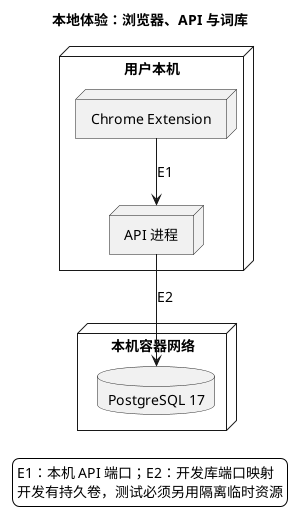

# 1. 运行与环境：把体验、资料和测试分开

> 位置：[文档首页](../README.md) → [工程地图](overview.md) → 运行与环境。启动 API、导入词库和准备隔离测试是不同操作；有副作用的动作不能隐藏在只读 Verify 内。

## 1.1. 先选择运行目的

| 目的 | 输入和前置 | 进入哪里 |
| --- | --- | --- |
| 在真实浏览器体验提示 | Java/Node/Chrome、已发布开发词库 | [本地体验](operations/local-experience.md) |
| 准备或重建词库资料 | 明确来源、项目开发库、导入/发布操作授权 | [词库导入](operations/lexicon-import.md) |
| 执行完整 Java/仓库验证 | 显式隔离 PostgreSQL/Redis 与声明环境 | [隔离验证环境](operations/verification-environment.md) |
| 自动验证扩展工程链路 | 临时 Chromium profile、合成页面、本机夹具 API | [扩展 E2E](operations/extension-e2e.md) |

## 1.2. 正常本机体验的资源关系

E1 的 API 端口由扩展构建参数与 host permission 共同绑定，默认 18080；E2 读取 PostgreSQL 已发布资料。Redis/worker 不属于观看最短请求链的必经节点。开发 compose 有持久数据卷，测试不能把它当临时资源使用。

## 1.3. 环境准备与验证的边界

首次 Python 环境使用 requirements-dev.txt 显式创建本机 venv；之后用该解释器执行仓库命令。Java 始终通过 java_exec 和仓库 Gradle Wrapper。依赖安装、容器创建、skill 链接都属于显式准备，不在 Verify 内自动发生。

准备失败时记录 BLOCKED 并指出具体资源；业务断言失败另记 FAIL。运行日志不包含真实字幕、观看历史、密钥或模型输入输出。下一步进入对应操作，或回到[交付主干](change-delivery.md)。
