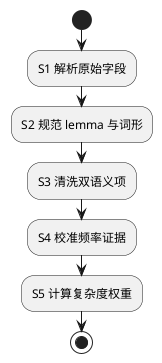

# 1. 导入记录的处理与字段 Reference

> 位置：[Operations](../../operations.md) → [词库导入](../lexicon-import.md) → 记录处理。这里只解释字段、频率与选择规则，不是每次操作都必须逐项执行的步骤。

## 1.1. 单条记录提取



| 来源字段 | 提取与清洗 | 输出字段 |
|---|---|---|
| `word` | NFC、去首尾空白、连续空白折叠、英语小写；单词为 `word`，空格分隔 2–5 词为 `phrase`；观看一期只枚举连续 1–3 词。 | `lemma`、`entry_kind` |
| `exchange` | 以 `/` 分项、以首个 `:` 分键值。`p/d/i/3/r/t/s` 的值去重为词形；`0:lemma` 归并到 lemma，不另建派生词。 | `lexicon_hint_lookup` 中的屈折形式行 |
| `translation` | 按行切分，清理空白和词性前缀；有普通释义时移除仅 `[网络]` 行。分号项去除明确领域标签后全部逐字相同才合并，否则完整保留，不选首义。 | `source_gloss`、安全时的 `prepared_gloss` |
| `definition` | 统一换行和空白；缺失时保留来源未提供状态，不伪造英文定义。 | 离线清洗依据，不进入观看查询表 |
| `tag` | 小写、去重；仅 `cet6`、`ky`、`toefl`、`ielts`、`gre`、`sat` 计入复杂词表。 | `source_complex_tags`、`complex_list_count` |
| `bnc`、`frq` | 只接受正十进制排名；`0` 或非数值为缺失。 | `source_bnc_rank`、`source_frq_rank`、`frequency_zipf` |
| `oxford` | `1` 与有效 BNC/FRQ 排名共同构成基础词名单来源；原有不预热边界保留。 | `source_oxford_basic`、基础词选择依据 |
| `collins`、`phonetic`、`pos`、`detail`、`audio` | 不参与首批释义、频率或权重计算。 | 诊断或忽略 |

## 1.2. 频率与权重

`bnc`、`frq` 是排名而非 Zipf，数值越小越常见。

| BNC / FRQ | `rank` | `frequency_zipf` |
|---|---:|---:|
| 两者均为正数 | `min(bnc, frq)` | `roundHalfUp(clamp(8 - log10(rank), 0, 8), 2)` |
| 仅一个为正数 | 该值 | 同上 |
| 均缺失 | 无 | `0`，不具备 L1 资格 |

```text
frequency_fit(zipf) = 0,                              zipf <= 2.5 or zipf >= 6.0
                      (zipf - 2.5) / 1.8,             2.5 < zipf <= 4.3
                      (6.0 - zipf) / 1.7,             4.3 < zipf < 6.0

complex_list_count = unique(cet6, ky, toefl, ielts, gre, sat in tag)
raw_priority = round(1000 × (0.55 × frequency_fit +
                             0.45 × (1 - exp(-complex_list_count))))
memory_priority = 0 when rank is missing; otherwise raw_priority
```

L1 的 HINT 与 BLOCK 词形分开按 `cache_priority` 预热。常见基础词虽不展示，也可以作为准确词形的负向缓存；其他长尾词形保留在 PostgreSQL。频率仅在新来源批次中整体重算，已发布版本不会由用户行为
增量更新。

`reliable` 的 `bnc=3271`、`frq=3504` 得 `rank=3271`、`frequency_zipf=4.49`；其
`cet6, ky, toefl, ielts` 得 `complex_list_count=4`、`memory_priority=930`。

基础词排除与缓存优先级是不同合同。StarDict 导入先流式预扫描，在可导入的独立 lemma 中取 `oxford=1` 且 `rank>0` 的候选，按 `rank ASC, lemma ASC` 确定性选择前 2000 个，再并入固定功能词。小样本不足 2000 时使用实际数量并报告，不按文件顺序或缺失排名补足。固定词的别名/词形也在导入期处理；完整短语不按其组成词排除。预扫描只保留有界候选。

正式导入写入来源排名和 Oxford 原始标记，并计算 `prepared_gloss` 或 `exclusion_reason`；查询投影固定为 `final_action=HINT|BLOCK`。名单摘要包含选择结果和固定词表，但 Oxford 原始标记自身不等于最终阻断。规范 CSV 没有 Oxford 原始证据，使用固定功能词规则。观看只读最终查询投影，词形和别名继承主词条的决定。

重复表达清洗在构造导入行时执行；不同表达保留，后续无法消歧则不展示。结构变化直接修改 `infra/postgres/schema.sql`，显式重建本项目开发库后完整重新导入，不维护旧结构升级或旧数据资格回填。未完成准备的数据不发布；数据库不保存中间生命周期状态。来源清单绑定预处理策略、许可和文件摘要；不得把列存在当作资料已经处理。

## 1.3. 规范输入与数据库

导入命令会按首行自动识别 StarDict 原始 CSV；它不会生成或要求中间的大型规范 CSV。保留
`lexiflow-lexicon-v1.csv` 仅用于已经按该合同准备的其他受控来源，其首行必须是：

```text
lemma,chinese_gloss,definition,aliases,inflections,frequency_zipf,frequency_source_id,frequency_license_id,frequency_ref,complex_evidence,dictionary_source_id,dictionary_license_id,dictionary_ref
```

| 表 | 核心字段 |
|---|---|
| `lexicon_dataset` | 已发布资料版本、来源清单、来源行数、准备词条数、查询行数及准备规则。 |
| `lexicon_prepared_entry` | `lemma`、`source_*` 原始证据、`prepared_gloss`、`exclusion_reason` 与准备优先级。 |
| `lexicon_hint_lookup` | 每个原形、别名和屈折形各一行；准确词形、`final_action`、`final_gloss`、`final_priority` 和 `cache_priority`。 |

查询只用 `lexicon_hint_lookup`；同形对应多词条时返回全部候选，不在数据库里选择第一条。每个字段的中文数据库注释见最新 SQL。
