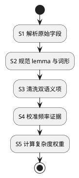

# 1. 导入记录的处理与字段 Reference

> 位置：[Operations](../../operations.md) → [词库导入](../lexicon-import.md) → 记录处理。这里只解释字段、频率与选择规则，不是每次操作都必须逐项执行的步骤。

## 1.1. 单条记录提取


```plantuml
@startuml
skinparam nodesep 30
skinparam ranksep 35
start
:S1 解析原始字段;
:S2 规范 lemma 与词形;
:S3 清洗双语义项;
:S4 校准频率证据;
:S5 计算复杂度权重;
stop
@enduml
```

| 来源字段 | 提取与清洗 | 输出字段 |
|---|---|---|
| `word` | NFC、去首尾空白、连续空白折叠、英语小写；单词为 `word`，空格分隔 2–5 词为 `phrase`；观看只枚举连续 1–3 词。 | `lemma`、`entry_kind` |
| `exchange` | 以 `/` 分项、以首个 `:` 分键值。`p/d/i/3/r/t/s` 的值去重为词形；`0:lemma` 归并到 lemma，不另建派生词。 | `lexicon_form` 中的屈折形式行 |
| `translation` | 按行切分，清理空白和词性前缀；有普通释义时移除仅 `[网络]` 行。完整来源表达保留；导入期按来源约定解析有序候选，选第一项并进行短释安全校验后发布，不在观看时临时截取。首项无效不扫描后续项补位；释义括号不平衡只将本词条置为 BLOCK，原文留在受控来源文件，CSV 列结构损坏仍阻止发布；具体解析边界见[默认首义规范](../../../../openspec/specs/product-architecture/spec.md)。 | 导入内存中的来源表达；安全时持久化 `lexicon_entry.gloss` |
| `definition` | 统一换行和空白；缺失时保留来源未提供状态，不伪造英文定义。 | 离线清洗依据，不进入观看查询表 |
| `tag` | 小写、去重；仅 `cet6`、`ky`、`toefl`、`ielts`、`gre`、`sat` 计入复杂词表。 | 导入内存中的复杂标签；发布结果的 `complex_list_count` |
| `bnc`、`frq` | 只接受正十进制排名；`0` 或非数值为缺失。 | 导入内存中的排名与 Zipf；计算发布分数和 `ranked_word` |
| `oxford` | `1` 与有效 BNC/FRQ 排名共同构成基础词名单来源；原有不预热边界保留。 | 导入内存中的基础词选择依据 |
| `collins`、`phonetic`、`pos`、`detail`、`audio` | 不参与首批释义、频率或权重计算。 | 诊断或忽略 |

## 1.2. 频率与权重

`bnc`、`frq` 是排名而非 Zipf，数值越小越常见。

| BNC / FRQ | `rank` | `frequency_zipf` |
|---|---:|---:|
| 两者均为正数 | `min(bnc, frq)` | `roundHalfUp(clamp(8 - log10(rank), 0, 8), 2)` |
| 仅一个为正数 | 该值 | 同上 |
| 均缺失 | 无 | `0`，不具备 L1 资格 |

```text
frequency_fit(zipf) = 0,                              zipf <= 2.5 or zipf >= 6.0
                      (zipf - 2.5) / 1.8,             2.5 < zipf <= 4.3
                      (6.0 - zipf) / 1.7,             4.3 < zipf < 6.0

complex_list_count = unique(cet6, ky, toefl, ielts, gre, sat in tag)
raw_priority = round(1000 × (0.55 × frequency_fit +
                             0.45 × (1 - exp(-complex_list_count))))
memory_priority = 0 when rank is missing; otherwise raw_priority
```

L1 的 HINT 与 BLOCK 词形分开按 `cache_priority` 预热。常见基础词虽不展示，也可以作为准确词形的负向缓存；其他长尾词形保留在 PostgreSQL。频率仅在新来源批次中整体重算，已发布版本不会由用户行为
增量更新。

`reliable` 的 `bnc=3271`、`frq=3504` 得 `rank=3271`、`frequency_zipf=4.49`；其
`cet6, ky, toefl, ielts` 得 `complex_list_count=4`、`memory_priority=930`。

基础词排除与缓存优先级是不同合同。StarDict 导入先流式预扫描，在派生行归并前收集所有受支持的单词表面中 `oxford=1` 的候选，再并入固定功能词，不按数量截断，也不要求有效排名。报告按有效 `rank ASC, lemma ASC` 排序；缺失排名记为 0 并排在有效排名后，不影响基础资格。词条原形或任一已归属词形命中 Oxford 名单时，整个单词词条及其词形均阻断，避免归并派生行丢失基础资格；固定词的别名/词形也在导入期处理；完整短语不继承单词的 Oxford 阻断；另由 `all_basic_phrase` 独立判断至少两个空格分词是否全部属于来源 Oxford 与固定基础词并集。预扫描仅保留 Oxford 单词集合，不保留完整来源文件。

正式导入在内存中使用来源排名和 Oxford 原始标记，计算短释或排除决定；只将安全短释存为 `lexicon_entry.gloss`，BLOCK 存 NULL。处理原因与规则轨迹不逐词入库。名单摘要包含选择结果、固定词表和策略标识；共享导入边界也保证有 Oxford 原始标记的独立单词进入基础词阻断，避免调用路径遗漏名单。规范 CSV 没有 Oxford 原始证据，使用固定功能词规则。观看只读最终查询投影，词形和别名继承主词条的决定。

重复表达清洗在构造导入行时执行；真实不同义项保留，默认短释取导入期按候选顺序确定并校验的第一义，不要求先完成上下文消歧。没有可核对的已发布默认义项仍不展示；本地两列候选 CSV 不可绕过来源和发布校验直接作为正式导入。结构变化直接修改 `infra/postgres/schema.sql`，显式重建本项目开发库后完整重新导入，不维护旧结构升级或旧数据资格回填。未完成准备的数据不发布；数据库不保存中间生命周期状态。来源清单绑定预处理策略、许可和文件摘要；不得把列存在当作资料已经处理。

## 1.3. 规范输入与数据库

导入命令会按首行自动识别 StarDict 原始 CSV；它不会生成或要求中间的大型规范 CSV。保留
`lexiflow-lexicon-v1.csv` 仅用于已经按该合同准备的其他受控来源，其首行必须是：

```text
lemma,chinese_gloss,definition,aliases,inflections,frequency_zipf,frequency_source_id,frequency_license_id,frequency_ref,complex_evidence,dictionary_source_id,dictionary_license_id,dictionary_ref
```

| 表 | 核心字段 |
|---|---|
| `lexicon_dataset` | 已发布资料版本、来源清单、来源行数、准备词条数、查询行数及准备规则。 |
| `lexicon_entry` | `entry_id`、`lemma`、`gloss`、`ranked_word`、`hint_priority`、`complex_list_count`、`cache_priority`。 |
| `lexicon_form` | 只存查询窗口内的准确词形与 `entry_id` 映射，不重复短释和分数。 |

查询一次批量关联 `lexicon_form` 和 `lexicon_entry`；同形对应多词条时返回全部候选，不在数据库里选择第一条。每个字段的中文数据库注释见最新 SQL。

## 1.4. 确定性短释清洗

Lexicon 在 Java 导入准备阶段执行纯文本清洗，不调用模型、数据库或网络。`StardictGlossPreparation` 统一 `firstCandidate`、`candidates` 与 `safeGloss`：保持五种顶层分隔符、全段括号配对、空首项不补位，长度按 code point、显示偏移按 UTF-16。首候选最多 24 个 code point 且至少一个汉字；未知标签、坏括号与非法字符不得为提高覆盖率而放行。

`StardictGlossCleaner.clean(lemma, sourceGloss)` 返回 `Result(workingGloss, candidate, decisiveRule, matchedRules)`。已有安全首义立即返回 `existing_safe`；否则依次执行 `source_label`、`english_expansion`、`angle_tag`、`person_header`、`leading_han`、`acronym_expansion`、`han_spacing`、`mixed_spacing`、`trailing_parenthesis`、`medical_insert`，每步只执行一次并重新解析校验，首次安全即停止，最终仍不安全为 `unresolved`。规则读取来源限定时始终使用原文；不覆盖受核验 curated 候选，不恢复未批准的词形推导或其他实验规则。纯文本组件不裁决基础词、低信息或频率资格。

前缀只识别白名单元数据，不能跨空首项寻找后义；缩写展开必须核对字母对应。尾圆括注仅在完整首候选为 1–24 个纯汉字加一个完整配对尾注时清理，保护纯罗马数字和 1–2 个 ASCII 字母技术符号；不全删句中、前置或坏括号。医学补字要求原来源明确带 `[医]`，英文词间空格与有意义术语保留。

资格使用共享功能词集合和“命中低信息启发式且实义词少于两个”的条件，不把实义词门槛泛化到所有短语；`all_basic_phrase` 独立于单词标记。基础词优先，原来源身份、别名和首义一致性不变。一次准备结果用于最终词条和词形发布，BLOCK 仍参与同形歧义；原始资料留在受控来源，规则轨迹只用于内存统计或本机审计，不逐词入库。

验收覆盖每个场景的正反例、步骤顺序、幂等与边界，并在冻结来源上逐 ID 只读重放、核对互斥计数及已有安全记录。可选增强按净终态贡献达到批准的千条门槛才启用，基础安全与身份合同不受门槛裁剪；格式通过不等于语义正确、已发布或真实观看覆盖。验收不得修改真实产品数据，独立验证仍按 Harness 执行。
