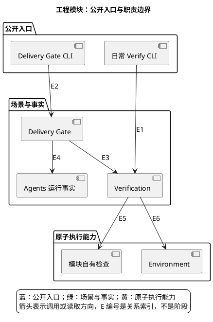

# 1. 工程地图：从工作目标找到流程与文件

> 位置：[文档首页](../README.md) → 工程地图。本页先解释工程能力的关系，不要求先读脚本清单或配置字段。

开发工作的主干是“实现 → Verify → 必要时正式 Delivery Gate”。环境准备是前置能力，Agent 协作是可选实现方式，格式与配置检查是可独立调用的叶子能力；它们不应被串成每次都必须走完的长链。

## 1.1. 先选择要完成的事情

| 你的问题 | 阅读入口 | 能得到什么 |
| --- | --- | --- |
| 改动完成后如何可信交付？ | [开发交付](change-delivery.md) | 大阶段、角色交接、失败卡点 |
| 为什么触发这些检查？ | [Verify](change-delivery/verification.md) | 选择规则、依赖闭包与执行文件 |
| 如何安排 Agent 工作？ | [Agent workflow](agent-workflow.md) | 可选委派、终态事件与事实核对 |
| 如何运行产品或准备测试？ | [运行与环境](operations.md) | 本地体验、资料导入、隔离资源 |
| 已经卡住，下一步做什么？ | [按阶段排障](troubleshooting.md) | 失败层与安全恢复路径 |
| 只想查一个字段或命令？ | [Reference](reference.md) | 工程术语、独立工具、配置与脚本职责 |

## 1.2. 再理解能力的归属

上图是能力依赖，不是执行时序。Delivery Gate 消费 Verification 与 Agents 的公开能力；Verification 不读取 Task identity。Agents 产生真实执行事实，不签发正式验收。模块拥有自己的检查内容，全局执行器不应了解模块内部测试类。

Harness 的机器规则与入口见 [harness/README.md](../../harness/README.md)，原生 Java 规则由 Gradle 拥有。阶段展开后再读文件职责；完整对照放在 [Scripts Reference](reference/scripts.md)，不要求首次阅读时逐个浏览。

## 1.3. 主干与侧链的区别

- **workflow：**需要前后证据和上下文，按阶段讲，例如 submit/validate/review/check。
- **standalone checker：**给定输入即可局部判断，例如 docs_check；可被 workflow 调用，但不是新阶段。
- **上下文观察：**status/result 依赖具体 submission/run，不因有 CLI 就变成无上下文工具。
- **维护动作：**install/link/start 会修改本机或启动进程，必须与只读 check 区分。
- **内部实现：**kernel/records/identity helper 在模块详情展开，不挤进总览。

当前执行状态只在[路线图状态](../roadmap/master-plan/status.md)维护。流程说明不代表相应功能已经正式验收。
