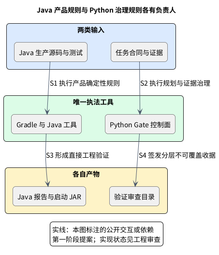
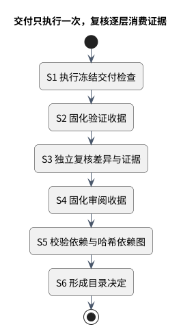

# 质量验收分层

Java 产品规则由 Gradle/Java 唯一执行；Python 负责规划、派发、证据与收据治理，不重复扫描 Java 源码。固定 JDK 启动器只选择 Temurin 25 并调用仓库 Gradle Wrapper，不替代质量工具。

增量交付选择 `check`，完整交付选择 `deliveryFull`（包含 `qualityFull`、`check` 与两个启动 JAR）。`architectureTest`、`verifyProductLanguage` 是诊断入口，不与聚合交付重复选择。机器声明见 [Java 产品清单](../../harness/java-product.manifest.yaml)。

正式验收分三层：`TASK_VALIDATION` 执行冻结的检查；`INDEPENDENT_REVIEW` 读取不可变验证证据；`CATALOG_DECISION` 消费验证、审阅及依赖收据。后两层不重跑交付命令。操作步骤只在[校验手册](validation/README.md)维护。

## 先区分两类确定性工具

架构图：Java 产品执法与 Python 治理各自接收输入、生成报告或收据。

左路检查 Java 产品源码、字节码和测试；右路检查任务、规划、证据、身份与收据。箭头没有把两路直接接起来，因为统一 Gate 的 Java Gradle 适配器接入状态见阶段状态页；未接入时，Java 聚合构建属于直接工程验证，尚不能自动成为正式 Java 任务收据。

| 被检查的内容 | 唯一负责人 / 工具 | 不能重复做的事 |
|---|---|---|
| Java 格式与导入 | Spotless | Python 再做同义格式扫描 |
| Javadoc/风格、静态缺陷 | Checkstyle、PMD、DocLint | 多层反复运行相同规则或默认启用全量低信号检查 |
| 中文注释、记录参数、禁止 PMD 抑制 | Java 源码检查，共享编译器解析 | Python 重写 Java 词法或 AST 判断 |
| 项目依赖与真实类型方向 | Gradle 依赖护栏、ArchUnit | 把空领域范围或测试样例合规当未来业务合规 |
| 直接行为测试、零失败/错误/跳过、覆盖报告 | JUnit、Gradle XML 负责人、JaCoCo | 把 NO-SOURCE 当业务测试或把报告当覆盖率门槛 |
| 任务图、交接、冻结证据、收据和哈希 DAG | Python Gate / Harness | 侵入产品领域/应用/API/工作进程业务逻辑 |

精确工具版本以 [Java 清单](../../harness/java-product.manifest.yaml) 为准，操作与探针见[Java 校验手册](validation/03-java-engineering.md)。

## 功能交付与验收只执行一层

活动图：验证执行检查，审查和目录逐层消费冻结证据。

S1/S2 属于 `TASK_VALIDATION`：在冻结合同下执行直接检查，生成不可覆盖验证收据。S3/S4 属于 `INDEPENDENT_REVIEW`：独立身份读冻结差异和证据，不能重跑全部交付命令。S5/S6 属于 `CATALOG_DECISION`：读验证、审查、依赖收据与哈希 DAG，形成目录决定。

图画成功路径，不能据此跳过身份与输入验证。缺检查、跳过、未触发、进程零退出码、queued、ack 或收据过时都不能称 PASS。详细归属、收据和签发权限合同见 [Gate 控制面](gate-control-plane-design.md)。

## 工作包和回调如何节约执行成本

一个工作包完成同负责人、同合同与写入边界的连续功能及直接测试，再向精确父会话发紧凑信号；主代理用产物定位、身份和哈希核对，不读完整聊天和日志，也不按固定短周期循环询问进展。

工作包规模、模型、并发、身份和回调参数只在[共享策略](../../harness/agent-policy.manifest.yaml)维护；本页不扩展冻结交接结构或另设调度守护进程。

## 状态与证据去哪里查

阶段状态只在[第一阶段状态页](../roadmap/phase-1-status.md)维护；签发接口与身份边界只见[控制面合同](gate-control-plane-design.md#current-execution-evidence)。

## 文档和合同改动也要保持证据诚实

阅读结构可以调整，旧收据不能随之覆盖或改签。变更后先列真正受影响的输入与任务，再生成新版本的当前证据。无需为展示信息变化重跑所有产品工具，但也不能借旧 PASS 为新架构正文背书。

正式验收按真实执行者、冻结版本和受信签发者处理受影响任务；旧收据不改签，不自动跨入下一阶段。
