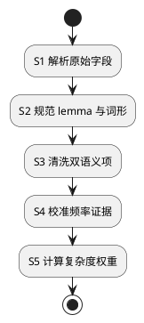

# 1. 离线词库导入

首批完整来源是本机 `stardict.csv`；不叠加 `ecdict.csv`，避免重复 lemma 与词形。词典文件只在
本机读取，不提交到仓库；频率与缓存优先级不使用用户字幕、观看历史、点击或熟悉度。

## 1.1. 单条记录提取



| 来源字段 | 提取与清洗 | 输出字段 |
|---|---|---|
| `word` | NFC、去首尾空白、连续空白折叠、英语小写；单词为 `word`，空格分隔 2–5 词为 `phrase`。 | `lemma`、`entry_kind`、`normalized_key` |
| `exchange` | 以 `/` 分项、以首个 `:` 分键值。`p/d/i/3/r/t/s` 的值去重为词形；`0:lemma` 归并到 lemma，不另建派生词。 | `lexicon_inflection` |
| `translation` | 按行切分，清理空白和词性前缀；有普通释义时移除仅 `[网络]` 行，余项以 `；` 连接。 | `chinese_gloss` |
| `definition` | 统一换行和空白；缺失时保留来源未提供状态，不伪造英文定义。 | `definition_text` |
| `tag` | 小写、去重；仅 `cet6`、`ky`、`toefl`、`ielts`、`gre`、`sat` 计入复杂词表。 | 复杂词表证据 |
| `bnc`、`frq` | 只接受正十进制排名；`0` 或非数值为缺失。 | 频率证据、`frequency_zipf` |
| `oxford` | `1` 仍可查询，但不预热。 | L1 资格 |
| `collins`、`phonetic`、`pos`、`detail`、`audio` | 不参与首批释义、频率或权重计算。 | 诊断或忽略 |

## 1.2. 频率与权重

`bnc`、`frq` 是排名而非 Zipf，数值越小越常见。

| BNC / FRQ | `rank` | `frequency_zipf` |
|---|---:|---:|
| 两者均为正数 | `min(bnc, frq)` | `roundHalfUp(clamp(8 - log10(rank), 0, 8), 2)` |
| 仅一个为正数 | 该值 | 同上 |
| 均缺失 | 无 | `0`，不具备 L1 资格 |

```text
frequency_fit(zipf) = 0,                              zipf <= 2.5 or zipf >= 6.0
                      (zipf - 2.5) / 1.8,             2.5 < zipf <= 4.3
                      (6.0 - zipf) / 1.7,             4.3 < zipf < 6.0

complex_list_count = unique(cet6, ky, toefl, ielts, gre, sat in tag)
raw_priority = round(1000 × (0.55 × frequency_fit +
                             0.45 × (1 - exp(-complex_list_count))))
memory_priority = 0 when rank is missing; otherwise raw_priority
```

L1 从 `rank` 存在、`oxford != 1` 的词条中按 `memory_priority DESC`、`normalized_key ASC`
取固定数量；所有有效长尾词保留在 PostgreSQL。频率仅在新来源批次中整体重算，已发布版本不会由用户行为
增量更新。

`reliable` 的 `bnc=3271`、`frq=3504` 得 `rank=3271`、`frequency_zipf=4.49`；其
`cet6, ky, toefl, ielts` 得 `complex_list_count=4`、`memory_priority=930`。

## 1.3. 规范输入与数据库

导入命令会按首行自动识别 StarDict 原始 CSV；它不会生成或要求中间的大型规范 CSV。保留
`lexiflow-lexicon-v1.csv` 仅用于已经按该合同准备的其他受控来源，其首行必须是：

```text
lemma,chinese_gloss,definition,aliases,inflections,frequency_zipf,frequency_source_id,frequency_license_id,frequency_ref,complex_evidence,dictionary_source_id,dictionary_license_id,dictionary_ref
```

| 表 | 核心字段 |
|---|---|
| `lexicon_import_batch` | `lexicon_version`、来源、许可证、摘要、状态、条目数。 |
| `lexicon_entry` | lemma、词类、规范键、Zipf、复杂词表数、内存优先级。 |
| `lexicon_sense` | 中文释义、英文定义、来源记录引用。 |
| `lexicon_inflection` | 词形到 lemma 的映射。 |
| `lexicon_source_evidence` | 词典、频率与复杂词表的逐条证据。 |

## 1.4. 操作与验证

准备本机 `stardict.csv`，确认首行和摘要；**直接把该文件传给命令**，不要把 StarDict 文件先转换成
`lexiflow-lexicon-v1.csv`，也不要叠加 `ecdict.csv`：

```bash
export STARDICT_CSV=/absolute/path/stardict.csv
shasum -a 256 "$STARDICT_CSV"
head -n 1 "$STARDICT_CSV"
LEXICON_ARGS=$(printf 'validate\037--input\037%s' "$STARDICT_CSV")
python3 -m scripts.environment.java_exec backend/gradlew -p backend \
  :platform:adapters:lexiconImport "-PlexiconImportArgs=$LEXICON_ARGS"
LEXICON_ARGS=$(printf 'prewarm-report\037--input\037%s\037--limit\0372000' "$STARDICT_CSV")
python3 -m scripts.environment.java_exec backend/gradlew -p backend \
  :platform:adapters:lexiconImport "-PlexiconImportArgs=$LEXICON_ARGS"
```

`validate` 流式扫描原始 CSV，输出 `entries`、归并的派生词数和跳过原因；它不连接数据库，也不会将
3 百万行载入内存。`prewarm-report` 只保持 `--limit` 个候选，用于人工检查频率、复杂词表与 Oxford 排除。

确认上述输出后启动本机 PostgreSQL 并发布：

```bash
podman compose -f infra/local/compose.yaml up -d
JDBC_URL='jdbc:postgresql://127.0.0.1:15432/lexiflow?user=postgres'
MIGRATION_ARGS=$(printf '%s\037%s' "$JDBC_URL" "$PWD/infra/postgres/migrations")
python3 -m scripts.environment.java_exec backend/gradlew -p backend \
  :platform:adapters:postgresMigrate "-PpostgresMigrateArgs=$MIGRATION_ARGS"
LEXICON_ARGS=$(printf 'publish\037--input\037%s\037--database-url\037%s\037--batch-source-id\037ecdict-stardict\037--batch-license-id\037MIT' "$STARDICT_CSV" "$JDBC_URL")
python3 -m scripts.environment.java_exec backend/gradlew -p backend \
  :platform:adapters:lexiconImport "-PlexiconImportArgs=$LEXICON_ARGS"
```

发布以 500 条为一个已提交的 `STAGED` 分块；任意已发布版本在整个扫描期间继续可查询。中断后以相同
输入摘要、`--batch-source-id` 和 `--batch-license-id` 重跑同一命令，导入从最后已提交的来源行继续；只有
完整扫描完成才会切换为 `PUBLISHED`。若来源文件或参数改变，则使用新的发布批次，不复用旧的 `STAGED` 批次。
