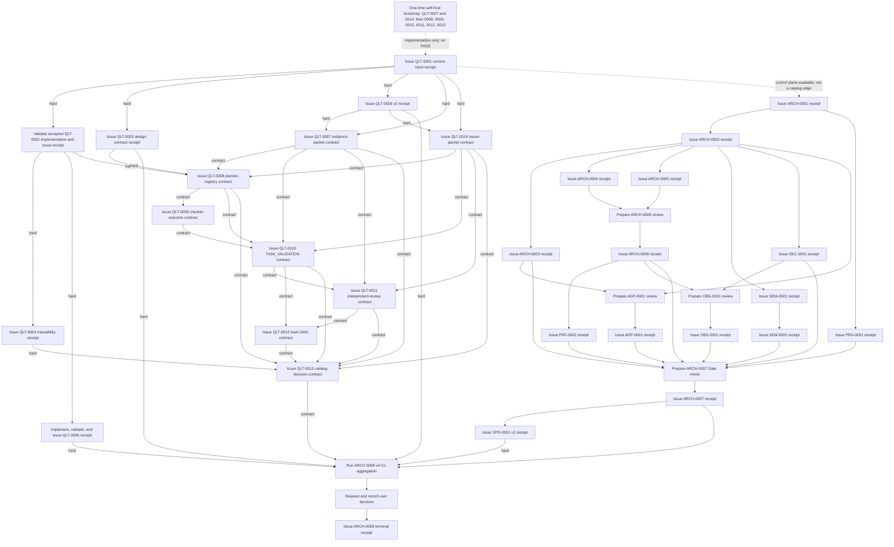

> 当前入口：ARCH-0008@5/2.2.0；runtime-bound correction 020 正在实现。下列历史 review 和摘要不证明新的 current Task/issuer contract。用户决定前完成 29 个前置 Task；退出收据在批准后签发，详见 [acceptance order](../development/phase-1-acceptance-order.md)。

# G1 Catalog Task Evidence Map

> Target：`LF-TSK-ARCH-0008` task version `4` / change version `2.1.0`
>
> Catalog source：[`planning/workstreams.yaml`](../../planning/workstreams.yaml)
>
> Scope：只覆盖目标 task 及其 blocking `hard` / `contract` dependency closure；共 30 个 catalog task、60 条 blocking edge（41 `hard`、19 `contract`）。
>
> 截止日期：2026-09-16。

> Historical layered-version addendum：前一次分层 Gate 迁移把 `QLT-0003/0008/0010/0011/0013` 提升为 `2/2.0.0`，`QLT-0009/0012` 提升为 `2/1.1.0`，并把 `ARCH-0008` 提升为 `3/2.0.0`。旧版本 receipt 与本页下方保留的历史执行叙述只用于 provenance，不能进入 current receipt chain。

> Current execution evidence update：当前目标 ARCH-0008@5/2.2.0；当前工作包 LF-WP-QLT-RUNTIME-GATE-EVIDENCE-020（265 分钟）。旧 019 及历史复核不是 current receipt。

## 1. 判定边界

本页是 G1 receipt 的准备索引，不是 receipt，也不改变任何 task 的目录状态。下文的“已复核文档”“bootstrap validation”“测试通过”只描述已有证据；除非 Gate control plane 在冻结输入上执行 required checks、保存不可覆盖 receipt，并完成 Main Agent 独立复核，否则对应 catalog task 仍不得称为 `PASS`。

[`openspec/changes/establish-lexiflow-foundation/tasks.md`](../../openspec/changes/establish-lexiflow-foundation/tasks.md) 中的 `[x]` 只说明该 change 提交了 `satisfies` 所列的局部切片。它不代表：

- catalog task 的所有 acceptance criteria/evidence 已验收；
- blocking `hard` / `contract` dependency 已有精确 `PASS` receipt 或 produced contract；
- `scripts/gates/cli.py` 已执行；
- 用户已批准 G1。

正式 receipt 的共同最低要求来自 [`planning/workstreams.yaml`](../../planning/workstreams.yaml) 和 [`harness/agent-policy.manifest.yaml`](../../harness/agent-policy.manifest.yaml)：精确 task/change/run/agent/parent identity、冻结输入及 hash、文件 claim 对账、命令与退出码、acceptance/effect/risk 映射、独立复核，以及唯一且不可覆盖的 receipt。`queued`、callback、进程退出 `0`、未运行、跳过、bootstrap receipt 和 change-local `[x]` 均不能替代这些要求。

当前 30 个 closure Task 均有可编译 dispatch contract。21 个 profile 由 [`harness/g1-task-contract-profiles.yaml`](../../harness/g1-task-contract-profiles.yaml) 封闭 required inputs、语义断言、owner 与 evidence path；[`harness/gate-check-registry.yaml`](../../harness/gate-check-registry.yaml) version 3 从 profile 与 current catalog 确定性生成 30-entry registry。只有 `TASK_VALIDATION` 计划可以选择并执行 checks；`INDEPENDENT_REVIEW` 与 `CATALOG_DECISION` 的 checks 必须为空，只消费已经发布的不可变 receipt。Java 产品质量只由 JDK 25 下的 Gradle、Spotless、Checkstyle、PMD、Java 注释/Javadoc Gate、ArchUnit、JUnit 与 JaCoCo 执行，Python 控制面不得再次扫描 Java 源码。这些可执行性与 fail-closed 证据仍不是 current catalog receipt。

## 2. Blocking closure 与直接关系

本页按 `hard` 与 `contract` 两类 blocking dependency 计算 closure。`ARCH-0008@5/2.2.0` 保留五个直接 `hard` 前置：`ARCH-0007`、`QLT-0003@4/2.2.0`、`QLT-0005`、`QLT-0006@3/2.1.0`、`OPS-0001@2/1.1.0`；同时要求 `QLT-0013@4/2.2.0` 的 `catalog-decision-receipt@2.0.0` contract。当前闭包仍为 30 个 task、60 条 blocking edge，其中 41 条 `hard`、19 条 `contract`。

下表中的“上游”是 task 的直接 blocking dependency；“下游”是本闭包中直接消费它的 task。边类型随引用标出，足以按当前 catalog 重建完整 closure。

| Task | Task/change version | 与 `ARCH-0008` 的关系 | 直接上游 | 闭包内直接下游 |
|---|---|---|---|---|
| `LF-TSK-ARCH-0008` | `5` / `2.2.0` | 目标 | `ARCH-0007` (hard), `QLT-0003` (hard), `QLT-0005` (hard), `QLT-0006` (hard), `OPS-0001` (hard), `QLT-0013` (contract) | — |
| `LF-TSK-ARCH-0007` | `1` / `1.0.0` | 直接 hard 前置 | `ARCH-0003` (hard), `ARCH-0006` (hard), `PRD-0001` (hard), `SEM-0002` (hard), `PRF-0002` (hard), `SEC-0001` (hard), `OBS-0001` (hard), `ADP-0001` (hard) | `ARCH-0008` (hard), `OPS-0001` (hard) |
| `LF-TSK-QLT-0003` | `4` / `2.2.0` | 直接 hard 前置 | `QLT-0001` (hard) | `ARCH-0008` (hard), `QLT-0008` (hard) |
| `LF-TSK-QLT-0005` | `1` / `1.0.0` | 直接 hard 前置 | `QLT-0002` (hard) | `ARCH-0008` (hard) |
| `LF-TSK-QLT-0006` | `3` / `2.1.0` | 直接 hard 前置 | `QLT-0001` (hard) | `ARCH-0008` (hard), `QLT-0007` (hard), `QLT-0014` (hard) |
| `LF-TSK-OPS-0001` | `2` / `1.1.0` | 直接 hard 前置 | `ARCH-0007` (hard) | `ARCH-0008` (hard) |
| `LF-TSK-QLT-0013` | `4` / `2.2.0` | 直接 contract 前置 | `QLT-0004` (hard), `QLT-0007` (contract), `QLT-0008` (contract), `QLT-0010` (contract), `QLT-0011` (contract), `QLT-0012` (contract), `QLT-0014` (contract) | `ARCH-0008` (contract) |
| `LF-TSK-ARCH-0001` | `1` / `1.0.0` | 传递 blocking 前置 | — | `ARCH-0002` (hard), `PRD-0001` (hard) |
| `LF-TSK-ARCH-0002` | `1` / `1.0.0` | 传递 blocking 前置 | `ARCH-0001` (hard) | `ADP-0001` (hard), `ARCH-0003` (hard), `ARCH-0004` (hard), `ARCH-0005` (hard), `SEC-0001` (hard), `SEM-0001` (hard) |
| `LF-TSK-ARCH-0003` | `1` / `1.0.0` | 传递 blocking 前置 | `ARCH-0002` (hard) | `ADP-0001` (hard), `ARCH-0007` (hard) |
| `LF-TSK-ARCH-0004` | `1` / `1.0.0` | 传递 blocking 前置 | `ARCH-0002` (hard) | `ARCH-0006` (hard) |
| `LF-TSK-ARCH-0005` | `1` / `1.0.0` | 传递 blocking 前置 | `ARCH-0002` (hard) | `ARCH-0006` (hard) |
| `LF-TSK-ARCH-0006` | `1` / `1.0.0` | 传递 blocking 前置 | `ARCH-0004` (hard), `ARCH-0005` (hard) | `ARCH-0007` (hard), `OBS-0001` (hard), `PRF-0002` (hard) |
| `LF-TSK-PRD-0001` | `1` / `1.0.0` | 传递 blocking 前置 | `ARCH-0001` (hard) | `ARCH-0007` (hard) |
| `LF-TSK-SEM-0001` | `1` / `1.0.0` | 传递 blocking 前置 | `ARCH-0002` (hard) | `SEM-0002` (hard) |
| `LF-TSK-SEM-0002` | `1` / `1.0.0` | 传递 blocking 前置 | `SEM-0001` (hard) | `ARCH-0007` (hard) |
| `LF-TSK-PRF-0002` | `1` / `1.0.0` | 传递 blocking 前置 | `ARCH-0006` (hard) | `ARCH-0007` (hard) |
| `LF-TSK-SEC-0001` | `1` / `1.0.0` | 传递 blocking 前置 | `ARCH-0002` (hard) | `ARCH-0007` (hard), `OBS-0001` (hard) |
| `LF-TSK-OBS-0001` | `1` / `1.0.0` | 传递 blocking 前置 | `ARCH-0006` (hard), `SEC-0001` (hard) | `ARCH-0007` (hard) |
| `LF-TSK-ADP-0001` | `1` / `1.0.0` | 传递 blocking 前置 | `ARCH-0002` (hard), `ARCH-0003` (hard) | `ARCH-0007` (hard) |
| `LF-TSK-QLT-0001` | `1` / `1.0.0` | 传递 blocking 前置 | — | `QLT-0002` (hard), `QLT-0003` (hard), `QLT-0006` (hard), `QLT-0007` (hard), `QLT-0014` (hard) |
| `LF-TSK-QLT-0002` | `1` / `1.0.0` | 传递 blocking 前置 | `QLT-0001` (hard) | `QLT-0004` (hard), `QLT-0005` (hard), `QLT-0008` (hard) |
| `LF-TSK-QLT-0004` | `1` / `1.0.0` | 传递 blocking 前置 | `QLT-0002` (hard) | `QLT-0013` (hard) |
| `LF-TSK-QLT-0007` | `3` / `1.2.0` | 传递 blocking 前置 | `QLT-0001` (hard), `QLT-0006` (hard) | `QLT-0008` (contract), `QLT-0010` (contract), `QLT-0011` (contract), `QLT-0013` (contract) |
| `LF-TSK-QLT-0014` | `3` / `3.0.0` | 传递 blocking 前置 | `QLT-0001` (hard), `QLT-0006` (hard) | `QLT-0008` (contract), `QLT-0010` (contract), `QLT-0011` (contract), `QLT-0013` (contract) |
| `LF-TSK-QLT-0008` | `4` / `2.2.0` | 传递 blocking 前置 | `QLT-0002` (hard), `QLT-0003` (hard), `QLT-0007` (contract), `QLT-0014` (contract) | `QLT-0009` (contract), `QLT-0010` (contract), `QLT-0013` (contract) |
| `LF-TSK-QLT-0009` | `4` / `1.3.0` | 传递 blocking 前置 | `QLT-0008` (contract) | `QLT-0010` (contract) |
| `LF-TSK-QLT-0010` | `4` / `2.2.0` | 传递 blocking 前置 | `QLT-0007` (contract), `QLT-0008` (contract), `QLT-0009` (contract), `QLT-0014` (contract) | `QLT-0011` (contract), `QLT-0012` (contract), `QLT-0013` (contract) |
| `LF-TSK-QLT-0011` | `4` / `2.2.0` | 传递 blocking 前置 | `QLT-0007` (contract), `QLT-0010` (contract), `QLT-0014` (contract) | `QLT-0012` (contract), `QLT-0013` (contract) |
| `LF-TSK-QLT-0012` | `4` / `1.3.0` | 传递 blocking 前置 | `QLT-0010` (contract), `QLT-0011` (contract) | `QLT-0013` (contract) |

所有 blocking edge 都精确要求上游列出的 task/change version 与 `required_result: PASS`；`contract` edge 还要求精确 producer、contract name 与 contract version。Phase 编号不构成隐式依赖。

### 2.1 Catalog acceptance 原文索引

下表保留 `planning/workstreams.yaml` 的 criterion/evidence 原文与数组索引。第 3 节解释每项目前有哪些证据、哪些仍缺；本表中的词句不表示它们已经执行，也不表示已经取得 catalog receipt。

| Task | `acceptance_criteria` | `acceptance_evidence` |
|---|---|---|
| `ARCH-0008` | `[0]` Complete the declared outcome: Run G1 architecture review and request user decision | `[0]` PASS, FAIL, or BLOCKED with user decision |
| `ARCH-0007` | `[0]` Complete the declared outcome: Compare alternatives and publish P1 ADR package | `[0]` Two or three options per material decision |
| `QLT-0003` | `[0]` Define frozen plan and receipt execution layers so TASK_VALIDATION alone executes selected checks while INDEPENDENT_REVIEW and CATALOG_DECISION consume immutable evidence without rerunning delivery commands. | `[0]` Frozen-input plan and immutable receipt example |
| `QLT-0005` | `[0]` Complete the declared outcome: Implement file claims and single-owner dispatch checks | `[0]` LF-GATE-DISPATCH-001 -> tests/gates/test_dispatch_preflight.py `[1]` tmp/quality/runs/{run_id}/receipt.json |
| `QLT-0006` | `[0]` Enforce the complete caller handoff schema, including task/change versions, acceptance criteria/evidence, and parent_client. `[1]` Reject caller-supplied agent_id, run_id, session_id, or client at first dispatch; bind and persist runner-generated identity. `[2]` Write a terminal completion record with task/change/run identity before callback delivery to the exact parent session; require the six result fields in the Qoder prompt for main-agent validation. `[3]` Prevent a second Qoder run while a run is active or unknown, without recursive delegation or LLM busy-waiting. `[4]` Enforce callback-first recovery with the first fallback probe no earlier than 300 seconds and later probes at least 600 seconds apart. | `[0]` Automated tests covering every caller field and rejection of caller-owned runtime identity. `[1]` Completion identity/version verification, result-field prompt contract, and completion-before-callback ordering tests. `[2]` One-active-or-unknown-Qoder-run fixtures and 300/600-second no-busy-wait watchdog tests. |
| `OPS-0001` | `[0]` Publish a Phase 1 toolchain ADR that compares at least three viable stacks, recommends runtime/build/lock/repository boundaries, cites current compatibility evidence, records local environment gaps, and defines the exact post-approval reproducibility checks without creating product code or build files. | `[0]` ADR alternatives, trade-offs, recommendation, version policy, compatibility sources, and revisit triggers. `[1]` Reference-wrapper audit and local runtime inventory with any mismatch reported as a future bootstrap prerequisite. `[2]` Post-approval checklist for wrapper, dependency locks, toolchain resolution, clean build, and architecture-test reproducibility. |
| `QLT-0013` | `[0]` Verify the current acceptance-case registry hash, reject orphan or duplicate cases, reconcile every current acceptance mapping, then reconcile task/change/source/registry/policy hashes, validation/review receipts, and every required dependency receipt. `[1]` Permit catalog PASS only when all kind-specific evidence, reviewer independence, hash-DAG verification, freshness, and required current-input dependency results are PASS. `[2]` Aggregate prior BLOCKED or FAIL results without promotion; classify missing, stale, malformed, unsafe, or unverified evidence as FAIL. `[3]` Install the CATALOG_DECISION handler in the single scripts/gates/cli.py route, consume a zero-check evidence plan without invoking the delivery executor, and publish a new immutable decision receipt with no self-reference, latest dependency, bootstrap backfill, or inferred user approval. | `[0]` LF-GATE-CATALOG-001 -> tests/gates/test_catalog_decision.py `[1]` tmp/quality/runs/{run_id}/receipt.json |
| `ARCH-0001` | `[0]` Complete the declared outcome: Freeze assumptions, invariants, and non-goals | `[0]` Reviewed assumption table |
| `ARCH-0002` | `[0]` Complete the declared outcome: Define bounded contexts and responsibilities | `[0]` Responsibility and ownership matrix |
| `ARCH-0003` | `[0]` Complete the declared outcome: Define module dependency direction and ports | `[0]` DAG validation and forbidden-edge list |
| `ARCH-0004` | `[0]` Complete the declared outcome: Design caption-to-annotation core flow | `[0]` Happy, timeout, cache-hit, and fallback paths |
| `ARCH-0005` | `[0]` Complete the declared outcome: Design behavior-event-to-profile core flow | `[0]` Idempotency, replay, and eventual-consistency paths |
| `ARCH-0006` | `[0]` Complete the declared outcome: Freeze synchronous and asynchronous boundaries | `[0]` Latency, timeout, retry, and degradation budgets |
| `PRD-0001` | `[0]` Complete the declared outcome: Define English-first viewing journey and interruption budget | `[0]` Scenario review |
| `SEM-0001` | `[0]` Complete the declared outcome: Define disambiguate, translateInContext, extractPhrase, and explainSentence ports | `[0]` Provider-neutral type review |
| `SEM-0002` | `[0]` Complete the declared outcome: Define structured output, confidence, timeout, and error semantics | `[0]` Malformed, low-confidence, timeout, and refusal cases |
| `PRF-0002` | `[0]` Complete the declared outcome: Define L1, Redis, PostgreSQL, semantic, and context-cache contracts | `[0]` Key, version, TTL, invalidation, and privacy analysis |
| `SEC-0001` | `[0]` Complete the declared outcome: Threat-model Extension, API, worker, stores, and providers | `[0]` Trust boundaries and abuse cases |
| `OBS-0001` | `[0]` Complete the declared outcome: Define correlation, structured logging, metrics, tracing, and redaction contract | `[0]` Cross-flow correlation and forbidden-field review |
| `ADP-0001` | `[0]` Complete the declared outcome: Define source-adapter port and conformance fixtures | `[0]` YouTube, web, PDF, and audio examples |
| `QLT-0001` | `[0]` Complete the declared outcome: Define task, run, owner, and evidence schemas | `[0]` Schema fixtures and validation |
| `QLT-0002` | `[0]` Complete the declared outcome: Implement ID, owner, and DAG validators | `[0]` Duplicate, missing, owner-conflict, and cycle tests |
| `QLT-0004` | `[0]` Complete the declared outcome: Create acceptance-case traceability contract | `[0]` Orphan and duplicate detection |
| `QLT-0007` | `[0]` Materialize all six result fields only from Main-Agent supplied structured values; never infer a result from stdout, callback text, exit code, or prose. `[1]` Bind packet identity to exact task, completion, stdout/stderr, changed-file snapshot, diff, and validation artifact locators and SHA-256 values. `[2]` Reject missing fields, subject identity drift, claim mismatch, unsafe locators, changed bytes, and duplicate packet identity. `[3]` Publish each result packet under a unique immutable identity and keep issuer trust outside this task. `[4]` Publish immutable canonical Codex per-Task projections/outcomes/completions/signals with trusted runtime actor binding, real shared host session, precise current Task contracts, structured six-field results and verified artifact hashes; materialize fixed explicit Gate inputs by reusing the evidence packet validator without subprocesses, log inference or legacy layout fallback. | `[0]` LF-GATE-EVIDENCE-001 -> tests/gates/test_evidence_packet.py `[1]` tmp/quality/runs/{run_id}/receipt.json `[2]` Canonical runtime binding, artifact publication and explicit Gate materialization API regressions for caller identity rejection, stable actor across runs, missing runtime, exact Task/outcome aggregation, immutable collisions, current scope/version/hash drift and real planner integration. |
| `QLT-0014` | `[0]` Resolve every Qoder, Codex, human, or CI issuer through a fixed verifier registered in harness/gate-issuer-authorities.yaml and bind only verified runner, host-session, operator-record, or workload-identity provenance. `[1]` Reject caller-selected authority/verifier, self-asserted actor/role, copied actor/agent/run/issuer-instance or replay identity, unsupported receipt authorization, unavailable authority and identity drift. Shared client or host session alone is not copied actor identity; distinct actors remain host-verified, and changing run or attestation never makes the same actor independent. `[2]` Publish a schema-complete packet with unique issuer instance, actor/session provenance, authorized receipt kinds, immutable locator, and SHA-256. `[3]` Keep issuer authorization independent from result evidence materialization and prove valid and forged fixtures for every supported actor type. | `[0]` LF-GATE-ISSUER-001 -> tests/gates/test_issuer_packet.py `[1]` tmp/quality/runs/{run_id}/receipt.json |
| `QLT-0008` | `[0]` Produce the same canonical content fingerprint for the same normalized current inputs while creating no file, plan identity, run identity, or lifecycle state. `[1]` Freeze exact task/change/dependency identity, explicit result and trusted issuer packet locators and hashes, source hashes, normalized scope and claims, execution layer, required checks, selection reasons, and acceptance/effect/risk mappings. `[2]` Match the caller's full validation command string to one declared registry value; select fixed argv only for TASK_VALIDATION, freeze zero checks for INDEPENDENT_REVIEW and CATALOG_DECISION, and reject unknown commands, overrides, or receipt-kind/execution-layer mismatch. `[3]` Reject missing or stale packets, registry drift, invalid owners/triggers/mappings, and non-current task or dependency versions. | `[0]` LF-GATE-PLAN-001 -> tests/gates/test_gate_planner.py `[1]` tmp/quality/runs/{run_id}/receipt.json |
| `QLT-0009` | `[0]` Execute only the fixed argv and cwd frozen by the registry and record process facts separately from typed checker outcomes. `[1]` Classify required skipped, not-run, unavailable, empty, malformed, timed-out, signaled, or unproved exit-zero checks as FAIL. `[2]` Continue independent checks after a domain BLOCKED outcome and retain every executed or not-run required member. `[3]` Aggregate every invocation, checker, and run strictly as FAIL over BLOCKED over PASS, with no unknown or empty set producing PASS. | `[0]` LF-GATE-CHECK-001 -> tests/gates/test_gate_executor.py `[1]` tmp/quality/runs/{run_id}/receipt.json |
| `QLT-0010` | `[0]` Resolve one explicit result packet and one trusted issuer packet from matching flags or trusted single-value launcher bindings; reject missing/conflicting context, then generate a unique run ID, persist the frozen plan, and flush a disk START event plus caller-visible run ID/event locator before any checker. `[1]` Publish a schema-complete TASK_VALIDATION receipt through a stable kind-handler and generic immutable-store interface; validate that its plan requires selected checks, and never invoke the delivery executor for evidence-consumption receipt kinds. `[2]` Use exclusive atomic publication so collisions, interruption, unsafe paths, partial staging, or changed inputs never produce a final PASS receipt or overwrite prior evidence. `[3]` Return RUNNING or FINALIZED only from an explicit run ID in a single read, without waiting, retrying, resuming, re-executing, or using latest as evidence. | `[0]` LF-GATE-VALIDATION-001 -> tests/gates/test_gate_lifecycle.py `[1]` tmp/quality/runs/{run_id}/receipt.json |
| `QLT-0011` | `[0]` Install the INDEPENDENT_REVIEW handler in the single scripts/gates/cli.py route, consume a zero-check evidence plan without invoking the delivery executor, then freeze the reviewed validation receipt path/hash, reviewer packet, source/diff scope, rerun evidence, structured findings, and decision in a new review receipt. `[1]` Reject missing identity, producer self-review, reviewer writes to subject files, stale inputs, unsafe locators, and subject receipt or artifact hash drift. `[2]` Never mutate the subject validation receipt; every re-review receives a new review run and immutable receipt. `[3]` Demonstrate PASS, BLOCKED, and FAIL review outcomes with structured independence assertions and current-input evidence. | `[0]` LF-GATE-REVIEW-001 -> tests/gates/test_independent_review.py `[1]` tmp/quality/runs/{run_id}/receipt.json |
| `QLT-0012` | `[0]` Verify the receipt-to-manifest-to-leaf and current-to-prior-receipt topology without writing or repairing evidence. `[1]` Reject self-reference, back-reference, latest or alias locators, duplicate identity with different bytes, missing nodes, and every detected cycle. `[2]` Reject any leaf, manifest, plan, packet, or prior receipt whose bytes no longer match its recorded hash. `[3]` Produce a typed PASS only for a complete finite DAG whose identities, locators, and hashes all reconcile. | `[0]` LF-GATE-HASH-001 -> tests/gates/test_hash_dag.py `[1]` tmp/quality/runs/{run_id}/receipt.json |

## 3. Catalog task 到证据的精确映射

### 3.1 Architecture 与 product 主链

#### `LF-TSK-ARCH-0001` — Freeze assumptions, invariants, and non-goals

- **Version / owner**：task `1`，change `1.0.0`；产物 owner `LF-WS-ARCH`，建议 Gate check owner `LF-WS-QLT`，Main Agent 独立复核。
- **Catalog acceptance**：criterion 为 “Freeze assumptions, invariants, and non-goals”；evidence 为 “Reviewed assumption table”。
- **现有可复核产物**：[`Product Brief`](../product/product-brief.md) 的 goals、non-goals、MVP 和待验证证据；[`Phase 1 Architecture`](../architecture/phase-1.md) 的 Assumptions、目标和范围；change-local `LF-DISC-001 [x]`。
- **当前真实状态**：architecture documentation slice 已写入并经历 Phase 1 文档复核；没有 catalog receipt。
- **正式 receipt 前仍缺**：冻结上述输入，逐项确认 assumption/non-goal 没有被后续文档反向覆盖，保存人工 review 表、命令/链接检查及独立复核 receipt。

#### `LF-TSK-ARCH-0002` — Define bounded contexts and responsibilities

- **Version / owner**：`1` / `1.0.0`；`LF-WS-ARCH`，建议 Gate check owner `LF-WS-QLT`。
- **Catalog acceptance**：criterion 为 “Define bounded contexts and responsibilities”；evidence 为 “Responsibility and ownership matrix”。
- **现有可复核产物**：[`Phase 1 Architecture`](../architecture/phase-1.md) 的 Bounded Context、关键归属和模块布局；[`harness/module-boundaries.yaml`](../../harness/module-boundaries.yaml)；change-local `LF-ARCH-P1-001 [x]`。
- **当前真实状态**：文档/机器边界已独立语义复核；没有 catalog receipt。
- **正式 receipt 前仍缺**：先取得 `ARCH-0001@1/1.0.0` receipt，再对 Context、state owner、公开 contract 和 forbidden cross-owner access 做冻结输入一致性检查并发 receipt。

#### `LF-TSK-ARCH-0003` — Define module dependency direction and ports

- **Version / owner**：`1` / `1.0.0`；`LF-WS-ARCH`，建议 Gate check owner `LF-WS-QLT`。
- **Catalog acceptance**：criterion 为 “Define module dependency direction and ports”；evidence 为 “DAG validation and forbidden-edge list”。
- **现有可复核产物**：[`Phase 1 Architecture`](../architecture/phase-1.md) 的静态依赖图和架构约束；[`harness/module-boundaries.yaml`](../../harness/module-boundaries.yaml)；[`Reference Audit`](../references/feipi-session-browser-java.md)；change-local `LF-REF-001 [x]` 与 `LF-ARCH-P1-001 [x]`。
- **当前真实状态**：设计和机器清单已复核；已存在 Java scaffold/build/architecture quality tests；它们不证明产品行为，也没有 catalog receipt。
- **正式 receipt 前仍缺**：先取得 `ARCH-0002` receipt；Gate 对 dependency DAG、允许边和 forbidden edge 做一致性检查。产品 architecture test 属于批准后落地证据，不应伪装为本次已运行。

#### `LF-TSK-ARCH-0004` — Design caption-to-annotation core flow

- **Version / owner**：`1` / `1.0.0`；`LF-WS-ARCH`，建议 Gate check owner `LF-WS-QLT`。
- **Catalog acceptance**：criterion 为 “Design caption-to-annotation core flow”；evidence 为 “Happy, timeout, cache-hit, and fallback paths”。
- **现有可复核产物**：[`Phase 1 Architecture`](../architecture/phase-1.md) 第 7、9、11、14 节；[`LF-CAPTION-001`、`LF-ENRICH-001/002`](../acceptance-cases/phase-1.md)；change-local `LF-ARCH-P1-001 [x]`。
- **当前真实状态**：核心流程文档已复核；没有 catalog receipt。
- **正式 receipt 前仍缺**：先取得 `ARCH-0002` receipt；在 receipt 中逐一映射 happy、cache hit、Provider timeout、worker/Redis/backend failure、durable enqueue failure 与 late-result discard。

#### `LF-TSK-ARCH-0005` — Design behavior-event-to-profile core flow

- **Version / owner**：`1` / `1.0.0`；`LF-WS-ARCH`，建议 Gate check owner `LF-WS-QLT`。
- **Catalog acceptance**：criterion 为 “Design behavior-event-to-profile core flow”；evidence 为 “Idempotency, replay, and eventual-consistency paths”。
- **现有可复核产物**：[`Phase 1 Architecture`](../architecture/phase-1.md) 第 8、9、10、14 节；[`LF-PROFILE-001`、`LF-LEARNING-001/002`](../acceptance-cases/phase-1.md)；change-local `LF-ARCH-P1-001 [x]`。
- **当前真实状态**：核心流程文档已复核；没有 catalog receipt。
- **正式 receipt 前仍缺**：先取得 `ARCH-0002` receipt；Gate 显式核对 event durable intake、幂等、replay、显式/隐式信号、projection pending、跨设备 eventual consistency 和 observed-display 语义。

#### `LF-TSK-ARCH-0006` — Freeze synchronous and asynchronous boundaries

- **Version / owner**：`1` / `1.0.0`；`LF-WS-ARCH`，建议 Gate check owner `LF-WS-QLT`。
- **Catalog acceptance**：criterion 为 “Freeze synchronous and asynchronous boundaries”；evidence 为 “Latency, timeout, retry, and degradation budgets”。
- **现有可复核产物**：[`Phase 1 Architecture`](../architecture/phase-1.md) 第 6.3、7、8、9、11 节；[`Phase 1 Review Checklist`](phase-1-checklist.md) 的初始 targets；change-local `LF-ARCH-P1-001 [x]`。
- **当前真实状态**：同步/异步和降级边界已复核；数值仍是待用户确认的 initial target，不是已承诺 SLO；没有 catalog receipt。
- **正式 receipt 前仍缺**：先取得 `ARCH-0004` 与 `ARCH-0005` receipts；把每条 latency/timeout/retry/degradation 约束标为 invariant 或待批准 target，禁止把未测量数值写成已验证事实。

#### `LF-TSK-PRD-0001` — Define English-first viewing journey and interruption budget

- **Version / owner**：`1` / `1.0.0`；产物 owner `LF-WS-PRD`，建议 Gate check owner `LF-WS-QLT`，产品方向由用户审批。
- **Catalog acceptance**：criterion 为 “Define English-first viewing journey and interruption budget”；evidence 为 “Scenario review”。
- **现有可复核产物**：[`Product Brief`](../product/product-brief.md) 的低打扰、英文优先和 MVP 边界；[`LF-CAPTION-001`](../acceptance-cases/phase-1.md)；[`Phase 1 Review Checklist`](phase-1-checklist.md) 的用户旅程和 initial target。
- **当前真实状态**：英文优先 journey 有文档证据；没有独立的 change-local `satisfies` 映射，也没有 catalog receipt；提示密度/打扰预算仍需产品 owner 确认。
- **正式 receipt 前仍缺**：先取得 `ARCH-0001` receipt；补齐逐场景 review、明确 qualitative interruption invariant 与待测/待批准的数值 target，再由产品 owner 和独立 Gate reviewer 签收。

#### `LF-TSK-ARCH-0007` — Compare alternatives and publish P1 ADR package

- **Version / owner**：`1` / `1.0.0`；`LF-WS-ARCH`，建议 Gate check owner `LF-WS-QLT`。
- **Catalog acceptance**：criterion 为 “Compare alternatives and publish P1 ADR package”；evidence 为 “Two or three options per material decision”。
- **现有可复核产物**：[`Phase 1 ADRs`](../architecture/decisions.md) 的 ADR-001 至 ADR-010；[`G1 Decision Package`](g1-decision-package.md)；change-local `LF-ARCH-P1-001 [x]`。ADR 当前均为 `Proposed`。
- **当前真实状态**：ADR package 已有文档复核；它的八个直接 hard prerequisite 都没有 formal receipt，因此 `ARCH-0007` 也没有 receipt。
- **正式 receipt 前仍缺**：按 catalog 取得 `ARCH-0003`、`ARCH-0006`、`PRD-0001`、`SEM-0002`、`PRF-0002`、`SEC-0001`、`OBS-0001`、`ADP-0001` 的精确 receipt；随后逐 ADR 检查 2–3 个方案、trade-off、推荐、consequence 和 revisit trigger。

### 3.2 Phase 1 横切合同

以下六项均由 [`Phase 1 Cross-cutting Contracts`](../architecture/phase-1-cross-cutting-contracts.md) 承载，并已有对应 change-local `[x]`。这只证明文档切片已提交和独立复核；该文档自身也明确规定，缺少 task-specific acceptance evidence 时不能报告 catalog `PASS`。

#### `LF-TSK-SEM-0001` — Semantic capability ports

- **Version / owner**：`1` / `1.0.0`；`LF-WS-SEM`，建议 Gate check owner `LF-WS-QLT`，由 `LF-WS-ARCH` 复核 provider 隔离。
- **Catalog acceptance**：定义 `disambiguate`、`translateInContext`、`extractPhrase`、`explainSentence` ports；evidence 为 “Provider-neutral type review”。
- **现有可复核产物**：横切合同第 2 节的 capability、调用包络、owner、privacy/deadline/error 边界和 conformance review；change-local `LF-SEM-PORT-P1-001 [x]`。
- **当前真实状态**：documentation reviewed；没有 catalog receipt。
- **正式 receipt 前仍缺**：先取得 `ARCH-0002` receipt；保存逐 capability 的 provider-neutral type review，证明无 SDK、model、Prompt、transport 和展示决策泄漏。

#### `LF-TSK-SEM-0002` — Semantic result semantics

- **Version / owner**：`1` / `1.0.0`；`LF-WS-SEM`，建议 Gate check owner `LF-WS-QLT`。
- **Catalog acceptance**：定义 structured output、confidence、timeout 和 error semantics；evidence 为 malformed、low-confidence、timeout、refusal cases。
- **现有可复核产物**：横切合同第 3 节的标准 outcome、置信语义和失败矩阵；change-local `LF-SEM-RESULT-P1-001 [x]`。
- **当前真实状态**：documentation reviewed；没有 catalog receipt。
- **正式 receipt 前仍缺**：先取得 `SEM-0001` receipt；对 success、abstained、malformed、timeout、refusal、late result 和 low-confidence 的 owner/fallback 做冻结输入 case review。

#### `LF-TSK-PRF-0002` — Cache contracts

- **Version / owner**：`1` / `1.0.0`；`LF-WS-PRF`，建议 Gate check owner `LF-WS-QLT`，由 `LF-WS-SEC` 复核 privacy。
- **Catalog acceptance**：定义 L1、Redis、PostgreSQL、semantic 与 context cache contracts；evidence 为 key、version、TTL、invalidation 和 privacy analysis。
- **现有可复核产物**：横切合同第 4 节的 tier/owner、key 输入、soft/hard expiry、invalidation、用户隔离和清除场景；change-local `LF-CACHE-P1-001 [x]`。
- **当前真实状态**：documentation reviewed；没有 catalog receipt，也没有 Phase 2/4 cache implementation fixture。
- **正式 receipt 前仍缺**：先取得 `ARCH-0006` receipt；按合同列出的 cache inventory、collision/privacy、invalidation、rebuild 和 deletion scenarios 生成 review receipt。后续实现 fixture 不是本页可回填的已运行证据。

#### `LF-TSK-SEC-0001` — Phase 1 threat model

- **Version / owner**：`1` / `1.0.0`；`LF-WS-SEC`，建议 Gate check owner `LF-WS-QLT`。
- **Catalog acceptance**：threat-model Extension、API、worker、stores、providers；evidence 为 trust boundaries 和 abuse cases。
- **现有可复核产物**：横切合同第 5 节的资产、trust zones、boundary rules、threat/abuse register 和 mitigation；change-local `LF-THREAT-P1-001 [x]`。
- **当前真实状态**：documentation reviewed；没有 catalog receipt。
- **正式 receipt 前仍缺**：先取得 `ARCH-0002` receipt；逐 threat 保存 prevention、detection、safe degradation、residual risk 和 follow-up owner，并做 secret/minimal-provider-input/forbidden-dependency review。

#### `LF-TSK-OBS-0001` — Telemetry and redaction contract

- **Version / owner**：`1` / `1.0.0`；`LF-WS-OBS`，建议 Gate check owner `LF-WS-QLT`，由 `LF-WS-SEC` 复核 redaction。
- **Catalog acceptance**：定义 correlation、structured logging、metrics、tracing 和 redaction contract；evidence 为 cross-flow correlation 与 forbidden-field review。
- **现有可复核产物**：横切合同第 6 节的 correlation、log/metric/trace、cardinality、redaction 和 retention；change-local `LF-TELEMETRY-P1-001 [x]`。
- **当前真实状态**：documentation reviewed；没有 catalog receipt 或 telemetry implementation fixture。
- **正式 receipt 前仍缺**：先取得 `ARCH-0006` 与 `SEC-0001` receipts；用 fast/slow/learning cross-flow matrix 和 forbidden-field/cardinality review 签发静态合同 receipt。

#### `LF-TSK-ADP-0001` — Source adapter contract

- **Version / owner**：`1` / `1.0.0`；`LF-WS-ADP`，建议 Gate check owner `LF-WS-QLT`，由 `LF-WS-ARCH` 复核 source-neutral core。
- **Catalog acceptance**：定义 source-adapter port 和 conformance fixtures；evidence 为 YouTube、web、PDF、audio examples。
- **现有可复核产物**：横切合同第 7 节的 canonical port、四类 source example 和 cross-source suite；[`LF-ADAPTER-001`](../acceptance-cases/phase-1.md)；change-local `LF-SOURCE-P1-001 [x]`。
- **当前真实状态**：documentation reviewed；现有的是 Phase 1 conformance examples/fixture design，没有可执行产品 adapter tests 或 catalog receipt。
- **正式 receipt 前仍缺**：先取得 `ARCH-0002` 与 `ARCH-0003` receipts；核对 identity/revision/segment/location/context/language/provenance，以及 capability absent、重复、乱序和 forbidden source-type dependency。

### 3.3 Agent、Gate 与 dispatch 主链

#### `LF-TSK-QLT-0001` — Task, run, owner, and evidence schemas

- **Version / owner**：`1` / `1.0.0`；`LF-WS-QLT`，建议 Gate check owner仍为 `LF-WS-QLT`，但必须由 Main Agent 或不参与实现的 reviewer 独立复核。
- **Catalog acceptance**：criterion 为 “Define task, run, owner, and evidence schemas”；evidence 为 “Schema fixtures and validation”。
- **现有可复核产物**：[`planning/workstreams.yaml`](../../planning/workstreams.yaml)、[`planning/task-template.yaml`](../../planning/task-template.yaml)、[`harness/agent-policy.manifest.yaml`](../../harness/agent-policy.manifest.yaml)、[`harness/agent-runtime.manifest.yaml`](../../harness/agent-runtime.manifest.yaml)；change-local `LF-PLAN-001 [x]`。
- **现有命令/证据**：bootstrap receipt `tmp/quality/bootstrap/9a59133f-b4ea-4a01-a8f1-2c294e23091a/receipt.json` 的 `validation_status` 为 `PASS`，但其 `catalog_task_status` 是 `PENDING_GATE_RECEIPT`；该路径是 ignored local evidence，不作为本页链接。接受后的 planning validator 命令应为 `python3 -m scripts.gates.planning --root .`。
- **当前真实状态**：bootstrap validation only；没有 catalog receipt。[`G1 Bootstrap Variance`](g1-bootstrap-variance.md) 禁止回填或把早期 validation 写成正式 `PASS`。
- **正式 receipt 前仍缺**：先完成已激活的 `QLT-0007`–`0014` 一次性控制面 bootstrap；再在冻结的四类机器契约上执行 schema/owner/evidence validation，保存首个正式 catalog receipt 和独立复核。`QLT-0003` 只提供设计合同。

#### `LF-TSK-QLT-0002` — Planning validator

- **Version / owner**：`1` / `1.0.0`；`LF-WS-QLT`，建议 Gate check owner `LF-WS-QLT`，Main Agent 与独立 reviewer 必须执行 mutation probes。
- **Catalog acceptance**：criterion 为 “Implement ID, owner, and DAG validators”；evidence 为 duplicate、missing、owner-conflict 和 cycle tests。
- **现有可复核产物/命令**：`scripts/gates/planning/**`、`tests/gates/test_planning.py`、`tests/gates/test_planning_gaps.py`；`python3 -m unittest discover -s tests/gates -p 'test_*.py'`、`python3 -m scripts.gates.planning --root . --verbose` 与 Main Agent mutation probe。完整结论见 [`Final Implementation Review`](qlt-0002-final-review.md)。
- **当前真实状态**：Qoder run 1 `1ea2bbdb-ec89-4dee-83c1-18c760f98528`、rework 1 `37d4a455-e1ca-4b2a-a38f-8a19df1f27f2` 和 final rework `0fd5af62-5b5f-40b0-982b-c639341543af` 的实现结果都保留为 `FAIL`；最后一次 Qoder 输出虽有六个 prose section，Main Agent probes 仍发现十个验收缺陷。Qoder 返工额度用尽后，Codex takeover 修复并由 Main Agent 和独立 reviewer 取得 implementation `PASS`。这仍是 bootstrap implementation evidence；catalog result 为 `PENDING_GATE_RECEIPT`。
- **正式 receipt 前仍缺**：在已激活的 113-task current catalog 上重新冻结并运行 validation/review evidence chain；先取得 `QLT-0001` receipt，再由 `QLT-0010`、`QLT-0011`、`QLT-0012`、`QLT-0013` 组成的控制面签发 current-input catalog decision。三个 Qoder `FAIL` 不得被覆盖或回填。

#### `LF-TSK-QLT-0003` — G1 plan, run, status, and receipt semantics

- **Version / owner**：`4` / `2.2.0`；`LF-WS-QLT`，Gate control-plane owner `LF-WS-QLT`，Main Agent 独立复核 self-host bootstrap 与分层执行边界。
- **Catalog acceptance**：criterion 为 “Define G1 plan, run, status, and receipt semantics”；evidence 为 “Frozen-input plan and immutable receipt example”。
- **现有可复核产物**：[`Gate Control Plane 设计合同`](../development/gate-control-plane-design.md) 定义唯一 CLI、纯 plan、registry、三态、receipt、issuer、hash DAG 和分层执行；[`Layered Contract Review`](layered-gate-contract-version-review.md) 复核 v2 合同。原 [`Independent Design Review`](gate-control-plane-design-review.md) 只保留历史来源，不作为 current profile input。
- **当前真实状态**：v2 设计已经把执行职责收敛为一层：`TASK_VALIDATION` 执行 registry checks，`INDEPENDENT_REVIEW` 与 `CATALOG_DECISION` 只消费 immutable receipts；Java 质量检查由 JDK 25/Gradle 工具链执行，Python 不重复扫描 Java 源码。实现和定向复核已完成，但版本迁移后的正式 receipt chain 尚未重建。
- **正式 receipt 前仍缺**：以 registry v3 和 current catalog bytes 重新签发 `QLT-0003@2` validation/review/catalog chain；旧 v1 receipt 不得晋升或回填。

#### `LF-TSK-QLT-0004` — Acceptance-case traceability contract

- **Version / owner**：`1` / `1.0.0`；`LF-WS-QLT`，独立 reviewer 检查 registry 与 OpenSpec mapping。
- **Catalog acceptance**：定义 acceptance-case traceability contract；evidence 为 orphan 与 duplicate detection。
- **现有可复核产物**：[`Phase 1 Acceptance Cases`](../acceptance-cases/phase-1.md)、OpenSpec change 中 `LF-TRACE-001 [x]` 的 `satisfies` mapping，以及 planning validator 的 traceability checks。
- **当前真实状态**：change-local contract slice 已存在；没有 current-input validation/review/catalog receipts。
- **正式 receipt 前仍缺**：先取得 `QLT-0002` receipt，再冻结 acceptance registry、OpenSpec mappings 与 checker evidence，验证 orphan、duplicate 和 stale mapping；其 `PASS` receipt 是 `QLT-0013` 唯一 hard 前置。

#### `LF-TSK-QLT-0005` — File claims and single-owner dispatch checks

- **Version / owner**：`1` / `1.0.0`；`LF-WS-QLT`，建议 Gate check owner `LF-WS-QLT`，Main Agent 做并发 claim 反例复核。
- **Catalog acceptance**：criterion 为 “Implement file claims and single-owner dispatch checks”；evidence 为 write-write 和 contract-conflict fixtures。
- **现有可复核产物**：[`Dispatch Preflight 设计`](../development/dispatch-preflight-design.md)、[`Independent Design Review`](dispatch-preflight-design-review.md)、[`LF-GATE-DISPATCH-001`](../acceptance-cases/phase-1.md)、[`scripts/gates/dispatch_preflight.py`](../../scripts/gates/dispatch_preflight.py)、[`tests/gates/test_dispatch_preflight.py`](../../tests/gates/test_dispatch_preflight.py)、当前 [`Gate registry`](../../harness/gate-check-registry.yaml) entry、planning 的 `path_ownership` 与 [`Agent Policy`](../../harness/agent-policy.manifest.yaml) 的 non-overlap 规则；change-local `LF-DISPATCH-P1-001` 仍为 `[ ]`。
- **当前真实状态**：纯输入实现与定向 fixture 通过；首次独立代码审阅发现的 casefold、forbidden、contract path、identity/owner、三态和同名 writer 缺陷已由 Main Agent 修复并加入回归。Catalog Task 已补齐 owner/file claims/validation/acceptance mapping，并进入 registry v3 的 30-entry 投影。尚无版本迁移后的 current catalog receipt。
- **正式 receipt 前仍缺**：在完整 Gate 控制面形成后，把本实现纳入较大的独立审阅工作包，签发 current-input validation/review/catalog receipts；最终 receipt 必须绑定 owner resolution、allowed/write claim reconcile、active overlap、write-write 与 contract-writer conflict 的 fail-closed fixtures。

#### `LF-TSK-QLT-0006` — Callback-first lifecycle and watchdog

- **Version / owner**：`3` / `2.1.0`；`LF-WS-QLT`，建议 Gate check owner `LF-WS-QLT`，Main Agent 独立运行测试并核对真实 run lifecycle。
- **Catalog acceptance criteria**：完整 14-field caller schema；拒绝 caller-supplied runner identity 并持久化 runner identity；completion 先于精确 callback 且 prompt 要求六个 result fields；active/unknown 时禁止第二个 Qoder run；首次/后续 fallback 不早于 300/600 秒。
- **Catalog evidence**：覆盖每个 caller field 与 identity rejection 的自动测试；completion identity/version、六字段 prompt 和 completion-before-callback 测试；single-run 与 300/600 秒 watchdog fixtures。
- **现有可复核产物/命令**：[`scripts/harness/qoder_task.py`](../../scripts/harness/qoder_task.py)、[`scripts/harness/qoder_task_lifecycle.py`](../../scripts/harness/qoder_task_lifecycle.py)、[`tests/harness/test_qoder_runner.py`](../../tests/harness/test_qoder_runner.py)、两个 agent manifests；`python3 -m unittest discover -s tests/harness -p 'test_*.py'`。change-local `LF-HARNESS-BOOT-001 [x]`；已有 17 个 synthetic tests 与独立代码复核记录。
- **当前真实状态**：implementation/documentation evidence reviewed；测试历史和 change-local `[x]` 仍不是 catalog receipt。
- **正式 receipt 前仍缺**：先取得 `QLT-0001` receipt；control plane 冻结 runner/manifests/tests 输入并重跑全部 required checks，核对 completion-before-callback 和真实 300/600 lifecycle evidence，签发独立 receipt。

#### `LF-TSK-QLT-0007` — Explicit Gate result evidence packets

- **Version / owner**：`3` / `1.2.0`；`LF-WS-QLT`；produces `gate-evidence-packet@1.0.0`。
- **Catalog acceptance**：只从 Main Agent 显式提供的结构化值 materialize 六个结果字段；绑定 raw task/completion/stdout/stderr、changed-file snapshot、diff、tests 的 locator/hash；identity、claim、bytes 或字段不完整时 fail closed；issuer trust 保持在本 task 之外。
- **现有可复核产物**：[`Gate Control Plane 设计合同`](../development/gate-control-plane-design.md)、[`LF-GATE-EVIDENCE-001`](../acceptance-cases/phase-1.md)、[`实现独立复审`](qlt-0007-implementation-review.md)、`scripts/gates/evidence_packet.py` 与对应 tests。
- **当前真实状态**：三次 Qoder 实现和 Codex takeover 初版均独立拒收；最终 Codex 修复在 115 项聚焦测试、246 项全 Gate 测试和 190 个独立探针下取得 implementation `PASS`。这仍是 non-READY bootstrap evidence；没有正式 Gate receipt 或 current produced contract。
- **正式 receipt 前仍缺**：按 current-input 拓扑证明 `QLT-0001` 与 `QLT-0006@3` hard prerequisites，再对当前 bytes 执行 validation、independent review、hash verification 与 catalog decision；不得回填 bootstrap `PASS`。

#### `LF-TSK-QLT-0014` — Trusted Gate issuer packets

- **Version / owner**：`3` / `3.0.0`；`LF-WS-QLT`；produces `trusted-gate-issuer-packet@2.0.0`。
- **Catalog acceptance**：只通过 QLT-owned 固定 verifier registry 绑定 Qoder、Codex、human 或 CI provenance；拒绝 caller-selected verifier、自报 actor/role、错误 receipt-kind authorization、stale/replayed attestation 和 identity drift。
- **现有可复核产物**：[`Gate Control Plane 设计合同`](../development/gate-control-plane-design.md)、[`LF-GATE-ISSUER-001`](../acceptance-cases/phase-1.md)、[`实现独立复审`](qlt-0014-implementation-review.md)、`harness/gate-issuer-authorities.yaml`、`scripts/gates/issuer_packet.py` 与对应 tests。
- **当前真实状态**：四轮返工后，固定 verifier、authority registry、replay、publication 和四类 actor 正反例通过 45 项聚焦测试与独立验收，implementation `PASS`。仍无真实 issuer packet 用于正式 receipt，没有 catalog `PASS` 或 current produced contract。
- **正式 receipt 前仍缺**：按 current-input 拓扑证明 `QLT-0001` 与 `QLT-0006@3` hard prerequisites，再验证当前 registry/actor provenance、签发对应 validation/review/hash/catalog receipts；subject identity 或请求 payload 不能直接建立 issuer trust。

#### `LF-TSK-QLT-0008` — Pure Gate planner and fixed-command registry

- **Version / owner**：`4` / `2.2.0`；`LF-WS-QLT`；produces `gate-plan-registry@2.0.0`。
- **Catalog acceptance**：纯 compiler 对相同 current inputs 产生相同 fingerprint 且零写入；冻结 task/dependency、evidence/issuer packets、scope/claims、checks 与 acceptance/effect/risk mappings；只执行 registry 的 fixed argv；缺失、漂移、冲突或非 current version 均 fail closed。
- **现有可复核产物**：[`Gate Control Plane 设计合同`](../development/gate-control-plane-design.md)、[`LF-GATE-PLAN-001`](../acceptance-cases/phase-1.md)、[`实现独立复审`](qlt-0008-implementation-review.md)、`scripts/gates/planner.py`、`harness/gate-check-registry.yaml` 与 `tests/gates/test_gate_planner.py`。
- **当前真实状态**：历史失败记录保持不变。当前 planner 从 registry v3 编译 30 个 G1 closure Task，并显式校验 receipt kind、execution layer 与 check set：validation 选择 checks，review/catalog 必须是零 checks。分层实现已通过独立合同复核，仍没有 v2 正式 receipt 或 current produced contract。
- **正式 receipt 前仍缺**：取得 `QLT-0002`、`QLT-0003` hard prerequisites，并消费 `QLT-0007` 与 `QLT-0014` 的精确 contracts；验证 determinism、zero-write、registry/command drift 和 current-version 负例。

#### `LF-TSK-QLT-0009` — Frozen checker execution and typed outcomes

- **Version / owner**：`4` / `1.3.0`；`LF-WS-QLT`；produces `gate-check-outcome@1.0.0`。
- **Catalog acceptance**：只运行 frozen fixed argv/cwd；process facts 与 typed assertion 分离；required skipped/not-run/unavailable/empty/malformed/timeout/exit-zero-without-proof 都是 `FAIL`；聚合严格为 `FAIL > BLOCKED > PASS`。
- **现有可复核产物**：[`Gate Control Plane 设计合同`](../development/gate-control-plane-design.md)、[`LF-GATE-CHECK-001`](../acceptance-cases/phase-1.md)、[`scripts/gates/executor.py`](../../scripts/gates/executor.py)、[`tests/gates/test_gate_executor.py`](../../tests/gates/test_gate_executor.py) 与 catalog contract。
- **当前真实状态**：单一 Qoder run 以匹配的 Task/change/run/session/client completion 结束并 ACK；主 Agent 重跑后修复 cwd symlink、command/adapter identity、capture failure、严格 marker、per-stream overflow 与实际 subprocess fixture 缺口。最新 remediation 又移除环境 `PATH` 继承，把注册的 `python3` 绑定到 canonical interpreter path、hash 与 inode，并在执行前后验证；fake-PATH subprocess fixture 证明不能替换执行文件。这仍是 bootstrap implementation evidence；没有 current integrated independent review、正式 receipt 或 current produced contract。
- **正式 receipt 前仍缺**：消费 `QLT-0008` 的 current `gate-plan-registry@2.0.0`，仅在 `TASK_VALIDATION` 层运行 executor，签发覆盖 process/outcome、required skip、empty suite、continuation 与完整 aggregation matrix 的 current receipt；review/catalog 不得再次执行这些 checks。

#### `LF-TSK-QLT-0010` — Atomic task-validation receipts and read-only status

- **Version / owner**：`4` / `2.2.0`；`LF-WS-QLT`；produces `task-validation-receipt@2.0.0`。
- **Catalog acceptance**：显式绑定 result/issuer packets；checker 前先持久化并 flush plan 与 disk START，再向 caller flush `run_id`/event locator；通过稳定 kind-handler/store 发布不可覆盖 `TASK_VALIDATION` receipt；`status` 只单次读取显式 run ID。
- **现有可复核产物**：[`Gate Control Plane 设计合同`](../development/gate-control-plane-design.md)、[`LF-GATE-VALIDATION-001`](../acceptance-cases/phase-1.md) 与 catalog contract。
- **当前真实状态**：`scripts/gates/cli.py`、lifecycle/store/status 与 tests 已实现，TASK_VALIDATION route 能 fail closed 并发布不可覆盖证据；当前没有针对 G1 closure 的正式 Gate receipt，且首轮 integrated review 的总体结论为 `FAIL`，修复后的 bytes 待重新复核。
- **正式 receipt 前仍缺**：消费 `QLT-0007`、`QLT-0008`、`QLT-0009`、`QLT-0014` contracts，验证双 flush 顺序、collision/crash/path safety、immutable publication、kind completeness 和 one-read status；后续 CLI owner 必须串行扩展同一入口。

#### `LF-TSK-QLT-0011` — Immutable independent-review evidence chains

- **Version / owner**：`4` / `2.2.0`；`LF-WS-QLT`；produces `independent-review-receipt@2.0.0`。
- **Catalog acceptance**：串行安装唯一 CLI 的 `INDEPENDENT_REVIEW` route；冻结 subject receipt/hash、reviewer packet、scope、rerun evidence、findings 和 decision；拒绝 self-review、reviewer 写 subject、stale input 与 hash drift；每次复核都生成新 receipt。
- **现有可复核产物**：[`Gate Control Plane 设计合同`](../development/gate-control-plane-design.md)、[`LF-GATE-REVIEW-001`](../acceptance-cases/phase-1.md) 与 catalog contract。
- **当前真实状态**：review workflow、CLI route 与 tests 已实现，subject hash、reviewer independence、write-set 和 current snapshot 的负例已覆盖；v2 route 强制零 checks，只读取冻结的 validation receipt 与 review evidence。当前没有 G1 closure 的 v2 正式 review receipt。
- **正式 receipt 前仍缺**：消费 `QLT-0007`、`QLT-0010`、`QLT-0014` contracts，覆盖 reviewer identity/independence、scope、stale/tamper、no-rewrite 及三态结果；必须在 `QLT-0010` 之后串行修改 `scripts/gates/cli.py`。

#### `LF-TSK-QLT-0012` — Acyclic immutable evidence hash graph

- **Version / owner**：`4` / `1.3.0`；`LF-WS-QLT`；produces `evidence-hash-dag-verification@1.0.0`。
- **Catalog acceptance**：pure-read 验证 receipt→manifest→leaf 与 prior-receipt topology；拒绝 self/back edge、alias/latest、duplicate identity with different bytes、missing node、cycle 和任意 hash drift。
- **现有可复核产物**：[`Gate Control Plane 设计合同`](../development/gate-control-plane-design.md)、[`LF-GATE-HASH-001`](../acceptance-cases/phase-1.md) 与 catalog contract。
- **当前真实状态**：pure-read hash DAG verifier 与 tests 已实现并覆盖 self/back edge、cycle、alias、missing node、identity 和 byte drift；当前没有 G1 closure 的正式 verification receipt，修复后的完整控制面待重新独立复核。
- **正式 receipt 前仍缺**：消费 `QLT-0010` 与 `QLT-0011` contracts，覆盖合法有限 DAG 及全部拓扑、identity、locator、bytes/hash 负例；verifier 不得写入或修复 evidence。

#### `LF-TSK-QLT-0013` — Current-input catalog decisions

- **Version / owner**：`4` / `2.2.0`；`LF-WS-QLT`；produces `catalog-decision-receipt@2.0.0`，并作为 `ARCH-0008@4` 的 direct contract prerequisite。
- **Catalog acceptance**：验证 current acceptance registry 与 mappings，串联 validation/review/hash DAG/dependency receipts；只有完整、fresh、independent 且全部 required current-input evidence 为 `PASS` 才允许 catalog `PASS`；缺失、stale、malformed、unsafe 或 unverified evidence 均为 `FAIL`；串行安装唯一 CLI 的 `CATALOG_DECISION` route。
- **现有可复核产物**：[`Gate Control Plane 设计合同`](../development/gate-control-plane-design.md)、[`LF-GATE-CATALOG-001`](../acceptance-cases/phase-1.md) 与已激活的 producer/consumer contract pins。
- **当前真实状态**：catalog closure implementation、CLI route 与 tests 已实现，并强制 canonical task-source locator、current acceptance/source/receipt revalidation、零 checks 与三态聚合；当前没有 v2 正式 `catalog-decision-receipt`，旧 receipt 在版本迁移后均非 current。
- **正式 receipt 前仍缺**：取得 `QLT-0004` hard prerequisite，并消费 `QLT-0007`、`QLT-0008`、`QLT-0010`、`QLT-0011`、`QLT-0012`、`QLT-0014` contracts；不得直接读取 raw `QLT-0009` output，不得 backfill bootstrap evidence，也不得推断用户批准。

### 3.4 Toolchain 与 G1 目标

#### `LF-TSK-OPS-0001` — Runtime, build, lock, and repository layout decision

- **Version / owner**：task `2`，change `1.1.0`；`LF-WS-OPS`，建议 Gate check owner `LF-WS-QLT`，由 `LF-WS-ARCH` 复核与模块边界一致性。
- **Catalog acceptance criterion**：发布 Phase 1 toolchain ADR，比较至少三套 viable stack，推荐 runtime/build/lock/repository boundaries，引用当前 compatibility evidence，记录本地环境缺口，并定义批准后的精确复现检查；本 task 不创建产品代码或 build files。
- **Catalog evidence**：ADR alternatives/trade-offs/recommendation/version policy/sources/revisit trigger；参考 wrapper audit 与本地 runtime inventory；批准后的 wrapper、locks、toolchain resolution、clean build、architecture-test reproducibility checklist。
- **现有可复核产物**：[`ADR-010`](../architecture/decisions.md#adr-010采用-jvm-后端typescript-extension-与独立-python-工具链)、[`Reference Audit`](../references/feipi-session-browser-java.md)、[`Post-approval Toolchain Verification`](../development/post-approval-toolchain-verification.md)、[`G1 Decision Package`](g1-decision-package.md)；change-local `LF-OPS-P1-001 [x]`。
- **当前真实状态**：v2/`1.1.0` proposal 已独立文档复核，Java product foundation 已按 exact JDK 25 建立 wrapper 与确定性质量任务；`python3 scripts/toolchain/java_gradle.py --no-daemon clean deliveryFull` 已在 Temurin 25.0.4.1 上通过。该工具链结果仍是实现验证，不是 current catalog receipt。
- **正式 receipt 前仍缺**：先取得 `ARCH-0007` receipt；control plane 对 v2 的 ADR、官方兼容证据、reference/local inventory、JDK 25 build evidence 与 drift/revisit policy 运行冻结输入 review，再签发正式 receipt。

#### `LF-TSK-ARCH-0008` — Run G1 architecture review and request user decision

- **Version / owner**：`5` / `2.2.0`；`LF-WS-ARCH` 汇总，Gate control-plane owner `LF-WS-QLT`，最终 decision owner 为用户，Main Agent 负责独立复核与提交。
- **Catalog acceptance**：criterion 为 “Run G1 architecture review and request user decision”；evidence 为 “PASS, FAIL, or BLOCKED with user decision”。
- **现有可复核产物**：[`G1 Decision Package`](g1-decision-package.md)、[`Phase 1 Review Checklist`](phase-1-checklist.md)、[`G1 Bootstrap Variance`](g1-bootstrap-variance.md)、本 evidence map 与全部上游设计文件；change-local `LF-DECISION-P1-001` 仍为 `[ ]`。
- **当前真实状态**：layered Gate migration 已把目标升级为 v5/change `2.2.0`，保留五个 direct hard prerequisites，并要求 `QLT-0013@4` 的 `catalog-decision-receipt@2.0.0`。迁移前 receipt 均非 current，用户也尚未被请求做 G1 决定；`ARCH-0008` 不能签发 `PASS` receipt，Phase 2 不能进入 `READY`。
- **正式 receipt 前仍缺**：六个直接 blocking prerequisites，即五张精确 hard dependency `PASS` receipts 与 `QLT-0013` current contract；在唯一 frozen G1 plan 上运行 `python3 scripts/gates/cli.py run --mode incremental`；Main Agent 复核聚合 receipt；向用户提交完整方案并记录 `APPROVED`、要求修改或拒绝。只有 required checks 和用户决定都进入最终不可覆盖 receipt 后，才能决定 `ARCH-0008` 的 `PASS`/`BLOCKED`/`FAIL`。

## 4. Receipt issuance DAG

下面描述 current-input 正式 receipt/contract 的允许拓扑。虚线 `BOOT` 只表示建立首个控制面所需的一次性 self-host implementation sequence；它产生 non-READY provenance，不满足任何 dependency，也不把既有文档、bootstrap validation、Qoder completion 或 Codex implementation review 改写为 catalog `PASS`。

执行顺序的关键约束如下：

1. **Catalog activation 只冻结范围。** 当前 113-task catalog、30-task G1 blocking closure、60 条 edge 与 ARCH-0008 v4 pins 已对齐，但 activation 没有创建 current Gate receipt、`PASS` 或用户批准。
2. **先完成一次性 self-host bootstrap implementation。** 按 Gate 设计先准备彼此分离的 `QLT-0007` result evidence 与 `QLT-0014` trusted issuer materializers，再实现 `QLT-0008` pure planner/registry、`QLT-0009` typed checker、`QLT-0010` validation store/status、`QLT-0011` independent-review route、`QLT-0012` hash-DAG verifier，最后由 `QLT-0013` 串行安装 catalog-decision route。`QLT-0010 → QLT-0011 → QLT-0013` 对同一 `scripts/gates/cli.py` 的修改必须串行。这个例外只记录 non-READY provenance，`QLT-0013` 首次可用后立即关闭，禁止 backfill。
3. **正式 receipt 从 `QLT-0001` current inputs 开始。** 首张 root receipt 到位后，`QLT-0002`、`QLT-0003`、`QLT-0006@3` 才能分别验证；`QLT-0007` 与 `QLT-0014` 还同时 hard-consume `QLT-0006@3`。随后严格按上图的 hard/contract producer versions 推进到 `QLT-0013`，不得把 bootstrap implementation 直接晋升为正式 contract。
4. **保留 QLT-0002 的完整失败历史。** 三次 Qoder 实现结果保持 `FAIL`；Codex takeover 的 implementation `PASS` 只是新 evidence。正式 `QLT-0002` receipt 必须基于当前 113-task planning/OpenSpec 输入重新运行验证、独立复核和 mutation probes，不能覆盖早期失败。
5. **`QLT-0005` 只能在 `QLT-0002` receipt 后正式运行。** 已复核的 dispatch 设计不能替代 executable preflight；其 receipt 必须覆盖 owner resolution、claim reconciliation、active overlap、write-write 与 contract-writer conflicts。
6. **Architecture receipts 仍按原 DAG 补发。** `ARCH-0001`/`ARCH-0002` 是设计主根；所有八个 `ARCH-0007` 直接前置到齐后才能运行 ADR package check。`OPS-0001@2/1.1.0` 只能在 `ARCH-0007` 后正式验收，且不得伪称批准后的 Wrapper、lock、clean build 已执行。
7. **最后运行 `ARCH-0008@4/2.1.0`。** 五个 direct hard receipts 与 `QLT-0013@4` 的 current `catalog-decision-receipt@2.0.0` 同时有效后，control plane 才能生成 G1 聚合结果并请求用户决定。用户决定必须进入最终不可覆盖 receipt；required check 缺失或用户要求修改时，如实得到 `BLOCKED` 或 `FAIL`。

## 5. 建议的 Gate owner 规则

| 证据类型 | 产物 owner | Gate check owner | 独立确认 |
|---|---|---|---|
| Architecture/ADR/domain-flow | `LF-WS-ARCH` | `LF-WS-QLT` | Main Agent；必要时对应 Context owner |
| Product journey/initial target | `LF-WS-PRD` | `LF-WS-QLT` | 用户作为产品 decision owner |
| Semantic/cache/security/telemetry/source contract | 各自 `LF-WS-SEM/PRF/SEC/OBS/ADP` | `LF-WS-QLT` | `LF-WS-ARCH` 检查边界；`LF-WS-SEC` 检查 privacy/redaction |
| Planning/Gate/runner/dispatch implementation | `LF-WS-QLT` | `LF-WS-QLT` 执行机器 Gate | 未参与实现的 reviewer 与 Main Agent，避免 owner 自证 |
| Toolchain ADR/reproducibility plan | `LF-WS-OPS` | `LF-WS-QLT` | `LF-WS-ARCH` 检查模块边界；批准后由干净环境复现任务另行验证 |
| `ARCH-0008` G1 aggregation | `LF-WS-ARCH` | `LF-WS-QLT` | Main Agent 复核，用户给出显式 decision |

该 owner 分工不创建新 dependency，也不允许 reviewer 改写产物 owner。它只说明谁准备 evidence、谁运行 Gate、谁独立确认；所有正式关系仍以 catalog 的精确 task/change version 和 immutable receipt 为准。
