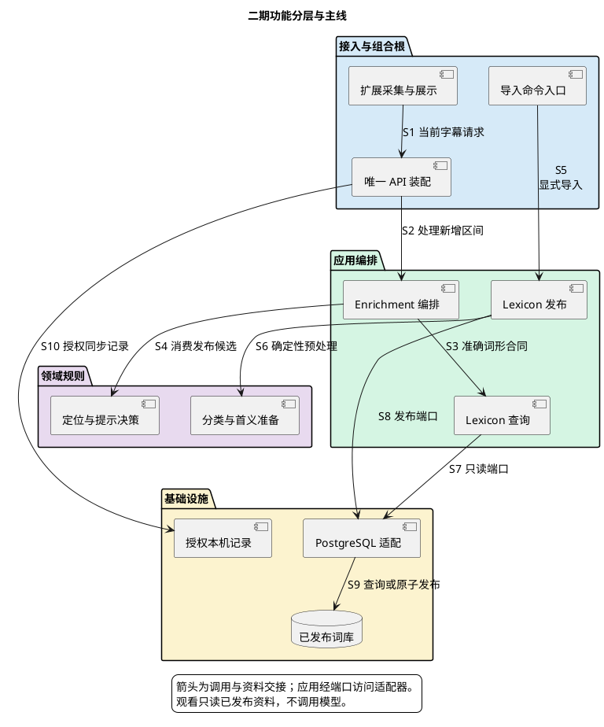
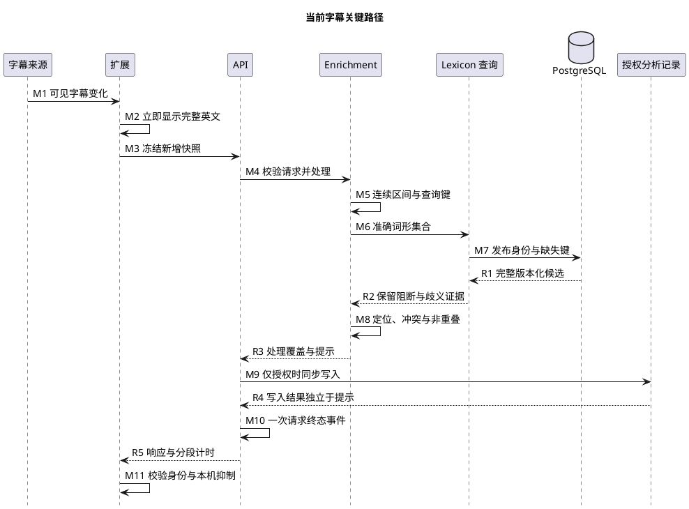
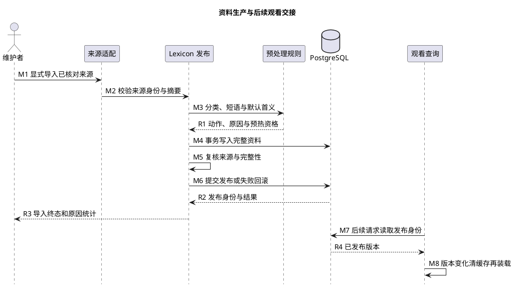

# 1. 二期功能架构与执行主线

上级：[二期设计](design.md)。图表达已确定的职责和交接，不表示实现已完成；执行证据见[状态页](status.md)。

## 1.1. 功能分层

图中箭头表示运行调用与资料交接，不是直接编译依赖；应用通过公开 port 访问平台实现。Lexicon 拥有资料及发布身份，Enrichment 拥有字幕候选和提示决策。macOS 和 Docker 运行同一组合根，不增加产品 worker。

## 1.2. 当前字幕关键路径

英文在 M2 即显示，后端 M3–R5 只决定中文提示。M7 表示版本查询与缓存缺失时的批量读取，不表示每个键均访问数据库。图展开成功主线；非法请求、资料缺失或依赖故障走统一终态，禁止用未经校验的提示补位。M9 仅在本机显式授权时执行，写入失败不改变已确定提示；M11 拒绝迟到、跨身份和被本机抑制的结果。

## 1.3. 离线生产与后续观看

维护者在观看之外显式启动资料生产。M6 成功提交后新身份才可见；校验或写入失败回滚，原完整发布继续可用。观看仅观察已发布身份并重建缓存，不触发导入或模型。Docker 资料包来自这条经校验的发布链，不从用户字幕临时生成。

